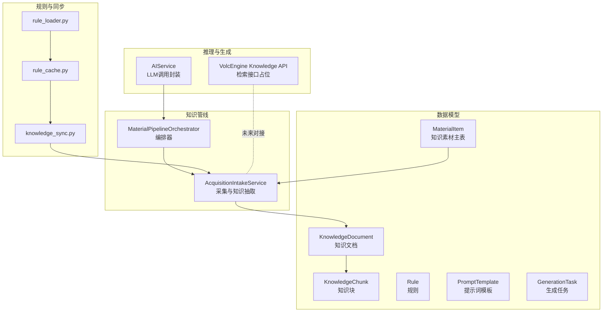
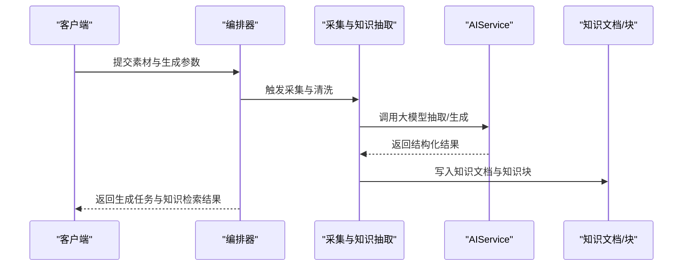
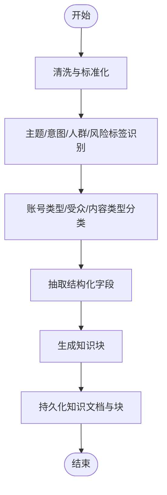
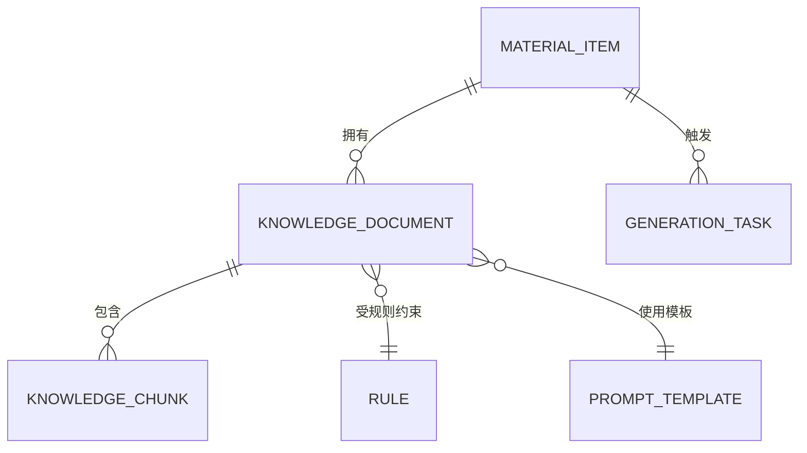
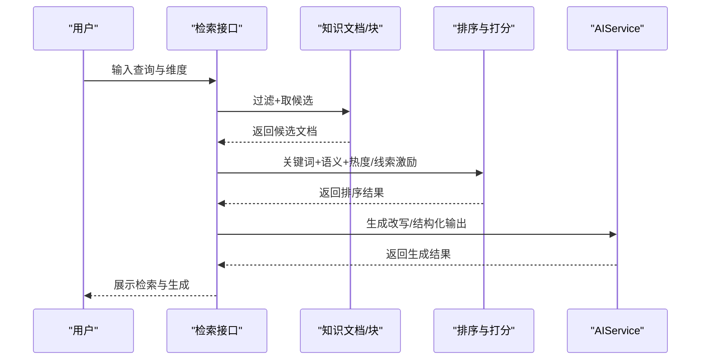
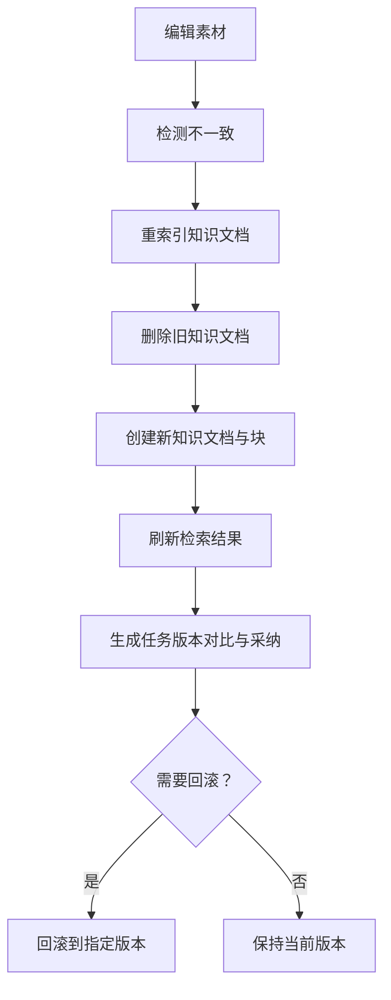
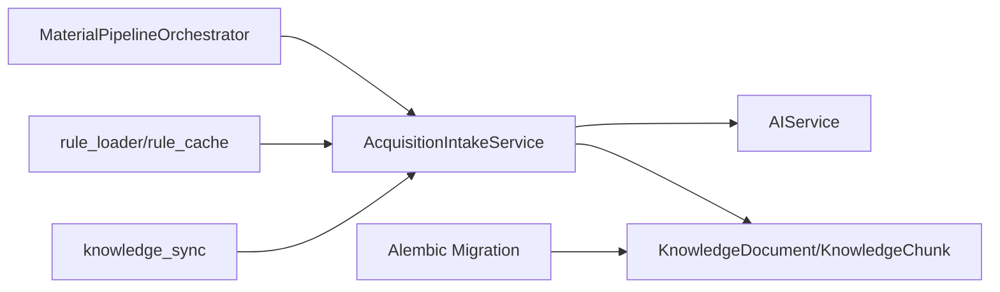

# 知识图谱

<cite>
**本文引用的文件**
- [models.py](file://backend/app/models/models.py)
- [material_pipeline_service.py](file://backend/app/services/collector/material_pipeline_service.py)
- [orchestrator.py](file://backend/app/domains/acquisition/orchestrator.py)
- [ai_service.py](file://backend/app/services/ai_service.py)
- [knowledge_api.py](file://backend/app/integrations/volcengine/knowledge_api.py)
- [20260327_02_add_material_knowledge_pipeline.py](file://backend/alembic/versions/20260327_02_add_material_knowledge_pipeline.py)
- [test_material_pipeline_postgres_regression.py](file://backend/test_material_pipeline_postgres_regression.py)
- [rule_loader.py](file://backend/app/rules/dynamic/rule_loader.py)
- [rule_cache.py](file://backend/app/rules/dynamic/rule_cache.py)
- [knowledge_sync.py](file://backend/app/rules/sync/knowledge_sync.py)
- [sync_rules.py](file://scripts/sync_rules.py)
</cite>

## 目录
1. [简介](#简介)
2. [项目结构](#项目结构)
3. [核心组件](#核心组件)
4. [架构总览](#架构总览)
5. [详细组件分析](#详细组件分析)
6. [依赖分析](#依赖分析)
7. [性能考虑](#性能考虑)
8. [故障排查指南](#故障排查指南)
9. [结论](#结论)
10. [附录](#附录)

## 简介
本技术文档面向“智获客知识图谱系统”，聚焦于实体识别与关系抽取的算法实现、知识图谱存储结构、查询与推理机制、更新策略以及与内容分析系统的集成与智能推荐应用。通过对后端模型、采集与知识管线、检索与生成服务、规则与同步机制的深入分析，帮助读者快速理解系统如何从原始素材中抽取结构化知识，并以可检索、可推理的形式服务于内容创作与合规改写。

## 项目结构
知识图谱能力在后端以“采集-清洗-知识抽取-检索-生成”为主线，围绕 SQLAlchemy 模型与服务层协同工作：
- 数据模型层：定义知识文档、知识块、规则、提示词模板、生成任务等核心实体
- 知识管线层：负责内容标准化、知识抽取、检索排序与重索引
- 推理与生成层：通过本地或火山引擎大模型进行内容改写与洞察
- 规则与同步层：动态规则加载、缓存与同步至知识域
- 集成层：对外暴露检索接口，支持未来扩展为图数据库或 SPARQL 查询

图表来源
- [models.py:584-752](file://backend/app/models/models.py#L584-L752)
- [material_pipeline_service.py:30-200](file://backend/app/services/collector/material_pipeline_service.py#L30-L200)
- [ai_service.py:15-460](file://backend/app/services/ai_service.py#L15-L460)
- [knowledge_api.py:1-4](file://backend/app/integrations/volcengine/knowledge_api.py#L1-L4)
- [rule_loader.py:1-3](file://backend/app/rules/dynamic/rule_loader.py#L1-L3)
- [rule_cache.py:1-6](file://backend/app/rules/dynamic/rule_cache.py#L1-L6)
- [knowledge_sync.py:1-3](file://backend/app/rules/sync/knowledge_sync.py#L1-L3)

章节来源
- [models.py:584-752](file://backend/app/models/models.py#L584-L752)
- [material_pipeline_service.py:30-200](file://backend/app/services/collector/material_pipeline_service.py#L30-L200)
- [ai_service.py:15-460](file://backend/app/services/ai_service.py#L15-L460)
- [knowledge_api.py:1-4](file://backend/app/integrations/volcengine/knowledge_api.py#L1-L4)
- [rule_loader.py:1-3](file://backend/app/rules/dynamic/rule_loader.py#L1-L3)
- [rule_cache.py:1-6](file://backend/app/rules/dynamic/rule_cache.py#L1-L6)
- [knowledge_sync.py:1-3](file://backend/app/rules/sync/knowledge_sync.py#L1-L3)

## 核心组件
- 知识文档与块：将素材标准化后的文本拆分为可检索的知识块，支持关键词与语义相似度评分
- 规则与提示词：通过规则约束与提示词模板指导生成，确保内容合规与风格统一
- 生成任务：持久化生成结果与上下文快照，支持版本回滚与对比
- 编排器：串联采集、清洗、知识抽取、检索与生成流程
- 大模型服务：封装本地 Ollama 与火山引擎 Ark Responses API，提供统一调用入口

章节来源
- [models.py:642-752](file://backend/app/models/models.py#L642-L752)
- [material_pipeline_service.py:770-820](file://backend/app/services/collector/material_pipeline_service.py#L770-L820)
- [ai_service.py:15-460](file://backend/app/services/ai_service.py#L15-L460)
- [orchestrator.py:11-163](file://backend/app/domains/acquisition/orchestrator.py#L11-L163)

## 架构总览
系统采用“数据模型 + 管线服务 + 推理服务 + 规则同步”的分层架构。知识抽取与检索位于中间层，向上承接编排器，向下连接模型服务与外部检索接口。规则通过动态加载与缓存注入到知识抽取与生成阶段，保证策略一致性与可演进性。

图表来源
- [orchestrator.py:127-163](file://backend/app/domains/acquisition/orchestrator.py#L127-L163)
- [material_pipeline_service.py:770-820](file://backend/app/services/collector/material_pipeline_service.py#L770-L820)
- [ai_service.py:24-92](file://backend/app/services/ai_service.py#L24-L92)
- [models.py:642-752](file://backend/app/models/models.py#L642-L752)

## 详细组件分析

### 实体识别与关系抽取算法实现
- 文本清洗与标准化
  - 去除噪声行、HTML 标签、多余空白，规范化换行与标点
  - 支持标题与正文的独立清洗，避免重复行与空行干扰
- 主题/意图/人群/风险标签
  - 基于预定义规则集进行关键词匹配，计算热度得分
  - 高/中/低风险阈值判断，结合长度与高频词叠加
- 账号类型/受众/内容类型的分类
  - 使用规则匹配与关键词权重，对文本进行分类标注
- 知识抽取与三元组构建
  - 将标题与正文合并，抽取结构化字段（主题、摘要、内容）
  - 生成知识块，记录块类型、索引与关键词，便于检索与召回

图表来源
- [material_pipeline_service.py:130-191](file://backend/app/services/collector/material_pipeline_service.py#L130-L191)
- [material_pipeline_service.py:416-470](file://backend/app/services/collector/material_pipeline_service.py#L416-L470)
- [material_pipeline_service.py:770-820](file://backend/app/services/collector/material_pipeline_service.py#L770-L820)
- [material_pipeline_service.py:1285-1320](file://backend/app/services/collector/material_pipeline_service.py#L1285-L1320)

章节来源
- [material_pipeline_service.py:130-191](file://backend/app/services/collector/material_pipeline_service.py#L130-L191)
- [material_pipeline_service.py:416-470](file://backend/app/services/collector/material_pipeline_service.py#L416-L470)
- [material_pipeline_service.py:770-820](file://backend/app/services/collector/material_pipeline_service.py#L770-L820)
- [material_pipeline_service.py:1285-1320](file://backend/app/services/collector/material_pipeline_service.py#L1285-L1320)

### 知识图谱存储结构
- 节点类型与属性
  - 知识文档：包含平台、账号类型、目标受众、内容类型、主题、标题、摘要、正文、创建时间
  - 知识块：包含块类型、块文本、块索引、关键词列表、创建时间
  - 规则：规则类型、平台/账号类型/目标受众维度、名称、内容、优先级
  - 提示词模板：任务类型、平台/账号类型/目标受众维度、版本、系统提示与用户提示模板
  - 生成任务：平台/账号类型/目标受众/任务类型、提示词快照、输出文本、引用文档ID、标签/变体/合规信息、采纳状态
- 边关系建模
  - 知识文档与知识块：一对多
  - 知识文档与素材：多对一
  - 生成任务与素材：多对一
- 索引与查询
  - 在关键维度建立索引，支持按平台、账号类型、目标受众、内容类型快速过滤
  - 通过检索接口支持关键词与语义相似度综合打分

图表来源
- [models.py:584-752](file://backend/app/models/models.py#L584-L752)
- [20260327_02_add_material_knowledge_pipeline.py:164-200](file://backend/alembic/versions/20260327_02_add_material_knowledge_pipeline.py#L164-L200)

章节来源
- [models.py:642-752](file://backend/app/models/models.py#L642-L752)
- [20260327_02_add_material_knowledge_pipeline.py:164-200](file://backend/alembic/versions/20260327_02_add_material_knowledge_pipeline.py#L164-L200)

### 图谱查询与推理机制
- 检索与排序
  - 先按平台/账号类型/目标受众过滤，取最新 N 条候选
  - 计算关键词匹配分数与语义相似度（基于分词集合与序列相似度），叠加热度与线索等级激励
  - 返回知识文档及其知识块片段
- 推理与生成
  - 通过 AIService 统一大模型调用，支持本地 Ollama 与火山引擎 Ark Responses
  - 生成任务持久化，支持版本选择与回滚
- 外部检索接口
  - 当前为占位实现，未来可接入向量化检索或图数据库查询

图表来源
- [material_pipeline_service.py:1393-1454](file://backend/app/services/collector/material_pipeline_service.py#L1393-L1454)
- [material_pipeline_service.py:1374-1391](file://backend/app/services/collector/material_pipeline_service.py#L1374-L1391)
- [ai_service.py:24-92](file://backend/app/services/ai_service.py#L24-L92)
- [knowledge_api.py:1-4](file://backend/app/integrations/volcengine/knowledge_api.py#L1-L4)

章节来源
- [material_pipeline_service.py:1393-1454](file://backend/app/services/collector/material_pipeline_service.py#L1393-L1454)
- [material_pipeline_service.py:1374-1391](file://backend/app/services/collector/material_pipeline_service.py#L1374-L1391)
- [ai_service.py:24-92](file://backend/app/services/ai_service.py#L24-L92)
- [knowledge_api.py:1-4](file://backend/app/integrations/volcengine/knowledge_api.py#L1-L4)

### 更新策略：增量同步、冲突解决与版本管理
- 增量同步
  - 通过编排器检测素材与知识文档不一致时触发重索引，删除旧知识文档并重建
  - 支持编辑后刷新，确保检索结果与最新内容一致
- 冲突解决
  - 重索引过程中删除旧知识文档，避免重复与陈旧数据污染
  - 生成任务采用“采纳状态”与“采纳人”字段，便于冲突时回滚与审计
- 版本管理
  - 生成任务保存提示词快照与引用文档ID，支持版本对比与一键回滚
  - 规则与提示词模板具备版本字段，便于灰度与回滚

图表来源
- [orchestrator.py:66-94](file://backend/app/domains/acquisition/orchestrator.py#L66-L94)
- [material_pipeline_service.py:1305-1320](file://backend/app/services/collector/material_pipeline_service.py#L1305-L1320)
- [models.py:724-752](file://backend/app/models/models.py#L724-L752)

章节来源
- [orchestrator.py:66-94](file://backend/app/domains/acquisition/orchestrator.py#L66-L94)
- [material_pipeline_service.py:1305-1320](file://backend/app/services/collector/material_pipeline_service.py#L1305-L1320)
- [models.py:724-752](file://backend/app/models/models.py#L724-L752)

### 与内容分析系统的集成与智能推荐应用
- 内容分析
  - 采集阶段对内容进行标签、分类、热度与病毒性预测，作为后续生成与推荐的基础
- 智能推荐
  - 基于检索结果与热度/线索等级激励，为不同平台与受众提供可复用的内容结构与风格建议
- 合规与风控
  - 通过规则与风险词库进行风险等级判定，结合合规评分与建议，辅助人工审核与自动拦截

章节来源
- [material_pipeline_service.py:416-470](file://backend/app/services/collector/material_pipeline_service.py#L416-L470)
- [ai_service.py:224-259](file://backend/app/services/ai_service.py#L224-L259)

## 依赖分析
- 组件耦合
  - 管线服务与模型服务松耦合，通过 AIService 抽象统一调用
  - 规则与提示词模板通过动态加载与缓存注入，降低硬编码耦合
- 外部依赖
  - 火山引擎 Ark Responses API 用于云端模型调用
  - Alembic 迁移脚本定义知识文档与知识块表结构及索引
- 潜在循环依赖
  - 当前模块间以服务层与模型层为主，未发现直接循环导入

图表来源
- [material_pipeline_service.py:30-200](file://backend/app/services/collector/material_pipeline_service.py#L30-L200)
- [ai_service.py:15-460](file://backend/app/services/ai_service.py#L15-L460)
- [rule_loader.py:1-3](file://backend/app/rules/dynamic/rule_loader.py#L1-L3)
- [rule_cache.py:1-6](file://backend/app/rules/dynamic/rule_cache.py#L1-L6)
- [knowledge_sync.py:1-3](file://backend/app/rules/sync/knowledge_sync.py#L1-L3)
- [20260327_02_add_material_knowledge_pipeline.py:164-200](file://backend/alembic/versions/20260327_02_add_material_knowledge_pipeline.py#L164-L200)

章节来源
- [material_pipeline_service.py:30-200](file://backend/app/services/collector/material_pipeline_service.py#L30-L200)
- [ai_service.py:15-460](file://backend/app/services/ai_service.py#L15-L460)
- [rule_loader.py:1-3](file://backend/app/rules/dynamic/rule_loader.py#L1-L3)
- [rule_cache.py:1-6](file://backend/app/rules/dynamic/rule_cache.py#L1-L6)
- [knowledge_sync.py:1-3](file://backend/app/rules/sync/knowledge_sync.py#L1-L3)
- [20260327_02_add_material_knowledge_pipeline.py:164-200](file://backend/alembic/versions/20260327_02_add_material_knowledge_pipeline.py#L164-L200)

## 性能考虑
- 索引与过滤
  - 在平台、账号类型、目标受众、内容类型等维度建立索引，减少全表扫描
- 打分与排序
  - 关键词与语义打分结合，限制候选数量（如取最新 N 条）以控制排序成本
- 批量加载
  - 使用 selectinload 预加载关联对象，减少 N+1 查询
- 生成任务缓存
  - 通过提示词快照与引用文档ID，避免重复生成与网络调用

## 故障排查指南
- 知识文档缺失或不一致
  - 检查是否触发重索引流程，确认旧知识文档已被删除且新文档创建成功
- 检索结果为空
  - 确认过滤维度是否正确，尝试放宽平台维度或扩大候选数量
- 生成失败
  - 检查 AIService 的模型配置与网络连通性，查看 Ark 调用日志
- 规则未生效
  - 确认规则加载与缓存是否正确，检查规则优先级与维度匹配

章节来源
- [orchestrator.py:66-94](file://backend/app/domains/acquisition/orchestrator.py#L66-L94)
- [material_pipeline_service.py:1305-1320](file://backend/app/services/collector/material_pipeline_service.py#L1305-L1320)
- [ai_service.py:132-240](file://backend/app/services/ai_service.py#L132-L240)
- [rule_loader.py:1-3](file://backend/app/rules/dynamic/rule_loader.py#L1-L3)
- [rule_cache.py:1-6](file://backend/app/rules/dynamic/rule_cache.py#L1-L6)

## 结论
本系统以“采集-清洗-知识抽取-检索-生成”为核心路径，通过结构化的知识文档与知识块、完善的规则与提示词体系、以及统一的大模型服务，实现了从原始素材到可检索、可推理、可生成的知识资产沉淀。未来可在现有基础上扩展为图数据库或引入 SPARQL 查询，进一步增强关系推理与路径查找能力。

## 附录
- 单元测试验证
  - 回归测试覆盖知识文档创建、清理后内容与生成任务快照等关键路径
- 规则同步脚本
  - 提供规则同步入口，便于运维与开发执行

章节来源
- [test_material_pipeline_postgres_regression.py:125-172](file://backend/test_material_pipeline_postgres_regression.py#L125-L172)
- [sync_rules.py:1-6](file://scripts/sync_rules.py#L1-L6)