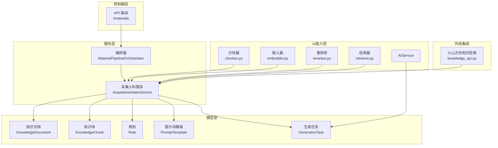
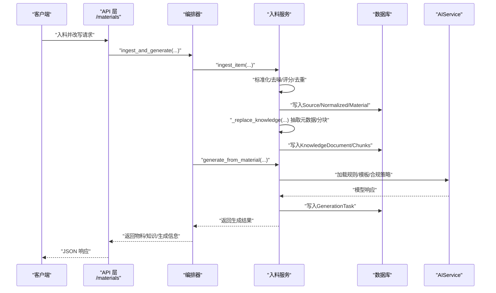
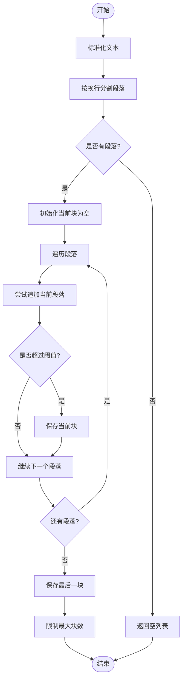
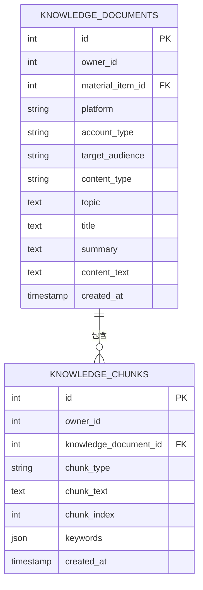
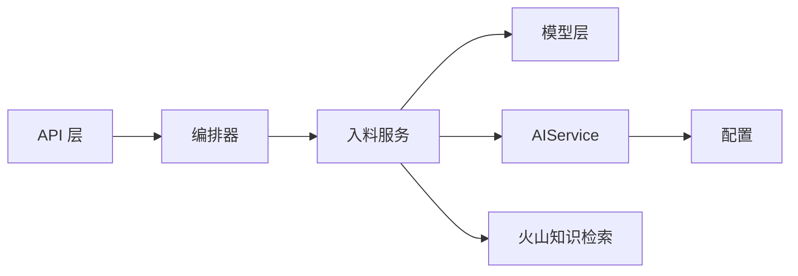

# 知识库构建

<cite>
**本文引用的文件**
- [backend/app/services/collector/material_pipeline_service.py](file://backend/app/services/collector/material_pipeline_service.py)
- [backend/app/domains/acquisition/orchestrator.py](file://backend/app/domains/acquisition/orchestrator.py)
- [backend/app/models/models.py](file://backend/app/models/models.py)
- [backend/app/api/v2/endpoints/materials.py](file://backend/app/api/v2/endpoints/materials.py)
- [backend/app/services/ai_service.py](file://backend/app/services/ai_service.py)
- [backend/app/core/config.py](file://backend/app/core/config.py)
- [backend/app/ai/rag/chunker.py](file://backend/app/ai/rag/chunker.py)
- [backend/app/ai/rag/embedder.py](file://backend/app/ai/rag/embedder.py)
- [backend/app/ai/rag/retriever.py](file://backend/app/ai/rag/retriever.py)
- [backend/app/ai/rag/reranker.py](file://backend/app/ai/rag/reranker.py)
- [backend/app/integrations/volcengine/knowledge_api.py](file://backend/app/integrations/volcengine/knowledge_api.py)
</cite>

## 目录
1. [简介](#简介)
2. [项目结构](#项目结构)
3. [核心组件](#核心组件)
4. [架构总览](#架构总览)
5. [详细组件分析](#详细组件分析)
6. [依赖分析](#依赖分析)
7. [性能考虑](#性能考虑)
8. [故障排查指南](#故障排查指南)
9. [结论](#结论)
10. [附录](#附录)

## 简介
本文件面向“智获客知识库构建”功能，系统化梳理从采集内容到知识文档的完整转换流程，涵盖内容标准化、结构化处理、知识抽取、文本分块、元数据提取、检索与生成链路，并给出配置参数、性能优化建议与最佳实践。同时阐明与内容采集系统的数据流转关系与质量控制机制。

## 项目结构
知识库构建功能主要由以下模块协同完成：
- 数据模型层：定义知识文档、知识块、规则、提示词模板、生成任务等持久化结构
- 服务层：采集与入料处理、知识抽取与分块、检索与排序、生成编排
- 控制器层：对外暴露物料与知识库相关接口，支持入料、重索引、改写、采纳等
- AI能力层：本地或云端大模型调用、嵌入向量占位、重排序占位、检索占位
- 配置层：AI模型、限流、存储、浏览器采集等运行时参数

图表来源
- [backend/app/api/v2/endpoints/materials.py:1-386](file://backend/app/api/v2/endpoints/materials.py#L1-L386)
- [backend/app/domains/acquisition/orchestrator.py:1-174](file://backend/app/domains/acquisition/orchestrator.py#L1-L174)
- [backend/app/services/collector/material_pipeline_service.py:1-1739](file://backend/app/services/collector/material_pipeline_service.py#L1-L1739)
- [backend/app/models/models.py:640-839](file://backend/app/models/models.py#L640-L839)
- [backend/app/services/ai_service.py:1-460](file://backend/app/services/ai_service.py#L1-L460)
- [backend/app/ai/rag/chunker.py:1-3](file://backend/app/ai/rag/chunker.py#L1-L3)
- [backend/app/ai/rag/embedder.py:1-3](file://backend/app/ai/rag/embedder.py#L1-L3)
- [backend/app/ai/rag/retriever.py:1-3](file://backend/app/ai/rag/retriever.py#L1-L3)
- [backend/app/ai/rag/reranker.py:1-3](file://backend/app/ai/rag/reranker.py#L1-L3)
- [backend/app/integrations/volcengine/knowledge_api.py:1-3](file://backend/app/integrations/volcengine/knowledge_api.py#L1-L3)

章节来源
- [backend/app/api/v2/endpoints/materials.py:1-386](file://backend/app/api/v2/endpoints/materials.py#L1-L386)
- [backend/app/domains/acquisition/orchestrator.py:1-174](file://backend/app/domains/acquisition/orchestrator.py#L1-L174)
- [backend/app/services/collector/material_pipeline_service.py:1-1739](file://backend/app/services/collector/material_pipeline_service.py#L1-L1739)
- [backend/app/models/models.py:640-839](file://backend/app/models/models.py#L640-L839)

## 核心组件
- 编排器 MaterialPipelineOrchestrator：统一入口，串联“入料 -> 清洗 -> 知识 -> 检索 -> 生成”
- 采集入料服务 AcquisitionIntakeService：负责内容标准化、去噪、质量/相关性/线索评分、重复判定、知识抽取与分块、检索与生成编排
- 数据模型 KnowledgeDocument/KnowledgeChunk：知识文档与块的持久化结构，承载元数据与分块内容
- API 接口：提供物料列表/详情、更新、删除、重索引、改写、入料并改写、采纳生成结果等
- AI 能力：AIService 统一封装本地/云端模型调用；RAG 组件为占位实现，便于后续替换

章节来源
- [backend/app/domains/acquisition/orchestrator.py:11-174](file://backend/app/domains/acquisition/orchestrator.py#L11-L174)
- [backend/app/services/collector/material_pipeline_service.py:30-918](file://backend/app/services/collector/material_pipeline_service.py#L30-L918)
- [backend/app/models/models.py:642-683](file://backend/app/models/models.py#L642-L683)
- [backend/app/api/v2/endpoints/materials.py:151-381](file://backend/app/api/v2/endpoints/materials.py#L151-L381)
- [backend/app/services/ai_service.py:15-460](file://backend/app/services/ai_service.py#L15-L460)

## 架构总览
从采集内容到知识文档的端到端流程如下：

图表来源
- [backend/app/api/v2/endpoints/materials.py:284-308](file://backend/app/api/v2/endpoints/materials.py#L284-L308)
- [backend/app/domains/acquisition/orchestrator.py:127-173](file://backend/app/domains/acquisition/orchestrator.py#L127-L173)
- [backend/app/services/collector/material_pipeline_service.py:811-918](file://backend/app/services/collector/material_pipeline_service.py#L811-L918)
- [backend/app/services/ai_service.py:15-460](file://backend/app/services/ai_service.py#L15-L460)

## 详细组件分析

### 内容标准化与清洗
- 标题/正文清洗：统一换行、HTML 去除、实体解码、多余空白折叠、噪声行过滤
- 去噪规则：针对“展开/收起/点赞/话题标签/链接”等模式进行过滤
- 内容预处理：段落规范化、重复行去重、标点规整
- 字段归一化：平台、URL、作者、时间、互动数、解析/风险状态等

章节来源
- [backend/app/services/collector/material_pipeline_service.py:130-190](file://backend/app/services/collector/material_pipeline_service.py#L130-L190)

### 质量、相关性与线索评分
- 质量评分：标题/正文长度/封面/发布时间等维度加权
- 相关性评分：关键词命中与目标词表匹配
- 线索评分：意图词与联系方式识别，分级阈值
- 热度评分：基于互动数聚合

章节来源
- [backend/app/services/collector/material_pipeline_service.py:273-340](file://backend/app/services/collector/material_pipeline_service.py#L273-L340)

### 重复判定与入料决策
- 去重依据：source_id 优先，其次基于内容哈希
- 入料状态决策：综合风险状态、解析状态、质量/相关性/线索评分与来源通道，进入“待审/回收/通过/需复核”

章节来源
- [backend/app/services/collector/material_pipeline_service.py:661-693](file://backend/app/services/collector/material_pipeline_service.py#L661-L693)
- [backend/app/services/collector/material_pipeline_service.py:630-658](file://backend/app/services/collector/material_pipeline_service.py#L630-L658)

### 知识抽取与元数据提取
- 元数据字段：平台、账号类型、受众、内容类型、主题标签、标题、摘要、正文
- 分类规则：
  - 账号类型：顾问号/法务号/引流号/科普号
  - 受众：负债逾期/征信问题/创业周转/宝妈
  - 内容类型：案例/评论洞察/规则说明/标题/正文
  - 主题：基于关键词抽取与规则匹配
- 摘要与主题：摘要截断，主题为关键词组合

章节来源
- [backend/app/services/collector/material_pipeline_service.py:414-469](file://backend/app/services/collector/material_pipeline_service.py#L414-L469)
- [backend/app/services/collector/material_pipeline_service.py:342-368](file://backend/app/services/collector/material_pipeline_service.py#L342-L368)
- [backend/app/models/models.py:642-664](file://backend/app/models/models.py#L642-L664)

### 文本分块算法实现原理
- 分块策略：按段落拼接，达到阈值则切分；限制最大块数
- 关键词提取：用于块级关键词标注，辅助检索
- 当前实现：占位分块器与嵌入器/重排序/检索器为占位，便于后续替换

图表来源
- [backend/app/services/collector/material_pipeline_service.py:371-392](file://backend/app/services/collector/material_pipeline_service.py#L371-L392)
- [backend/app/ai/rag/chunker.py:1-3](file://backend/app/ai/rag/chunker.py#L1-L3)

章节来源
- [backend/app/services/collector/material_pipeline_service.py:371-392](file://backend/app/services/collector/material_pipeline_service.py#L371-L392)
- [backend/app/ai/rag/chunker.py:1-3](file://backend/app/ai/rag/chunker.py#L1-L3)

### 知识文档与块的数据模型
- 知识文档：包含元数据与正文，一对多关联知识块
- 知识块：按序号组织，支持关键词标注，支持检索时取前若干块

图表来源
- [backend/app/models/models.py:642-683](file://backend/app/models/models.py#L642-L683)

章节来源
- [backend/app/models/models.py:642-683](file://backend/app/models/models.py#L642-L683)

### 检索与排序
- 结构化过滤：按平台/账号类型/受众过滤候选集
- 排序指标：
  - 关键词命中计数
  - 语义相似度（词集 Jaccard + 序列相似度加权）
  - 热度/线索等级加成
- 返回：知识文档、物料信息、块片段

章节来源
- [backend/app/services/collector/material_pipeline_service.py:1393-1454](file://backend/app/services/collector/material_pipeline_service.py#L1393-L1454)

### 生成编排与合规策略
- 规则加载：按 owner/platform/account_type/target_audience 加载优先级规则
- 提示词模板：按任务类型与结构维度加载模板
- 合规策略：阈值与自定义敏感词，支持二次校验与阻断
- 生成任务：持久化输出、引用文档、变体选择、采纳状态

章节来源
- [backend/app/services/collector/material_pipeline_service.py:1457-1579](file://backend/app/services/collector/material_pipeline_service.py#L1457-L1579)
- [backend/app/services/ai_service.py:15-460](file://backend/app/services/ai_service.py#L15-L460)

### API 与前端交互
- 列表/详情：支持包含知识、生成、块
- 更新：可修改标题/正文/备注/状态
- 重索引：触发重新抽取与分块
- 改写：按目标平台/账号类型/受众生成
- 入料并改写：一次性完成入料与生成
- 采纳：选定生成变体并回写正文

章节来源
- [backend/app/api/v2/endpoints/materials.py:151-381](file://backend/app/api/v2/endpoints/materials.py#L151-L381)

## 依赖分析
- 组件耦合
  - 编排器依赖入料服务与 AIService
  - 入料服务依赖模型层（知识文档/块/规则/模板/生成任务）
  - API 层依赖编排器与入料服务
- 外部依赖
  - 本地/云端模型调用（AIService）
  - 火山引擎知识检索占位
  - RAG 组件占位（后续可接入向量化与重排序）

图表来源
- [backend/app/api/v2/endpoints/materials.py:1-386](file://backend/app/api/v2/endpoints/materials.py#L1-L386)
- [backend/app/domains/acquisition/orchestrator.py:1-174](file://backend/app/domains/acquisition/orchestrator.py#L1-L174)
- [backend/app/services/collector/material_pipeline_service.py:1-1739](file://backend/app/services/collector/material_pipeline_service.py#L1-L1739)
- [backend/app/services/ai_service.py:1-460](file://backend/app/services/ai_service.py#L1-L460)
- [backend/app/core/config.py:71-102](file://backend/app/core/config.py#L71-L102)
- [backend/app/integrations/volcengine/knowledge_api.py:1-3](file://backend/app/integrations/volcengine/knowledge_api.py#L1-L3)

## 性能考虑
- 分块阈值与块数限制：通过分块函数的阈值与上限控制检索/生成负载
- 检索候选裁剪：先按结构过滤，再限定候选数量，最后排序
- 关键词与语义双轨评分：兼顾召回与精度
- 生成任务幂等与缓存：对相同输入可复用已有生成结果
- 模型调用优化：合理设置超时、并发与限流，必要时启用云端模型

章节来源
- [backend/app/services/collector/material_pipeline_service.py:371-392](file://backend/app/services/collector/material_pipeline_service.py#L371-L392)
- [backend/app/services/collector/material_pipeline_service.py:1393-1454](file://backend/app/services/collector/material_pipeline_service.py#L1393-L1454)
- [backend/app/core/config.py:71-102](file://backend/app/core/config.py#L71-L102)

## 故障排查指南
- 入料失败/重复：检查去重逻辑与字段完整性
- 状态异常流转：核对评分阈值与来源通道规则
- 生成阻断：检查合规阈值与敏感词配置
- 检索无结果：确认结构过滤参数与候选集裁剪
- 模型调用失败：检查本地/云端模型可用性与鉴权配置

章节来源
- [backend/app/services/collector/material_pipeline_service.py:630-658](file://backend/app/services/collector/material_pipeline_service.py#L630-L658)
- [backend/app/services/collector/material_pipeline_service.py:1536-1568](file://backend/app/services/collector/material_pipeline_service.py#L1536-L1568)
- [backend/app/services/ai_service.py:39-91](file://backend/app/services/ai_service.py#L39-L91)
- [backend/app/core/config.py:71-102](file://backend/app/core/config.py#L71-L102)

## 结论
本知识库构建功能以“采集入料服务”为核心，围绕标准化、抽取、分块、检索与生成形成闭环。当前 RAG 组件为占位实现，建议后续接入向量化与重排序，结合业务规则与模板，持续提升检索与生成质量。通过合理的阈值与限流配置，可在保证质量的同时提升吞吐与稳定性。

## 附录

### 配置参数一览
- AI 模型与调用
  - OLLAMA_BASE_URL/OLLAMA_MODEL：本地模型地址与模型名
  - USE_CLOUD_MODEL/ARK_*：云端模型开关与火山引擎配置
- 限流与速率
  - USE_REDIS_RATE_LIMIT/REDIS_URL/RATE_LIMIT_KEY_PREFIX：分布式限流
  - ARK_VISION_RATE_LIMIT_* / INSIGHT_BATCH_ANALYZE_RATE_LIMIT_*：特定接口限流
- 存储与上传
  - MAX_UPLOAD_SIZE/UPLOAD_DIR：上传大小与目录
- 浏览器采集
  - BROWSER_COLLECTOR_BASE_URL/BROWSER_COLLECTOR_TIMEOUT_SECONDS：采集服务地址与超时

章节来源
- [backend/app/core/config.py:71-102](file://backend/app/core/config.py#L71-L102)

### 最佳实践
- 明确账号类型与受众标签：确保检索与生成的结构化约束准确
- 控制分块大小与数量：平衡检索粒度与生成成本
- 使用规则与模板：统一输出风格与合规要求
- 定期重索引：对更新后的素材触发重新抽取与分块
- 生成变体管理：通过采纳机制固化最优版本

章节来源
- [backend/app/services/collector/material_pipeline_service.py:1457-1533](file://backend/app/services/collector/material_pipeline_service.py#L1457-L1533)
- [backend/app/api/v2/endpoints/materials.py:311-381](file://backend/app/api/v2/endpoints/materials.py#L311-L381)