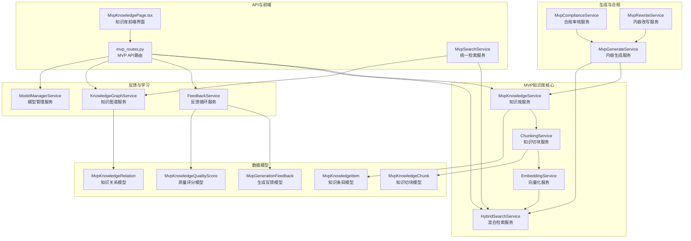
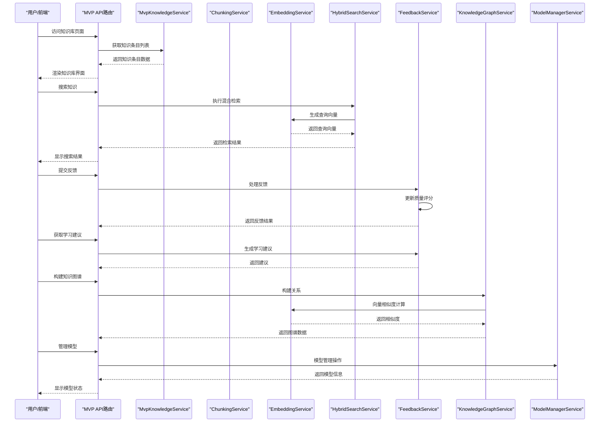
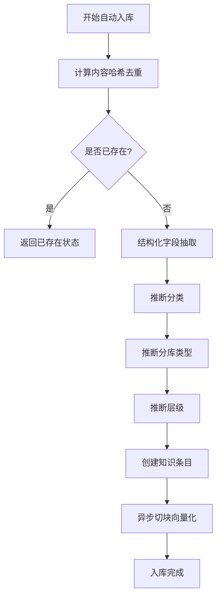
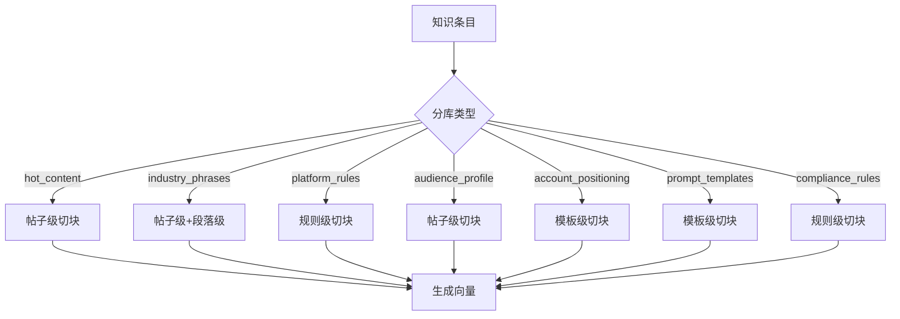
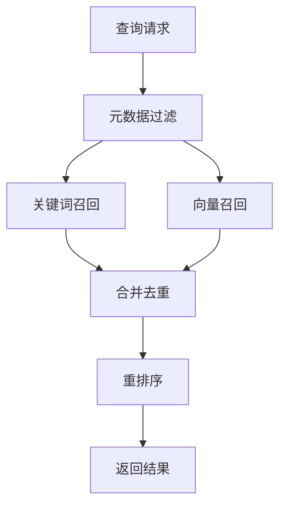
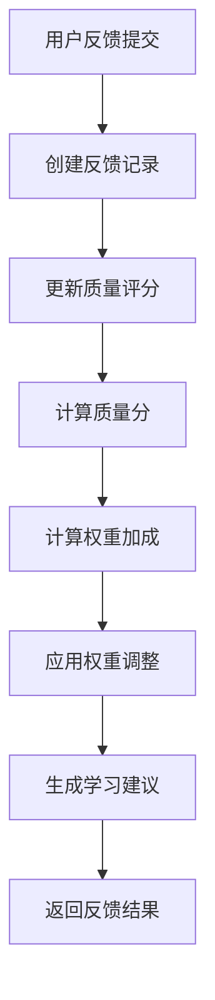
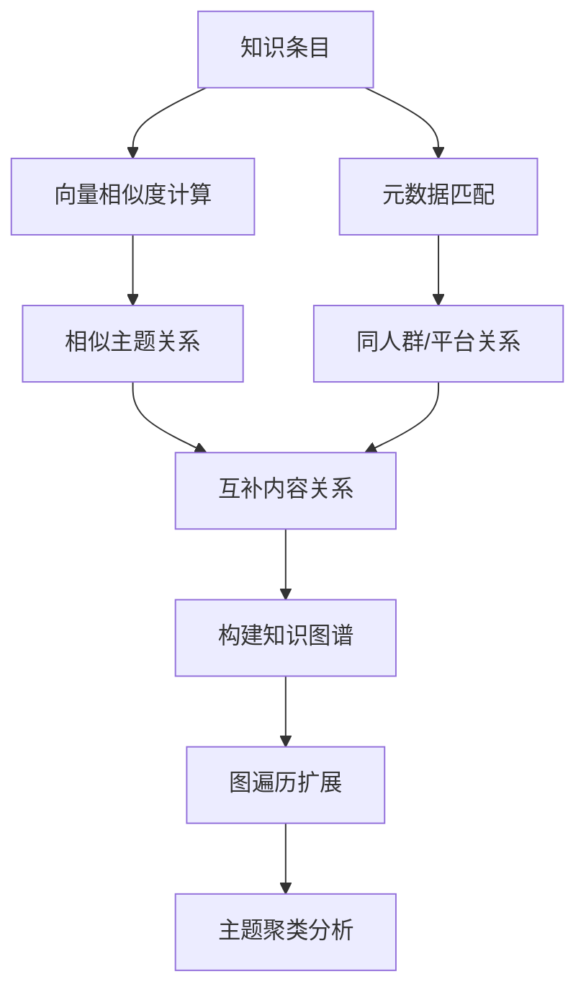
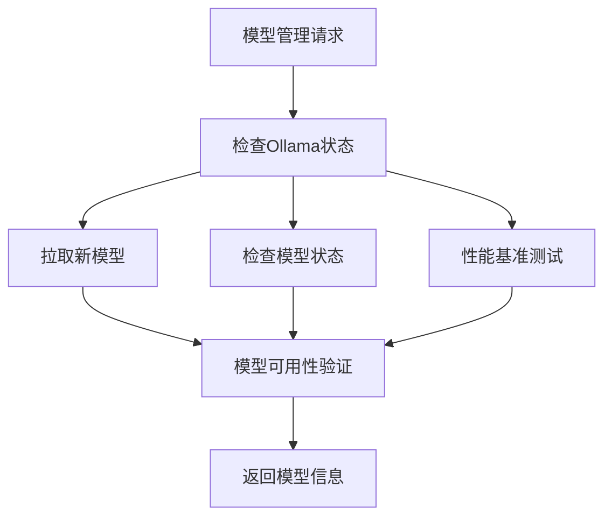
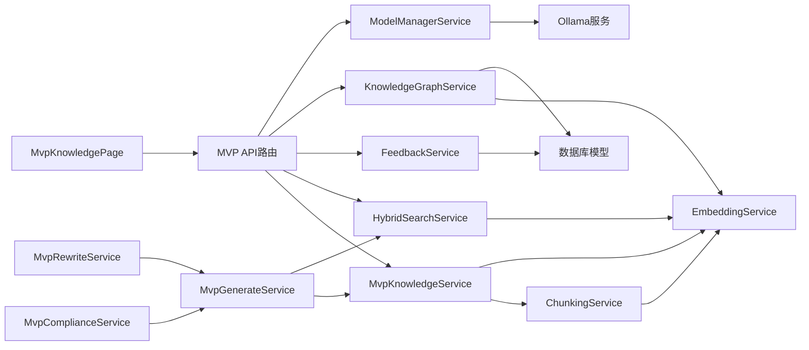

# 知识管理体系

<cite>
**本文引用的文件**
- [backend/app/services/mvp_knowledge_service.py](file://backend/app/services/mvp_knowledge_service.py)
- [backend/app/services/chunking_service.py](file://backend/app/services/chunking_service.py)
- [backend/app/services/embedding_service.py](file://backend/app/services/embedding_service.py)
- [backend/app/services/hybrid_search_service.py](file://backend/app/services/hybrid_search_service.py)
- [backend/app/services/mvp_search_service.py](file://backend/app/services/mvp_search_service.py)
- [backend/app/services/feedback_service.py](file://backend/app/services/feedback_service.py)
- [backend/app/services/knowledge_graph_service.py](file://backend/app/services/knowledge_graph_service.py)
- [backend/app/services/model_manager_service.py](file://backend/app/services/model_manager_service.py)
- [backend/app/models/models.py](file://backend/app/models/models.py)
- [backend/app/api/endpoints/mvp_routes.py](file://backend/app/api/endpoints/mvp_routes.py)
- [backend/app/services/ai_service.py](file://backend/app/services/ai_service.py)
- [backend/app/services/mvp_generate_service.py](file://backend/app/services/mvp_generate_service.py)
- [backend/app/services/mvp_compliance_service.py](file://backend/app/services/mvp_compliance_service.py)
- [backend/app/services/mvp_rewrite_service.py](file://backend/app/services/mvp_rewrite_service.py)
- [backend/app/services/mvp_material_service.py](file://backend/app/services/mvp_material_service.py)
- [backend/app/services/mvp_inbox_service.py](file://backend/app/services/mvp_inbox_service.py)
- [backend/app/services/mvp_tag_service.py](file://backend/app/services/mvp_tag_service.py)
- [desktop/src/pages/knowledge/MvpKnowledgePage.tsx](file://desktop/src/pages/knowledge/MvpKnowledgePage.tsx)
- [backend/app/core/config.py](file://backend/app/core/config.py)
</cite>

## 更新摘要
**变更内容**
- 新增反馈循环系统，实现用户反馈收集与知识质量评分机制
- 新增知识图谱能力，支持关系发现、图遍历和主题聚类
- 新增模型管理功能，支持多模型池管理和性能基准测试
- 扩展检索能力，增加图增强检索和权重动态调整
- 完善知识库维护机制，支持自动权重调整和学习建议

## 目录
1. [简介](#简介)
2. [项目结构](#项目结构)
3. [核心组件](#核心组件)
4. [架构总览](#架构总览)
5. [详细组件分析](#详细组件分析)
6. [依赖分析](#依赖分析)
7. [性能考虑](#性能考虑)
8. [故障排查指南](#故障排查指南)
9. [结论](#结论)
10. [附录](#附录)

## 简介
本文档全面介绍智获客MVP知识管理体系，这是一个全新的、基于向量数据库的智能知识管理解决方案。系统实现了从内容采集、结构化处理、自动入库、向量化存储到RAG检索增强生成的完整闭环，提供多维度的知识分库管理和智能内容生成能力。

**更新** 本版本完全重构了原有的知识管理体系，采用MVP架构，集成了向量化存储、RAG检索、混合检索等先进功能，并新增了反馈循环系统、知识图谱能力和模型管理功能，形成了完整的智能知识生态系统。

## 项目结构
MVP知识管理体系采用模块化分层设计，围绕"采集-结构化-入库-检索-生成-反馈-学习"主路径组织代码：

- **MVP知识库服务**：提供知识条目管理、自动入库、结构化抽取
- **知识切块服务**：支持多种切块策略（帖子级、段落级、规则级、模板级）
- **向量化服务**：支持火山方舟和Ollama两种Embedding模式
- **混合检索服务**：实现关键词+向量+重排序的混合检索
- **反馈循环服务**：收集用户反馈、更新质量评分、生成学习建议
- **知识图谱服务**：构建知识关系、图遍历扩展、主题聚类分析
- **模型管理服务**：多模型池管理、性能基准测试、模型选择
- **API路由**：提供完整的MVP知识库管理接口
- **前端界面**：提供知识库管理的可视化界面
- **生成服务**：基于知识库的内容生成和合规审核

**图表来源**
- [backend/app/services/mvp_knowledge_service.py](file://backend/app/services/mvp_knowledge_service.py)
- [backend/app/services/chunking_service.py](file://backend/app/services/chunking_service.py)
- [backend/app/services/embedding_service.py](file://backend/app/services/embedding_service.py)
- [backend/app/services/hybrid_search_service.py](file://backend/app/services/hybrid_search_service.py)
- [backend/app/services/feedback_service.py](file://backend/app/services/feedback_service.py)
- [backend/app/services/knowledge_graph_service.py](file://backend/app/services/knowledge_graph_service.py)
- [backend/app/services/model_manager_service.py](file://backend/app/services/model_manager_service.py)
- [backend/app/models/models.py](file://backend/app/models/models.py)
- [backend/app/api/endpoints/mvp_routes.py](file://backend/app/api/endpoints/mvp_routes.py)
- [desktop/src/pages/knowledge/MvpKnowledgePage.tsx](file://desktop/src/pages/knowledge/MvpKnowledgePage.tsx)

**章节来源**
- [backend/app/services/mvp_knowledge_service.py](file://backend/app/services/mvp_knowledge_service.py)
- [backend/app/models/models.py](file://backend/app/models/models.py)
- [backend/app/api/endpoints/mvp_routes.py](file://backend/app/api/endpoints/mvp_routes.py)

## 核心组件
MVP知识管理体系的核心组件包括：

- **MvpKnowledgeService**：知识库核心服务，负责知识条目的创建、查询、更新、删除，以及自动入库Pipeline
- **ChunkingService**：知识切块服务，支持4种切块策略，将知识内容切分为适合向量检索的片段
- **EmbeddingService**：向量化服务，支持火山方舟和Ollama两种Embedding模式，生成文本向量
- **HybridSearchService**：混合检索服务，实现关键词+向量+重排序的混合检索算法
- **FeedbackService**：反馈循环服务，收集用户对生成内容的反馈，更新知识质量评分
- **KnowledgeGraphService**：知识图谱服务，构建知识关系、图遍历扩展、主题聚类分析
- **ModelManagerService**：模型管理服务，支持多模型池管理、性能基准测试、模型选择
- **MvpKnowledgeItem/MvpKnowledgeChunk**：知识库数据模型，支持结构化字段和向量化存储
- **MvpGenerationFeedback/MvpKnowledgeQualityScore**：反馈与质量评分数据模型
- **MvpKnowledgeRelation**：知识关系数据模型，支持知识图谱构建
- **MvpSearchService**：统一检索服务，提供知识库、素材库、收件箱的统一检索能力
- **MVP API路由**：提供完整的知识库管理接口，包括列表、详情、搜索、切块等操作

**章节来源**
- [backend/app/services/mvp_knowledge_service.py](file://backend/app/services/mvp_knowledge_service.py)
- [backend/app/services/chunking_service.py](file://backend/app/services/chunking_service.py)
- [backend/app/services/embedding_service.py](file://backend/app/services/embedding_service.py)
- [backend/app/services/hybrid_search_service.py](file://backend/app/services/hybrid_search_service.py)
- [backend/app/services/feedback_service.py](file://backend/app/services/feedback_service.py)
- [backend/app/services/knowledge_graph_service.py](file://backend/app/services/knowledge_graph_service.py)
- [backend/app/services/model_manager_service.py](file://backend/app/services/model_manager_service.py)
- [backend/app/models/models.py](file://backend/app/models/models.py)
- [backend/app/services/mvp_search_service.py](file://backend/app/services/mvp_search_service.py)

## 架构总览
MVP知识管理体系采用分层架构设计，实现了从内容采集到智能生成再到持续学习的完整闭环：

**图表来源**
- [backend/app/api/endpoints/mvp_routes.py](file://backend/app/api/endpoints/mvp_routes.py)
- [backend/app/services/mvp_knowledge_service.py](file://backend/app/services/mvp_knowledge_service.py)
- [backend/app/services/chunking_service.py](file://backend/app/services/chunking_service.py)
- [backend/app/services/embedding_service.py](file://backend/app/services/embedding_service.py)
- [backend/app/services/hybrid_search_service.py](file://backend/app/services/hybrid_search_service.py)
- [backend/app/services/feedback_service.py](file://backend/app/services/feedback_service.py)
- [backend/app/services/knowledge_graph_service.py](file://backend/app/services/knowledge_graph_service.py)
- [backend/app/services/model_manager_service.py](file://backend/app/services/model_manager_service.py)

## 详细组件分析

### MVP知识库服务（MvpKnowledgeService）
MvpKnowledgeService是知识库的核心服务，提供完整的知识生命周期管理：

- **知识条目管理**：支持创建、查询、更新、删除知识条目
- **自动入库Pipeline**：从原始内容自动执行清洗、结构化抽取、入知识库
- **结构化字段抽取**：基于关键词规则抽取topic、audience、content_type等字段
- **分库类型推断**：根据内容特征自动推断分库类型（hot_content、industry_phrases等）
- **层级推断**：根据分库类型推断知识层级（raw、structured、rule、generation）

**图表来源**
- [backend/app/services/mvp_knowledge_service.py](file://backend/app/services/mvp_knowledge_service.py)

**章节来源**
- [backend/app/services/mvp_knowledge_service.py](file://backend/app/services/mvp_knowledge_service.py)

### 知识切块服务（ChunkingService）
ChunkingService支持4种切块策略，针对不同类型的分库采用最适合的切块方式：

- **帖子级切块**：将完整内容作为单一chunk，适用于需要完整上下文的场景
- **段落级切块**：按段落拆分，支持开头、中间、结尾的结构化切分
- **规则级切块**：按规则编号或分隔符拆分，适用于平台规则等结构化内容
- **模板级切块**：按模板类型（语气、CTA、开头、提示词）进行切分

**图表来源**
- [backend/app/services/chunking_service.py](file://backend/app/services/chunking_service.py)

**章节来源**
- [backend/app/services/chunking_service.py](file://backend/app/services/chunking_service.py)

### 向量化服务（EmbeddingService）
EmbeddingService提供双模态向量化能力，支持云端和本地两种Embedding模式：

- **火山方舟模式**：调用火山方舟Embedding API，支持doubao-embedding-large-text模型
- **本地Ollama模式**：调用本地Ollama服务，支持nomic-embed-text模型
- **向量维度适配**：自动处理不同模型的向量维度差异
- **批量处理**：支持批量生成向量，提高处理效率

**章节来源**
- [backend/app/services/embedding_service.py](file://backend/app/services/embedding_service.py)

### 混合检索服务（HybridSearchService）
HybridSearchService实现了先进的混合检索算法，结合关键词检索和向量检索：

- **元数据过滤**：基于library_type、platform、audience等元数据过滤知识条目
- **关键词召回**：使用BM25算法进行关键词匹配召回
- **向量召回**：使用余弦相似度进行向量相似度检索
- **重排序**：结合语义相似度和元数据相关性进行最终排序
- **去重合并**：对关键词和向量召回的结果进行去重合并

**图表来源**
- [backend/app/services/hybrid_search_service.py](file://backend/app/services/hybrid_search_service.py)

**章节来源**
- [backend/app/services/hybrid_search_service.py](file://backend/app/services/hybrid_search_service.py)

### 反馈循环服务（FeedbackService）
FeedbackService实现了完整的用户反馈收集和知识质量评分机制：

- **反馈收集**：收集用户对AI生成内容的反馈，包括采纳、修改、拒绝三种类型
- **质量评分**：基于反馈类型更新知识条目的质量评分，支持平滑处理
- **权重调整**：根据质量评分自动调整检索权重（0.5-1.5倍）
- **学习建议**：基于质量评分和使用情况生成优化建议
- **统计分析**：提供反馈统计和趋势分析

**图表来源**
- [backend/app/services/feedback_service.py](file://backend/app/services/feedback_service.py)

**章节来源**
- [backend/app/services/feedback_service.py](file://backend/app/services/feedback_service.py)

### 知识图谱服务（KnowledgeGraphService）
KnowledgeGraphService提供了完整的知识关系建模和图遍历能力：

- **关系发现**：基于向量相似度、元数据匹配发现知识关系
- **图遍历**：支持1跳关系查询和图遍历扩展
- **主题聚类**：基于相似主题关系发现主题簇
- **图增强检索**：结合向量检索和图遍历的增强检索
- **统计分析**：提供图谱统计和连接性分析

**图表来源**
- [backend/app/services/knowledge_graph_service.py](file://backend/app/services/knowledge_graph_service.py)

**章节来源**
- [backend/app/services/knowledge_graph_service.py](file://backend/app/services/knowledge_graph_service.py)

### 模型管理服务（ModelManagerService）
ModelManagerService提供了完整的模型池管理和性能基准测试能力：

- **Ollama集成**：支持Ollama本地模型的拉取、检查和管理
- **模型列表**：获取已安装模型的详细信息
- **性能基准**：对模型进行延迟和质量评分测试
- **模型选择**：支持不同模型的切换和配置
- **配置管理**：支持多模型池配置和默认模型设置

**图表来源**
- [backend/app/services/model_manager_service.py](file://backend/app/services/model_manager_service.py)

**章节来源**
- [backend/app/services/model_manager_service.py](file://backend/app/services/model_manager_service.py)

### 知识库数据模型
MVP知识库采用关系型数据库存储，支持结构化字段和向量化数据：

- **MvpKnowledgeItem**：知识条目模型，支持标题、内容、分类、平台、人群等字段
- **MvpKnowledgeChunk**：知识切块模型，支持切块类型、索引、内容、元数据、向量等字段
- **MvpGenerationFeedback**：生成反馈模型，支持反馈类型、评分、标签、引用知识等
- **MvpKnowledgeQualityScore**：质量评分模型，支持正负面反馈、引用次数、权重加成等
- **MvpKnowledgeRelation**：知识关系模型，支持关系类型、权重、元数据等
- **分库类型**：hot_content、industry_phrases、platform_rules、audience_profile、account_positioning、prompt_templates、compliance_rules
- **层级结构**：raw、structured、rule、generation四个层级

**章节来源**
- [backend/app/models/models.py](file://backend/app/models/models.py)

### MVP知识库API路由
MVP API路由提供完整的知识库管理接口：

- **知识库管理**：列表、详情、搜索、分库统计、切块查询、重建索引
- **自动入库**：单条和批量自动入库Pipeline
- **知识生成**：基于知识库的内容生成和合规审核
- **反馈管理**：反馈提交、统计分析、质量排行、学习建议
- **知识图谱**：关系构建、图遍历、主题聚类、统计分析
- **模型管理**：模型列表、状态检查、性能基准、模型选择
- **统计信息**：知识库、素材库、生成结果的统计信息

**章节来源**
- [backend/app/api/endpoints/mvp_routes.py](file://backend/app/api/endpoints/mvp_routes.py)

### 前端知识库界面
前端提供完整的知识库管理界面，支持：

- **知识条目列表**：按平台、人群、风格、分类等条件筛选
- **知识详情查看**：查看知识条目的详细信息和元数据
- **操作功能**：去AI工作台生成、查看来源素材、重新构建
- **反馈功能**：提交反馈、查看质量评分、学习建议
- **图谱展示**：知识图谱可视化、关系探索
- **响应式设计**：支持不同屏幕尺寸的显示效果

**章节来源**
- [desktop/src/pages/knowledge/MvpKnowledgePage.tsx](file://desktop/src/pages/knowledge/MvpKnowledgePage.tsx)

## 依赖分析
MVP知识管理体系的组件依赖关系如下：

- **服务层依赖**：MvpKnowledgeService依赖ChunkingService和EmbeddingService
- **检索依赖**：HybridSearchService依赖EmbeddingService和数据库查询
- **反馈依赖**：FeedbackService依赖数据库模型和质量评分
- **图谱依赖**：KnowledgeGraphService依赖EmbeddingService和数据库关系
- **模型依赖**：ModelManagerService依赖Ollama服务和配置
- **API依赖**：所有API路由依赖对应的服务层
- **前端依赖**：前端界面依赖API路由和数据模型

**图表来源**
- [backend/app/services/mvp_knowledge_service.py](file://backend/app/services/mvp_knowledge_service.py)
- [backend/app/services/chunking_service.py](file://backend/app/services/chunking_service.py)
- [backend/app/services/embedding_service.py](file://backend/app/services/embedding_service.py)
- [backend/app/services/hybrid_search_service.py](file://backend/app/services/hybrid_search_service.py)
- [backend/app/services/feedback_service.py](file://backend/app/services/feedback_service.py)
- [backend/app/services/knowledge_graph_service.py](file://backend/app/services/knowledge_graph_service.py)
- [backend/app/services/model_manager_service.py](file://backend/app/services/model_manager_service.py)
- [backend/app/api/endpoints/mvp_routes.py](file://backend/app/api/endpoints/mvp_routes.py)
- [desktop/src/pages/knowledge/MvpKnowledgePage.tsx](file://desktop/src/pages/knowledge/MvpKnowledgePage.tsx)

## 性能考虑
MVP知识管理体系在性能方面采用了多项优化策略：

- **向量化检索优化**
  - 使用向量维度适配，统一不同模型的向量长度
  - 实现批量向量生成，减少API调用开销
  - 限制向量检索的计算范围，避免全库扫描
- **混合检索优化**
  - 元数据过滤提前缩小搜索范围
  - 关键词召回和向量召回并行执行
  - 重排序算法优化，减少不必要的计算
- **反馈循环优化**
  - 质量评分的平滑处理，避免极端情况
  - 权重加成的线性插值，确保评分稳定性
  - 学习建议的智能生成，减少人工干预
- **知识图谱优化**
  - 关系构建的批量处理，提高效率
  - 图遍历的缓存策略，减少重复计算
  - 主题聚类的连通分量算法，保证准确性
- **模型管理优化**
  - 模型状态的异步检查，避免阻塞
  - 性能基准的多次测试取平均，提高准确性
  - 模型拉取的超时控制，提升用户体验
- **存储优化**
  - 知识切块采用JSON存储向量，支持后续pgvector迁移
  - 建立必要的数据库索引（library_type、layer、is_hot等）
  - 支持分库类型的数据分区存储
- **缓存策略**
  - 知识使用计数的实时更新
  - 检索结果的短期缓存
  - 结构化字段的预计算和缓存

## 故障排查指南
MVP知识管理体系的故障排查要点：

- **向量化服务故障**
  - 检查ARK_API_KEY配置和网络连接
  - 验证Ollama服务的可用性和模型加载
  - 监控向量生成的超时和错误日志
- **知识切块故障**
  - 检查切块策略配置是否正确
  - 验证向量生成API的响应格式
  - 监控数据库连接和事务提交
- **混合检索故障**
  - 检查查询向量生成是否成功
  - 验证数据库中的向量数据是否存在
  - 监控重排序算法的执行情况
- **反馈循环故障**
  - 检查反馈数据的完整性
  - 验证质量评分计算的正确性
  - 监控权重调整的执行情况
- **知识图谱故障**
  - 检查pgvector扩展的可用性
  - 验证关系构建的逻辑正确性
  - 监控图遍历的性能表现
- **模型管理故障**
  - 检查Ollama服务的连接状态
  - 验证模型拉取的权限配置
  - 监控性能基准测试的执行情况
- **API接口故障**
  - 检查数据库连接池配置
  - 验证权限认证和访问控制
  - 监控API响应时间和错误码

**章节来源**
- [backend/app/services/embedding_service.py](file://backend/app/services/embedding_service.py)
- [backend/app/services/chunking_service.py](file://backend/app/services/chunking_service.py)
- [backend/app/services/hybrid_search_service.py](file://backend/app/services/hybrid_search_service.py)
- [backend/app/services/feedback_service.py](file://backend/app/services/feedback_service.py)
- [backend/app/services/knowledge_graph_service.py](file://backend/app/services/knowledge_graph_service.py)
- [backend/app/services/model_manager_service.py](file://backend/app/services/model_manager_service.py)
- [backend/app/api/endpoints/mvp_routes.py](file://backend/app/api/endpoints/mvp_routes.py)

## 结论
MVP知识管理体系代表了智获客知识管理系统的全新升级，通过引入向量化存储、混合检索、自动入库Pipeline等先进技术，实现了从传统知识管理到智能化知识服务的转变。系统不仅提供了完整的知识生命周期管理，还支持多维度的知识分库和智能内容生成，为企业知识资产的积累和利用提供了强大的技术支撑。

**更新** 新增的反馈循环系统、知识图谱能力和模型管理功能进一步完善了整个知识生态体系，实现了从知识创建到持续优化的完整闭环，为企业知识管理提供了更加智能化和自动化的解决方案。

## 附录

### 配置项与参数说明
- **向量化配置**
  - ARK_API_KEY/ARK_BASE_URL/ARK_EMBEDDING_MODEL
  - OLLAMA_BASE_URL/OLLAMA_EMBEDDING_MODEL
- **模型池配置**
  - EMBEDDING_MODELS/LLM_MODELS配置
  - DEFAULT_EMBEDDING_MODEL/DEFAULT_LLM_MODEL
- **数据库配置**
  - DATABASE_URL/数据库连接池设置
  - pgvector扩展配置（可选）
- **API配置**
  - CORS配置、限流设置
  - 文件上传大小限制
- **反馈配置**
  - FEEDBACK_TAGS_OPTIONS反馈标签选项
  - 质量评分计算参数

**章节来源**
- [backend/app/services/embedding_service.py](file://backend/app/services/embedding_service.py)
- [backend/app/core/config.py](file://backend/app/core/config.py)
- [backend/app/services/feedback_service.py](file://backend/app/services/feedback_service.py)

### 使用示例（路径指引）
- **自动入库Pipeline**
  - 路径：[backend/app/services/mvp_knowledge_service.py](file://backend/app/services/mvp_knowledge_service.py)
  - 方法：auto_ingest_from_raw(...)
- **混合检索**
  - 路径：[backend/app/services/hybrid_search_service.py](file://backend/app/services/hybrid_search_service.py)
  - 方法：search(...)
- **知识切块向量化**
  - 路径：[backend/app/services/chunking_service.py](file://backend/app/services/chunking_service.py)
  - 方法：process_and_store_chunks(...)
- **反馈提交**
  - 路径：[backend/app/services/feedback_service.py](file://backend/app/services/feedback_service.py)
  - 方法：submit_feedback(...)
- **知识图谱构建**
  - 路径：[backend/app/services/knowledge_graph_service.py](file://backend/app/services/knowledge_graph_service.py)
  - 方法：build_relations(...)
- **模型管理**
  - 路径：[backend/app/services/model_manager_service.py](file://backend/app/services/model_manager_service.py)
  - 方法：list_ollama_models()/benchmark_model(...)
- **知识库管理API**
  - 路径：[backend/app/api/endpoints/mvp_routes.py](file://backend/app/api/endpoints/mvp_routes.py)
  - 方法：/api/mvp/knowledge/* 系列接口
- **反馈管理API**
  - 路径：[backend/app/api/endpoints/mvp_routes.py](file://backend/app/api/endpoints/mvp_routes.py)
  - 方法：/api/mvp/feedback/* 系列接口
- **图谱管理API**
  - 路径：[backend/app/api/endpoints/mvp_routes.py](file://backend/app/api/endpoints/mvp_routes.py)
  - 方法：/api/mvp/knowledge/graph/* 系列接口
- **模型管理API**
  - 路径：[backend/app/api/endpoints/mvp_routes.py](file://backend/app/api/endpoints/mvp_routes.py)
  - 方法：/api/mvp/models/* 系列接口