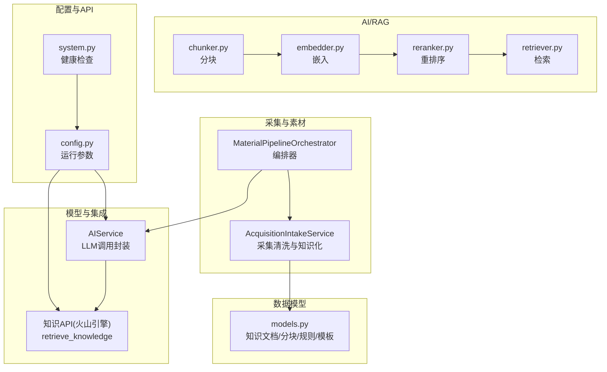
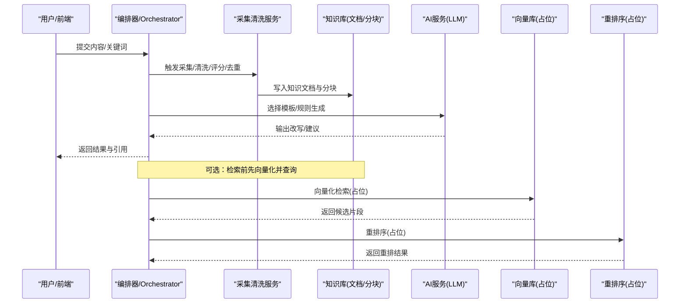
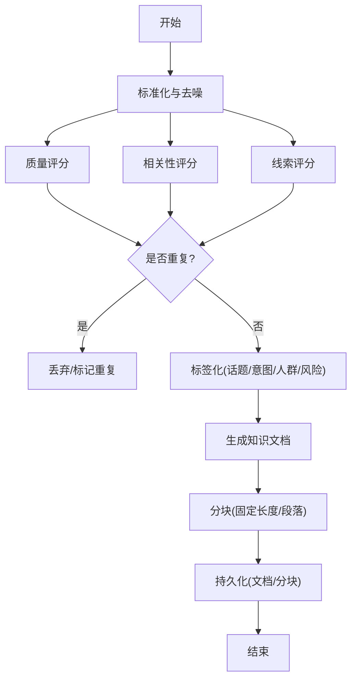
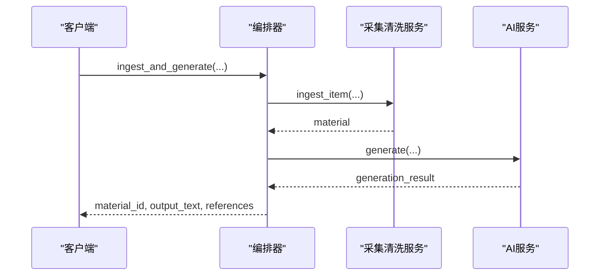
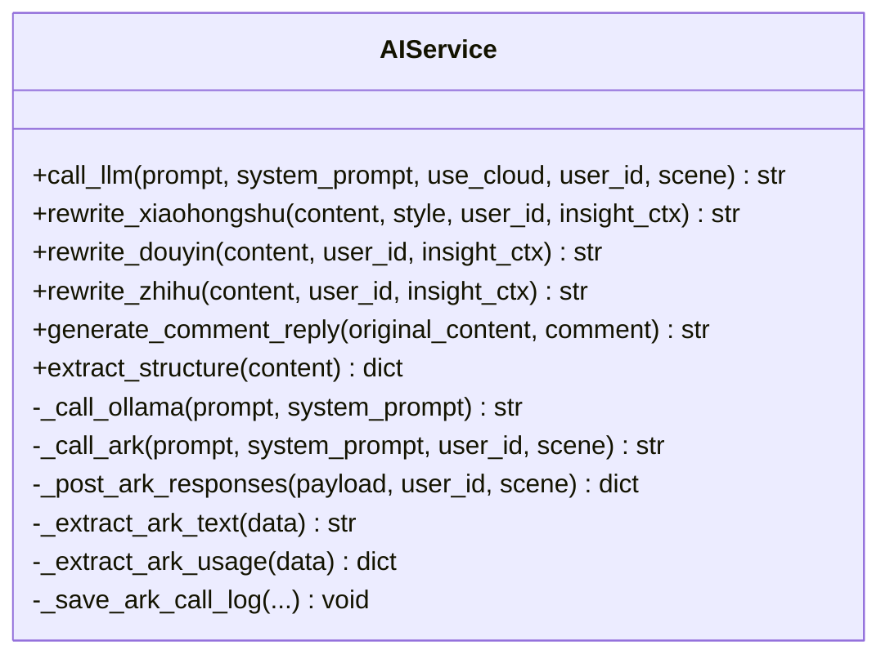
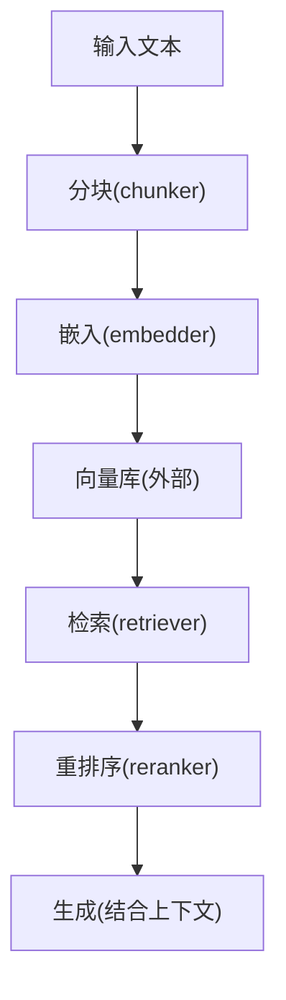
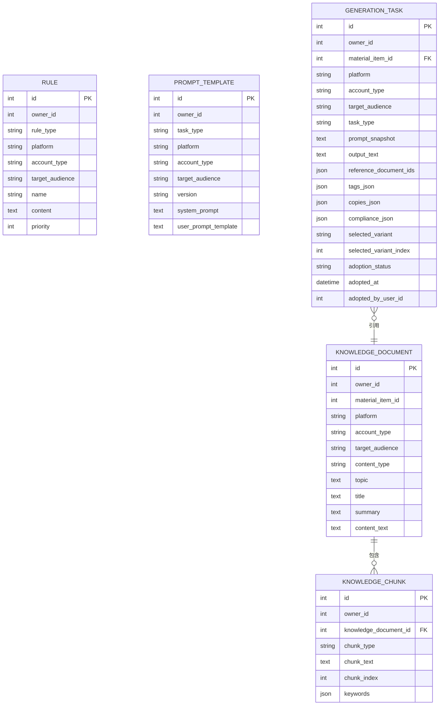
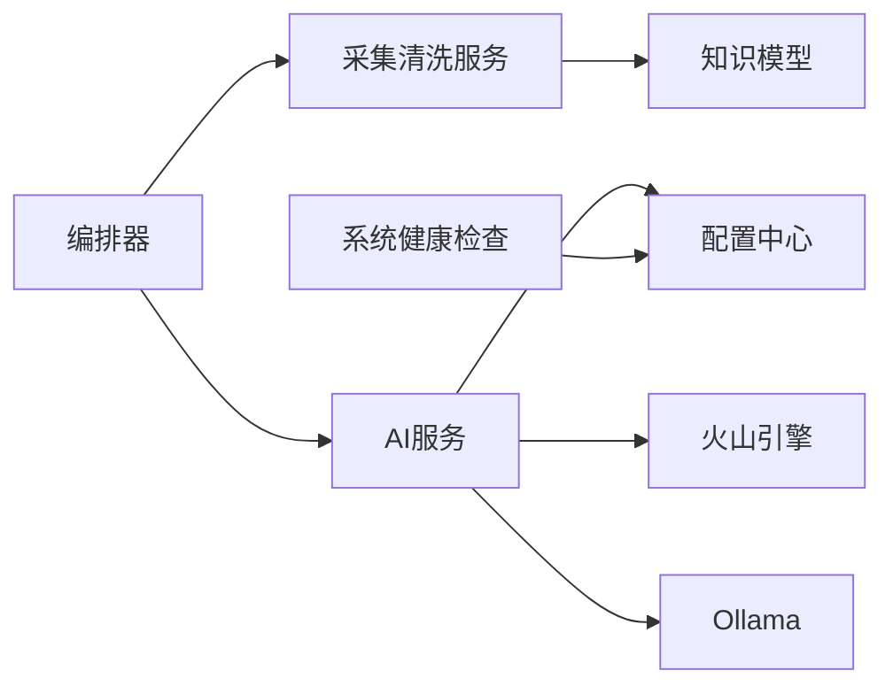

# 知识管理体系

<cite>
**本文引用的文件**
- [backend/app/ai/rag/chunker.py](file://backend/app/ai/rag/chunker.py)
- [backend/app/ai/rag/embedder.py](file://backend/app/ai/rag/embedder.py)
- [backend/app/ai/rag/reranker.py](file://backend/app/ai/rag/reranker.py)
- [backend/app/ai/rag/retriever.py](file://backend/app/ai/rag/retriever.py)
- [backend/app/ai/agents/material_agent.py](file://backend/app/ai/agents/material_agent.py)
- [backend/app/services/collector/material_pipeline_service.py](file://backend/app/services/collector/material_pipeline_service.py)
- [backend/app/domains/acquisition/orchestrator.py](file://backend/app/domains/acquisition/orchestrator.py)
- [backend/app/models/models.py](file://backend/app/models/models.py)
- [backend/app/core/config.py](file://backend/app/core/config.py)
- [backend/app/services/ai_service.py](file://backend/app/services/ai_service.py)
- [backend/app/integrations/volcengine/knowledge_api.py](file://backend/app/integrations/volcengine/knowledge_api.py)
- [backend/app/api/endpoints/content.py](file://backend/app/api/endpoints/content.py)
- [backend/app/api/endpoints/collect.py](file://backend/app/api/endpoints/collect.py)
- [backend/app/api/endpoints/system.py](file://backend/app/api/endpoints/system.py)
</cite>

## 目录
1. [简介](#简介)
2. [项目结构](#项目结构)
3. [核心组件](#核心组件)
4. [架构总览](#架构总览)
5. [详细组件分析](#详细组件分析)
6. [依赖分析](#依赖分析)
7. [性能考虑](#性能考虑)
8. [故障排查指南](#故障排查指南)
9. [结论](#结论)
10. [附录](#附录)

## 简介
本文件面向“智获客知识管理体系”的功能与实现，系统性梳理从内容采集、清洗与结构化、知识抽取与向量化、检索增强生成（RAG）、到知识图谱应用与维护的全流程。文档重点覆盖：
- 知识库构建：内容提取、结构化处理、分块与嵌入、向量化存储
- RAG 实现：检索、重排序与生成链路及性能优化
- 知识图谱：构建方法与应用场景
- 检索算法、重排序机制与结果优化
- 配置项、参数说明与使用示例
- 与内容采集系统的集成关系与数据流
- 知识库维护与更新最佳实践

## 项目结构
后端采用模块化分层设计，围绕“采集-清洗-知识-检索-生成”主路径组织代码：
- AI/RAG 子系统：提供文本分块、嵌入、重排序与检索接口占位
- 采集与素材服务：负责内容采集、去重、评分、标签化与知识文档/分块生成
- 领域编排器：统一入口，串联采集、知识化与生成
- 数据模型：定义知识文档、分块、规则、提示词模板等核心实体
- 配置中心：统一管理本地/云端模型、火山引擎集成、限流与上传等参数
- 外部集成：火山引擎知识检索接口占位
- API 层：提供系统健康检查与迁移后的接口路由

图表来源
- [backend/app/services/collector/material_pipeline_service.py](file://backend/app/services/collector/material_pipeline_service.py)
- [backend/app/domains/acquisition/orchestrator.py](file://backend/app/domains/acquisition/orchestrator.py)
- [backend/app/ai/rag/chunker.py](file://backend/app/ai/rag/chunker.py)
- [backend/app/ai/rag/embedder.py](file://backend/app/ai/rag/embedder.py)
- [backend/app/ai/rag/reranker.py](file://backend/app/ai/rag/reranker.py)
- [backend/app/ai/rag/retriever.py](file://backend/app/ai/rag/retriever.py)
- [backend/app/services/ai_service.py](file://backend/app/services/ai_service.py)
- [backend/app/integrations/volcengine/knowledge_api.py](file://backend/app/integrations/volcengine/knowledge_api.py)
- [backend/app/models/models.py](file://backend/app/models/models.py)
- [backend/app/core/config.py](file://backend/app/core/config.py)
- [backend/app/api/endpoints/system.py](file://backend/app/api/endpoints/system.py)

章节来源
- [backend/app/services/collector/material_pipeline_service.py](file://backend/app/services/collector/material_pipeline_service.py)
- [backend/app/domains/acquisition/orchestrator.py](file://backend/app/domains/acquisition/orchestrator.py)
- [backend/app/models/models.py](file://backend/app/models/models.py)
- [backend/app/core/config.py](file://backend/app/core/config.py)
- [backend/app/api/endpoints/system.py](file://backend/app/api/endpoints/system.py)

## 核心组件
- 采集清洗与知识化服务：负责采集输入标准化、去噪、质量/相关性/线索评分、重复检测、标签化，并生成知识文档与分块
- 编排器：统一入口，支持手动/采集输入，确保知识化一致性，驱动生成
- AI 服务：封装本地 Ollama 与火山引擎（Ark）模型调用，提供多平台改写能力
- RAG 组件：提供分块、嵌入、重排序、检索接口占位，便于后续接入向量库
- 知识模型：定义知识文档、分块、规则、提示词模板等持久化结构
- 配置中心：集中管理模型、限流、上传、采集器等参数
- 系统健康检查：数据库、Redis、Ollama 状态探测

章节来源
- [backend/app/services/collector/material_pipeline_service.py](file://backend/app/services/collector/material_pipeline_service.py)
- [backend/app/domains/acquisition/orchestrator.py](file://backend/app/domains/acquisition/orchestrator.py)
- [backend/app/services/ai_service.py](file://backend/app/services/ai_service.py)
- [backend/app/ai/rag/chunker.py](file://backend/app/ai/rag/chunker.py)
- [backend/app/ai/rag/embedder.py](file://backend/app/ai/rag/embedder.py)
- [backend/app/ai/rag/reranker.py](file://backend/app/ai/rag/reranker.py)
- [backend/app/ai/rag/retriever.py](file://backend/app/ai/rag/retriever.py)
- [backend/app/models/models.py](file://backend/app/models/models.py)
- [backend/app/core/config.py](file://backend/app/core/config.py)

## 架构总览
知识管理体系以“采集-清洗-知识化-检索-生成”为主线，结合规则与提示词模板，形成可扩展的知识资产与智能生成能力。

图表来源
- [backend/app/domains/acquisition/orchestrator.py](file://backend/app/domains/acquisition/orchestrator.py)
- [backend/app/services/collector/material_pipeline_service.py](file://backend/app/services/collector/material_pipeline_service.py)
- [backend/app/services/ai_service.py](file://backend/app/services/ai_service.py)
- [backend/app/models/models.py](file://backend/app/models/models.py)

## 详细组件分析

### 采集清洗与知识化服务
- 输入标准化：统一清理标题/正文、HTML、噪声行、多余空白，规范化时间与数值字段
- 质量/相关性/线索评分：基于长度、出现频次、关键词命中、热度指标计算综合评分
- 重复检测：优先按 source_id 匹配，其次按内容哈希
- 标签化：话题、意图、人群、风险等级、热度等标签
- 知识化：生成知识文档与分块，支持后续检索与生成

图表来源
- [backend/app/services/collector/material_pipeline_service.py](file://backend/app/services/collector/material_pipeline_service.py)
- [backend/app/models/models.py](file://backend/app/models/models.py)

章节来源
- [backend/app/services/collector/material_pipeline_service.py](file://backend/app/services/collector/material_pipeline_service.py)
- [backend/app/models/models.py](file://backend/app/models/models.py)

### 编排器（MaterialPipelineOrchestrator）
- 手动/采集输入统一入口
- 确保知识文档一致性，必要时重建索引
- 驱动生成任务，返回改写结果与引用

图表来源
- [backend/app/domains/acquisition/orchestrator.py](file://backend/app/domains/acquisition/orchestrator.py)
- [backend/app/services/collector/material_pipeline_service.py](file://backend/app/services/collector/material_pipeline_service.py)
- [backend/app/services/ai_service.py](file://backend/app/services/ai_service.py)

章节来源
- [backend/app/domains/acquisition/orchestrator.py](file://backend/app/domains/acquisition/orchestrator.py)

### AI 服务与多平台改写
- 支持本地 Ollama 与火山引擎 Ark 两种推理后端
- 提供小红书、抖音、知乎等平台风格改写
- 统一日志与用量统计，便于审计与成本控制

图表来源
- [backend/app/services/ai_service.py](file://backend/app/services/ai_service.py)

章节来源
- [backend/app/services/ai_service.py](file://backend/app/services/ai_service.py)

### RAG 组件（占位与扩展）
- 分块：按段落与长度切分
- 嵌入：占位函数，便于接入向量模型
- 重排序：占位函数，便于接入重排序模型
- 检索：占位函数，便于接入向量库

图表来源
- [backend/app/ai/rag/chunker.py](file://backend/app/ai/rag/chunker.py)
- [backend/app/ai/rag/embedder.py](file://backend/app/ai/rag/embedder.py)
- [backend/app/ai/rag/reranker.py](file://backend/app/ai/rag/reranker.py)
- [backend/app/ai/rag/retriever.py](file://backend/app/ai/rag/retriever.py)

章节来源
- [backend/app/ai/rag/chunker.py](file://backend/app/ai/rag/chunker.py)
- [backend/app/ai/rag/embedder.py](file://backend/app/ai/rag/embedder.py)
- [backend/app/ai/rag/reranker.py](file://backend/app/ai/rag/reranker.py)
- [backend/app/ai/rag/retriever.py](file://backend/app/ai/rag/retriever.py)

### 知识模型与规则/模板
- 知识文档与分块：承载结构化知识与检索单元
- 规则与提示词模板：约束生成边界与风格
- 生成任务：持久化生成输出与上下文快照

图表来源
- [backend/app/models/models.py](file://backend/app/models/models.py)

章节来源
- [backend/app/models/models.py](file://backend/app/models/models.py)

### 火山引擎知识检索接口
- 占位实现，预留检索能力扩展
- 与配置中心协同，支持模型与限流参数

章节来源
- [backend/app/integrations/volcengine/knowledge_api.py](file://backend/app/integrations/volcengine/knowledge_api.py)
- [backend/app/core/config.py](file://backend/app/core/config.py)

### 配置中心与系统健康检查
- 集中管理数据库、JWT、CORS、AI模型、火山引擎、Redis、上传大小等
- 提供系统健康检查与就绪检查，便于运维与自动化部署

章节来源
- [backend/app/core/config.py](file://backend/app/core/config.py)
- [backend/app/api/endpoints/system.py](file://backend/app/api/endpoints/system.py)

### 与内容采集系统的集成关系
- 旧接口已下线，迁移至新版素材与采集接口
- 新接口路由清晰，避免历史路径冲突

章节来源
- [backend/app/api/endpoints/content.py](file://backend/app/api/endpoints/content.py)
- [backend/app/api/endpoints/collect.py](file://backend/app/api/endpoints/collect.py)

## 依赖分析
- 组件耦合
  - 编排器依赖采集清洗服务与 AI 服务
  - 采集清洗服务依赖模型与规则/模板
  - AI 服务依赖配置中心与外部模型
  - 知识模型作为共享数据契约
- 外部依赖
  - 数据库：PostgreSQL
  - 缓存/限流：Redis
  - 推理后端：Ollama 或 火山引擎 Ark
  - 文件上传：本地目录或对象存储（需按配置启用）

图表来源
- [backend/app/domains/acquisition/orchestrator.py](file://backend/app/domains/acquisition/orchestrator.py)
- [backend/app/services/collector/material_pipeline_service.py](file://backend/app/services/collector/material_pipeline_service.py)
- [backend/app/services/ai_service.py](file://backend/app/services/ai_service.py)
- [backend/app/models/models.py](file://backend/app/models/models.py)
- [backend/app/core/config.py](file://backend/app/core/config.py)
- [backend/app/api/endpoints/system.py](file://backend/app/api/endpoints/system.py)

章节来源
- [backend/app/domains/acquisition/orchestrator.py](file://backend/app/domains/acquisition/orchestrator.py)
- [backend/app/services/collector/material_pipeline_service.py](file://backend/app/services/collector/material_pipeline_service.py)
- [backend/app/services/ai_service.py](file://backend/app/services/ai_service.py)
- [backend/app/models/models.py](file://backend/app/models/models.py)
- [backend/app/core/config.py](file://backend/app/core/config.py)
- [backend/app/api/endpoints/system.py](file://backend/app/api/endpoints/system.py)

## 性能考虑
- 向量化与检索
  - 分块策略：按段落与长度平衡召回与上下文完整性
  - 嵌入模型：选择合适维度与批量大小，避免超时
  - 检索策略：混合检索（BM25 + 向量）与过滤条件
  - 重排序：引入语义重排与规则打分，减少无关片段
- 生成性能
  - 模板缓存与规则预加载
  - 异步生成与并发控制
  - 限流与熔断：Redis 限流与超时保护
- 存储与索引
  - 知识文档/分块建立必要索引（平台、账户类型、受众、关键词）
  - 定期归档与压缩，控制表规模
- 运行时监控
  - 日志埋点与用量统计，定位慢查询与异常

## 故障排查指南
- 健康检查
  - 使用系统健康接口确认数据库、Redis、Ollama 状态
- 模型调用
  - 检查本地模型可用性与云端 API Key 配置
  - 关注 Ark 调用日志与用量统计
- 采集与知识化
  - 查看重复检测与评分逻辑，确认输入标准化是否正确
  - 核对知识文档/分块是否成功写入
- 接口迁移
  - 旧接口已下线，按提示迁移至新路由

章节来源
- [backend/app/api/endpoints/system.py](file://backend/app/api/endpoints/system.py)
- [backend/app/services/ai_service.py](file://backend/app/services/ai_service.py)
- [backend/app/services/collector/material_pipeline_service.py](file://backend/app/services/collector/material_pipeline_service.py)
- [backend/app/api/endpoints/content.py](file://backend/app/api/endpoints/content.py)
- [backend/app/api/endpoints/collect.py](file://backend/app/api/endpoints/collect.py)

## 结论
本知识管理体系以采集清洗与知识化为核心，结合规则与模板实现可控的生成式内容创作。RAG 组件提供可扩展的检索增强框架，未来可无缝对接向量库与重排序模型。通过完善的配置中心与健康检查，系统具备良好的可观测性与可运维性。建议在生产环境中逐步引入向量化检索与重排序，并持续优化分块策略与生成模板，以提升检索精度与生成质量。

## 附录

### 配置项与参数说明
- 数据库与安全
  - DATABASE_URL/DATABASE_HOST/DATABASE_PORT/DATABASE_NAME
  - SECRET_KEY/ALGORITHM/ACCESS_TOKEN_EXPIRE_MINUTES
- AI 与模型
  - OLLAMA_BASE_URL/OLLAMA_MODEL/USE_CLOUD_MODEL
  - ARK_API_KEY/ARK_BASE_URL/ARK_MODEL/ARK_TIMEOUT_SECONDS
- 限流与缓存
  - USE_REDIS_RATE_LIMIT/REDIS_URL/RATE_LIMIT_KEY_PREFIX
- 上传与跨域
  - MAX_UPLOAD_SIZE/UPLOAD_DIR/CORS_ORIGINS
- 采集器
  - BROWSER_COLLECTOR_BASE_URL/BROWSER_COLLECTOR_TIMEOUT_SECONDS

章节来源
- [backend/app/core/config.py](file://backend/app/core/config.py)

### 使用示例（路径指引）
- 手动导入并生成
  - 路径：[backend/app/domains/acquisition/orchestrator.py](file://backend/app/domains/acquisition/orchestrator.py)
  - 方法：ingest_and_generate(...)
- 小红书风格改写
  - 路径：[backend/app/services/ai_service.py](file://backend/app/services/ai_service.py)
  - 方法：rewrite_xiaohongshu(...)
- 抖音脚本改写
  - 路径：[backend/app/services/ai_service.py](file://backend/app/services/ai_service.py)
  - 方法：rewrite_douyin(...)
- 知识检索（占位）
  - 路径：[backend/app/integrations/volcengine/knowledge_api.py](file://backend/app/integrations/volcengine/knowledge_api.py)
  - 方法：retrieve_knowledge(...)