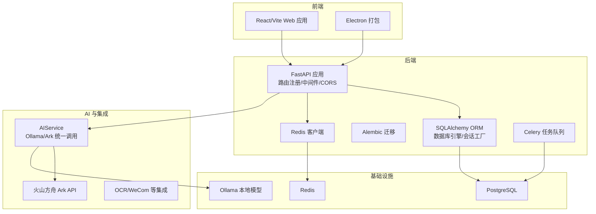
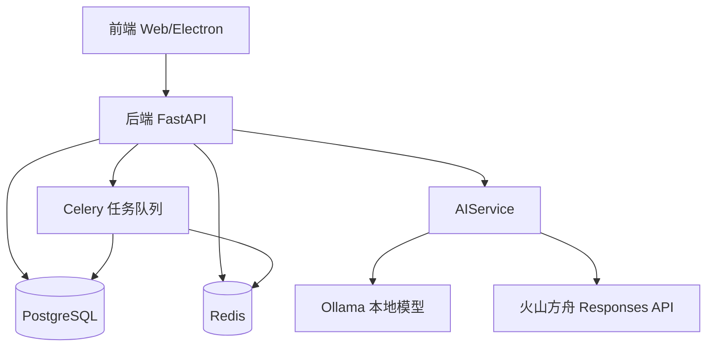
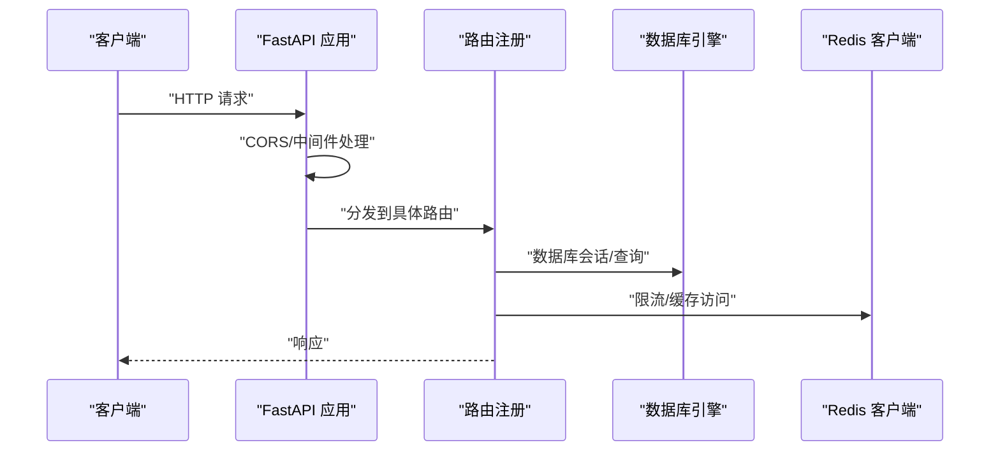
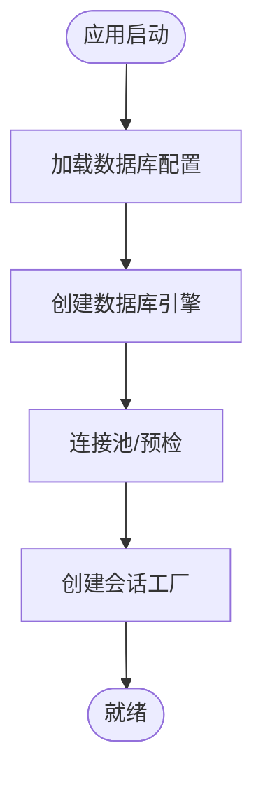
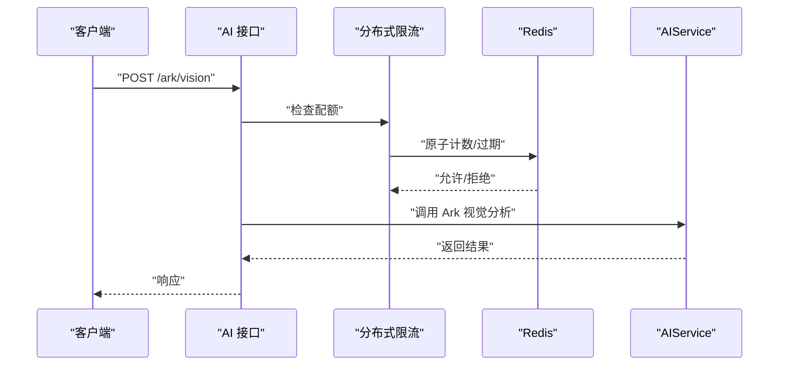
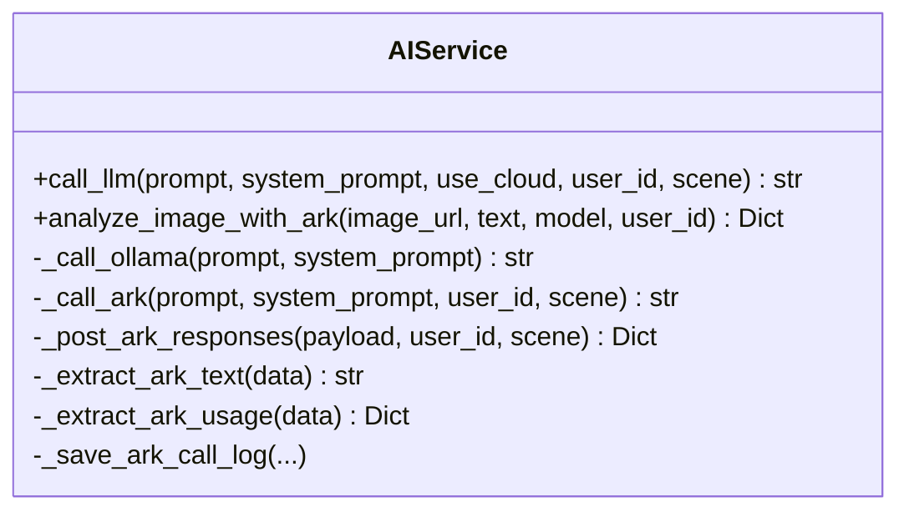
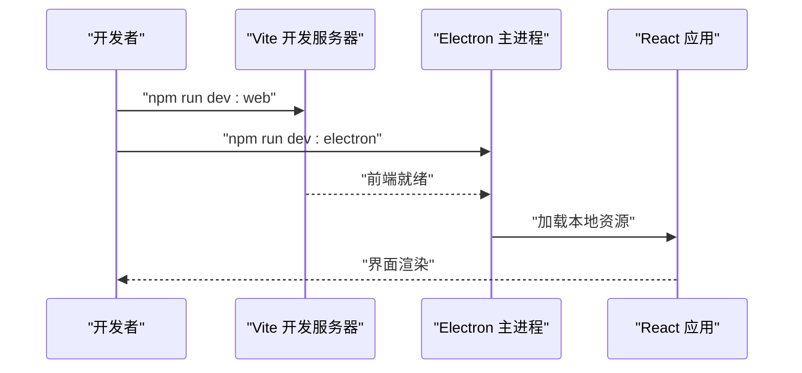
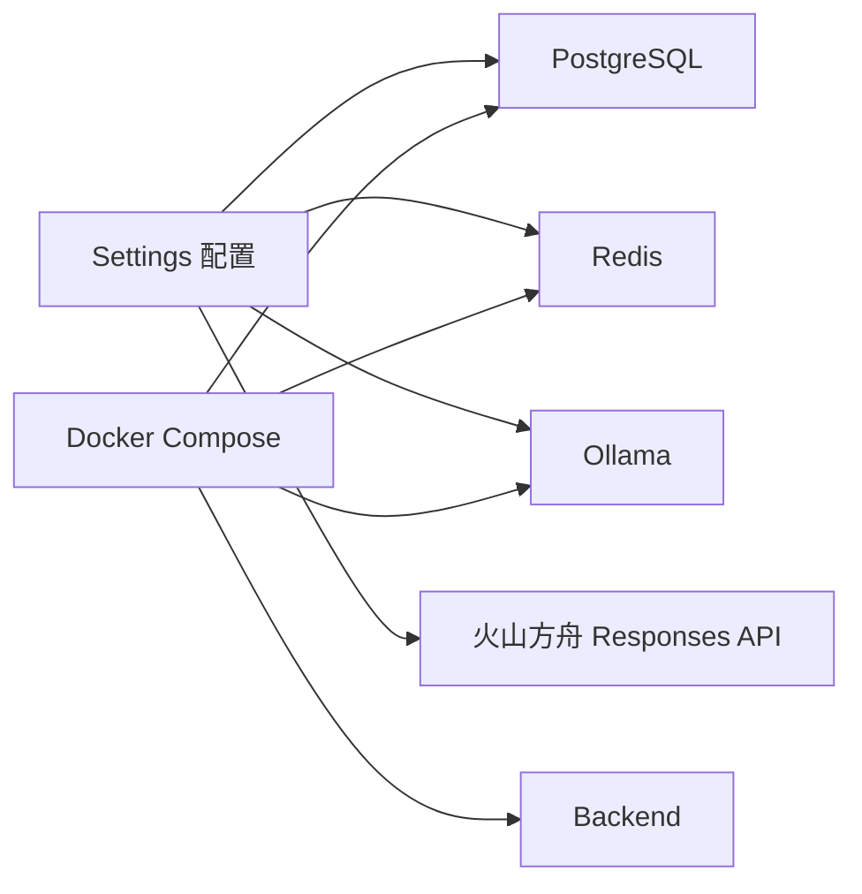
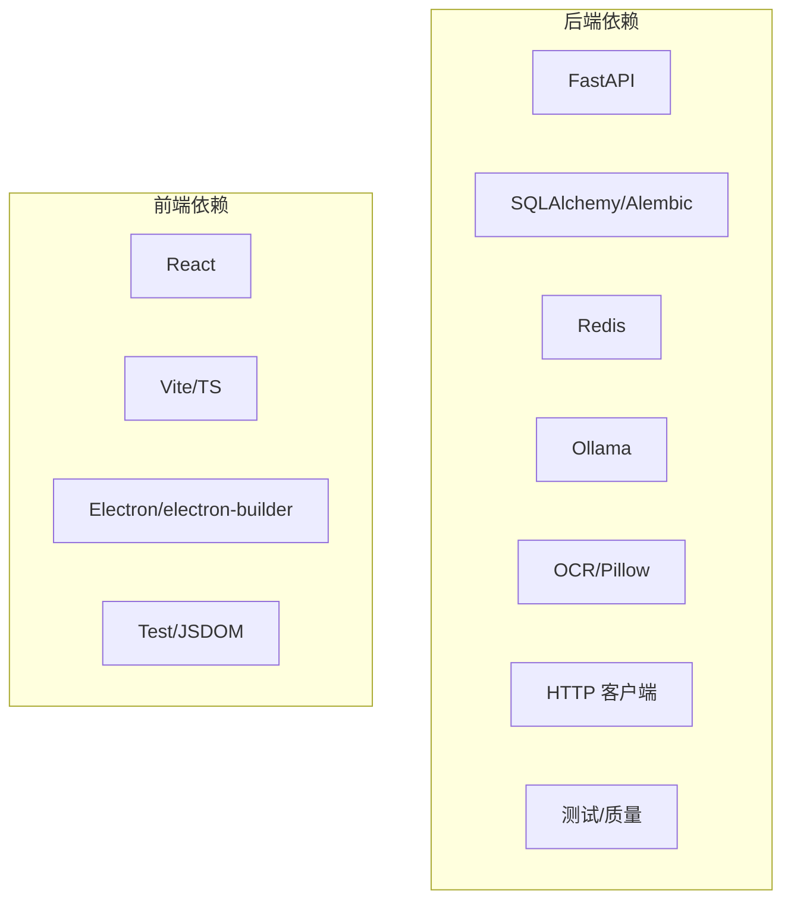

# 技术架构

<cite>
**本文引用的文件**
- [backend/pyproject.toml](file://backend/pyproject.toml)
- [backend/main.py](file://backend/main.py)
- [backend/app/core/config.py](file://backend/app/core/config.py)
- [backend/app/core/database.py](file://backend/app/core/database.py)
- [backend/app/core/redis.py](file://backend/app/core/redis.py)
- [backend/docker-compose.yml](file://backend/docker-compose.yml)
- [backend/alembic.ini](file://backend/alembic.ini)
- [desktop/package.json](file://desktop/package.json)
- [desktop/src/main.tsx](file://desktop/src/main.tsx)
- [desktop/vite.config.ts](file://desktop/vite.config.ts)
- [backend/app/services/ai_service.py](file://backend/app/services/ai_service.py)
- [backend/app/api/endpoints/ai.py](file://backend/app/api/endpoints/ai.py)
- [backend/app/integrations/volcengine/ark_client.py](file://backend/app/integrations/volcengine/ark_client.py)
</cite>

## 目录
1. [引言](#引言)
2. [项目结构](#项目结构)
3. [核心组件](#核心组件)
4. [架构总览](#架构总览)
5. [详细组件分析](#详细组件分析)
6. [依赖关系分析](#依赖关系分析)
7. [性能考量](#性能考量)
8. [故障排查指南](#故障排查指南)
9. [结论](#结论)
10. [附录](#附录)

## 引言
本文件系统化梳理“智获客”的技术架构，覆盖后端技术栈（FastAPI、SQLAlchemy、Celery、Redis、PostgreSQL、Ollama、火山方舟）、前端技术栈（React、Electron、Vite）、以及AI能力（本地模型与云模型双栈）。文档从技术选型动机、组件集成方式、数据与控制流、依赖关系与版本兼容性、到演进路线与发展规划进行全景式阐述，帮助研发与运维团队快速理解并高效交付。

## 项目结构
项目采用多模块分层组织：
- 后端服务：基于 FastAPI 的 API 层，配合 SQLAlchemy ORM、Alembic 迁移、Redis 限流与缓存、PostgreSQL 数据持久化，并通过 Celery 执行异步任务。
- AI 能力：封装 AIService，统一调用本地 Ollama 与火山方舟 Responses API，支持文案改写、图片视觉分析等。
- 前端：React + Vite 构建 Web 应用，Electron 将其打包为桌面应用，提供跨平台安装体验。
- 集成：与火山引擎 Ark API、OCR、WeCom 等外部系统对接；通过浏览器采集器服务实现内容采集管线。

图表来源
- [backend/main.py:46-68](file://backend/main.py#L46-L68)
- [backend/app/core/database.py:6-13](file://backend/app/core/database.py#L6-L13)
- [backend/app/core/redis.py:6-7](file://backend/app/core/redis.py#L6-L7)
- [backend/app/services/ai_service.py:15-38](file://backend/app/services/ai_service.py#L15-L38)
- [backend/docker-compose.yml:3-38](file://backend/docker-compose.yml#L3-L38)

章节来源
- [backend/main.py:1-138](file://backend/main.py#L1-L138)
- [backend/docker-compose.yml:1-67](file://backend/docker-compose.yml#L1-L67)

## 核心组件
- 后端框架与运行时
  - FastAPI 提供高性能异步 API，内置 OpenAPI/Swagger 文档，支持依赖注入与中间件。
  - Uvicorn 作为 ASGI 服务器，支持热重载与生产部署。
- 数据持久化
  - SQLAlchemy 2.x + psycopg2 + Alembic，提供 ORM 映射、连接池与迁移管理。
- 缓存与限流
  - Redis 用于分布式速率限制、会话与缓存。
- 异步任务
  - Celery 用于后台任务编排（采集、统计、推送等），结合 Redis 作为消息代理。
- AI 与大模型
  - AIService 统一封装 Ollama 本地模型与火山方舟 Responses API，支持多场景改写与视觉分析。
- 前端与桌面
  - React + Vite 构建 Web 应用，Electron 将 Web 打包为桌面应用，支持多平台安装。

章节来源
- [backend/pyproject.toml:7-30](file://backend/pyproject.toml#L7-L30)
- [backend/main.py:46-68](file://backend/main.py#L46-L68)
- [backend/app/core/database.py:1-29](file://backend/app/core/database.py#L1-L29)
- [backend/app/core/redis.py:1-8](file://backend/app/core/redis.py#L1-L8)
- [desktop/package.json:1-77](file://desktop/package.json#L1-L77)
- [desktop/vite.config.ts:1-23](file://desktop/vite.config.ts#L1-L23)

## 架构总览
后端以 FastAPI 为核心，向上承载 API 路由与业务服务，向下连接数据库、缓存与外部 AI 能力。前端通过 Electron 与 Vite 提供桌面端体验，Web 应用与后端通过 REST 协议交互。AI 侧同时支持本地与云端模型，满足不同合规与性能需求。

图表来源
- [backend/app/services/ai_service.py:15-38](file://backend/app/services/ai_service.py#L15-L38)
- [backend/app/api/endpoints/ai.py:87-102](file://backend/app/api/endpoints/ai.py#L87-L102)
- [backend/docker-compose.yml:40-58](file://backend/docker-compose.yml#L40-L58)

## 详细组件分析

### 后端应用与路由
- 应用生命周期与健康检查：通过 lifespan 在启动阶段执行用户序列健康检查，确保数据库序列一致性。
- CORS 与静态资源：按配置注入 CORS，挂载前端静态资源目录，支持 SPA 回退至 index.html。
- OpenAPI 自定义：生成品牌化文档，包含 Logo 与版本信息。
- 主机与端口：开发模式默认 8000 端口，支持主机绑定与热重载。

图表来源
- [backend/main.py:22-35](file://backend/main.py#L22-L35)
- [backend/main.py:59-65](file://backend/main.py#L59-L65)
- [backend/main.py:78-99](file://backend/main.py#L78-L99)
- [backend/app/core/database.py:22-28](file://backend/app/core/database.py#L22-L28)
- [backend/app/core/redis.py:6-7](file://backend/app/core/redis.py#L6-L7)

章节来源
- [backend/main.py:1-138](file://backend/main.py#L1-L138)
- [backend/app/core/database.py:1-29](file://backend/app/core/database.py#L1-L29)
- [backend/app/core/redis.py:1-8](file://backend/app/core/redis.py#L1-L8)

### 数据库与迁移
- 连接与会话：基于 settings.DATABASE_URL 创建引擎，启用 pool_pre_ping 与连接池参数，提供 SessionLocal 工厂。
- 迁移：Alembic 配置文件指定脚本位置与默认连接串，日志级别与格式可调。
- 初始化：可通过设置开启启动时自动建表（仅开发/测试环境建议）。

图表来源
- [backend/app/core/database.py:6-13](file://backend/app/core/database.py#L6-L13)
- [backend/alembic.ini:1-43](file://backend/alembic.ini#L1-L43)

章节来源
- [backend/app/core/database.py:1-29](file://backend/app/core/database.py#L1-L29)
- [backend/alembic.ini:1-43](file://backend/alembic.ini#L1-L43)

### 缓存与限流
- Redis 客户端：通过 settings.REDIS_URL 获取连接实例，统一解码响应。
- 分布式限流：在 AI 视觉分析接口上使用 DistributedRateLimiter，基于 Redis 实现分钟级配额控制。

图表来源
- [backend/app/api/endpoints/ai.py:18-24](file://backend/app/api/endpoints/ai.py#L18-L24)
- [backend/app/api/endpoints/ai.py:94-102](file://backend/app/api/endpoints/ai.py#L94-L102)
- [backend/app/core/redis.py:6-7](file://backend/app/core/redis.py#L6-L7)

章节来源
- [backend/app/core/redis.py:1-8](file://backend/app/core/redis.py#L1-L8)
- [backend/app/api/endpoints/ai.py:1-103](file://backend/app/api/endpoints/ai.py#L1-L103)

### AI 能力与模型选择
- AIService 设计
  - 统一入口：call_llm 支持本地 Ollama 与火山方舟 Ark 两种路径。
  - 本地模型：Ollama 通过 /api/generate 接口调用，支持温度、非流式返回。
  - 云端模型：火山方舟 Responses API，支持文本与图文输入，统一提取输出文本与用量。
  - 日志与可观测性：请求开始/成功/失败均记录日志与 Token 使用情况，必要时落库 ArkCallLog。
- 场景化改写
  - 小红书、抖音、知乎三种平台风格的改写提示词与约束，通过 AIService 的具体方法实现。
- 速率限制
  - 针对 Ark 视觉分析接口设置独立配额，避免突发流量影响稳定性。

图表来源
- [backend/app/services/ai_service.py:15-304](file://backend/app/services/ai_service.py#L15-L304)

章节来源
- [backend/app/services/ai_service.py:1-460](file://backend/app/services/ai_service.py#L1-L460)
- [backend/app/api/endpoints/ai.py:87-102](file://backend/app/api/endpoints/ai.py#L87-L102)

### 前端与桌面
- React + Vite：开发服务器绑定 0.0.0.0:5173，支持 LAN 预览；测试环境使用 jsdom。
- Electron：通过 package.json 的 dev:electron 脚本等待前端就绪后启动 Electron；构建产物与后端二进制打包为安装包。
- 应用入口：main.tsx 使用 BrowserRouter 包裹 App，根节点渲染 React 应用。

图表来源
- [desktop/package.json:8-19](file://desktop/package.json#L8-L19)
- [desktop/vite.config.ts:4-22](file://desktop/vite.config.ts#L4-L22)
- [desktop/src/main.tsx:1-14](file://desktop/src/main.tsx#L1-L14)

章节来源
- [desktop/package.json:1-77](file://desktop/package.json#L1-L77)
- [desktop/vite.config.ts:1-23](file://desktop/vite.config.ts#L1-L23)
- [desktop/src/main.tsx:1-14](file://desktop/src/main.tsx#L1-L14)

### 外部集成与配置
- 配置中心：Settings 统一管理数据库、JWT、CORS、AI 模型、火山方舟、Redis、上传大小、WeCom、浏览器采集器等参数。
- 火山方舟：ArkClient 提供基础连通性检测；Responses API 作为主要调用入口。
- Docker Compose：一键拉起 postgres、redis、ollama、backend，服务间网络隔离与健康检查完备。

图表来源
- [backend/app/core/config.py:27-101](file://backend/app/core/config.py#L27-L101)
- [backend/app/integrations/volcengine/ark_client.py:1-4](file://backend/app/integrations/volcengine/ark_client.py#L1-L4)
- [backend/docker-compose.yml:3-38](file://backend/docker-compose.yml#L3-L38)

章节来源
- [backend/app/core/config.py:1-103](file://backend/app/core/config.py#L1-L103)
- [backend/app/integrations/volcengine/ark_client.py:1-4](file://backend/app/integrations/volcengine/ark_client.py#L1-L4)
- [backend/docker-compose.yml:1-67](file://backend/docker-compose.yml#L1-L67)

## 依赖关系分析
- 后端依赖
  - Web 框架：FastAPI、Uvicorn
  - ORM 与迁移：SQLAlchemy、Alembic、psycopg2-binary
  - 配置与安全：Pydantic Settings、python-jose、passlib bcrypt
  - HTTP 客户端：aiohttp、httpx、requests
  - OCR 与图像：Pillow、pytesseract
  - AI 与缓存：ollama、redis
  - 测试与质量：pytest、pytest-asyncio、python-dotenv、black/isort/flake8/mypy
- 前端依赖
  - React 生态：React、React DOM、React Router
  - 构建与测试：Vite、TypeScript、Electron、electron-builder、vitest/jsdom
  - 开发工具：concurrently、wait-on

图表来源
- [backend/pyproject.toml:7-30](file://backend/pyproject.toml#L7-L30)
- [desktop/package.json:21-44](file://desktop/package.json#L21-L44)

章节来源
- [backend/pyproject.toml:1-47](file://backend/pyproject.toml#L1-L47)
- [desktop/package.json:1-77](file://desktop/package.json#L1-L77)

## 性能考量
- 数据库
  - 连接池参数与 pool_pre_ping 降低连接失效带来的失败重试成本。
  - Alembic 迁移保证结构演进的可控性，减少线上变更风险。
- 缓存与限流
  - Redis 限流避免突发流量冲击 AI 与下游服务，保障 SLA。
- 异步与并发
  - FastAPI 异步与 httpx 异步客户端提升 I/O 密集场景吞吐。
- 前端
  - Vite 开发服务器与 Electron 打包优化首屏与安装体验。
- AI 推理
  - 本地 Ollama 适合低延迟与隐私敏感场景；火山方舟适合复杂视觉与长上下文任务。

## 故障排查指南
- 启动与健康
  - 启动阶段健康检查失败：查看 lifespan 中用户序列检查日志，确认数据库连接与权限。
- CORS 与静态资源
  - 前端无法访问：核对 CORS_ORIGINS 配置，生产环境禁止使用通配符。
  - SPA 路由 404：确认前端构建产物存在且 index.html 可访问。
- 数据库
  - 连接异常：检查 DATABASE_URL、网络连通与凭据；启用 DEBUG 查看 SQL 输出。
- Redis 与限流
  - 限流频繁触发：调整配额或键前缀；检查 Redis 连接与过期策略。
- AI 与模型
  - Ollama 无法访问：确认 Ollama_HOST 与端口映射；检查容器健康状态。
  - 火山方舟错误：核对 ARK_API_KEY、模型名与超时设置；查看 ArkCallLog 记录。
- Docker Compose
  - 服务不可用：查看健康检查日志与容器状态；确认端口映射与卷挂载。

章节来源
- [backend/main.py:22-35](file://backend/main.py#L22-L35)
- [backend/app/core/config.py:49-69](file://backend/app/core/config.py#L49-L69)
- [backend/docker-compose.yml:15-19](file://backend/docker-compose.yml#L15-L19)
- [backend/app/services/ai_service.py:132-239](file://backend/app/services/ai_service.py#L132-L239)

## 结论
本架构以 FastAPI 为枢纽，结合 SQLAlchemy、Redis、PostgreSQL、Ollama 与火山方舟，形成“Web/Electron 前端 + 后端 API + AI 能力 + 数据与缓存”的完整闭环。通过 Docker Compose 实现一键部署，通过 Alembic 与严格的配置校验保障演进稳定。未来可在任务编排、可观测性与多租户隔离方面持续增强。

## 附录

### 技术选型与优势
- FastAPI
  - 异步原生、自动生成 OpenAPI、强类型依赖注入，提升开发效率与运行性能。
- SQLAlchemy + Alembic
  - ORM 与迁移一体化，降低数据库变更风险，便于团队协作。
- Redis
  - 分布式限流、缓存与会话存储，支撑高并发与弹性扩展。
- PostgreSQL
  - 企业级关系型数据库，支持事务、索引与扩展，满足结构化数据持久化。
- Ollama
  - 本地推理，低延迟、隐私友好，适合内部场景与快速迭代。
- 火山方舟
  - 多模态与长上下文能力，适配复杂内容分析与合规审查。
- React + Vite + Electron
  - 前端生态成熟，开发体验佳；Electron 打包跨平台桌面应用，降低交付成本。

### 版本兼容性矩阵（示例）
- Python：^3.10
- FastAPI：^0.104.1
- Uvicorn：^0.24.0
- SQLAlchemy：^2.0.23
- Alembic：^1.12.1
- psycopg2-binary：^2.9.9
- Pydantic/Settings：^2.5.0 / ^2.1.0
- Redis：^5.0.1
- Ollama：^0.0.55
- React：^18.3.1
- Vite：^5.4.14
- Electron：^35.1.5
- electron-builder：^25.1.8

章节来源
- [backend/pyproject.toml:7-30](file://backend/pyproject.toml#L7-L30)
- [desktop/package.json:21-44](file://desktop/package.json#L21-L44)