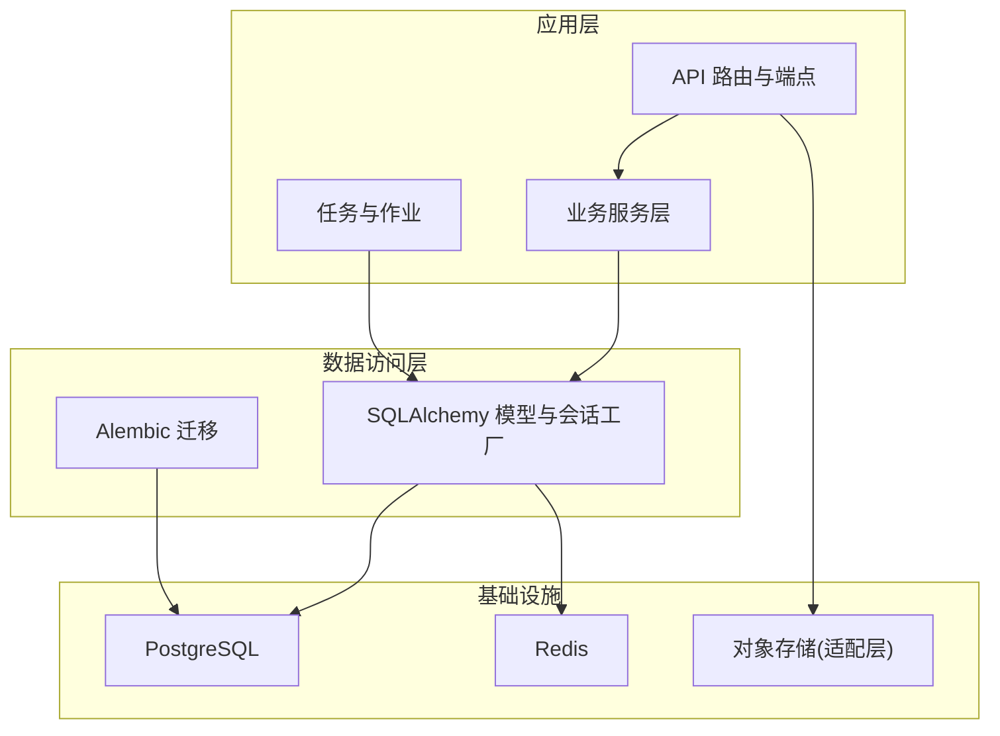
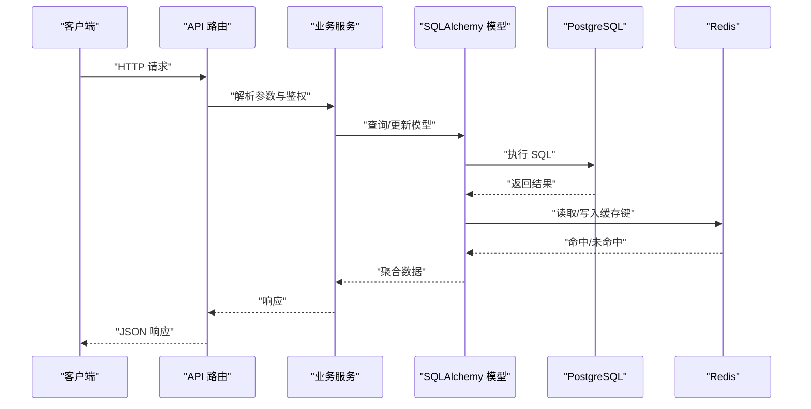
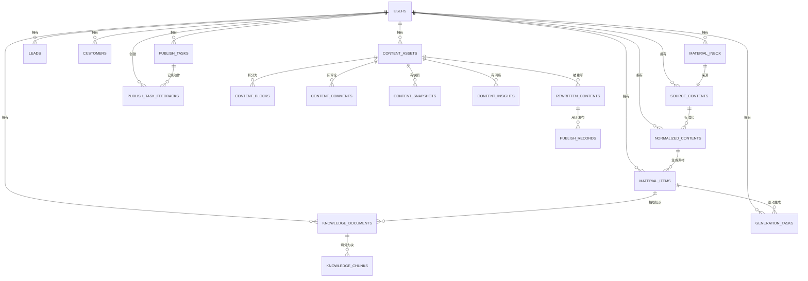
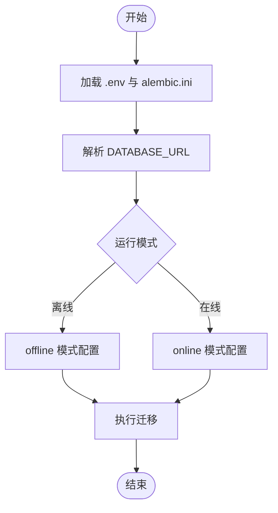
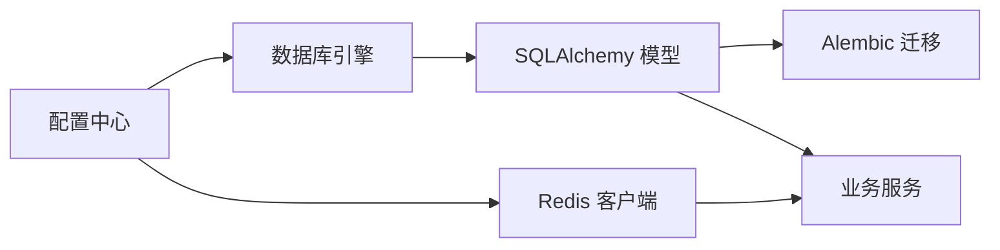

# 数据架构

<cite>
**本文引用的文件**
- [backend/app/core/database.py](file://backend/app/core/database.py)
- [backend/app/core/redis.py](file://backend/app/core/redis.py)
- [backend/app/core/config.py](file://backend/app/core/config.py)
- [backend/app/models/models.py](file://backend/app/models/models.py)
- [backend/alembic/env.py](file://backend/alembic/env.py)
- [backend/alembic/versions/20260323_0008_legacy_baseline.py](file://backend/alembic/versions/20260323_0008_legacy_baseline.py)
- [backend/scripts/backup_db.sh](file://backend/scripts/backup_db.sh)
- [backend/scripts/restore_db.sh](file://backend/scripts/restore_db.sh)
- [backend/docs/architecture/er-overview.md](file://backend/docs/architecture/er-overview.md)
- [backend/deploy/postgres/README.md](file://backend/deploy/postgres/README.md)
- [backend/deploy/redis/README.md](file://backend/deploy/redis/README.md)
</cite>

## 目录
1. [简介](#简介)
2. [项目结构](#项目结构)
3. [核心组件](#核心组件)
4. [架构总览](#架构总览)
5. [详细组件分析](#详细组件分析)
6. [依赖分析](#依赖分析)
7. [性能考虑](#性能考虑)
8. [故障排查指南](#故障排查指南)
9. [结论](#结论)
10. [附录](#附录)

## 简介
本文件系统化梳理“智获客”的数据架构，覆盖数据存储策略、数据模型设计、数据流架构与运维保障。重点包括：
- PostgreSQL 数据库设计与迁移策略
- Redis 缓存与限流策略
- 对象存储集成（当前为适配层）
- 数据模型关系、约束与索引设计
- 数据迁移、备份恢复与一致性保障
- 数据安全、隐私保护与访问控制
- 数据生命周期管理与性能优化

## 项目结构
后端采用 SQLAlchemy ORM + Alembic 迁移，核心数据层位于 app/core，模型定义于 app/models，迁移脚本位于 alembic/versions。配置通过 pydantic-settings 的 Settings 统一读取，支持数据库、Redis、AI、OCR、火山引擎等外部集成。

图表来源
- [backend/app/core/database.py:1-29](file://backend/app/core/database.py#L1-L29)
- [backend/app/core/redis.py:1-8](file://backend/app/core/redis.py#L1-L8)
- [backend/app/core/config.py:27-35](file://backend/app/core/config.py#L27-L35)
- [backend/alembic/env.py:34-44](file://backend/alembic/env.py#L34-L44)

章节来源
- [backend/app/core/database.py:1-29](file://backend/app/core/database.py#L1-L29)
- [backend/app/core/redis.py:1-8](file://backend/app/core/redis.py#L1-L8)
- [backend/app/core/config.py:27-35](file://backend/app/core/config.py#L27-L35)
- [backend/alembic/env.py:34-44](file://backend/alembic/env.py#L34-L44)

## 核心组件
- 数据库连接与会话工厂：基于 SQLAlchemy 创建连接池、预检查与会话生成器，提供依赖注入式 get_db。
- Redis 客户端：统一从配置读取 REDIS_URL，提供分布式限流与缓存能力。
- 配置中心：集中管理 DATABASE_URL、REDIS_URL、CORS、JWT、AI/OCR/火山引擎等参数。
- 模型层：涵盖身份、采集、素材、知识库、生成任务、发布、CRM 等核心域。
- 迁移框架：Alembic 读取 .env 与 alembic.ini，确保目标元数据与实际表结构一致。

章节来源
- [backend/app/core/database.py:1-29](file://backend/app/core/database.py#L1-L29)
- [backend/app/core/redis.py:1-8](file://backend/app/core/redis.py#L1-L8)
- [backend/app/core/config.py:27-35](file://backend/app/core/config.py#L27-L35)
- [backend/app/models/models.py:1-120](file://backend/app/models/models.py#L1-L120)
- [backend/alembic/env.py:34-44](file://backend/alembic/env.py#L34-L44)

## 架构总览
下图展示数据流与组件交互：API 层接收请求，业务服务层协调模型与外部集成，ORM 通过数据库与 Redis 提供持久化与缓存能力，迁移工具保障结构演进。

图表来源
- [backend/app/core/database.py:22-29](file://backend/app/core/database.py#L22-L29)
- [backend/app/core/redis.py:6-8](file://backend/app/core/redis.py#L6-L8)
- [backend/app/core/config.py:86-90](file://backend/app/core/config.py#L86-L90)

## 详细组件分析

### 数据库设计与模型关系
- 设计原则
  - 使用主键与外键建立强关系，避免悬挂引用。
  - 大字段（如文本）采用 TEXT/JSON 存储，必要时拆分子表或使用 JSON 字段承载动态结构。
  - 时间戳统一使用 UTC，默认值与更新触发器保持审计一致性。
- 核心域与实体
  - 身份域：用户、企业微信关联
  - 采集域：采集任务、员工提交、原始内容、标准化内容、素材项
  - 素材域：素材项、知识文档、知识块
  - 生成域：生成任务、提示词模板、规则
  - 发布域：重写内容、发布记录、发布任务、任务反馈
  - CRM 域：线索、客户
  - 洞察域：主题、作者画像
- 关系与约束
  - 多对一/一对多：用户与内容、评论、线索、客户等
  - 一对多级联：内容资产与其块、评论、快照、洞察、重写内容；标准化内容与素材项；知识文档与知识块；生成任务与素材项
  - 唯一约束：素材收件箱按 owner、platform、source_id 组合唯一
  - 索引字段：大量查询过滤字段（如 platform、source_id、status、risk_status、parse_status、is_duplicate、content_hash 等）建立索引以提升查询性能
- ER 关系概览
  - 参考文档：核心域包括 identity、acquisition、material、ai_workbench、compliance、publish、crm 等

图表来源
- [backend/app/models/models.py:8-27](file://backend/app/models/models.py#L8-L27)
- [backend/app/models/models.py:45-84](file://backend/app/models/models.py#L45-L84)
- [backend/app/models/models.py:86-98](file://backend/app/models/models.py#L86-L98)
- [backend/app/models/models.py:101-116](file://backend/app/models/models.py#L101-L116)
- [backend/app/models/models.py:118-131](file://backend/app/models/models.py#L118-L131)
- [backend/app/models/models.py:133-147](file://backend/app/models/models.py#L133-L147)
- [backend/app/models/models.py:156-182](file://backend/app/models/models.py#L156-L182)
- [backend/app/models/models.py:229-257](file://backend/app/models/models.py#L229-L257)
- [backend/app/models/models.py:259-290](file://backend/app/models/models.py#L259-L290)
- [backend/app/models/models.py:292-334](file://backend/app/models/models.py#L292-L334)
- [backend/app/models/models.py:336-349](file://backend/app/models/models.py#L336-L349)
- [backend/app/models/models.py:458-505](file://backend/app/models/models.py#L458-L505)
- [backend/app/models/models.py:507-546](file://backend/app/models/models.py#L507-L546)
- [backend/app/models/models.py:548-582](file://backend/app/models/models.py#L548-L582)
- [backend/app/models/models.py:584-640](file://backend/app/models/models.py#L584-L640)
- [backend/app/models/models.py:642-665](file://backend/app/models/models.py#L642-L665)
- [backend/app/models/models.py:667-684](file://backend/app/models/models.py#L667-L684)
- [backend/app/models/models.py:724-752](file://backend/app/models/models.py#L724-L752)

章节来源
- [backend/app/models/models.py:1-928](file://backend/app/models/models.py#L1-L928)
- [backend/docs/architecture/er-overview.md:1-4](file://backend/docs/architecture/er-overview.md#L1-L4)

### 索引与查询优化建议
- 已有索引字段示例：content_assets.platform、content_assets.source_id、material_inbox.status/risk_status/parse_status/is_duplicate、normalized_contents.content_hash、material_items.keyword/platform/source_id/status 等
- 建议补充
  - 复合索引：material_items(platform, status, created_at)、material_items(owner_id, platform, created_at)
  - 统计字段索引：content_insights.content_id、publish_records.rewritten_content_id
  - 查询热点字段：leads.owner_id、leads.status、customers.lead_id、publish_tasks.assigned_to
- 注意
  - 避免过度索引导致写入放大
  - 定期分析慢查询日志，结合 EXPLAIN 分析执行计划

章节来源
- [backend/app/models/models.py:458-505](file://backend/app/models/models.py#L458-L505)
- [backend/app/models/models.py:507-546](file://backend/app/models/models.py#L507-L546)
- [backend/app/models/models.py:548-582](file://backend/app/models/models.py#L548-L582)
- [backend/app/models/models.py:584-640](file://backend/app/models/models.py#L584-L640)

### Redis 缓存与限流策略
- 缓存用途
  - 分布式限流：基于 Redis 计数器实现速率限制
  - 会话与临时数据：短期状态、验证码、令牌等
- 配置要点
  - REDIS_URL 从配置读取
  - KEY 前缀可配置，便于隔离不同租户或环境
- 最佳实践
  - 为热点键设置 TTL，避免内存膨胀
  - 使用 pipeline 批量操作，降低 RTT
  - 对并发敏感的计数操作使用 Lua 脚本保证原子性

章节来源
- [backend/app/core/redis.py:1-8](file://backend/app/core/redis.py#L1-L8)
- [backend/app/core/config.py:86-90](file://backend/app/core/config.py#L86-L90)

### 对象存储配置
- 当前状态
  - 对象存储为适配层入口，具体实现位于 app/integrations/storage/__init__.py
- 建议
  - 明确上传/下载接口契约，支持断点续传与签名直传
  - 配置访问控制与生命周期策略（过期删除、归档）
  - 与业务模型解耦，通过抽象接口替换实现

章节来源
- [backend/app/integrations/storage/__init__.py:1-2](file://backend/app/integrations/storage/__init__.py#L1-L2)

### 数据迁移策略
- 迁移框架
  - Alembic 读取 .env 与 alembic.ini，确保 DATABASE_URL 正确
  - 目标元数据来自 app/core/database.py 中的 Base.metadata
- 版本管理
  - 仓库包含基础桥接版本，后续逐步扩展
- 运行方式
  - 在线/离线两种模式，支持类型与默认值比较，保证结构一致性

图表来源
- [backend/alembic/env.py:22-44](file://backend/alembic/env.py#L22-L44)
- [backend/alembic/env.py:47-87](file://backend/alembic/env.py#L47-L87)
- [backend/alembic/versions/20260323_0008_legacy_baseline.py:18-25](file://backend/alembic/versions/20260323_0008_legacy_baseline.py#L18-L25)

章节来源
- [backend/alembic/env.py:1-88](file://backend/alembic/env.py#L1-L88)
- [backend/alembic/versions/20260323_0008_legacy_baseline.py:1-26](file://backend/alembic/versions/20260323_0008_legacy_baseline.py#L1-L26)

### 备份与恢复方案
- 现状
  - 备份与恢复脚本存在但尚未实现
- 建议
  - 备份：逻辑导出（pg_dump）+ 物理备份（根据 PostgreSQL 部署策略），定期校验
  - 恢复：灰度验证（新实例导入 → 校验 → 切换），回滚路径明确
  - 自动化：CI/CD 集成定时任务，失败告警
- 与部署模板协同
  - PostgreSQL/Redis 部署模板提供参考，结合实际环境完善

章节来源
- [backend/scripts/backup_db.sh:1-4](file://backend/scripts/backup_db.sh#L1-L4)
- [backend/scripts/restore_db.sh:1-4](file://backend/scripts/restore_db.sh#L1-L4)
- [backend/deploy/postgres/README.md:1-1](file://backend/deploy/postgres/README.md#L1-L1)
- [backend/deploy/redis/README.md:1-1](file://backend/deploy/redis/README.md#L1-L1)

### 数据一致性保证
- ACID 基础
  - 使用事务包裹写入流程，确保幂等与回滚
  - 外键约束与唯一约束防止脏数据
- 读写分离与并发
  - 读多写少场景可引入只读副本
  - 对并发敏感操作使用悲观/乐观锁或分布式锁
- 异步处理
  - 洞察、生成、发布等耗时任务通过队列/作业系统异步执行，最终一致性

章节来源
- [backend/app/models/models.py:458-505](file://backend/app/models/models.py#L458-L505)
- [backend/app/models/models.py:507-546](file://backend/app/models/models.py#L507-L546)

### 数据安全、隐私保护与访问控制
- 密钥与配置
  - SECRET_KEY 必须强且不可为默认占位值，长度≥32
  - 生产环境禁止 CORS 白名单包含通配符
- 敏感字段
  - 用户密码需哈希存储，避免明文
  - 企业微信用户标识可单独字段存储，注意脱敏
- 访问控制
  - JWT 令牌签发与过期控制
  - 企业微信 OAuth 可选，未配置时降级为短票据
- 日志与审计
  - 统一时间戳与 UTC，保留必要的审计字段

章节来源
- [backend/app/core/config.py:55-69](file://backend/app/core/config.py#L55-L69)
- [backend/app/models/models.py:8-27](file://backend/app/models/models.py#L8-L27)

### 数据生命周期管理
- 素材与内容
  - status/review_note/remark 等字段用于生命周期流转
  - is_duplicate/filter_reason 用于去重与筛选
- 知识库
  - 知识文档与知识块支持级联删除，便于清理过期知识
- 生成任务
  - adoption_status/adopted_at/adopted_by_user_id 记录采纳状态
- 建议
  - 定期归档历史数据，清理长期未使用的素材与生成任务
  - 配置自动回收策略（如超过 N 天未更新的素材）

章节来源
- [backend/app/models/models.py:458-505](file://backend/app/models/models.py#L458-L505)
- [backend/app/models/models.py:548-582](file://backend/app/models/models.py#L548-L582)
- [backend/app/models/models.py:642-665](file://backend/app/models/models.py#L642-L665)
- [backend/app/models/models.py:724-752](file://backend/app/models/models.py#L724-L752)

## 依赖分析
- 组件耦合
  - 模型层依赖数据库基类，服务层依赖模型层
  - Alembic 依赖模型元数据与配置中的数据库 URL
  - Redis 依赖配置中心
- 外部依赖
  - PostgreSQL、Redis、火山引擎（ARK）、OCR、MinIO（对象存储适配层）
- 循环依赖
  - 代码中未发现循环导入；模型间通过外键与关系声明建立单向依赖

图表来源
- [backend/app/core/config.py:27-35](file://backend/app/core/config.py#L27-L35)
- [backend/app/core/config.py:86-90](file://backend/app/core/config.py#L86-L90)
- [backend/app/core/database.py:1-29](file://backend/app/core/database.py#L1-L29)
- [backend/app/core/redis.py:1-8](file://backend/app/core/redis.py#L1-L8)
- [backend/alembic/env.py:34-44](file://backend/alembic/env.py#L34-L44)

章节来源
- [backend/app/core/config.py:1-103](file://backend/app/core/config.py#L1-L103)
- [backend/app/core/database.py:1-29](file://backend/app/core/database.py#L1-L29)
- [backend/app/core/redis.py:1-8](file://backend/app/core/redis.py#L1-L8)
- [backend/alembic/env.py:1-88](file://backend/alembic/env.py#L1-L88)

## 性能考虑
- 连接池与预热
  - 启用 pool_pre_ping，减少连接失效导致的异常
  - 合理设置 pool_size 与 max_overflow，结合压测调整
- 查询优化
  - 为高频过滤字段建立索引；避免 SELECT *，仅取必要列
  - 大结果集分页，避免一次性加载
- 写入优化
  - 批量插入/更新；使用 RETURNING 获取自增主键
  - 控制 JSON 字段大小，必要时拆表
- 缓存策略
  - 热点读取使用 Redis 缓存，设置合理 TTL
  - 对写后读一致性要求高的场景，先写后删缓存
- 异步与并行
  - 将耗时任务放入队列，避免阻塞请求线程

## 故障排查指南
- 数据库
  - 连接失败：检查 DATABASE_URL、网络连通性与凭据
  - 迁移失败：确认 alembic.ini 与 .env 配置，查看迁移日志
- Redis
  - 连接异常：核对 REDIS_URL 与网络策略
  - 限流误伤：检查 KEY 前缀与 TTL 设置
- 备份恢复
  - 脚本未实现：按建议补齐逻辑导出与导入流程
- 安全与合规
  - 密钥校验失败：更换强密钥并满足长度要求
  - CORS 配置错误：生产环境禁用通配符

章节来源
- [backend/app/core/config.py:55-69](file://backend/app/core/config.py#L55-L69)
- [backend/alembic/env.py:37-44](file://backend/alembic/env.py#L37-L44)
- [backend/scripts/backup_db.sh:1-4](file://backend/scripts/backup_db.sh#L1-L4)
- [backend/scripts/restore_db.sh:1-4](file://backend/scripts/restore_db.sh#L1-L4)

## 结论
本数据架构以 SQLAlchemy/PostgreSQL 为核心，配合 Alembic 迁移、Redis 缓存与限流，支撑采集、素材、知识、生成、发布与 CRM 等业务域。建议在现有基础上完善对象存储适配、自动化备份恢复、索引与查询优化，并持续迭代规则与提示词模板，以提升整体稳定性与性能。

## 附录
- 部署参考
  - PostgreSQL/Redis 部署模板目录
- 文档索引
  - ER 概览文档列出核心域

章节来源
- [backend/deploy/postgres/README.md:1-1](file://backend/deploy/postgres/README.md#L1-L1)
- [backend/deploy/redis/README.md:1-1](file://backend/deploy/redis/README.md#L1-L1)
- [backend/docs/architecture/er-overview.md:1-4](file://backend/docs/architecture/er-overview.md#L1-L4)