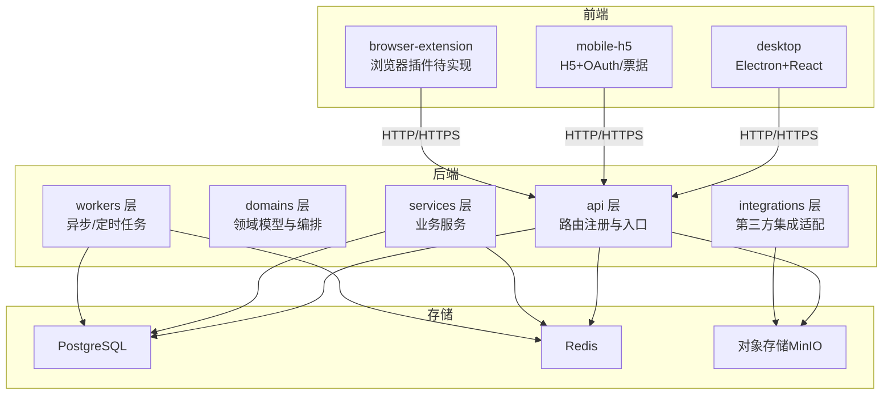
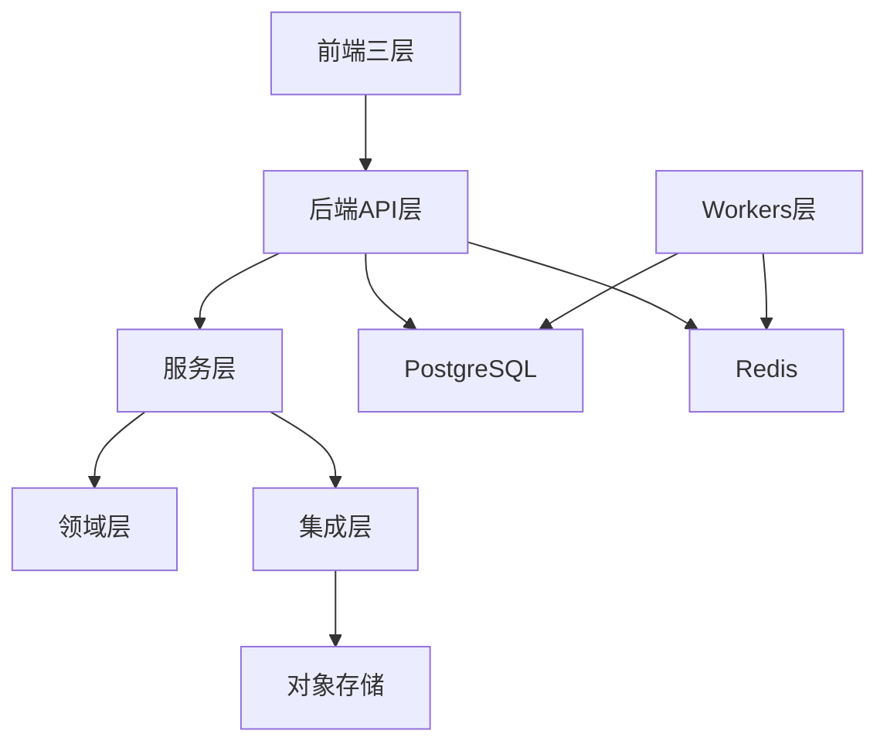
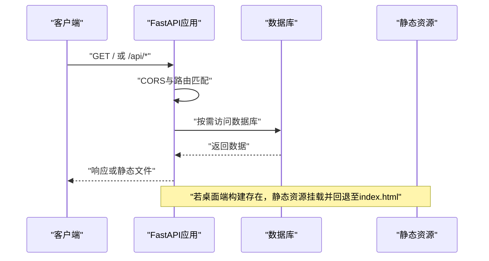
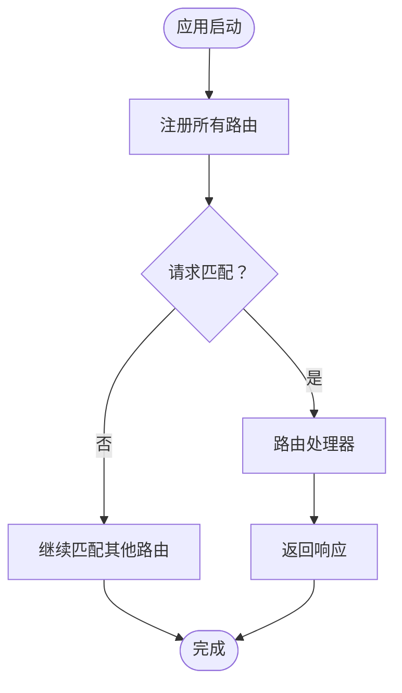
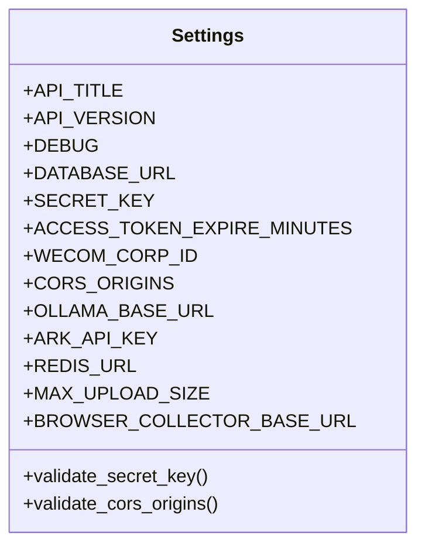
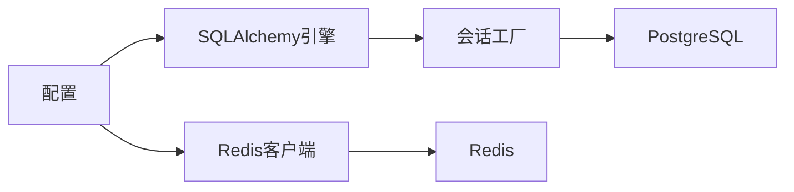
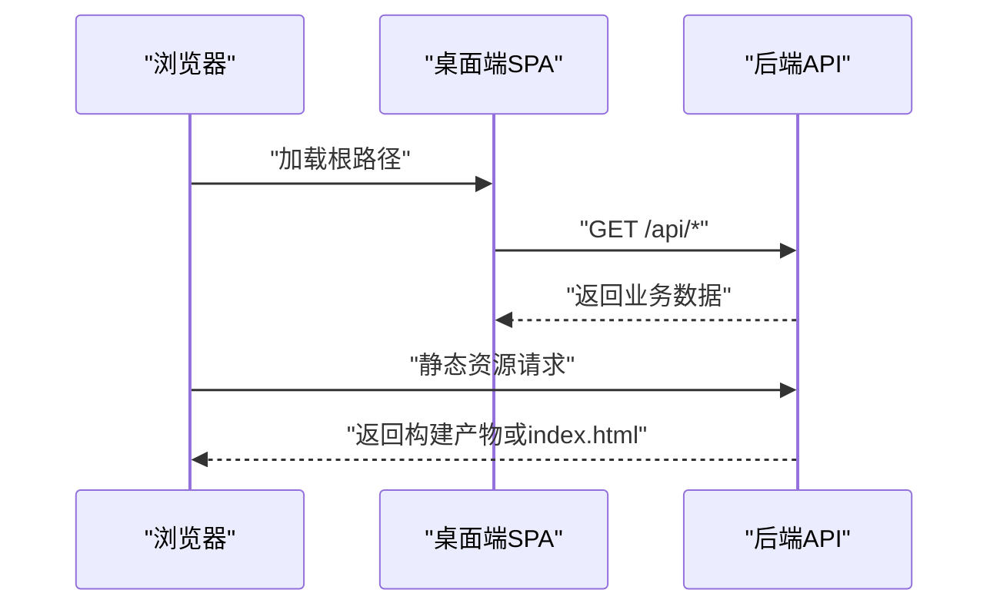
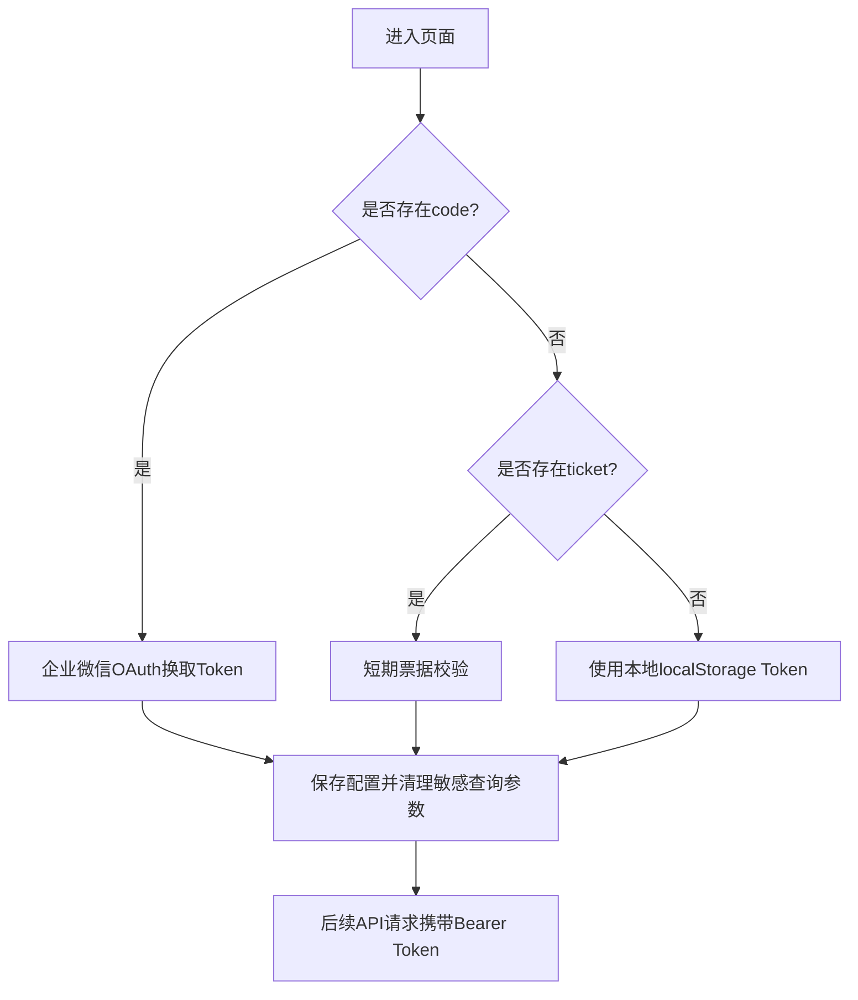
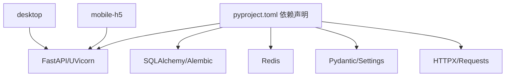

# 整体架构设计

<cite>
**本文引用的文件**
- [backend/main.py](file://backend/main.py)
- [backend/app/main.py](file://backend/app/main.py)
- [backend/app/api/router.py](file://backend/app/api/router.py)
- [backend/app/core/config.py](file://backend/app/core/config.py)
- [backend/app/core/database.py](file://backend/app/core/database.py)
- [backend/app/core/redis.py](file://backend/app/core/redis.py)
- [backend/pyproject.toml](file://backend/pyproject.toml)
- [desktop/src/main.tsx](file://desktop/src/main.tsx)
- [mobile-h5/src/utils/api-client.js](file://mobile-h5/src/utils/api-client.js)
- [docs/architecture/system-architecture.md](file://docs/architecture/system-architecture.md)
</cite>

## 目录
1. [引言](#引言)
2. [项目结构](#项目结构)
3. [核心组件](#核心组件)
4. [架构总览](#架构总览)
5. [详细组件分析](#详细组件分析)
6. [依赖分析](#依赖分析)
7. [性能考量](#性能考量)
8. [故障排查指南](#故障排查指南)
9. [结论](#结论)
10. [附录](#附录)

## 引言
本文件面向“智获客”整体架构设计，系统性阐述前后端分层、模块边界、职责划分与交互方式，覆盖前端三层（desktop、mobile-h5、browser-extension）、后端五层（api、domains、services、integrations、workers）以及存储层（postgres、redis、object storage）。文档同时总结设计原则、架构模式与约束条件，并提供系统上下文图与组件关系图，帮助技术与非技术读者快速理解系统。

## 项目结构
项目采用多仓库/多工程布局：
- 后端（FastAPI + SQLAlchemy）：位于 backend/，提供 REST API、业务服务、集成适配与定时/异步任务。
- 桌面端（Electron + React）：位于 desktop/，打包为桌面应用。
- 移动 H5：位于 mobile-h5/，提供轻量移动端能力与企业微信 OAuth/票据登录。
- 文档：位于 docs/，包含架构、部署、运维等文档。
- 部署模板：位于 deploy/，包含数据库、缓存、对象存储等基础设施模板。

图表来源
- [docs/architecture/system-architecture.md:1-8](file://docs/architecture/system-architecture.md#L1-L8)
- [backend/main.py:46-100](file://backend/main.py#L46-L100)
- [backend/app/api/router.py:32-35](file://backend/app/api/router.py#L32-L35)
- [backend/app/core/config.py:27-34](file://backend/app/core/config.py#L27-L34)
- [backend/app/core/redis.py:6-8](file://backend/app/core/redis.py#L6-L8)

章节来源
- [docs/architecture/system-architecture.md:1-8](file://docs/architecture/system-architecture.md#L1-L8)
- [backend/main.py:46-100](file://backend/main.py#L46-L100)

## 核心组件
- 后端应用与生命周期管理：后端以 FastAPI 应用为中心，定义健康检查、CORS、静态资源托管（SPA 回退）、OpenAPI 自定义等。应用启动时进行必要的健康检查与表结构准备。
- 路由与 API 分层：统一注册多组路由（v1/v2 与业务模块），便于版本演进与模块解耦。
- 配置与环境：集中式配置类，涵盖数据库、JWT、CORS、AI 模型、火山引擎接入、Redis 限流、上传限制、WeCom 集成、浏览器采集器地址等。
- 数据与缓存：PostgreSQL 作为主数据存储；Redis 用于分布式限流与会话相关能力。
- 前端入口：
  - 桌面端：React SPA，通过 Electron 打包，后端提供静态资源挂载与回退。
  - 移动 H5：原生 H5 页面，内置企业微信 OAuth 与短期票据登录流程，支持本地持久化配置与重试机制。

章节来源
- [backend/main.py:22-100](file://backend/main.py#L22-L100)
- [backend/app/api/router.py:32-35](file://backend/app/api/router.py#L32-L35)
- [backend/app/core/config.py:15-102](file://backend/app/core/config.py#L15-L102)
- [backend/app/core/database.py:6-29](file://backend/app/core/database.py#L6-L29)
- [backend/app/core/redis.py:6-8](file://backend/app/core/redis.py#L6-L8)
- [desktop/src/main.tsx:7-13](file://desktop/src/main.tsx#L7-L13)
- [mobile-h5/src/utils/api-client.js:84-170](file://mobile-h5/src/utils/api-client.js#L84-L170)

## 架构总览
系统采用“前端三层 + 后端五层 + 存储层”的分层架构：
- 前端三层
  - desktop：桌面应用，提供完整功能与最佳体验。
  - mobile-h5：移动端轻量页面，支持企业微信 OAuth 与短期票据登录。
  - browser-extension：浏览器插件（当前处于规划阶段）。
- 后端五层
  - api：路由与控制器，负责请求接入、鉴权、参数校验与响应封装。
  - domains：领域模型与编排，聚焦业务规则与流程编排。
  - services：业务服务层，封装具体业务操作与跨领域协作。
  - integrations：第三方集成适配（如火山引擎、OCR、WeCom、存储等）。
  - workers：异步/定时任务，处理耗时或周期性工作。
- 存储层
  - postgres：主数据库，持久化业务数据。
  - redis：缓存与限流，支撑高并发与分布式能力。
  - object storage：对象存储（如 MinIO），承载媒体与文件。

图表来源
- [docs/architecture/system-architecture.md:5-7](file://docs/architecture/system-architecture.md#L5-L7)
- [backend/app/core/config.py:27-34](file://backend/app/core/config.py#L27-L34)
- [backend/app/core/redis.py:6-8](file://backend/app/core/redis.py#L6-L8)
- [deploy/minio/README.md:1-1](file://deploy/minio/README.md#L1-L1)

## 详细组件分析

### 后端应用与入口
- 生命周期与健康检查：应用启动前进行用户序列健康检查，确保数据库自增列健康。
- CORS 与静态资源：根据配置加载 CORS 规则；当存在桌面端构建产物时，挂载静态资源并提供 SPA 回退。
- OpenAPI：自定义 OpenAPI Schema，便于文档展示与客户端生成。

图表来源
- [backend/main.py:22-100](file://backend/main.py#L22-L100)

章节来源
- [backend/main.py:22-100](file://backend/main.py#L22-L100)

### 路由与API分层
- 统一注册：将认证、内容、合规、客户、线索、发布、仪表盘、洞察、系统、WeCom 等路由与 v1/v2 路由集中注册。
- 版本化：通过 v1/v2 路由实现 API 版本演进，避免破坏性变更影响现有客户端。

图表来源
- [backend/app/api/router.py:32-35](file://backend/app/api/router.py#L32-L35)

章节来源
- [backend/app/api/router.py:32-35](file://backend/app/api/router.py#L32-L35)

### 配置与环境
- 关键配置项
  - 数据库：连接串、自动建表开关、启动健康检查。
  - JWT：算法、过期时间、移动端票据过期时间。
  - 企业微信：CorpID、AgentID、Secret、OAuth 配置。
  - CORS：开发/生产环境白名单策略。
  - AI 模型：本地 Ollama 与云端模型切换。
  - 火山引擎：Ark API Key、基础地址、模型、限流参数。
  - Redis：限流开关、URL、键前缀。
  - 文件上传：大小限制、上传目录。
  - WeCom Webhook：通知地址。
  - 浏览器采集器：基础地址与超时。
- 校验规则：对密钥长度与默认占位符进行校验；生产环境禁止通配 CORS。

图表来源
- [backend/app/core/config.py:15-102](file://backend/app/core/config.py#L15-L102)

章节来源
- [backend/app/core/config.py:15-102](file://backend/app/core/config.py#L15-L102)

### 数据与缓存
- 数据库：基于 SQLAlchemy 创建引擎与会话工厂，启用连接池预检与溢出控制。
- 缓存：通过 Redis 客户端提供统一获取方法，用于限流与会话相关能力。

图表来源
- [backend/app/core/database.py:6-29](file://backend/app/core/database.py#L6-L29)
- [backend/app/core/redis.py:6-8](file://backend/app/core/redis.py#L6-L8)

章节来源
- [backend/app/core/database.py:6-29](file://backend/app/core/database.py#L6-L29)
- [backend/app/core/redis.py:6-8](file://backend/app/core/redis.py#L6-L8)

### 桌面端前端
- SPA 入口：React + React Router，根节点渲染应用。
- 与后端集成：后端提供静态资源挂载与 SPA 回退，桌面端构建产物由后端托管。

图表来源
- [desktop/src/main.tsx:7-13](file://desktop/src/main.tsx#L7-L13)
- [backend/main.py:78-100](file://backend/main.py#L78-L100)

章节来源
- [desktop/src/main.tsx:7-13](file://desktop/src/main.tsx#L7-L13)
- [backend/main.py:78-100](file://backend/main.py#L78-L100)

### 移动 H5 前端
- 登录流程：优先企业微信 OAuth 换取 Token，其次短期票据校验，最后本地持久化 Token。
- 请求封装：统一的 API 调用函数，支持超时、重试、去重、敏感信息清理与错误格式化。
- 运行时配置：支持从页面读取/保存基础地址、Token、超时与重试次数。

图表来源
- [mobile-h5/src/utils/api-client.js:84-170](file://mobile-h5/src/utils/api-client.js#L84-L170)
- [mobile-h5/src/utils/api-client.js:189-267](file://mobile-h5/src/utils/api-client.js#L189-L267)

章节来源
- [mobile-h5/src/utils/api-client.js:84-170](file://mobile-h5/src/utils/api-client.js#L84-L170)
- [mobile-h5/src/utils/api-client.js:189-267](file://mobile-h5/src/utils/api-client.js#L189-L267)

## 依赖分析
- 技术栈与依赖来源：后端使用 FastAPI、SQLAlchemy、Pydantic/Settings、Redis、HTTP 客户端等；前端桌面端使用 React + Vite；移动 H5 使用原生 JS 与 fetch。
- 外部集成：火山引擎 Ark、OCR、WeCom、对象存储（MinIO）等通过集成层适配。
- 模块内聚与耦合：API 层仅负责路由与编排，服务层承担业务逻辑，集成层隔离外部依赖，降低耦合。

图表来源
- [backend/pyproject.toml:7-31](file://backend/pyproject.toml#L7-L31)

章节来源
- [backend/pyproject.toml:7-31](file://backend/pyproject.toml#L7-L31)

## 性能考量
- 连接池与预检：数据库连接池配置与 pre_ping，提升连接稳定性与可用性。
- 分布式限流：Redis 限流开关与键前缀，结合速率限制窗口与次数，保障系统稳定。
- 超时与重试：移动 H5 的请求封装支持超时与指数退避重试，增强弱网环境下的鲁棒性。
- 缓存策略：Redis 用于热点数据与限流，减少数据库压力。
- 静态资源：后端挂载静态资源并提供 SPA 回退，减少前端路由复杂度。

章节来源
- [backend/app/core/database.py:6-13](file://backend/app/core/database.py#L6-L13)
- [backend/app/core/config.py:86-90](file://backend/app/core/config.py#L86-L90)
- [mobile-h5/src/utils/api-client.js:40-54](file://mobile-h5/src/utils/api-client.js#L40-L54)
- [mobile-h5/src/utils/api-client.js:215-267](file://mobile-h5/src/utils/api-client.js#L215-L267)

## 故障排查指南
- 启动健康检查失败：关注用户序列健康检查日志，确认数据库连接与权限。
- CORS 问题：生产环境禁止使用通配来源，检查 CORS_ORIGINS 配置。
- 密钥安全：SECRET_KEY 不得使用默认占位值且长度至少 32 字符。
- OAuth/票据登录异常：优先检查企业微信配置与回调地址，其次验证短期票据有效期与后端票据过期时间。
- 请求超时/重试：调整移动 H5 的超时与重试次数，观察网络状态与后端限流策略。
- 静态资源缺失：确认桌面端构建产物存在，后端静态资源挂载路径正确。

章节来源
- [backend/main.py:22-35](file://backend/main.py#L22-L35)
- [backend/app/core/config.py:55-69](file://backend/app/core/config.py#L55-L69)
- [backend/app/core/config.py:38-41](file://backend/app/core/config.py#L38-L41)
- [mobile-h5/src/utils/api-client.js:84-170](file://mobile-h5/src/utils/api-client.js#L84-L170)
- [mobile-h5/src/utils/api-client.js:215-267](file://mobile-h5/src/utils/api-client.js#L215-L267)

## 结论
本架构以“前端三层 + 后端五层 + 存储层”为核心，强调模块边界清晰、职责分离与可扩展性。后端通过 API 分层与统一配置实现稳定与可演进；前端三层满足不同终端场景；存储层提供可靠的数据与对象服务能力。建议持续完善浏览器插件与 Workers 层，强化可观测性与弹性伸缩能力。

## 附录
- 设计原则
  - 单一职责：每层专注自身职责，避免交叉污染。
  - 开闭原则：通过集成层与配置扩展新能力。
  - 依赖倒置：上层依赖抽象，下层实现细节可替换。
- 架构模式
  - 分层架构：API/Domain/Service/Integration/Worker。
  - 适配器模式：集成层屏蔽第三方差异。
  - 路由聚合：统一注册与版本化路由。
- 约束条件
  - 生产环境 CORS 白名单不得使用通配。
  - SECRET_KEY 必须强密钥且长度≥32。
  - 火山引擎与 OCR 等集成需正确配置 API Key 与基础地址。
  - 移动端登录优先 OAuth，其次短期票据，最后本地 Token。