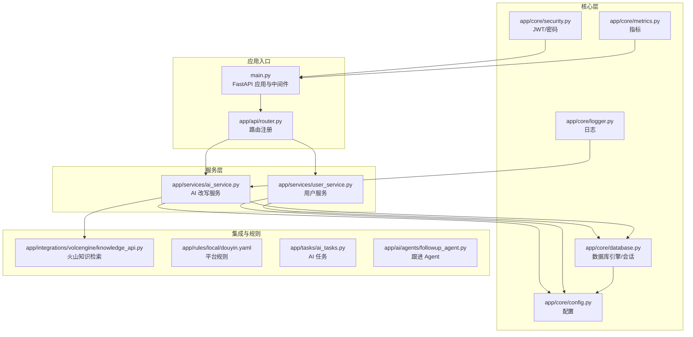
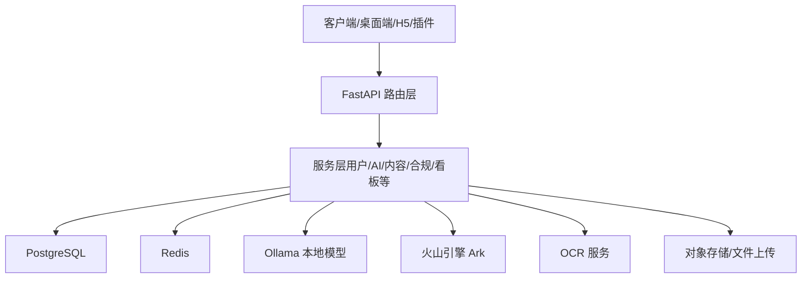
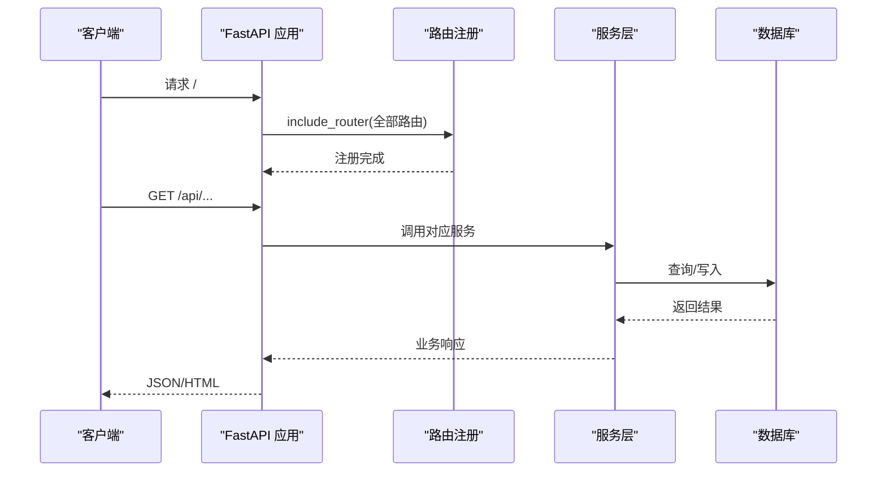
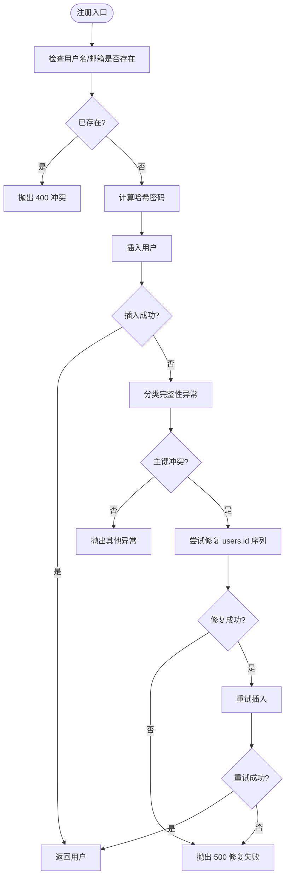
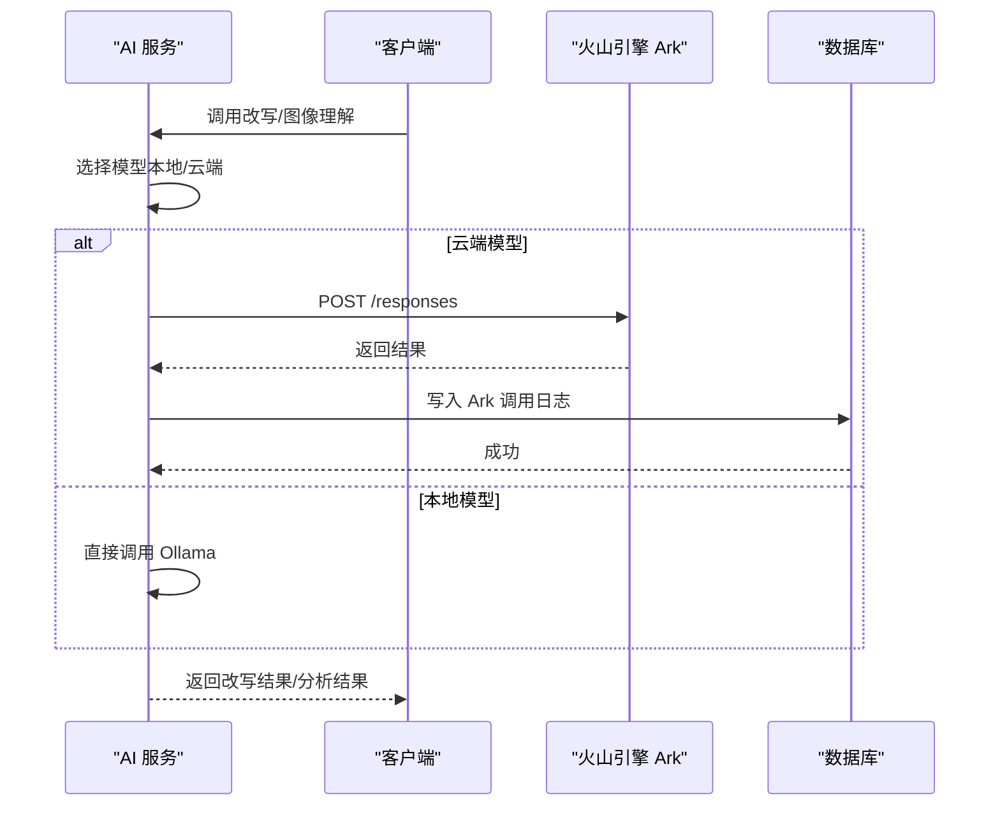
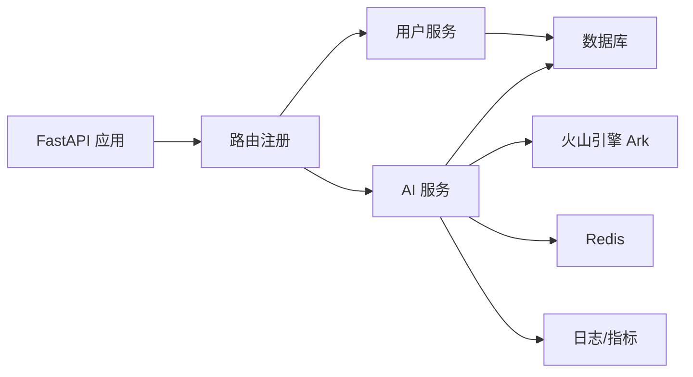

# 系统架构

<cite>
**本文引用的文件**
- [backend/README.md](file://backend/README.md)
- [backend/pyproject.toml](file://backend/pyproject.toml)
- [backend/main.py](file://backend/main.py)
- [backend/app/main.py](file://backend/app/main.py)
- [backend/docker-compose.yml](file://backend/docker-compose.yml)
- [backend/Dockerfile](file://backend/Dockerfile)
- [backend/app/core/config.py](file://backend/app/core/config.py)
- [backend/app/core/database.py](file://backend/app/core/database.py)
- [backend/app/core/security.py](file://backend/app/core/security.py)
- [backend/app/core/logger.py](file://backend/app/core/logger.py)
- [backend/app/core/metrics.py](file://backend/app/core/metrics.py)
- [backend/app/api/router.py](file://backend/app/api/router.py)
- [backend/app/services/user_service.py](file://backend/app/services/user_service.py)
- [backend/app/services/ai_service.py](file://backend/app/services/ai_service.py)
- [backend/app/integrations/volcengine/knowledge_api.py](file://backend/app/integrations/volcengine/knowledge_api.py)
- [backend/app/rules/local/douyin.yaml](file://backend/app/rules/local/douyin.yaml)
- [backend/app/tasks/ai_tasks.py](file://backend/app/tasks/ai_tasks.py)
- [backend/app/ai/agents/followup_agent.py](file://backend/app/ai/agents/followup_agent.py)
</cite>

## 目录
1. [引言](#引言)
2. [项目结构](#项目结构)
3. [核心组件](#核心组件)
4. [架构总览](#架构总览)
5. [详细组件分析](#详细组件分析)
6. [依赖关系分析](#依赖关系分析)
7. [性能考量](#性能考量)
8. [故障排查指南](#故障排查指南)
9. [结论](#结论)
10. [附录](#附录)

## 引言
本架构文档面向“智获客”系统，聚焦后端（FastAPI + PostgreSQL）的高层设计、架构模式与系统边界，系统通过统一的 API 路由层对外提供能力，内部以服务层承载业务逻辑，并通过数据库与外部 AI/OCR/存储等集成实现内容采集、合规、改写与发布等核心流程。文档同时覆盖基础设施需求、可扩展性、部署拓扑、安全与可观测性等横切关注点，并给出系统上下文图与组件分解图，帮助读者快速理解系统。

## 项目结构
后端采用分层与领域驱动相结合的组织方式：
- 应用入口与路由：FastAPI 应用在入口文件中注册中间件与路由，静态资源挂载支持前端 SPA。
- 核心配置与基础设施：配置项集中于 settings，数据库连接与会话工厂在 core 层定义，安全与指标工具在 core 层提供。
- API 层：按领域划分的 v1/v2 路由与通用端点路由，统一在 router 中注册。
- 服务层：封装业务逻辑，如用户、AI 改写、合规、内容、看板等。
- 集成与规则：对火山引擎、OCR、存储等外部能力进行适配；规则库以 YAML 形式本地化管理。
- AI 与 RAG：AI 服务封装本地/云端模型调用与日志记录；Agent/RAG 组件预留扩展点。
- 任务与工作流：定时/异步任务模块预留，支撑素材处理、提醒、统计等。

图表来源
- [backend/main.py:1-138](file://backend/main.py#L1-L138)
- [backend/app/api/router.py:1-35](file://backend/app/api/router.py#L1-L35)
- [backend/app/core/config.py:1-103](file://backend/app/core/config.py#L1-L103)
- [backend/app/core/database.py:1-29](file://backend/app/core/database.py#L1-L29)
- [backend/app/core/security.py:1-57](file://backend/app/core/security.py#L1-L57)
- [backend/app/core/metrics.py:1-44](file://backend/app/core/metrics.py#L1-L44)
- [backend/app/core/logger.py:1-6](file://backend/app/core/logger.py#L1-L6)
- [backend/app/services/user_service.py:1-177](file://backend/app/services/user_service.py#L1-L177)
- [backend/app/services/ai_service.py:1-460](file://backend/app/services/ai_service.py#L1-L460)
- [backend/app/integrations/volcengine/knowledge_api.py:1-4](file://backend/app/integrations/volcengine/knowledge_api.py#L1-L4)
- [backend/app/rules/local/douyin.yaml:1-4](file://backend/app/rules/local/douyin.yaml#L1-L4)
- [backend/app/tasks/ai_tasks.py:1-3](file://backend/app/tasks/ai_tasks.py#L1-L3)
- [backend/app/ai/agents/followup_agent.py:1-3](file://backend/app/ai/agents/followup_agent.py#L1-L3)

章节来源
- [backend/README.md:90-107](file://backend/README.md#L90-L107)
- [backend/main.py:46-107](file://backend/main.py#L46-L107)
- [backend/app/api/router.py:32-35](file://backend/app/api/router.py#L32-L35)

## 核心组件
- 应用入口与生命周期
  - 应用在入口文件中创建 FastAPI 实例，注入 CORS、静态资源与 SPA 回退；通过 lifespan 执行启动健康检查；提供 /health 与自定义 OpenAPI。
- 配置与环境
  - 集中在 settings 中，涵盖数据库、JWT、CORS、AI 模型、火山引擎、Redis 限流、上传限制、WeCom、浏览器采集器等。
- 数据库与会话
  - 基于 SQLAlchemy，配置连接池、pre_ping 与会话工厂，提供 get_db 依赖注入。
- 安全与认证
  - JWT 签发与校验，密码哈希与校验，Bearer 授权方案。
- 指标与日志
  - 用户序列修复计数与启动对齐指标；AI 调用日志持久化与 Ark 调用链路记录。
- 服务层
  - 用户服务：用户创建、认证、唯一性冲突处理与序列修复；AI 服务：Ollama/云模型调用、Ark 图像理解、提示词与改写模板、Token 使用统计与错误记录。

章节来源
- [backend/main.py:22-107](file://backend/main.py#L22-L107)
- [backend/app/core/config.py:15-103](file://backend/app/core/config.py#L15-L103)
- [backend/app/core/database.py:6-29](file://backend/app/core/database.py#L6-L29)
- [backend/app/core/security.py:18-57](file://backend/app/core/security.py#L18-L57)
- [backend/app/core/metrics.py:12-44](file://backend/app/core/metrics.py#L12-L44)
- [backend/app/services/user_service.py:24-177](file://backend/app/services/user_service.py#L24-L177)
- [backend/app/services/ai_service.py:15-304](file://backend/app/services/ai_service.py#L15-L304)

## 架构总览
系统采用“API 路由层 → 服务层 → 数据与外部集成”的分层架构，结合容器化与微服务式编排，形成可独立演进的模块化体系。核心边界如下：
- 内部边界：API 路由、服务、模型与数据库。
- 外部边界：火山引擎（Ark）、OCR、Redis、PostgreSQL、Ollama、浏览器采集器等。

图表来源
- [backend/main.py:46-107](file://backend/main.py#L46-L107)
- [backend/app/api/router.py:32-35](file://backend/app/api/router.py#L32-L35)
- [backend/app/core/config.py:71-101](file://backend/app/core/config.py#L71-L101)
- [backend/app/core/database.py:6-29](file://backend/app/core/database.py#L6-L29)

## 详细组件分析

### 组件：应用入口与路由
- 职责
  - 初始化 FastAPI 应用，配置 CORS、静态资源与 SPA 回退；注册全部路由；提供 /health 与自定义 OpenAPI。
- 关键流程
  - 启动阶段执行用户序列健康检查；路由统一注册，避免分散维护。
- 安全与可用性
  - CORS 白名单控制；DEBUG 下允许灵活配置；生产环境禁止通配符来源。

图表来源
- [backend/main.py:46-107](file://backend/main.py#L46-L107)
- [backend/app/api/router.py:32-35](file://backend/app/api/router.py#L32-L35)

章节来源
- [backend/main.py:46-107](file://backend/main.py#L46-L107)
- [backend/app/api/router.py:32-35](file://backend/app/api/router.py#L32-L35)

### 组件：配置与环境
- 职责
  - 统一管理数据库、JWT、CORS、AI/云模型、火山引擎、Redis 限流、上传大小、WeCom、浏览器采集器等配置。
- 关键特性
  - SECRET_KEY 强校验与长度校验；生产环境禁止 CORS 通配；AI 模型可切换本地或云端。
- 配置来源
  - .env 文件与 Pydantic Settings，默认值与校验器保证运行安全。

章节来源
- [backend/app/core/config.py:15-103](file://backend/app/core/config.py#L15-L103)

### 组件：数据库与会话
- 职责
  - 提供 SQLAlchemy 引擎、会话工厂与依赖注入函数；开启 pre_ping 与连接池参数。
- 可靠性
  - 连接池与健康检查降低长连接异常带来的影响；get_db 确保会话正确关闭。

章节来源
- [backend/app/core/database.py:6-29](file://backend/app/core/database.py#L6-L29)

### 组件：安全与认证
- 职责
  - 密码哈希与校验、JWT 签发与校验、Bearer 授权方案。
- 安全要点
  - 使用 pbkdf2_sha256 为主、bcrypt 为辅的密码上下文；JWT 算法与过期时间可控；令牌校验失败返回 401。

章节来源
- [backend/app/core/security.py:18-57](file://backend/app/core/security.py#L18-L57)

### 组件：用户服务与序列修复
- 职责
  - 用户创建、认证、查询；处理用户名/邮箱唯一性冲突；在主键冲突时尝试修复序列并重试一次。
- 可靠性与可观测性
  - 通过指标记录修复尝试/成功/失败与启动对齐次数；异常分类与日志记录增强可诊断性。

图表来源
- [backend/app/services/user_service.py:61-153](file://backend/app/services/user_service.py#L61-L153)
- [backend/app/core/metrics.py:12-44](file://backend/app/core/metrics.py#L12-L44)

章节来源
- [backend/app/services/user_service.py:24-177](file://backend/app/services/user_service.py#L24-L177)
- [backend/app/core/metrics.py:12-44](file://backend/app/core/metrics.py#L12-L44)

### 组件：AI 改写服务与火山引擎集成
- 职责
  - 封装本地 Ollama 与云端火山引擎 Ark 的调用；支持图像理解；记录 Ark 调用日志与 Token 使用。
- 关键流程
  - 选择模型（本地/云端），构造请求体，发送至 Ark /responses；解析输出文本；持久化调用日志。
- 可靠性
  - 超时控制、HTTP 错误捕获与告警、异常时持久化错误信息；支持分布式限流（Redis）降级策略。

图表来源
- [backend/app/services/ai_service.py:24-304](file://backend/app/services/ai_service.py#L24-L304)
- [backend/app/core/config.py:71-84](file://backend/app/core/config.py#L71-L84)

章节来源
- [backend/app/services/ai_service.py:15-460](file://backend/app/services/ai_service.py#L15-L460)
- [backend/app/core/config.py:71-84](file://backend/app/core/config.py#L71-L84)

### 组件：集成与规则
- 火山引擎知识检索
  - 留有检索接口占位，便于后续接入向量检索与 RAG。
- 平台规则
  - 以 YAML 管理平台规则，便于本地化与版本化治理。
- 任务与 Agent
  - 任务与 Agent 模块预留扩展点，支撑后续素材处理、跟进 Agent 等。

章节来源
- [backend/app/integrations/volcengine/knowledge_api.py:1-4](file://backend/app/integrations/volcengine/knowledge_api.py#L1-L4)
- [backend/app/rules/local/douyin.yaml:1-4](file://backend/app/rules/local/douyin.yaml#L1-L4)
- [backend/app/tasks/ai_tasks.py:1-3](file://backend/app/tasks/ai_tasks.py#L1-L3)
- [backend/app/ai/agents/followup_agent.py:1-3](file://backend/app/ai/agents/followup_agent.py#L1-L3)

## 依赖关系分析
- 技术栈与版本
  - FastAPI、SQLAlchemy、Pydantic、PostgreSQL、Redis、Ollama、Volcano Engine 等。
- 依赖耦合
  - 路由层依赖服务层；服务层依赖配置、数据库与外部集成；AI 服务依赖配置与日志/指标。
- 外部依赖
  - 火山引擎 Ark、OCR、Redis、PostgreSQL、Ollama；浏览器采集器作为可选集成。

图表来源
- [backend/app/api/router.py:32-35](file://backend/app/api/router.py#L32-L35)
- [backend/app/services/user_service.py:61-177](file://backend/app/services/user_service.py#L61-L177)
- [backend/app/services/ai_service.py:15-304](file://backend/app/services/ai_service.py#L15-L304)
- [backend/app/core/config.py:71-101](file://backend/app/core/config.py#L71-L101)

章节来源
- [backend/pyproject.toml:7-31](file://backend/pyproject.toml#L7-L31)
- [backend/app/core/config.py:71-101](file://backend/app/core/config.py#L71-L101)

## 性能考量
- 连接池与预检查
  - 数据库连接池与 pre_ping 降低连接失效导致的失败；合理设置 pool_size 与 overflow。
- 限流与降级
  - Redis 分布式限流优先，不可用时自动降级到进程内限流；Ark 调用超时与重试策略。
- 日志与指标
  - Ark 调用耗时、Token 使用与成功率记录，辅助容量规划与成本优化。
- 前端静态资源
  - SPA 回退与缓存友好头部，减少无效请求与 404。

章节来源
- [backend/app/core/database.py:6-13](file://backend/app/core/database.py#L6-L13)
- [backend/app/core/config.py:86-89](file://backend/app/core/config.py#L86-L89)
- [backend/app/services/ai_service.py:132-240](file://backend/app/services/ai_service.py#L132-L240)

## 故障排查指南
- 健康检查
  - /health 返回应用状态与用户序列指标快照；生产环境建议配合 /api/system/ops/health 与 /api/system/ops/readiness。
- 数据库与序列
  - 用户注册失败且提示主键冲突时，检查序列修复是否成功；查看指标与日志定位异常。
- AI 调用
  - Ark 调用失败时，检查 API Key、Base URL、超时与限流配置；查看 Ark 调用日志表定位错误。
- CORS 与安全
  - 生产环境禁止 CORS 通配符；JWT 密钥长度不足或默认值会导致启动失败。

章节来源
- [backend/main.py:71-77](file://backend/main.py#L71-L77)
- [backend/app/services/user_service.py:101-153](file://backend/app/services/user_service.py#L101-L153)
- [backend/app/services/ai_service.py:132-240](file://backend/app/services/ai_service.py#L132-L240)
- [backend/app/core/config.py:55-69](file://backend/app/core/config.py#L55-L69)

## 结论
智获客后端采用清晰的分层与模块化设计，围绕 FastAPI 与 SQLAlchemy 构建，结合 Redis、PostgreSQL、Ollama 与火山引擎实现从内容采集、合规、改写到发布的完整闭环。通过集中配置、可观测性与健康检查机制，系统具备良好的可维护性与可扩展性。建议在生产环境中强化安全基线（密钥、CORS、HTTPS）、完善监控告警与灾备演练，并持续迭代规则与 Agent 能力以提升业务价值。

## 附录
- 部署拓扑
  - 开发/测试：docker-compose 启动 PostgreSQL、Redis、Ollama 与后端；后端监听 8000 端口。
  - 生产：推荐使用 docker-compose.prod.yml 进行编排，配合 Nginx/反向代理、证书与 HTTPS。
- 基础设施需求
  - PostgreSQL（主）、Redis（缓存/限流）、Ollama（可选本地模型）、火山引擎（可选云端模型）、对象存储（可选）。
- 第三方依赖与版本兼容
  - 参考 pyproject.toml 中的依赖声明与版本范围；注意 bcrypt 与 Windows 环境兼容性提示。

章节来源
- [backend/docker-compose.yml:1-67](file://backend/docker-compose.yml#L1-L67)
- [backend/Dockerfile:1-19](file://backend/Dockerfile#L1-L19)
- [backend/README.md:164-172](file://backend/README.md#L164-L172)
- [backend/pyproject.toml:7-31](file://backend/pyproject.toml#L7-L31)