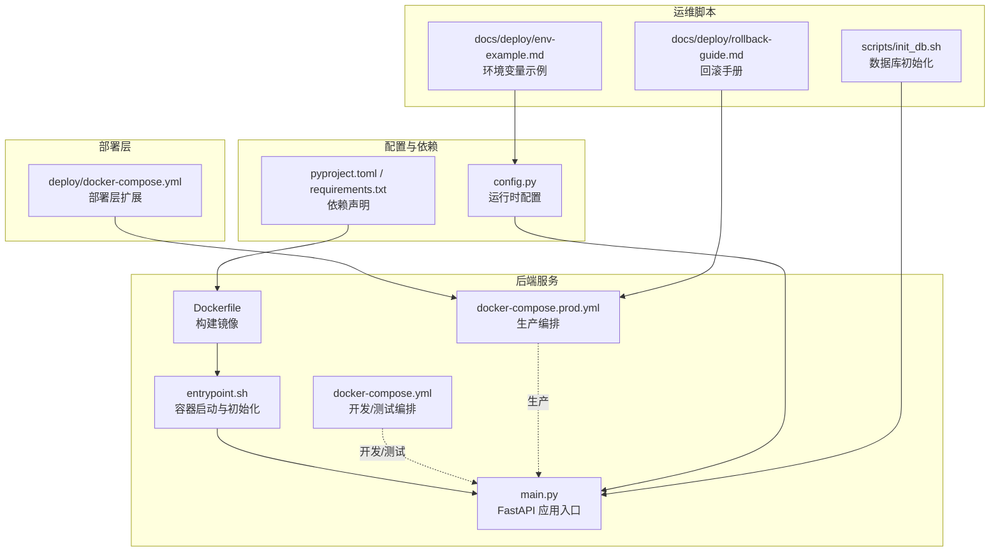
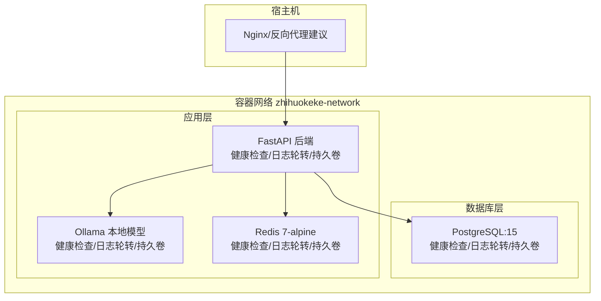
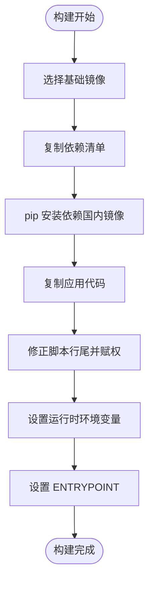
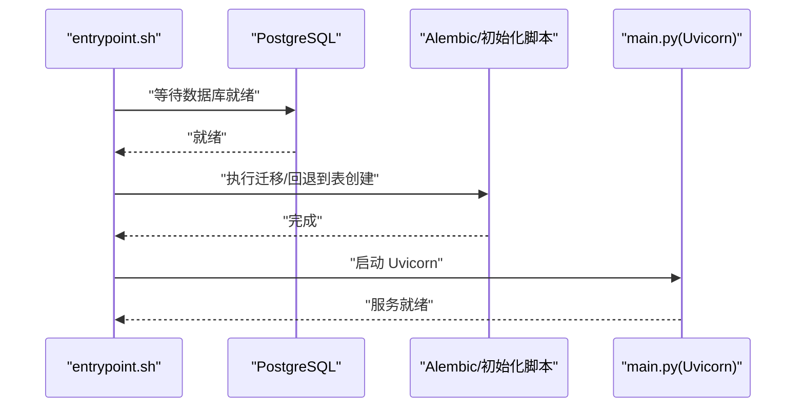
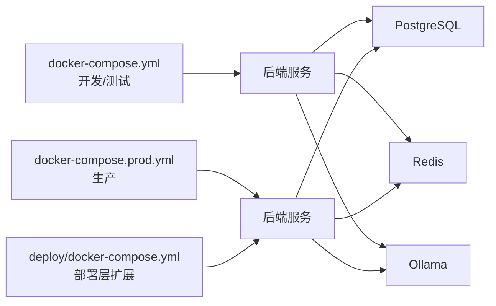
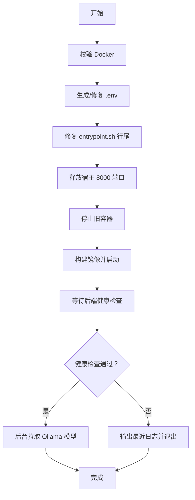
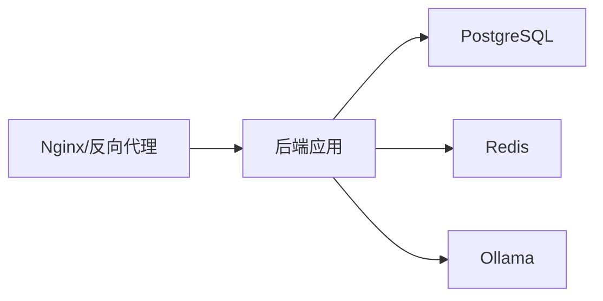

# 部署架构

<cite>
**本文引用的文件**   
- [Dockerfile](file://backend/Dockerfile)
- [docker-compose.yml](file://backend/docker-compose.yml)
- [docker-compose.prod.yml](file://backend/docker-compose.prod.yml)
- [deploy.sh](file://backend/deploy.sh)
- [entrypoint.sh](file://backend/entrypoint.sh)
- [main.py](file://backend/main.py)
- [pyproject.toml](file://backend/pyproject.toml)
- [requirements.txt](file://backend/requirements.txt)
- [config.py](file://backend/app/core/config.py)
- [env-example.md](file://docs/deploy/env-example.md)
- [rollback-guide.md](file://docs/deploy/rollback-guide.md)
- [docker-compose.yml（部署层）](file://deploy/docker-compose.yml)
- [init_db.sh](file://scripts/init_db.sh)
</cite>

## 目录
1. [简介](#简介)
2. [项目结构](#项目结构)
3. [核心组件](#核心组件)
4. [架构总览](#架构总览)
5. [详细组件分析](#详细组件分析)
6. [依赖关系分析](#依赖关系分析)
7. [性能考虑](#性能考虑)
8. [故障排查指南](#故障排查指南)
9. [结论](#结论)
10. [附录](#附录)

## 简介
本文件面向“智获客”项目的生产部署与运维，系统化梳理生产环境部署拓扑、容器化策略、基础设施配置、服务发现与负载均衡、开发/测试/生产的环境差异与部署流程、CI/CD 与自动化部署/回滚策略、监控告警与日志收集、性能监控、高可用与灾难恢复等主题。文档以仓库中的实际配置与脚本为依据，提供可操作的部署与运维指导。

## 项目结构
围绕部署与运维的关键目录与文件如下：
- 后端服务与容器化：backend/Dockerfile、backend/docker-compose.yml、backend/docker-compose.prod.yml、backend/deploy.sh、backend/entrypoint.sh、backend/main.py
- 配置与依赖：backend/app/core/config.py、backend/pyproject.toml、backend/requirements.txt
- 部署层扩展：deploy/docker-compose.yml
- 运维脚本：scripts/init_db.sh
- 环境变量与回滚指南：docs/deploy/env-example.md、docs/deploy/rollback-guide.md

图表来源
- [Dockerfile:1-19](file://backend/Dockerfile#L1-L19)
- [docker-compose.yml:1-67](file://backend/docker-compose.yml#L1-L67)
- [docker-compose.prod.yml:1-112](file://backend/docker-compose.prod.yml#L1-L112)
- [entrypoint.sh:1-48](file://backend/entrypoint.sh#L1-L48)
- [main.py:1-138](file://backend/main.py#L1-L138)
- [config.py:1-103](file://backend/app/core/config.py#L1-L103)
- [pyproject.toml:1-47](file://backend/pyproject.toml#L1-L47)
- [requirements.txt:1-21](file://backend/requirements.txt#L1-L21)
- [docker-compose.yml（部署层）:1-7](file://deploy/docker-compose.yml#L1-L7)
- [init_db.sh:1-5](file://scripts/init_db.sh#L1-L5)
- [env-example.md:1-8](file://docs/deploy/env-example.md#L1-L8)
- [rollback-guide.md:1-49](file://docs/deploy/rollback-guide.md#L1-L49)

章节来源
- [Dockerfile:1-19](file://backend/Dockerfile#L1-L19)
- [docker-compose.yml:1-67](file://backend/docker-compose.yml#L1-L67)
- [docker-compose.prod.yml:1-112](file://backend/docker-compose.prod.yml#L1-L112)
- [entrypoint.sh:1-48](file://backend/entrypoint.sh#L1-L48)
- [main.py:1-138](file://backend/main.py#L1-L138)
- [config.py:1-103](file://backend/app/core/config.py#L1-L103)
- [pyproject.toml:1-47](file://backend/pyproject.toml#L1-L47)
- [requirements.txt:1-21](file://backend/requirements.txt#L1-L21)
- [docker-compose.yml（部署层）:1-7](file://deploy/docker-compose.yml#L1-L7)
- [init_db.sh:1-5](file://scripts/init_db.sh#L1-L5)
- [env-example.md:1-8](file://docs/deploy/env-example.md#L1-L8)
- [rollback-guide.md:1-49](file://docs/deploy/rollback-guide.md#L1-L49)

## 核心组件
- 容器镜像与构建
  - 基于官方 Python 3.10 slim 镜像，使用国内镜像源加速依赖安装，复制应用代码并在容器启动时执行初始化与迁移。
- 编排与服务
  - 开发/测试：通过 docker-compose.yml 启动 PostgreSQL、Redis、Ollama 与后端服务，端口映射便于本地调试。
  - 生产：通过 docker-compose.prod.yml 启动生产态服务，包含健康检查、日志轮转、持久卷与依赖服务健康检查。
- 后端应用
  - FastAPI 应用入口 main.py 提供健康检查、CORS、静态资源托管与自定义 OpenAPI。
- 启动脚本
  - entrypoint.sh 在启动时等待数据库就绪、执行 Alembic 迁移或回退到表创建、可选创建测试用户，最后以多进程方式启动 Uvicorn。
- 配置管理
  - config.py 使用 Pydantic Settings 读取 .env，包含数据库、JWT、CORS、AI 模型、火山引擎、Redis、上传目录、浏览器采集器等配置项。
- 部署脚本
  - deploy.sh 实现一键部署：校验 Docker、生成/修复 .env、释放宿主端口、构建并启动、健康检查、后台拉取 AI 模型、输出服务地址与日志查看方式。
- 运维工具
  - init_db.sh 用于数据库初始化。
  - rollback-guide.md 提供回滚触发条件、流程与回滚后检查清单。

章节来源
- [Dockerfile:1-19](file://backend/Dockerfile#L1-L19)
- [docker-compose.yml:1-67](file://backend/docker-compose.yml#L1-L67)
- [docker-compose.prod.yml:1-112](file://backend/docker-compose.prod.yml#L1-L112)
- [entrypoint.sh:1-48](file://backend/entrypoint.sh#L1-L48)
- [main.py:1-138](file://backend/main.py#L1-L138)
- [config.py:1-103](file://backend/app/core/config.py#L1-L103)
- [deploy.sh:1-132](file://backend/deploy.sh#L1-L132)
- [init_db.sh:1-5](file://scripts/init_db.sh#L1-L5)
- [rollback-guide.md:1-49](file://docs/deploy/rollback-guide.md#L1-L49)

## 架构总览
下图展示生产环境的容器化部署拓扑与交互关系：

图表来源
- [docker-compose.prod.yml:8-112](file://backend/docker-compose.prod.yml#L8-L112)
- [entrypoint.sh:1-48](file://backend/entrypoint.sh#L1-L48)
- [main.py:71-77](file://backend/main.py#L71-L77)

说明
- 容器间通过自定义网络通信，后端服务依赖数据库与缓存服务。
- 建议在生产环境中通过 Nginx 或反向代理统一入口，实现 TLS 终止、压缩与基础防护。
- 健康检查覆盖数据库、缓存与后端应用，便于编排器进行故障检测与重启。

## 详细组件分析

### 容器化与镜像构建
- 基础镜像与依赖安装
  - 使用 Python 3.10 slim，国内镜像源加速 pip 安装，避免缓存以减小镜像体积。
- 应用打包与启动
  - 复制应用代码，修正脚本行尾并设置可执行权限，设置非缓冲输出，ENTRYPOINT 指向 entrypoint.sh。
- 依赖声明
  - pyproject.toml 与 requirements.txt 明确后端依赖，包括 FastAPI、Uvicorn、SQLAlchemy、Alembic、Redis、Ollama 等。

图表来源
- [Dockerfile:1-19](file://backend/Dockerfile#L1-L19)
- [pyproject.toml:1-47](file://backend/pyproject.toml#L1-L47)
- [requirements.txt:1-21](file://backend/requirements.txt#L1-L21)

章节来源
- [Dockerfile:1-19](file://backend/Dockerfile#L1-L19)
- [pyproject.toml:1-47](file://backend/pyproject.toml#L1-L47)
- [requirements.txt:1-21](file://backend/requirements.txt#L1-L21)

### 启动流程与初始化
- 启动顺序
  - entrypoint.sh 等待数据库就绪，执行 Alembic 迁移，若失败则回退到表创建；可选创建测试用户；最后以多进程方式启动 Uvicorn。
- 健康检查
  - 生产编排对后端、Redis、PostgreSQL、Ollama 设置健康检查，确保服务可用性。
- 静态资源与 API
  - main.py 提供 /health、CORS、静态资源挂载与 SPA 回退路由；未构建前端时返回版本与文档指引。

图表来源
- [entrypoint.sh:1-48](file://backend/entrypoint.sh#L1-L48)
- [main.py:71-77](file://backend/main.py#L71-L77)

章节来源
- [entrypoint.sh:1-48](file://backend/entrypoint.sh#L1-L48)
- [main.py:1-138](file://backend/main.py#L1-L138)

### 配置与环境变量
- 配置来源
  - config.py 通过 Pydantic Settings 从 .env 加载配置，包含数据库、JWT、CORS、AI 模型、火山引擎、Redis、上传目录、浏览器采集器等。
- 环境变量示例
  - env-example.md 指出需要补充 SECRET_KEY、DATABASE_URL、REDIS_URL、ARK_API_KEY 等关键变量。
- 安全与合规
  - 对 SECRET_KEY 的长度与默认值进行校验；生产禁止 CORS 使用通配来源。

章节来源
- [config.py:1-103](file://backend/app/core/config.py#L1-L103)
- [env-example.md:1-8](file://docs/deploy/env-example.md#L1-L8)

### 编排与服务发现
- 开发/测试编排
  - docker-compose.yml 定义 postgres、backend、ollama、redis 服务，端口映射便于本地访问，后端依赖数据库健康状态。
- 生产编排
  - docker-compose.prod.yml 增加 restart 策略、健康检查、日志轮转、持久卷与依赖服务健康检查；后端挂载上传目录与桌面前端产物目录。
- 部署层扩展
  - deploy/docker-compose.yml 通过 extends 引用 backend 的 backend 服务，便于在部署层复用与定制。

图表来源
- [docker-compose.yml:1-67](file://backend/docker-compose.yml#L1-L67)
- [docker-compose.prod.yml:1-112](file://backend/docker-compose.prod.yml#L1-L112)
- [docker-compose.yml（部署层）:1-7](file://deploy/docker-compose.yml#L1-L7)

章节来源
- [docker-compose.yml:1-67](file://backend/docker-compose.yml#L1-L67)
- [docker-compose.prod.yml:1-112](file://backend/docker-compose.prod.yml#L1-L112)
- [docker-compose.yml（部署层）:1-7](file://deploy/docker-compose.yml#L1-L7)

### 部署流程与自动化
- 一键部署脚本
  - deploy.sh 执行：Docker 校验、.env 生成与安全初始化、修复脚本行尾、释放宿主 8000 端口、停止旧容器、构建并启动、健康检查、后台拉取 AI 模型、输出服务地址与日志查看方式。
- 数据库初始化
  - init_db.sh 通过 backend 目录下的 init_db.py 执行初始化逻辑。

图表来源
- [deploy.sh:1-132](file://backend/deploy.sh#L1-L132)
- [init_db.sh:1-5](file://scripts/init_db.sh#L1-L5)

章节来源
- [deploy.sh:1-132](file://backend/deploy.sh#L1-L132)
- [init_db.sh:1-5](file://scripts/init_db.sh#L1-L5)

### 回滚策略
- 触发条件
  - 健康检查失败、核心链路不可用、错误率持续升高且无法在 15 分钟内止血。
- 快速回滚步骤
  - 停止当前容器、切换到上一个稳定版本、启动并运行健康检查与关键链路抽样。
- 数据回滚原则
  - 默认先回滚应用，不直接回滚数据库；仅在迁移可逆且评估后执行降级；涉及数据丢失风险时先备份再回退。
- 回滚后检查
  - API 健康、登录与鉴权、发布任务至线索至客户链路、插件回传接口、日志与监控。

章节来源
- [rollback-guide.md:1-49](file://docs/deploy/rollback-guide.md#L1-L49)

### 监控告警、日志收集与性能监控
- 健康检查
  - 后端提供 /health；生产编排对数据库、缓存、后端、Ollama 设置健康检查，便于编排器进行故障检测与重启。
- 日志轮转
  - 生产编排为各服务启用 json-file 驱动的日志轮转，限制单文件大小与保留文件数。
- 性能监控
  - main.py 中集成指标快照函数，可用于性能观测与健康检查。

章节来源
- [main.py:71-77](file://backend/main.py#L71-L77)
- [docker-compose.prod.yml:24-28](file://backend/docker-compose.prod.yml#L24-L28)
- [docker-compose.prod.yml:55-59](file://backend/docker-compose.prod.yml#L55-L59)
- [docker-compose.prod.yml:78-82](file://backend/docker-compose.prod.yml#L78-L82)
- [docker-compose.prod.yml:97-101](file://backend/docker-compose.prod.yml#L97-L101)

### 高可用性、灾难恢复与故障转移
- 健康检查与重启策略
  - 生产编排为各服务配置 restart: unless-stopped 与健康检查，提升可用性。
- 灾难恢复建议
  - 结合数据库与缓存的持久卷与日志轮转，定期备份与演练恢复流程；回滚手册提供快速回退路径。
- 故障转移
  - 建议在生产环境引入反向代理与多实例部署（如 Swarm/K8s），实现流量分发与故障转移。

章节来源
- [docker-compose.prod.yml:12-18](file://backend/docker-compose.prod.yml#L12-L18)
- [docker-compose.prod.yml:36-45](file://backend/docker-compose.prod.yml#L36-L45)
- [docker-compose.prod.yml:65-77](file://backend/docker-compose.prod.yml#L65-L77)
- [docker-compose.prod.yml:88-96](file://backend/docker-compose.prod.yml#L88-L96)
- [rollback-guide.md:1-49](file://docs/deploy/rollback-guide.md#L1-L49)

## 依赖关系分析
- 组件耦合
  - 后端应用依赖数据库与缓存服务；AI 模型服务可选；静态资源由后端提供。
- 外部依赖
  - PostgreSQL、Redis、Ollama 作为外部服务被后端依赖；Nginx 建议作为反向代理接入。
- 潜在环路
  - 当前编排未见循环依赖；建议在引入外部服务时保持单向依赖。

图表来源
- [docker-compose.prod.yml:8-112](file://backend/docker-compose.prod.yml#L8-L112)
- [main.py:71-77](file://backend/main.py#L71-L77)

章节来源
- [docker-compose.prod.yml:1-112](file://backend/docker-compose.prod.yml#L1-L112)
- [main.py:1-138](file://backend/main.py#L1-L138)

## 性能考虑
- 并发与进程
  - entrypoint.sh 以多进程方式启动 Uvicorn，提升并发处理能力。
- 缓存与限流
  - Redis 用于分布式限流与缓存，降低数据库压力。
- 存储与 IO
  - 生产编排为数据库、缓存、Ollama 配置持久卷，减少 IO 抖动与数据丢失风险。
- 网络与健康检查
  - 健康检查与合理的重试间隔有助于编排器及时发现与恢复异常。

章节来源
- [entrypoint.sh:47-48](file://backend/entrypoint.sh#L47-L48)
- [docker-compose.prod.yml:88-96](file://backend/docker-compose.prod.yml#L88-L96)
- [config.py:86-90](file://backend/app/core/config.py#L86-L90)

## 故障排查指南
- 健康检查失败
  - 使用 /health 与 /api/system/ops/health 接口确认后端、缓存与 AI 服务状态；查看最近日志定位问题。
- 端口冲突
  - deploy.sh 会尝试释放宿主 8000 端口占用；如仍有冲突，检查占用进程并终止。
- 数据库迁移
  - entrypoint.sh 优先执行 Alembic 迁移，失败时回退到表创建；必要时使用 init_db.sh 执行初始化。
- 回滚
  - 参考回滚手册进行快速回滚与验证，确保核心链路恢复。

章节来源
- [deploy.sh:84-108](file://backend/deploy.sh#L84-L108)
- [entrypoint.sh:24-35](file://backend/entrypoint.sh#L24-L35)
- [init_db.sh:1-5](file://scripts/init_db.sh#L1-L5)
- [rollback-guide.md:1-49](file://docs/deploy/rollback-guide.md#L1-L49)

## 结论
本部署架构以 Docker 容器化为核心，结合生产级编排与健康检查、日志轮转、持久卷与可选 AI 模型服务，形成可维护、可观测、可回滚的生产部署方案。建议在生产环境引入反向代理与多实例部署以增强高可用与故障转移能力，并完善 CI/CD 流水线与自动化巡检，持续提升交付质量与稳定性。

## 附录
- 环境变量示例与关键字段
  - 参考 docs/deploy/env-example.md，补充 SECRET_KEY、DATABASE_URL、REDIS_URL、ARK_API_KEY 等。
- 部署命令参考
  - 使用 docker compose -f backend/docker-compose.prod.yml up -d --build 启动生产服务。
- 健康检查与运维
  - /health 与 /api/system/ops/health 用于健康检查；docker compose logs -f backend 查看日志。

章节来源
- [env-example.md:1-8](file://docs/deploy/env-example.md#L1-L8)
- [docker-compose.prod.yml:1-112](file://backend/docker-compose.prod.yml#L1-L112)
- [main.py:71-77](file://backend/main.py#L71-L77)