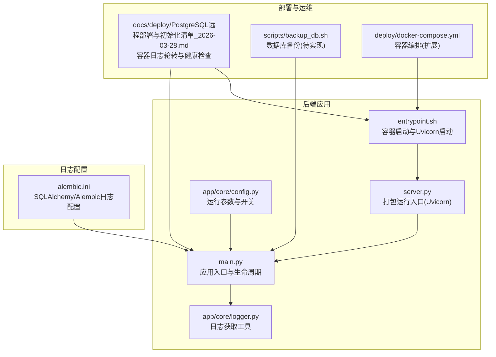
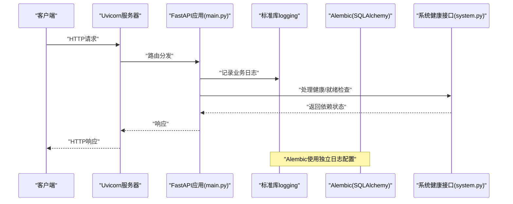
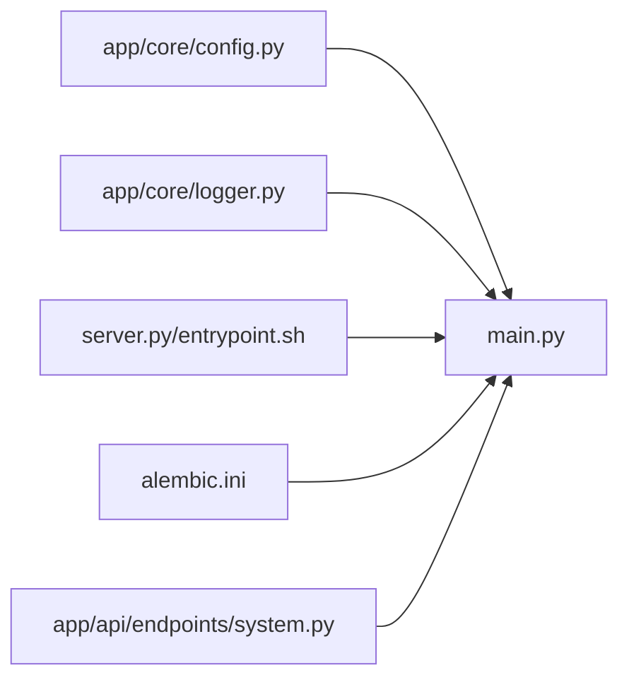

# 日志管理

<cite>
**本文引用的文件**
- [backend/app/core/logger.py](file://backend/app/core/logger.py)
- [backend/app/core/config.py](file://backend/app/core/config.py)
- [backend/alembic.ini](file://backend/alembic.ini)
- [backend/main.py](file://backend/main.py)
- [backend/server.py](file://backend/server.py)
- [backend/entrypoint.sh](file://backend/entrypoint.sh)
- [backend/app/api/endpoints/system.py](file://backend/app/api/endpoints/system.py)
- [docs/deploy/PostgreSQL远程部署与初始化清单_2026-03-28.md](file://docs/deploy/PostgreSQL远程部署与初始化清单_2026-03-28.md)
- [scripts/backup_db.sh](file://scripts/backup_db.sh)
- [deploy/docker-compose.yml](file://deploy/docker-compose.yml)
</cite>

## 目录
1. [简介](#简介)
2. [项目结构](#项目结构)
3. [核心组件](#核心组件)
4. [架构总览](#架构总览)
5. [详细组件分析](#详细组件分析)
6. [依赖关系分析](#依赖关系分析)
7. [性能考量](#性能考量)
8. [故障排查指南](#故障排查指南)
9. [结论](#结论)
10. [附录](#附录)

## 简介
本操作指南面向“智获客日志管理系统”，聚焦于日志配置参数、日志级别、结构化日志字段、日志收集与轮转、查询与分析、监控与告警、安全与隐私、备份与归档，以及常见问题排查。当前代码库中日志实现以 Python 标准库 logging 为主，并通过 Uvicorn/UWGSI 容器进行统一输出；Alembic 对 SQLAlchemy 和自身日志进行了独立配置；系统健康检查接口可作为日志监控的观测点之一。

## 项目结构
围绕日志相关的关键位置如下：
- 应用日志与启动：Uvicorn 启动参数、打包运行入口、FastAPI 生命周期日志
- 日志配置：Python logging、Alembic 日志配置
- 健康检查与可观测性：系统健康接口返回关键依赖状态
- 部署与轮转：容器日志滚动策略
- 备份：数据库备份脚本（待完善）

图表来源
- [backend/main.py:1-138](file://backend/main.py#L1-L138)
- [backend/server.py:1-29](file://backend/server.py#L1-L29)
- [backend/entrypoint.sh:38-47](file://backend/entrypoint.sh#L38-L47)
- [backend/app/core/logger.py:1-6](file://backend/app/core/logger.py#L1-L6)
- [backend/app/core/config.py:1-103](file://backend/app/core/config.py#L1-L103)
- [backend/alembic.ini:1-42](file://backend/alembic.ini#L1-L42)
- [docs/deploy/PostgreSQL远程部署与初始化清单_2026-03-28.md:92-141](file://docs/deploy/PostgreSQL远程部署与初始化清单_2026-03-28.md#L92-L141)
- [scripts/backup_db.sh:1-4](file://scripts/backup_db.sh#L1-L4)
- [deploy/docker-compose.yml:1-7](file://deploy/docker-compose.yml#L1-L7)

章节来源
- [backend/main.py:1-138](file://backend/main.py#L1-L138)
- [backend/server.py:1-29](file://backend/server.py#L1-L29)
- [backend/entrypoint.sh:38-47](file://backend/entrypoint.sh#L38-L47)
- [backend/app/core/logger.py:1-6](file://backend/app/core/logger.py#L1-L6)
- [backend/app/core/config.py:1-103](file://backend/app/core/config.py#L1-L103)
- [backend/alembic.ini:1-42](file://backend/alembic.ini#L1-L42)
- [docs/deploy/PostgreSQL远程部署与初始化清单_2026-03-28.md:92-141](file://docs/deploy/PostgreSQL远程部署与初始化清单_2026-03-28.md#L92-L141)
- [scripts/backup_db.sh:1-4](file://scripts/backup_db.sh#L1-L4)
- [deploy/docker-compose.yml:1-7](file://deploy/docker-compose.yml#L1-L7)

## 核心组件
- 日志获取工具：提供统一的日志 Logger 获取入口，便于在各模块中一致地使用标准库 logging。
- 日志级别与输出：Uvicorn 在不同运行模式下控制日志级别；打包运行时关闭 reload 并设置固定日志级别。
- Alembic 日志：独立配置 SQLAlchemy 与 Alembic 的日志级别与格式，避免与应用日志冲突。
- 健康检查接口：系统健康与就绪接口返回数据库、Redis、模型服务等依赖状态，可作为日志监控的观测点。
- 容器日志轮转：容器层已配置滚动策略（最大大小与文件数），便于长期运行时的磁盘占用控制。
- 备份脚本：数据库备份脚本存在但尚未实现，建议结合日志审计与合规要求制定备份策略。

章节来源
- [backend/app/core/logger.py:1-6](file://backend/app/core/logger.py#L1-L6)
- [backend/server.py:22-29](file://backend/server.py#L22-L29)
- [backend/entrypoint.sh:45-47](file://backend/entrypoint.sh#L45-L47)
- [backend/alembic.ini:10-42](file://backend/alembic.ini#L10-L42)
- [backend/app/api/endpoints/system.py:78-170](file://backend/app/api/endpoints/system.py#L78-L170)
- [docs/deploy/PostgreSQL远程部署与初始化清单_2026-03-28.md:125-128](file://docs/deploy/PostgreSQL远程部署与初始化清单_2026-03-28.md#L125-L128)
- [scripts/backup_db.sh:1-4](file://scripts/backup_db.sh#L1-L4)

## 架构总览
下图展示日志在系统中的流向与关键落点：应用日志由 Uvicorn 输出至容器标准错误流；Alembic 使用独立的 logging 配置；健康检查接口用于观测系统依赖状态，可辅助日志监控与告警。

图表来源
- [backend/main.py:46-77](file://backend/main.py#L46-L77)
- [backend/app/api/endpoints/system.py:141-170](file://backend/app/api/endpoints/system.py#L141-L170)
- [backend/alembic.ini:10-42](file://backend/alembic.ini#L10-L42)

## 详细组件分析

### 日志配置参数与日志级别
- 应用日志级别
  - 开发模式：可通过调试开关影响 Uvicorn 的 reload 行为，便于本地观察日志。
  - 打包模式：关闭 reload，固定日志级别，确保生产环境稳定输出。
  - 参考路径：[backend/server.py:22-29](file://backend/server.py#L22-L29)，[backend/entrypoint.sh:45-47](file://backend/entrypoint.sh#L45-L47)
- Alembic 日志级别
  - SQLAlchemy 引擎与 Alembic 自身的日志级别与格式独立配置，避免与应用日志混淆。
  - 参考路径：[backend/alembic.ini:10-42](file://backend/alembic.ini#L10-L42)
- 日志获取工具
  - 统一通过模块名获取 Logger，便于在各模块中保持一致的日志风格。
  - 参考路径：[backend/app/core/logger.py:1-6](file://backend/app/core/logger.py#L1-L6)

章节来源
- [backend/server.py:22-29](file://backend/server.py#L22-L29)
- [backend/entrypoint.sh:45-47](file://backend/entrypoint.sh#L45-L47)
- [backend/alembic.ini:10-42](file://backend/alembic.ini#L10-L42)
- [backend/app/core/logger.py:1-6](file://backend/app/core/logger.py#L1-L6)

### 结构化日志格式与字段含义
- 当前实现
  - 应用侧使用标准库 logging，未见显式的结构化日志格式定义；Alembic 配置了通用格式字符串。
  - 建议在业务日志中增加结构化字段（如请求ID、用户ID、耗时、错误码等），以提升可观测性与检索效率。
  - 参考路径：[backend/alembic.ini:40-42](file://backend/alembic.ini#L40-L42)
- 字段建议
  - 请求ID：用于跨服务串联请求轨迹
  - 用户ID：用于用户行为追踪
  - 路径/方法：用于接口维度统计
  - 耗时：毫秒级
  - 错误码/异常类型：用于告警与统计
  - 依赖状态：数据库、缓存、外部模型服务等
  - 参考健康接口返回字段：[backend/app/api/endpoints/system.py:141-161](file://backend/app/api/endpoints/system.py#L141-L161)

章节来源
- [backend/alembic.ini:40-42](file://backend/alembic.ini#L40-L42)
- [backend/app/api/endpoints/system.py:141-161](file://backend/app/api/endpoints/system.py#L141-L161)

### 日志收集、存储与轮转策略
- 收集
  - 应用日志由 Uvicorn 输出至容器标准错误流，适合与容器日志收集系统对接。
  - 参考路径：[backend/server.py:22-29](file://backend/server.py#L22-L29)
- 存储
  - 生产环境通过容器编排统一收集并持久化存储，仓库未提供专用日志存储配置文件。
  - 参考路径：[deploy/docker-compose.yml:1-7](file://deploy/docker-compose.yml#L1-7)
- 轮转
  - 已在部署文档中明确容器日志滚动策略（最大大小与文件数），有助于长期运行时的磁盘占用控制。
  - 参考路径：[docs/deploy/PostgreSQL远程部署与初始化清单_2026-03-28.md:125-128](file://docs/deploy/PostgreSQL远程部署与初始化清单_2026-03-28.md#L125-L128)

章节来源
- [backend/server.py:22-29](file://backend/server.py#L22-L29)
- [deploy/docker-compose.yml:1-7](file://deploy/docker-compose.yml#L1-7)
- [docs/deploy/PostgreSQL远程部署与初始化清单_2026-03-28.md:125-128](file://docs/deploy/PostgreSQL远程部署与初始化清单_2026-03-28.md#L125-L128)

### 日志查询与分析方法
- 健康检查接口
  - 通过系统健康接口可快速判断数据库、Redis、模型服务等依赖状态，辅助定位日志异常来源。
  - 参考路径：[backend/app/api/endpoints/system.py:141-170](file://backend/app/api/endpoints/system.py#L141-L170)
- 常用查询思路
  - 依赖状态异常：优先检查健康接口返回，再结合对应服务日志定位
  - 性能异常：关注接口耗时与错误率趋势，结合结构化日志字段进行聚合分析
  - 建议字段：请求ID、用户ID、路径/方法、耗时、错误码、依赖状态
- 常用查询语句示例（概念性说明）
  - 按时间窗口统计错误率与慢请求占比
  - 按用户ID或请求ID进行串行追踪
  - 按依赖名称（数据库/Redis/模型服务）聚合错误次数

章节来源
- [backend/app/api/endpoints/system.py:141-170](file://backend/app/api/endpoints/system.py#L141-L170)

### 日志监控与告警配置指南
- 观测点
  - 系统健康接口返回的整体状态与各依赖状态
  - 容器日志滚动与错误输出
- 告警建议
  - 整体状态非“ok”持续一定时间触发告警
  - 依赖状态异常（如数据库/Redis不可用）立即告警
  - 错误率与慢请求阈值告警
- 参考路径
  - [backend/app/api/endpoints/system.py:141-170](file://backend/app/api/endpoints/system.py#L141-L170)
  - [docs/deploy/PostgreSQL远程部署与初始化清单_2026-03-28.md:125-128](file://docs/deploy/PostgreSQL远程部署与初始化清单_2026-03-28.md#L125-L128)

章节来源
- [backend/app/api/endpoints/system.py:141-170](file://backend/app/api/endpoints/system.py#L141-L170)
- [docs/deploy/PostgreSQL远程部署与初始化清单_2026-03-28.md:125-128](file://docs/deploy/PostgreSQL远程部署与初始化清单_2026-03-28.md#L125-L128)

### 日志安全与隐私保护
- 密钥校验
  - 配置中对密钥长度与默认占位符进行严格校验，防止弱密钥进入生产环境。
  - 参考路径：[backend/app/core/config.py:55-63](file://backend/app/core/config.py#L55-L63)
- CORS 白名单
  - 生产环境禁止通配来源，降低跨域风险。
  - 参考路径：[backend/app/core/config.py:65-69](file://backend/app/core/config.py#L65-L69)
- 建议
  - 日志中避免输出敏感字段（如密码、完整令牌、身份证等）
  - 对日志访问进行权限控制与审计

章节来源
- [backend/app/core/config.py:55-63](file://backend/app/core/config.py#L55-L63)
- [backend/app/core/config.py:65-69](file://backend/app/core/config.py#L65-L69)

### 日志备份与归档策略
- 备份脚本
  - 数据库备份脚本存在但尚未实现，建议结合日志审计需求制定备份计划。
  - 参考路径：[scripts/backup_db.sh:1-4](file://scripts/backup_db.sh#L1-L4)
- 归档建议
  - 按日/周/月归档容器日志与数据库备份
  - 设置保留周期与清理策略
  - 对归档数据进行加密与访问控制

章节来源
- [scripts/backup_db.sh:1-4](file://scripts/backup_db.sh#L1-L4)

## 依赖关系分析
- 应用与日志
  - main.py 作为应用入口，负责注册中间件与路由；生命周期钩子中使用 logger 记录启动检查异常。
  - 参考路径：[backend/main.py:19-35](file://backend/main.py#L19-L35)
- 启动与日志
  - server.py 与 entrypoint.sh 控制 Uvicorn 的启动参数与日志级别，确保生产环境稳定输出。
  - 参考路径：[backend/server.py:22-29](file://backend/server.py#L22-L29)，[backend/entrypoint.sh:45-47](file://backend/entrypoint.sh#L45-L47)
- Alembic 日志
  - alembic.ini 独立配置 SQLAlchemy 与 Alembic 的日志级别与格式。
  - 参考路径：[backend/alembic.ini:10-42](file://backend/alembic.ini#L10-L42)

图表来源
- [backend/app/core/config.py:1-103](file://backend/app/core/config.py#L1-L103)
- [backend/app/core/logger.py:1-6](file://backend/app/core/logger.py#L1-L6)
- [backend/server.py:22-29](file://backend/server.py#L22-L29)
- [backend/entrypoint.sh:45-47](file://backend/entrypoint.sh#L45-L47)
- [backend/alembic.ini:10-42](file://backend/alembic.ini#L10-L42)
- [backend/app/api/endpoints/system.py:141-170](file://backend/app/api/endpoints/system.py#L141-L170)

章节来源
- [backend/app/core/config.py:1-103](file://backend/app/core/config.py#L1-L103)
- [backend/app/core/logger.py:1-6](file://backend/app/core/logger.py#L1-L6)
- [backend/server.py:22-29](file://backend/server.py#L22-L29)
- [backend/entrypoint.sh:45-47](file://backend/entrypoint.sh#L45-L47)
- [backend/alembic.ini:10-42](file://backend/alembic.ini#L10-L42)
- [backend/app/api/endpoints/system.py:141-170](file://backend/app/api/endpoints/system.py#L141-L170)

## 性能考量
- 日志级别与开销
  - 生产环境建议使用 INFO 或更高级别，避免过多 DEBUG 日志带来的 I/O 压力
  - 对高频接口可采用采样或结构化字段聚合，减少重复日志量
- 容器日志轮转
  - 合理设置最大大小与文件数，平衡磁盘占用与日志完整性
- 健康检查与延迟
  - 健康接口应尽量轻量化，避免引入额外延迟

## 故障排查指南
- 启动与健康检查
  - 使用健康接口确认数据库、Redis、模型服务等依赖状态
  - 参考路径：[backend/app/api/endpoints/system.py:141-170](file://backend/app/api/endpoints/system.py#L141-L170)
- 容器日志
  - 查看全部容器日志与按服务查看，结合轮转策略定位问题
  - 参考路径：[docs/deploy/PostgreSQL远程部署与初始化清单_2026-03-28.md:110-123](file://docs/deploy/PostgreSQL远程部署与初始化清单_2026-03-28.md#L110-L123)
- 启动等待与超时
  - 部署脚本中对健康检查超时进行处理并输出最近日志，便于快速定位
  - 参考路径：[backend/deploy.sh:85-100](file://backend/deploy.sh#L85-L100)
- 配置校验
  - 密钥与 CORS 白名单校验失败会直接报错，需根据提示修正 .env
  - 参考路径：[backend/app/core/config.py:55-69](file://backend/app/core/config.py#L55-L69)

章节来源
- [backend/app/api/endpoints/system.py:141-170](file://backend/app/api/endpoints/system.py#L141-L170)
- [docs/deploy/PostgreSQL远程部署与初始化清单_2026-03-28.md:110-123](file://docs/deploy/PostgreSQL远程部署与初始化清单_2026-03-28.md#L110-L123)
- [backend/deploy.sh:85-100](file://backend/deploy.sh#L85-L100)
- [backend/app/core/config.py:55-69](file://backend/app/core/config.py#L55-L69)

## 结论
当前系统日志以标准库 logging 与 Uvicorn 为主，Alembic 有独立日志配置；健康检查接口提供了可观测性的关键观测点。建议尽快引入结构化日志字段与统一的轮转策略，完善数据库备份脚本，并基于健康接口建立告警机制，以实现“证据驱动”的问题定位与高效运维。

## 附录
- 快速参考
  - 应用日志级别：参考 [backend/server.py:22-29](file://backend/server.py#L22-L29)、[backend/entrypoint.sh:45-47](file://backend/entrypoint.sh#L45-L47)
  - Alembic 日志配置：参考 [backend/alembic.ini:10-42](file://backend/alembic.ini#L10-L42)
  - 健康检查接口：参考 [backend/app/api/endpoints/system.py:141-170](file://backend/app/api/endpoints/system.py#L141-L170)
  - 容器日志轮转：参考 [docs/deploy/PostgreSQL远程部署与初始化清单_2026-03-28.md:125-128](file://docs/deploy/PostgreSQL远程部署与初始化清单_2026-03-28.md#L125-L128)
  - 备份脚本：参考 [scripts/backup_db.sh:1-4](file://scripts/backup_db.sh#L1-L4)