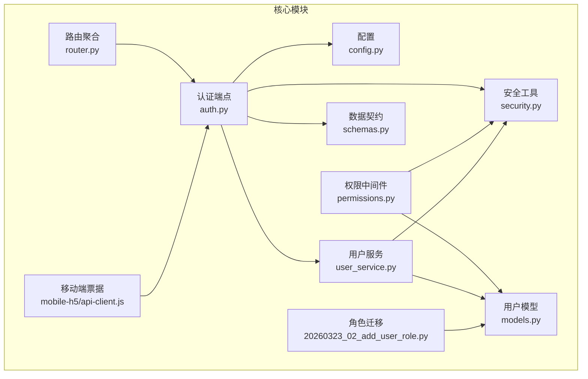
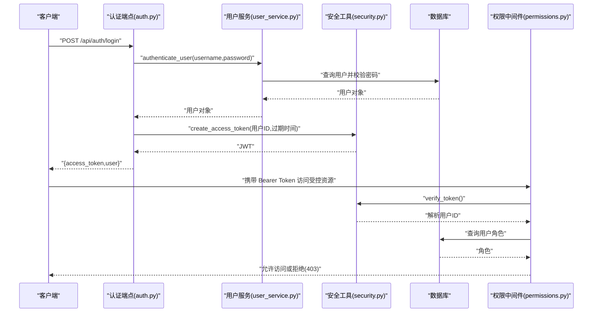
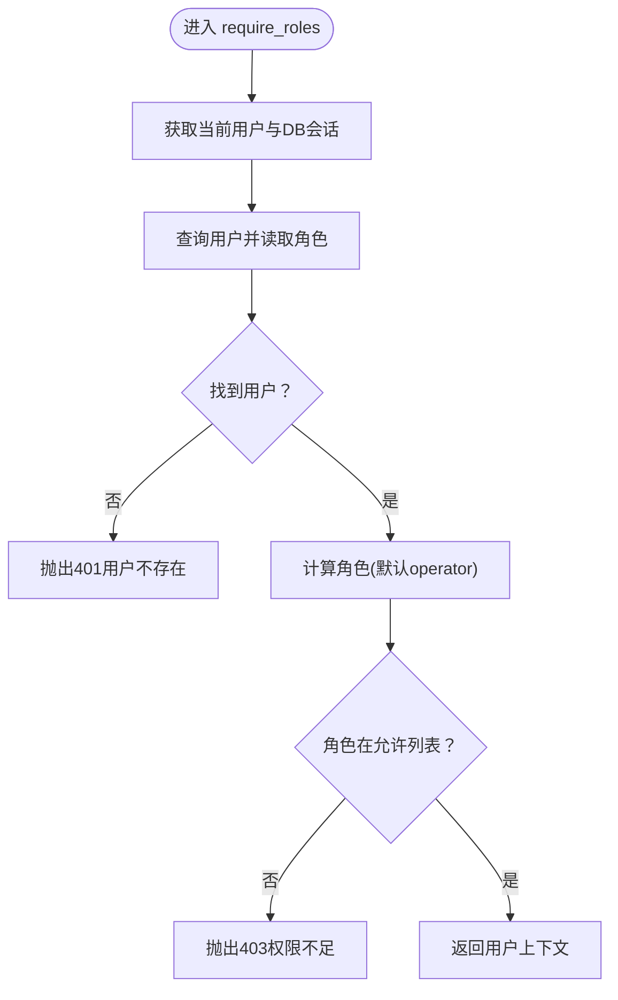
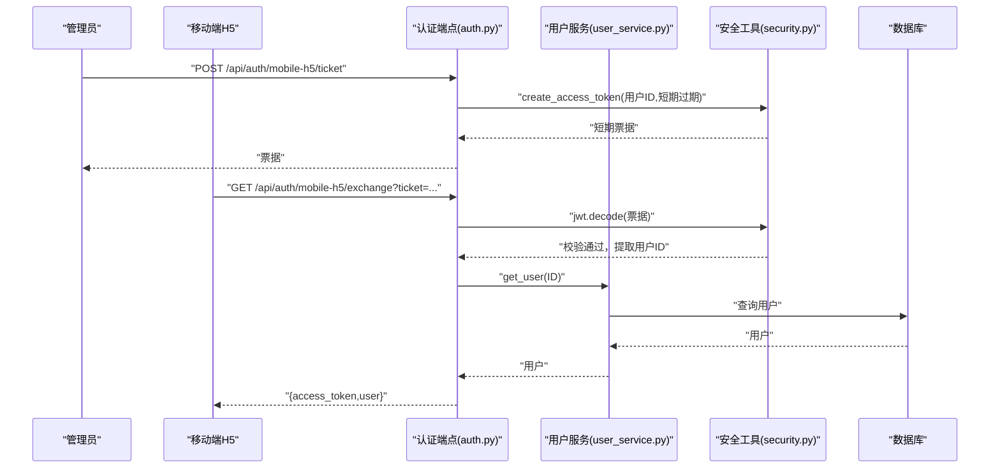
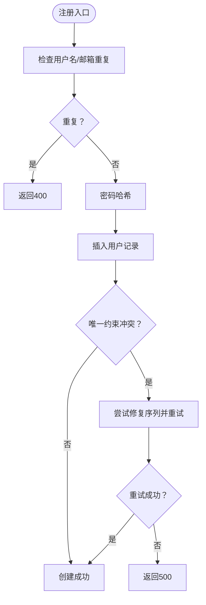
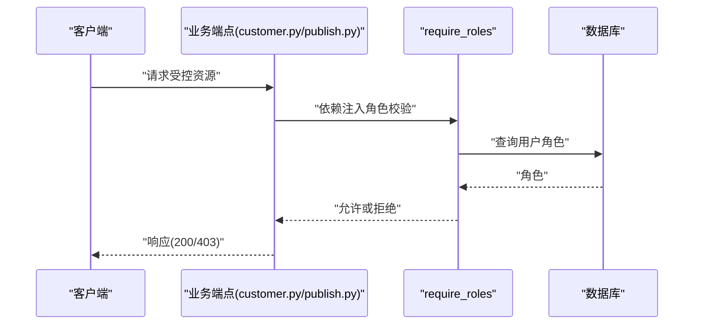
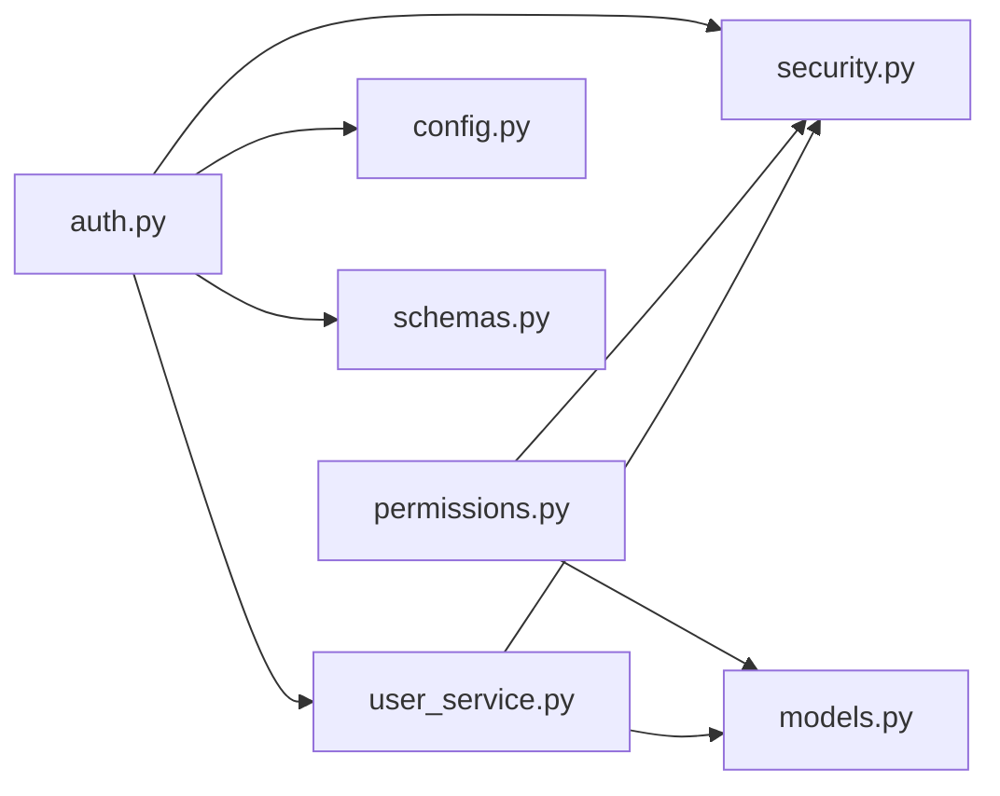

# 用户权限管理

<cite>
**本文引用的文件**
- [backend/app/core/permissions.py](file://backend/app/core/permissions.py)
- [backend/app/core/security.py](file://backend/app/core/security.py)
- [backend/app/core/config.py](file://backend/app/core/config.py)
- [backend/app/api/endpoints/auth.py](file://backend/app/api/endpoints/auth.py)
- [backend/app/services/user_service.py](file://backend/app/services/user_service.py)
- [backend/app/models/models.py](file://backend/app/models/models.py)
- [backend/alembic/versions/20260323_02_add_user_role.py](file://backend/alembic/versions/20260323_02_add_user_role.py)
- [backend/app/api/router.py](file://backend/app/api/router.py)
- [backend/app/schemas/schemas.py](file://backend/app/schemas/schemas.py)
- [backend/app/api/endpoints/customer.py](file://backend/app/api/endpoints/customer.py)
- [backend/app/api/endpoints/publish.py](file://backend/app/api/endpoints/publish.py)
- [backend/mobile-h5/src/utils/api-client.js](file://backend/mobile-h5/src/utils/api-client.js)
</cite>

## 目录
1. [简介](#简介)
2. [项目结构](#项目结构)
3. [核心组件](#核心组件)
4. [架构总览](#架构总览)
5. [详细组件分析](#详细组件分析)
6. [依赖关系分析](#依赖关系分析)
7. [性能考虑](#性能考虑)
8. [故障排查指南](#故障排查指南)
9. [结论](#结论)
10. [附录](#附录)

## 简介
本文件面向“智获客”系统的用户权限管理功能，提供从架构设计到操作实践的完整说明。重点涵盖：
- 角色定义与权限分配机制（角色层次、权限矩阵、访问控制策略）
- 用户账户生命周期管理（创建、修改、禁用、删除）
- JWT 令牌与会话控制机制（签发、校验、短期票据、企业微信 OAuth）
- 权限验证中间件工作原理与自定义权限检查方法
- 最佳实践与安全建议
- 权限继承与冲突处理策略

## 项目结构
围绕权限管理的关键目录与文件如下：
- 核心安全与权限
  - 权限中间件：backend/app/core/permissions.py
  - 安全工具（密码哈希、JWT 签发/校验）：backend/app/core/security.py
  - 配置项（密钥、算法、过期时间等）：backend/app/core/config.py
- 用户认证与会话
  - 认证端点：backend/app/api/endpoints/auth.py
  - 用户服务（注册、登录、查询）：backend/app/services/user_service.py
  - 用户模型（含角色字段）：backend/app/models/models.py
- 数据迁移（角色列）：backend/alembic/versions/20260323_02_add_user_role.py
- 路由聚合：backend/app/api/router.py
- 数据契约（请求/响应模型）：backend/app/schemas/schemas.py
- 权限使用示例（端点）：backend/app/api/endpoints/customer.py、backend/app/api/endpoints/publish.py
- 移动 H5 票据交换（前端集成）：backend/mobile-h5/src/utils/api-client.js

图表来源
- [backend/app/api/router.py:1-35](file://backend/app/api/router.py#L1-L35)
- [backend/app/api/endpoints/auth.py:1-280](file://backend/app/api/endpoints/auth.py#L1-L280)
- [backend/app/core/security.py:1-57](file://backend/app/core/security.py#L1-L57)
- [backend/app/core/permissions.py:1-30](file://backend/app/core/permissions.py#L1-L30)
- [backend/app/services/user_service.py:1-177](file://backend/app/services/user_service.py#L1-L177)
- [backend/app/models/models.py:1-800](file://backend/app/models/models.py#L1-L800)
- [backend/alembic/versions/20260323_02_add_user_role.py:1-36](file://backend/alembic/versions/20260323_02_add_user_role.py#L1-L36)
- [backend/app/schemas/schemas.py:1-200](file://backend/app/schemas/schemas.py#L1-L200)
- [backend/mobile-h5/src/utils/api-client.js:131-160](file://backend/mobile-h5/src/utils/api-client.js#L131-L160)

章节来源
- [backend/app/api/router.py:1-35](file://backend/app/api/router.py#L1-L35)
- [backend/app/api/endpoints/auth.py:1-280](file://backend/app/api/endpoints/auth.py#L1-L280)
- [backend/app/core/security.py:1-57](file://backend/app/core/security.py#L1-L57)
- [backend/app/core/permissions.py:1-30](file://backend/app/core/permissions.py#L1-L30)
- [backend/app/services/user_service.py:1-177](file://backend/app/services/user_service.py#L1-L177)
- [backend/app/models/models.py:1-800](file://backend/app/models/models.py#L1-L800)
- [backend/alembic/versions/20260323_02_add_user_role.py:1-36](file://backend/alembic/versions/20260323_02_add_user_role.py#L1-L36)
- [backend/app/schemas/schemas.py:1-200](file://backend/app/schemas/schemas.py#L1-L200)
- [backend/mobile-h5/src/utils/api-client.js:131-160](file://backend/mobile-h5/src/utils/api-client.js#L131-L160)

## 核心组件
- 权限中间件 require_roles
  - 作用：基于当前用户角色进行访问控制，支持白名单式角色匹配
  - 输入：依赖 verify_token 提供的用户标识，数据库查询用户角色
  - 输出：通过则返回标准化的用户上下文（用户ID、角色）
  - 异常：用户不存在、角色不足时抛出 401/403
- 安全工具
  - 密码哈希/校验：使用 pbkdf2_sha256/bcrypt 上下文
  - JWT 签发/校验：基于 HS256 算法，支持过期时间控制
- 用户服务
  - 注册：用户名/邮箱唯一性校验，序列冲突自动修复
  - 登录：凭据校验并签发访问令牌
  - 查询：按 ID 获取用户信息
- 认证端点
  - /api/auth/register：注册新用户
  - /api/auth/login：用户名+密码登录，返回 JWT
  - /api/auth/me：获取当前用户信息
  - /api/auth/mobile-h5/ticket：签发短期票据（移动端引导）
  - /api/auth/mobile-h5/exchange：短期票据换正式令牌
  - /api/auth/wecom/callback：企业微信 OAuth 回调换取用户令牌
  - /api/auth/wecom/bind：管理员为当前用户绑定企业微信用户ID
- 用户模型
  - 字段：id、username、email、hashed_password、role、is_active、wecom_userid、created_at、updated_at
  - 角色默认值：operator（迁移脚本保证非空）

章节来源
- [backend/app/core/permissions.py:1-30](file://backend/app/core/permissions.py#L1-L30)
- [backend/app/core/security.py:1-57](file://backend/app/core/security.py#L1-L57)
- [backend/app/services/user_service.py:1-177](file://backend/app/services/user_service.py#L1-L177)
- [backend/app/api/endpoints/auth.py:1-280](file://backend/app/api/endpoints/auth.py#L1-L280)
- [backend/app/models/models.py:1-800](file://backend/app/models/models.py#L1-L800)
- [backend/alembic/versions/20260323_02_add_user_role.py:1-36](file://backend/alembic/versions/20260323_02_add_user_role.py#L1-L36)

## 架构总览
下图展示从客户端到后端的典型鉴权与权限控制流程。

图表来源
- [backend/app/api/endpoints/auth.py:107-118](file://backend/app/api/endpoints/auth.py#L107-L118)
- [backend/app/services/user_service.py:155-165](file://backend/app/services/user_service.py#L155-L165)
- [backend/app/core/security.py:28-39](file://backend/app/core/security.py#L28-L39)
- [backend/app/core/security.py:42-56](file://backend/app/core/security.py#L42-L56)
- [backend/app/core/permissions.py:9-29](file://backend/app/core/permissions.py#L9-L29)

## 详细组件分析

### 组件A：权限中间件 require_roles
- 设计要点
  - 通过依赖注入链路获取当前用户与数据库会话
  - 从数据库读取用户角色，若为空则回退为默认值
  - 使用白名单策略进行角色匹配，不满足即拒绝
- 复杂度与性能
  - 单次 DB 查询，O(1) 时间复杂度
  - 依赖 verify_token 的 JWT 解析，O(1)
- 错误处理
  - 用户不存在：401
  - 角色不在允许列表：403
- 自定义扩展
  - 可在中间件内部增加角色继承/映射逻辑
  - 可引入权限点（细粒度）与角色-权限映射表

图表来源
- [backend/app/core/permissions.py:9-29](file://backend/app/core/permissions.py#L9-L29)

章节来源
- [backend/app/core/permissions.py:1-30](file://backend/app/core/permissions.py#L1-L30)

### 组件B：JWT 令牌与会话控制
- 令牌签发
  - 登录成功后根据配置生成 JWT，包含过期时间
  - 支持短期票据用于移动端 H5 引导（有效期较短）
- 令牌校验
  - 通过 HTTP Bearer 方式传递
  - verify_token 解析并校验签名，提取用户ID
- 企业微信 OAuth
  - 公开回调接口换取用户令牌，便于企业内用户免密登录
- 移动端票据
  - 管理员下发短期票据，H5 通过 /exchange 接口换取正式令牌

图表来源
- [backend/app/api/endpoints/auth.py:134-177](file://backend/app/api/endpoints/auth.py#L134-L177)
- [backend/app/core/security.py:28-39](file://backend/app/core/security.py#L28-L39)
- [backend/app/services/user_service.py:168-176](file://backend/app/services/user_service.py#L168-L176)

章节来源
- [backend/app/api/endpoints/auth.py:1-280](file://backend/app/api/endpoints/auth.py#L1-L280)
- [backend/app/core/security.py:1-57](file://backend/app/core/security.py#L1-L57)
- [backend/app/core/config.py:1-103](file://backend/app/core/config.py#L1-L103)
- [backend/mobile-h5/src/utils/api-client.js:131-160](file://backend/mobile-h5/src/utils/api-client.js#L131-L160)

### 组件C：用户账户管理流程
- 创建用户
  - 校验用户名/邮箱唯一性
  - 密码哈希后入库
  - 序列冲突自动修复（PostgreSQL）
- 修改用户
  - 当前实现未直接暴露修改密码/角色的端点
  - 可通过管理员绑定企业微信等方式间接影响登录方式
- 禁用/启用
  - 用户模型包含 is_active 字段
  - 企业微信回调仅接受 is_active=True 的用户
- 删除用户
  - 代码未提供删除接口
  - 建议通过软删除或审计日志配合业务流程处理

图表来源
- [backend/app/services/user_service.py:61-153](file://backend/app/services/user_service.py#L61-L153)
- [backend/app/core/security.py:18-25](file://backend/app/core/security.py#L18-L25)

章节来源
- [backend/app/services/user_service.py:1-177](file://backend/app/services/user_service.py#L1-L177)
- [backend/app/models/models.py:1-800](file://backend/app/models/models.py#L1-L800)
- [backend/app/api/endpoints/auth.py:185-254](file://backend/app/api/endpoints/auth.py#L185-L254)

### 组件D：权限验证中间件与自定义权限检查
- 中间件使用
  - 在端点层通过 Depends(require_roles(...)) 实现角色白名单控制
  - 示例：导出 CSV 等敏感操作要求 admin/operator
- 自定义权限检查方法
  - 可在 require_roles 内部扩展角色继承/映射
  - 可引入“权限点”与“角色-权限映射表”，在中间件中进行细粒度校验
  - 可结合业务实体（如 owner_id）做资源级访问控制

图表来源
- [backend/app/api/endpoints/customer.py:108-112](file://backend/app/api/endpoints/customer.py#L108-L112)
- [backend/app/api/endpoints/publish.py:543-548](file://backend/app/api/endpoints/publish.py#L543-L548)
- [backend/app/core/permissions.py:9-29](file://backend/app/core/permissions.py#L9-L29)

章节来源
- [backend/app/api/endpoints/customer.py:108-112](file://backend/app/api/endpoints/customer.py#L108-L112)
- [backend/app/api/endpoints/publish.py:543-548](file://backend/app/api/endpoints/publish.py#L543-L548)
- [backend/app/core/permissions.py:1-30](file://backend/app/core/permissions.py#L1-L30)

### 组件E：角色层次结构与权限矩阵
- 角色定义
  - 默认角色：operator（迁移脚本确保非空）
  - 管理员：在 require_roles 中显式使用 "admin" 白名单
- 权限矩阵（基于现有实现）
  - operator：可访问基础业务能力（如导出 CSV 的范围限定在自身或被指派的任务）
  - admin：可访问更高权限端点（如绑定企业微信、跨用户操作等）
- 权限继承与冲突
  - 当前实现为“角色白名单”，未体现复杂的继承/冲突合并
  - 建议引入“角色-权限映射表”，在中间件中统一合并与去重

章节来源
- [backend/alembic/versions/20260323_02_add_user_role.py:18-27](file://backend/alembic/versions/20260323_02_add_user_role.py#L18-L27)
- [backend/app/api/endpoints/customer.py:108-112](file://backend/app/api/endpoints/customer.py#L108-L112)
- [backend/app/api/endpoints/publish.py:543-548](file://backend/app/api/endpoints/publish.py#L543-L548)

## 依赖关系分析
- 组件耦合
  - 权限中间件依赖安全工具（verify_token）与数据库（查询用户）
  - 认证端点依赖用户服务与安全工具
  - 用户服务依赖模型与安全工具
- 外部依赖
  - JWT 算法与密钥来自配置
  - 企业微信 OAuth 依赖外部 API
- 潜在循环依赖
  - 当前文件组织避免了循环导入

图表来源
- [backend/app/api/endpoints/auth.py:1-280](file://backend/app/api/endpoints/auth.py#L1-L280)
- [backend/app/services/user_service.py:1-177](file://backend/app/services/user_service.py#L1-L177)
- [backend/app/core/security.py:1-57](file://backend/app/core/security.py#L1-L57)
- [backend/app/core/permissions.py:1-30](file://backend/app/core/permissions.py#L1-L30)
- [backend/app/models/models.py:1-800](file://backend/app/models/models.py#L1-L800)
- [backend/app/schemas/schemas.py:1-200](file://backend/app/schemas/schemas.py#L1-L200)

章节来源
- [backend/app/api/endpoints/auth.py:1-280](file://backend/app/api/endpoints/auth.py#L1-L280)
- [backend/app/services/user_service.py:1-177](file://backend/app/services/user_service.py#L1-L177)
- [backend/app/core/security.py:1-57](file://backend/app/core/security.py#L1-L57)
- [backend/app/core/permissions.py:1-30](file://backend/app/core/permissions.py#L1-L30)
- [backend/app/models/models.py:1-800](file://backend/app/models/models.py#L1-L800)
- [backend/app/schemas/schemas.py:1-200](file://backend/app/schemas/schemas.py#L1-L200)

## 性能考虑
- JWT 解析与数据库查询均为 O(1)，整体延迟低
- 密码哈希采用 pbkdf2_sha256/bcrypt，兼顾安全性与兼容性
- 企业微信 token 使用内存缓存，降低外部调用开销
- 建议
  - 对频繁访问的端点启用 API 级限流
  - 对登录/注册接口增加速率限制与验证码防护

## 故障排查指南
- 401 未授权
  - 检查 Authorization 头是否正确传递 Bearer 令牌
  - 核对 SECRET_KEY 与 ALGORITHM 配置一致性
- 403 权限不足
  - 确认当前用户角色是否在 require_roles 白名单中
  - 检查用户 is_active 是否为 True（企业微信回调限制）
- 企业微信 OAuth 失败
  - 核对 CorpId/AgentId/AgentSecret 配置
  - 检查回调地址与企业微信后台配置一致
- 短期票据无效
  - 确认票据用途字段与预期一致
  - 检查票据过期时间与服务器时间偏差

章节来源
- [backend/app/core/security.py:42-56](file://backend/app/core/security.py#L42-L56)
- [backend/app/api/endpoints/auth.py:185-254](file://backend/app/api/endpoints/auth.py#L185-L254)
- [backend/app/api/endpoints/auth.py:134-177](file://backend/app/api/endpoints/auth.py#L134-L177)
- [backend/app/core/config.py:1-103](file://backend/app/core/config.py#L1-103)

## 结论
本项目采用“角色白名单”的轻量级权限控制方案，结合 JWT 令牌与企业微信 OAuth，实现了基础但实用的用户权限管理能力。建议后续引入细粒度权限点与角色-权限映射，完善权限继承与冲突处理，进一步提升系统的可维护性与安全性。

## 附录

### A. 角色与权限最佳实践
- 角色最小化原则：仅授予完成任务所需的最少角色
- 管理员分离：admin 与 operator 明确区分，避免越权
- 审计追踪：对关键操作（导出、绑定、变更）记录日志
- 定期复核：定期审查角色分配与权限矩阵

### B. 安全建议
- 强制使用 HTTPS 传输
- 定期轮换 SECRET_KEY，长度不少于 32 字符
- 严格 CORS 配置，生产环境禁止通配符
- 对登录/注册接口实施速率限制与验证码
- 企业微信回调参数校验与防重放

### C. 权限继承与冲突解决机制建议
- 引入“角色-权限映射表”，在中间件中统一合并与去重
- 冲突解决：显式规则优先于隐式继承，deny 优先于 allow
- 可视化权限矩阵：便于运维与审计