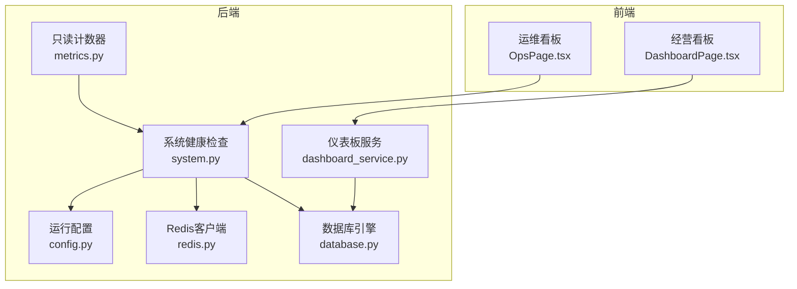
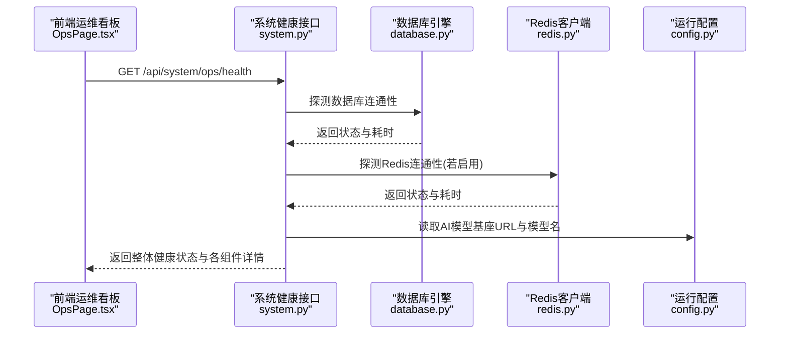
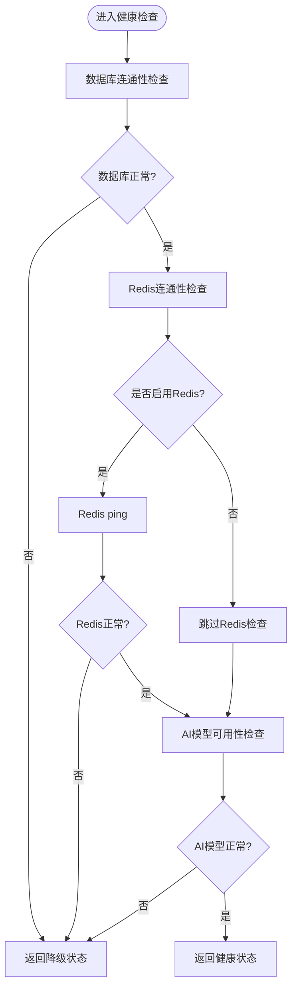
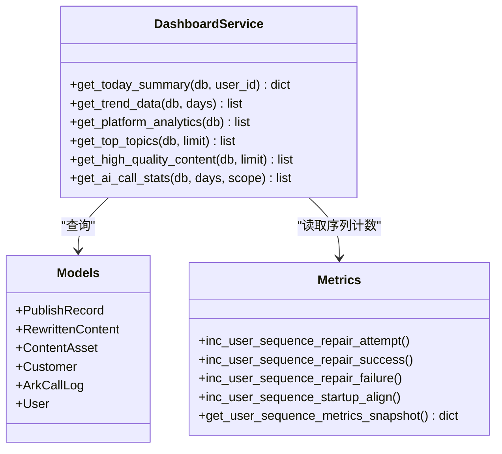
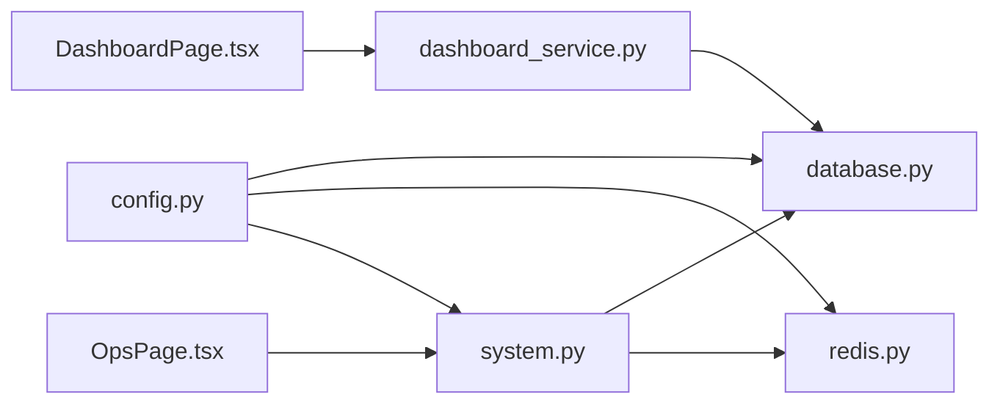

# 监控告警系统

<cite>
**本文引用的文件**
- [system.py](file://backend/app/api/endpoints/system.py)
- [config.py](file://backend/app/core/config.py)
- [database.py](file://backend/app/core/database.py)
- [redis.py](file://backend/app/core/redis.py)
- [metrics.py](file://backend/app/core/metrics.py)
- [dashboard_service.py](file://backend/app/services/dashboard_service.py)
- [schemas.py](file://backend/app/schemas/schemas.py)
- [models.py](file://backend/app/models/models.py)
- [OpsPage.tsx](file://desktop/src/pages/OpsPage.tsx)
- [DashboardPage.tsx](file://desktop/src/pages/DashboardPage.tsx)
- [maintenance-checklist.md](file://docs/operations/maintenance-checklist.md)
</cite>

## 目录
1. [简介](#简介)
2. [项目结构](#项目结构)
3. [核心组件](#核心组件)
4. [架构总览](#架构总览)
5. [详细组件分析](#详细组件分析)
6. [依赖分析](#依赖分析)
7. [性能考虑](#性能考虑)
8. [故障排查指南](#故障排查指南)
9. [结论](#结论)
10. [附录](#附录)

## 简介
本文件面向智获客监控告警系统，提供从健康检查、指标采集、存储与展示到告警规则与异常检测的完整配置与使用指南。系统通过后端健康检查接口对数据库、缓存与AI模型进行连通性与可用性探测，并在桌面端运维看板中呈现系统状态与AI调用统计；同时，通过仪表板聚合关键业务指标，辅助运营与技术团队进行日常运维与问题定位。

## 项目结构
监控告警系统由后端API、核心配置与存储、前端运维看板三部分组成：
- 后端健康检查与指标：提供系统健康状态、AI调用统计等只读接口
- 核心配置与连接：数据库、Redis、AI模型基座URL等运行参数
- 前端运维看板：定时刷新系统健康状态与AI调用统计，支持快速链接直达

图表来源
- [system.py:134-171](file://backend/app/api/endpoints/system.py#L134-L171)
- [config.py:27-101](file://backend/app/core/config.py#L27-L101)
- [database.py:6-29](file://backend/app/core/database.py#L6-L29)
- [redis.py:6-8](file://backend/app/core/redis.py#L6-L8)
- [metrics.py:12-44](file://backend/app/core/metrics.py#L12-L44)
- [dashboard_service.py:7-209](file://backend/app/services/dashboard_service.py#L7-L209)
- [OpsPage.tsx:18-239](file://desktop/src/pages/OpsPage.tsx#L18-L239)
- [DashboardPage.tsx:1-93](file://desktop/src/pages/DashboardPage.tsx#L1-L93)

章节来源
- [system.py:134-171](file://backend/app/api/endpoints/system.py#L134-L171)
- [config.py:27-101](file://backend/app/core/config.py#L27-L101)
- [database.py:6-29](file://backend/app/core/database.py#L6-L29)
- [redis.py:6-8](file://backend/app/core/redis.py#L6-L8)
- [metrics.py:12-44](file://backend/app/core/metrics.py#L12-L44)
- [dashboard_service.py:7-209](file://backend/app/services/dashboard_service.py#L7-L209)
- [OpsPage.tsx:18-239](file://desktop/src/pages/OpsPage.tsx#L18-L239)
- [DashboardPage.tsx:1-93](file://desktop/src/pages/DashboardPage.tsx#L1-L93)

## 核心组件
- 健康检查接口
  - 提供整体健康状态、数据库、Redis、AI模型可用性检查
  - 返回各组件状态、耗时、错误信息与运行时参数快照
- 指标采集与存储
  - 用户序列修复与启动对齐的只读计数器，用于观测序列一致性恢复情况
  - AI调用统计按天与用户聚合，包含调用次数、失败次数、失败率、Token消耗、平均延迟
  - 经营看板按自然日聚合发布数量、阅读量、私信、微信添加、线索、有效线索、转化等指标
- 前端展示
  - 运维看板定时刷新系统健康状态与AI调用统计
  - 经营看板展示趋势图与关键指标卡片

章节来源
- [system.py:134-171](file://backend/app/api/endpoints/system.py#L134-L171)
- [metrics.py:12-44](file://backend/app/core/metrics.py#L12-L44)
- [dashboard_service.py:7-209](file://backend/app/services/dashboard_service.py#L7-L209)
- [OpsPage.tsx:18-239](file://desktop/src/pages/OpsPage.tsx#L18-L239)
- [DashboardPage.tsx:1-93](file://desktop/src/pages/DashboardPage.tsx#L1-L93)

## 架构总览
系统健康检查与指标展示的整体交互如下：

图表来源
- [system.py:134-171](file://backend/app/api/endpoints/system.py#L134-L171)
- [database.py:6-29](file://backend/app/core/database.py#L6-L29)
- [redis.py:6-8](file://backend/app/core/redis.py#L6-L8)
- [config.py:71-74](file://backend/app/core/config.py#L71-L74)

## 详细组件分析

### 健康检查机制
- 数据库连接检查
  - 使用SQLAlchemy引擎发起连接并执行简单查询，记录耗时与错误
  - 返回字段包含名称、状态、方言、耗时、错误信息
- Redis状态检查
  - 若未启用速率限制，则直接返回“未启用”状态
  - 若未安装Redis包或连接超时，返回相应错误
  - 否则通过ping确认连通性，记录耗时与URL
- AI模型可用性检查
  - 通过请求AI模型标签接口，校验目标模型是否存在
  - 返回字段包含名称、状态、耗时、基座URL、模型数量、目标模型存在性

图表来源
- [system.py:39-131](file://backend/app/api/endpoints/system.py#L39-L131)

章节来源
- [system.py:39-131](file://backend/app/api/endpoints/system.py#L39-L131)

### 指标收集与存储
- 只读计数器
  - 用户序列修复尝试/成功/失败/启动对齐计数，线程安全累加
  - 提供快照读取接口，便于观测序列一致性恢复情况
- AI调用统计
  - 按自然日与用户聚合，计算调用次数、失败次数、失败率、Token消耗、平均延迟
  - 支持按“本人/全部”范围查询
- 经营看板指标
  - 今日新增客户、微信添加、线索、有效线索、转化
  - 近N日趋势：发布数、阅读量、私信、微信添加、线索、有效线索、转化
  - 平台分析：按平台汇总发布数与线索/转化
  - 热门主题Top榜与高质量内容Top榜

图表来源
- [dashboard_service.py:7-209](file://backend/app/services/dashboard_service.py#L7-L209)
- [metrics.py:12-44](file://backend/app/core/metrics.py#L12-L44)
- [models.py:259-289](file://backend/app/models/models.py#L259-L289)
- [models.py:156-181](file://backend/app/models/models.py#L156-L181)
- [models.py:45-83](file://backend/app/models/models.py#L45-L83)
- [models.py:229-257](file://backend/app/models/models.py#L229-L257)
- [models.py:1-27](file://backend/app/models/models.py#L1-L27)

章节来源
- [metrics.py:12-44](file://backend/app/core/metrics.py#L12-L44)
- [dashboard_service.py:7-209](file://backend/app/services/dashboard_service.py#L7-L209)
- [schemas.py:417-481](file://backend/app/schemas/schemas.py#L417-L481)
- [models.py:259-289](file://backend/app/models/models.py#L259-L289)

### 告警规则与级别
- 健康检查整体状态
  - 健康：数据库与Redis均正常且AI模型可用
  - 降级：数据库或Redis任一异常，或AI模型不可用
- 前端状态颜色
  - 绿色：健康/已连接
  - 黄色：缓慢/降级
  - 红色：异常/未连接
- 建议的阈值与规则
  - 数据库/Redis/Ping耗时超过阈值（如>500ms）标记为“缓慢”，>2000ms标记为“异常”
  - AI模型标签接口超时或返回非2xx视为异常
  - 失败率超过阈值（如>5%）触发告警
  - 平均延迟超过阈值（如>5000ms）触发告警
  - 未配置Redis时显示“未配置”，不计入健康状态

章节来源
- [system.py:134-171](file://backend/app/api/endpoints/system.py#L134-L171)
- [OpsPage.tsx:51-55](file://desktop/src/pages/OpsPage.tsx#L51-L55)
- [OpsPage.tsx:190](file://desktop/src/pages/OpsPage.tsx#L190)

### 性能监控指标与阈值
- 数据库/Redis/Ping耗时：毫秒级
- AI模型标签接口耗时：毫秒级
- AI调用统计
  - 调用次数：总量
  - 失败次数：总量
  - 失败率：百分比
  - Token消耗：输入+输出之和
  - 平均延迟：毫秒
- 经营看板指标
  - 发布数、阅读量、私信、微信添加、线索、有效线索、转化

章节来源
- [system.py:39-131](file://backend/app/api/endpoints/system.py#L39-L131)
- [dashboard_service.py:7-209](file://backend/app/services/dashboard_service.py#L7-L209)
- [schemas.py:444-461](file://backend/app/schemas/schemas.py#L444-L461)

### 监控仪表板使用指南
- 运维看板
  - 自动每30秒刷新系统健康状态
  - 展示数据库、Redis、AI模型可用性与最后检查时间
  - 展示API版本与桌面端版本
  - 展示AI调用统计：总调用次数、失败次数、失败率、Token消耗、平均延迟
  - 展示每日明细表格
- 经营看板
  - 展示今日新增客户、微信添加、线索、有效线索、转化
  - 展示近7日趋势折线图
  - 支持跳转至运维看板查看系统状态

章节来源
- [OpsPage.tsx:18-239](file://desktop/src/pages/OpsPage.tsx#L18-L239)
- [DashboardPage.tsx:1-93](file://desktop/src/pages/DashboardPage.tsx#L1-L93)

### 异常检测与自动化告警
- 异常检测
  - 健康检查接口对数据库、Redis、AI模型分别探测，聚合整体状态
  - 前端根据状态字符串映射颜色，实现可视化异常提示
- 自动化告警触发机制
  - 建议基于健康检查返回的“整体状态”与各组件耗时/错误信息进行阈值判断
  - 对失败率与平均延迟进行阈值告警
  - 未配置Redis时以“未配置”标识，避免误报

章节来源
- [system.py:134-171](file://backend/app/api/endpoints/system.py#L134-L171)
- [OpsPage.tsx:51-55](file://desktop/src/pages/OpsPage.tsx#L51-L55)

## 依赖分析
- 配置依赖
  - 数据库URL、主机、端口、名称
  - Redis开关与URL
  - AI模型基座URL与目标模型名
- 运行时依赖
  - SQLAlchemy用于数据库连接与探活
  - Redis客户端用于探活与速率限制
  - 请求库用于AI模型标签接口探活
- 前端依赖
  - 运维看板定时轮询健康检查与AI调用统计接口
  - 经营看板定时轮询今日汇总与趋势接口

图表来源
- [config.py:27-101](file://backend/app/core/config.py#L27-L101)
- [database.py:6-29](file://backend/app/core/database.py#L6-L29)
- [redis.py:6-8](file://backend/app/core/redis.py#L6-L8)
- [system.py:134-171](file://backend/app/api/endpoints/system.py#L134-L171)
- [OpsPage.tsx:18-239](file://desktop/src/pages/OpsPage.tsx#L18-L239)
- [dashboard_service.py:7-209](file://backend/app/services/dashboard_service.py#L7-L209)

章节来源
- [config.py:27-101](file://backend/app/core/config.py#L27-L101)
- [system.py:134-171](file://backend/app/api/endpoints/system.py#L134-L171)
- [OpsPage.tsx:18-239](file://desktop/src/pages/OpsPage.tsx#L18-L239)
- [dashboard_service.py:7-209](file://backend/app/services/dashboard_service.py#L7-L209)

## 性能考虑
- 数据库连接池
  - 预连接与溢出配置有助于降低连接抖动带来的波动
- Redis探活超时
  - 设置合理的连接与读取超时，避免阻塞健康检查
- AI模型探活
  - 采用短超时请求，避免因外部模型服务不稳定影响整体健康状态
- 前端轮询频率
  - 运维看板每30秒刷新，平衡实时性与服务器压力

章节来源
- [database.py:6-13](file://backend/app/core/database.py#L6-L13)
- [system.py:78-81](file://backend/app/api/endpoints/system.py#L78-L81)
- [system.py:105-108](file://backend/app/api/endpoints/system.py#L105-L108)
- [OpsPage.tsx:46-49](file://desktop/src/pages/OpsPage.tsx#L46-L49)

## 故障排查指南
- 健康检查返回“降级”或“异常”
  - 检查数据库连接串与网络连通性
  - 检查Redis服务状态与URL配置
  - 检查AI模型基座URL可达性与目标模型是否存在
- 失败率升高或平均延迟异常
  - 查看AI调用统计中的失败次数与失败率
  - 结合平均延迟与Token消耗评估模型负载
- 运维检查清单
  - 数据库连接
  - Redis连接
  - 任务队列消费
  - 日志与告警

章节来源
- [system.py:134-171](file://backend/app/api/endpoints/system.py#L134-L171)
- [OpsPage.tsx:144-150](file://desktop/src/pages/OpsPage.tsx#L144-L150)
- [maintenance-checklist.md:1-7](file://docs/operations/maintenance-checklist.md#L1-L7)

## 结论
智获客监控告警系统通过后端健康检查与前端仪表板实现了对数据库、Redis与AI模型的可视化监控，并提供了AI调用统计与经营看板指标，帮助团队快速定位问题并进行容量与质量评估。建议结合阈值策略与自动化告警机制，持续优化系统稳定性与用户体验。

## 附录
- 健康检查接口路径
  - GET /api/system/ops/health
  - GET /api/system/ops/readiness
- 指标接口路径
  - GET /api/system/version
  - GET /api/system/sequence-metrics
  - GET /api/dashboard/ai-call-stats
- 前端入口
  - 运维看板：/ops
  - 经营看板：/dashboard

章节来源
- [system.py:21-36](file://backend/app/api/endpoints/system.py#L21-L36)
- [system.py:134-171](file://backend/app/api/endpoints/system.py#L134-L171)
- [OpsPage.tsx:234-239](file://desktop/src/pages/OpsPage.tsx#L234-L239)
- [DashboardPage.tsx:33-42](file://desktop/src/pages/DashboardPage.tsx#L33-L42)