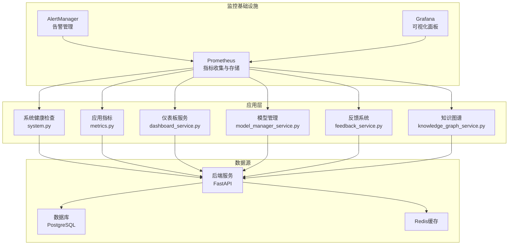
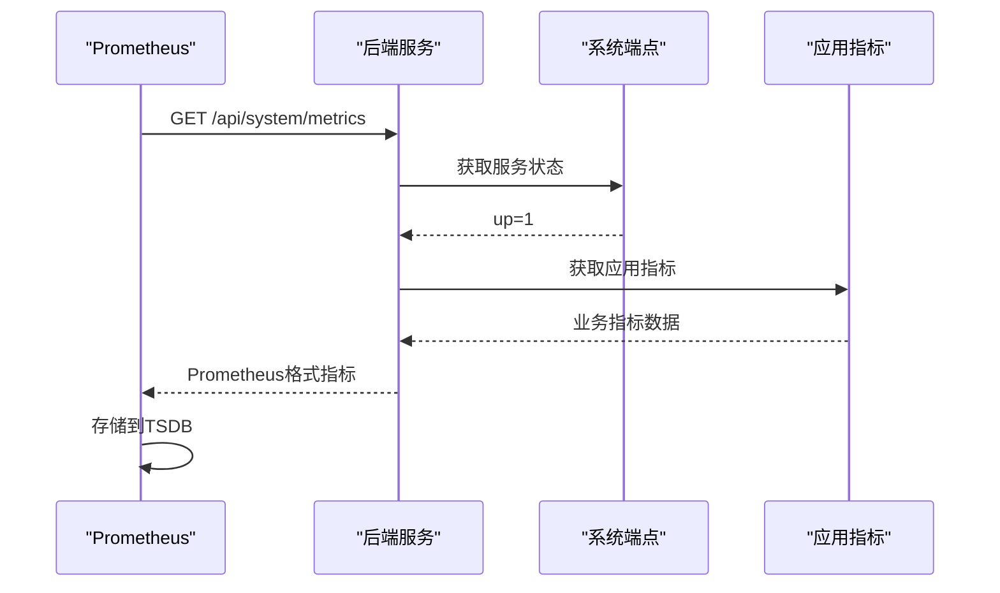
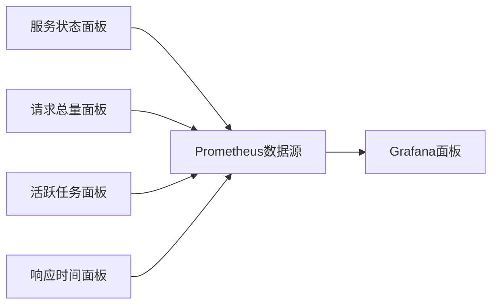
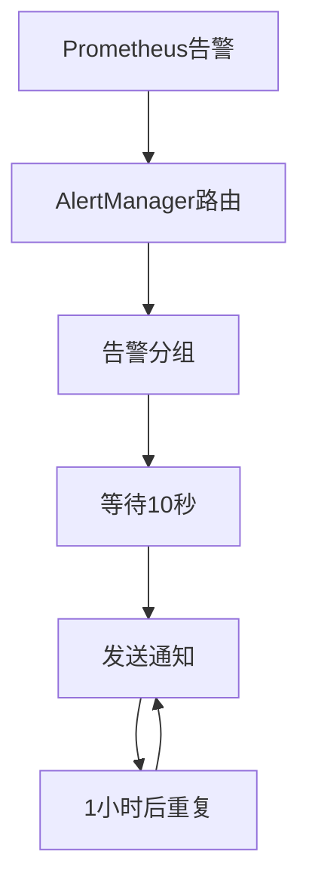
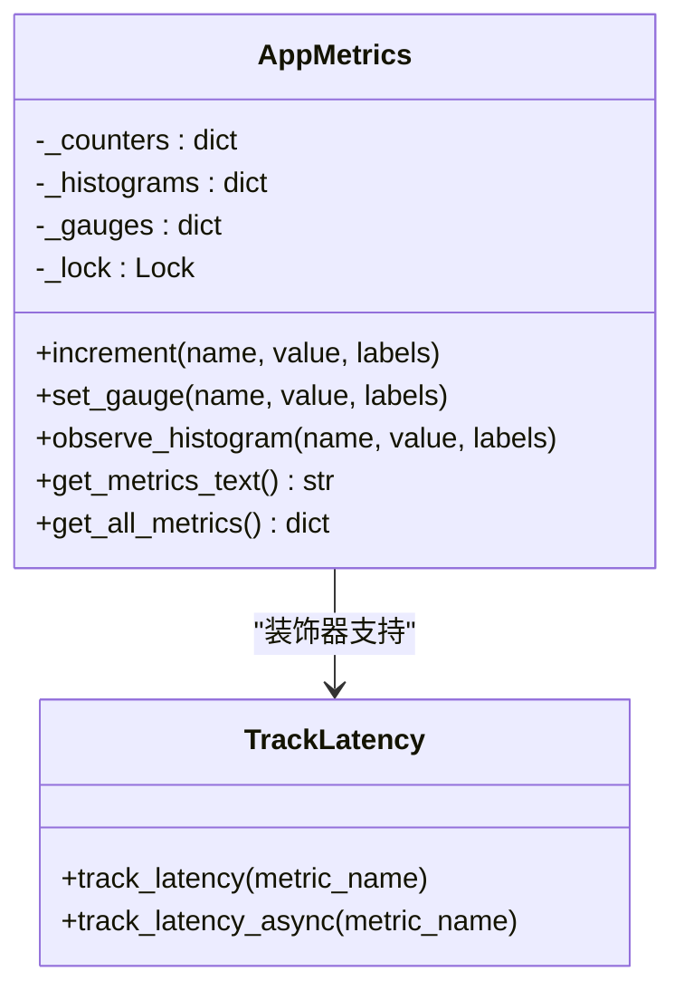
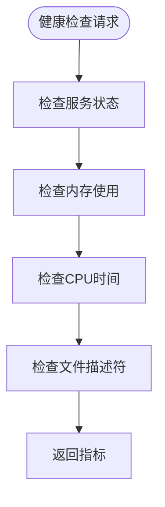
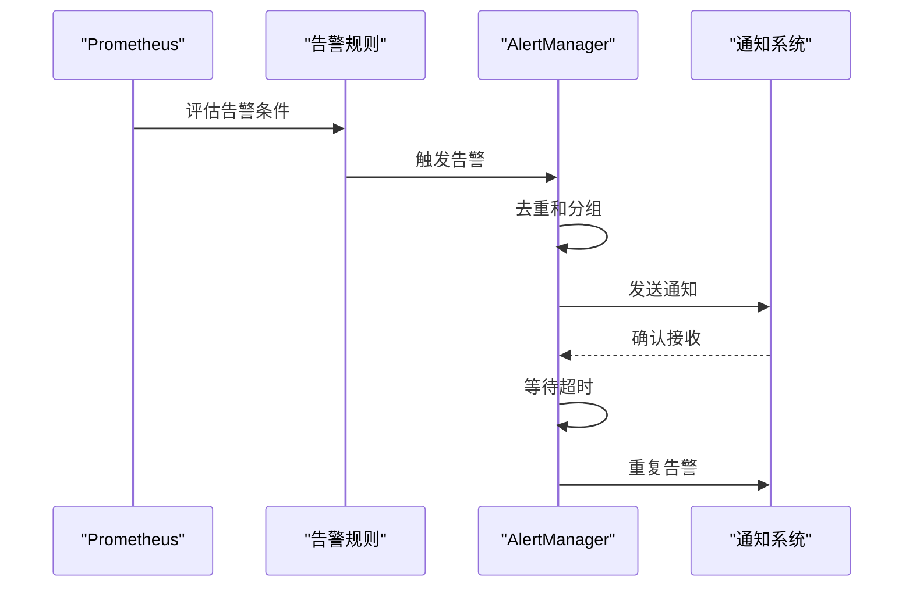
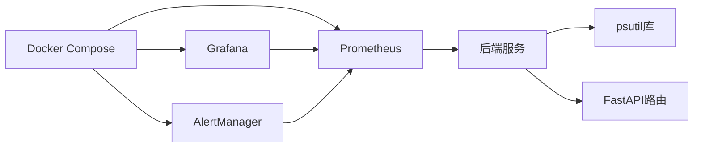

# 监控告警系统

<cite>
**本文引用的文件**
- [system.py](file://backend/app/api/endpoints/system.py)
- [config.py](file://backend/app/core/config.py)
- [database.py](file://backend/app/core/database.py)
- [redis.py](file://backend/app/core/redis.py)
- [metrics.py](file://backend/app/core/metrics.py)
- [dashboard_service.py](file://backend/app/services/dashboard_service.py)
- [schemas.py](file://backend/app/schemas/schemas.py)
- [models.py](file://backend/app/models/models.py)
- [OpsPage.tsx](file://desktop/src/pages/OpsPage.tsx)
- [DashboardPage.tsx](file://desktop/src/pages/DashboardPage.tsx)
- [mvp_routes.py](file://backend/app/api/endpoints/mvp_routes.py)
- [feedback_service.py](file://backend/app/services/feedback_service.py)
- [knowledge_graph_service.py](file://backend/app/services/knowledge_graph_service.py)
- [model_manager_service.py](file://backend/app/services/model_manager_service.py)
- [insight.py](file://backend/app/api/endpoints/insight.py)
- [insight_service.py](file://backend/app/services/insight_service.py)
- [maintenance-checklist.md](file://docs/operations/maintenance-checklist.md)
- [docker-compose.yml](file://deploy/monitoring/docker-compose.yml)
- [prometheus.yml](file://deploy/monitoring/prometheus.yml)
- [alertmanager.yml](file://deploy/monitoring/alertmanager.yml)
- [alerting_rules.yml](file://deploy/monitoring/alerting_rules.yml)
- [system-overview.json](file://deploy/monitoring/grafana/dashboards/system-overview.json)
- [dashboard.yml](file://deploy/monitoring/grafana/provisioning/dashboards/dashboard.yml)
- [datasource.yml](file://deploy/monitoring/grafana/provisioning/datasources/datasource.yml)
</cite>

## 更新摘要
**所做更改**
- 新增Prometheus监控基础设施章节，包含指标收集、存储和查询机制
- 新增Grafana可视化面板章节，包含系统概览仪表板和配置
- 新增AlertManager告警管理章节，包含告警规则和通知机制
- 更新健康检查机制，增加Prometheus指标端点和进程监控
- 扩展指标收集范围，包含应用业务指标和进程资源指标
- 增强告警规则，支持服务可用性、错误率、响应时间和内存使用告警

## 目录
1. [简介](#简介)
2. [监控基础设施架构](#监控基础设施架构)
3. [Prometheus监控系统](#prometheus监控系统)
4. [Grafana可视化面板](#grafana可视化面板)
5. [AlertManager告警管理](#alertmanager告警管理)
6. [应用指标收集](#应用指标收集)
7. [系统健康检查增强](#系统健康检查增强)
8. [告警规则与阈值](#告警规则与阈值)
9. [监控仪表板使用指南](#监控仪表板使用指南)
10. [异常检测与自动化告警](#异常检测与自动化告警)
11. [新增功能模块](#新增功能模块)
12. [依赖分析](#依赖分析)
13. [性能考虑](#性能考虑)
14. [故障排查指南](#故障排查指南)
15. [结论](#结论)
16. [附录](#附录)

## 简介
本文件面向智获客监控告警系统，提供从健康检查、指标采集、存储与展示到告警规则与异常检测的完整配置与使用指南。系统通过后端健康检查接口对数据库、缓存与AI模型进行连通性与可用性探测，并在桌面端运维看板中呈现系统状态与AI调用统计；同时，通过仪表板聚合关键业务指标，辅助运营与技术团队进行日常运维与问题定位。

**更新** 新增了完整的Prometheus监控基础设施，包括指标收集、Grafana可视化面板和AlertManager告警管理，提供更全面的系统可观测性和自动化告警能力。

## 监控基础设施架构
智获客监控告警系统采用现代化的监控栈架构，集成了Prometheus、Grafana和AlertManager三大核心组件：

**图表来源**
- [docker-compose.yml:1-47](file://deploy/monitoring/docker-compose.yml#L1-L47)
- [prometheus.yml:13-18](file://deploy/monitoring/prometheus.yml#L13-L18)
- [system.py:172-209](file://backend/app/api/endpoints/system.py#L172-L209)
- [metrics.py:54-124](file://backend/app/core/metrics.py#L54-L124)

## Prometheus监控系统
Prometheus作为核心监控系统，负责收集、存储和查询各种指标数据。

### 配置架构
- **Scrape配置**：定时从后端服务抓取指标，间隔10秒
- **规则文件**：定义告警规则和记录规则
- **存储配置**：TSDB存储，保留30天数据
- **告警路由**：将告警发送到AlertManager

### 指标收集机制
- **服务状态指标**：up指标表示服务可用性
- **进程资源指标**：内存使用、CPU时间、文件描述符
- **应用业务指标**：登录次数、生成次数、合规检查等
- **自定义指标**：API延迟、LLM调用等

**图表来源**
- [prometheus.yml:14-18](file://deploy/monitoring/prometheus.yml#L14-L18)
- [system.py:172-209](file://backend/app/api/endpoints/system.py#L172-L209)
- [metrics.py:92-111](file://backend/app/core/metrics.py#L92-L111)

**章节来源**
- [docker-compose.yml:4-16](file://deploy/monitoring/docker-compose.yml#L4-L16)
- [prometheus.yml:1-23](file://deploy/monitoring/prometheus.yml#L1-L23)
- [system.py:172-209](file://backend/app/api/endpoints/system.py#L172-L209)
- [metrics.py:54-124](file://backend/app/core/metrics.py#L54-L124)

## Grafana可视化面板
Grafana提供直观的可视化界面，展示系统运行状态和关键指标。

### 面板配置
- **系统概览面板**：展示服务状态、请求总量、活跃任务数、响应时间
- **数据源配置**：连接到Prometheus数据源
- **仪表板提供者**：自动加载JSON配置文件
- **刷新频率**：10秒自动刷新

### 关键指标展示
- **服务状态**：实时显示后端服务可用性
- **请求总量**：QPS趋势和方法/端点分布
- **活跃任务数**：Celery任务队列状态
- **响应时间**：P95延迟趋势

**图表来源**
- [system-overview.json:1-34](file://deploy/monitoring/grafana/dashboards/system-overview.json#L1-L34)
- [datasource.yml:1-8](file://deploy/monitoring/grafana/provisioning/datasources/datasource.yml#L1-L8)
- [dashboard.yml:1-9](file://deploy/monitoring/grafana/provisioning/dashboards/dashboard.yml#L1-L9)

**章节来源**
- [system-overview.json:1-34](file://deploy/monitoring/grafana/dashboards/system-overview.json#L1-L34)
- [datasource.yml:1-8](file://deploy/monitoring/grafana/provisioning/datasources/datasource.yml#L1-L8)
- [dashboard.yml:1-9](file://deploy/monitoring/grafana/provisioning/dashboards/dashboard.yml#L1-L9)

## AlertManager告警管理
AlertManager负责处理来自Prometheus的告警，提供告警路由、去重和通知功能。

### 告警配置
- **路由配置**：按告警名称分组，10秒等待时间
- **接收器**：默认接收器，支持Webhook扩展
- **告警级别**：critical、warning级别
- **重复间隔**：1小时重复告警

### 告警规则
- **服务宕机告警**：后端服务down超过1分钟
- **高错误率告警**：5xx错误率超过5%
- **高响应时间告警**：P95响应时间超过2秒
- **高内存使用告警**：内存使用超过512MB

**图表来源**
- [alertmanager.yml:4-9](file://deploy/monitoring/alertmanager.yml#L4-L9)
- [alerting_rules.yml:4-38](file://deploy/monitoring/alerting_rules.yml#L4-L38)

**章节来源**
- [alertmanager.yml:1-16](file://deploy/monitoring/alertmanager.yml#L1-L16)
- [alerting_rules.yml:1-38](file://deploy/monitoring/alerting_rules.yml#L1-L38)

## 应用指标收集
系统实现了完整的应用级指标收集机制，支持多种指标类型和标签管理。

### 指标类型
- **计数器（Counter）**：累计值，如登录次数、生成次数
- **仪表（Gauge）**：瞬时值，如活跃用户数、内存使用
- **直方图（Histogram）**：延迟分布，如API响应时间

### 指标管理器
- **线程安全**：使用锁保护共享状态
- **标签支持**：支持键值对标签
- **内存限制**：直方图仅保留最近1000个观测值
- **Prometheus格式**：自动转换为Prometheus可读格式

### 预定义指标
- **登录指标**：login_total
- **生成指标**：generation_total
- **合规指标**：compliance_pass_total、compliance_fail_total
- **API延迟**：api_latency_ms
- **LLM指标**：llm_call_total、llm_tokens_total
- **限流指标**：rate_limit_hit_total

**图表来源**
- [metrics.py:54-173](file://backend/app/core/metrics.py#L54-L173)

**章节来源**
- [metrics.py:54-173](file://backend/app/core/metrics.py#L54-L173)

## 系统健康检查增强
系统健康检查机制得到显著增强，增加了Prometheus指标端点和进程监控能力。

### 指标端点实现
- **服务状态**：up指标始终为1，表示服务可用
- **进程监控**：可选的进程资源监控（需要psutil库）
- **内存使用**：process_resident_memory_bytes
- **CPU时间**：process_cpu_seconds_total
- **文件描述符**：process_open_fds

### 健康检查流程

**图表来源**
- [system.py:172-209](file://backend/app/api/endpoints/system.py#L172-L209)

**章节来源**
- [system.py:172-209](file://backend/app/api/endpoints/system.py#L172-L209)

## 告警规则与阈值
系统定义了多层次的告警规则，覆盖服务可用性、性能和资源使用等方面。

### 告警规则详解
- **服务宕机告警**：up{job="zhk-backend"} == 0，持续1分钟
- **高错误率告警**：5xx错误率超过5%，持续5分钟
- **高响应时间告警**：P95响应时间超过2秒，持续5分钟
- **高内存使用告警**：内存使用超过512MB，持续10分钟

### 告警级别
- **Critical（严重）**：服务完全不可用
- **Warning（警告）**：性能或资源使用异常

### 阈值配置
- **服务可用性**：up指标必须为1
- **错误率**：>5%触发警告
- **响应时间**：>2秒触发警告
- **内存使用**：>512MB触发警告

**章节来源**
- [alerting_rules.yml:1-38](file://deploy/monitoring/alerting_rules.yml#L1-L38)
- [alertmanager.yml:1-16](file://deploy/monitoring/alertmanager.yml#L1-L16)

## 监控仪表板使用指南
Grafana提供直观的监控面板，支持实时数据展示和历史趋势分析。

### 仪表板功能
- **自动刷新**：10秒刷新频率
- **时间范围**：默认最近1小时
- **面板布局**：响应式网格布局
- **指标查询**：PromQL查询语言

### 关键面板说明
- **服务状态面板**：显示up指标，绿色表示正常
- **请求总量面板**：展示QPS趋势和方法分布
- **活跃任务面板**：显示Celery任务队列状态
- **响应时间面板**：展示P95延迟趋势

**章节来源**
- [system-overview.json:1-34](file://deploy/monitoring/grafana/dashboards/system-overview.json#L1-L34)

## 异常检测与自动化告警
系统实现了基于Prometheus的自动化异常检测和告警机制。

### 异常检测机制
- **阈值检测**：基于预定义阈值的简单检测
- **趋势检测**：基于时间序列趋势的复杂检测
- **组合检测**：多个指标的关联检测

### 告警触发流程

**图表来源**
- [prometheus.yml:8-11](file://deploy/monitoring/prometheus.yml#L8-L11)
- [alertmanager.yml:4-9](file://deploy/monitoring/alertmanager.yml#L4-L9)

**章节来源**
- [prometheus.yml:1-23](file://deploy/monitoring/prometheus.yml#L1-L23)
- [alertmanager.yml:1-16](file://deploy/monitoring/alertmanager.yml#L1-L16)

## 新增功能模块

### 模型性能监控
智获客系统新增了完整的模型性能监控能力，支持对Ollama本地模型的管理、性能基准测试和实时监控。

#### 模型管理功能
- **模型列表管理**：获取已拉取的Ollama模型列表，包含模型名称、大小、修改时间等信息
- **模型状态检查**：验证模型可用性和嵌入能力，返回模型维度和状态信息
- **模型基准测试**：执行性能测试，测量延迟并进行性能评级
- **模型选择管理**：支持切换当前使用的embedding模型

#### 性能监控指标
- **延迟指标**：平均延迟、最小延迟、最大延迟（毫秒级）
- **质量指标**：模型维度大小、性能评级（优秀/良好/一般/慢）
- **可用性指标**：模型可用性状态、响应码
- **资源指标**：模型大小、参数量等

#### 告警规则
- **性能告警**：延迟超过阈值（如>1000ms）触发性能告警
- **可用性告警**：模型检查失败或响应异常触发告警
- **资源告警**：模型大小异常或维度异常触发告警

**章节来源**
- [mvp_routes.py:1128-1257](file://backend/app/api/endpoints/mvp_routes.py#L1128-L1257)
- [model_manager_service.py:22-396](file://backend/app/services/model_manager_service.py#L22-L396)

### 知识图谱统计
系统实现了完整的知识图谱构建、统计和分析功能，支持智能内容推荐和主题发现。

#### 关系构建
- **相似主题关系**：基于向量相似度发现相似内容（余弦距离<0.25）
- **元数据关系**：基于受众、平台、主题等元数据匹配构建关系
- **互补内容关系**：基于主题相似但类型互补的内容关系
- **批量构建**：支持全量知识条目的关系批量构建

#### 图谱统计
- **基础统计**：节点数、边数、平均度、连通性比率
- **关系统计**：各类关系类型的数量分布
- **质量统计**：有关系的节点数、有嵌入的节点数
- **连通性分析**：最大连通分量、网络密度等

#### 主题聚类
- **连通分量算法**：使用BFS算法发现主题簇
- **主题识别**：统计簇内主要主题并进行命名
- **簇质量评估**：基于簇大小和内部关系密度评估质量

#### 增强检索
- **向量检索**：基于embedding的初始检索
- **图扩展**：沿关系图扩展相关条目
- **权重衰减**：基于关系权重对扩展结果进行分数衰减

**章节来源**
- [mvp_routes.py:1263-1401](file://backend/app/api/endpoints/mvp_routes.py#L1263-L1401)
- [knowledge_graph_service.py:30-621](file://backend/app/services/knowledge_graph_service.py#L30-L621)

### 反馈质量指标监控
系统建立了完整的反馈闭环机制，通过用户反馈持续优化知识库质量和模型性能。

#### 反馈收集
- **反馈类型**：采纳（adopted）、修改（modified）、拒绝（rejected）
- **评分系统**：1-5分评分，支持文本反馈和标签分类
- **使用追踪**：记录引用的知识库条目，支持多条目引用
- **修改追踪**：保存用户修改后的文本，便于质量分析

#### 质量评分
- **评分算法**：基于正面、中性、负面反馈的贝叶斯平滑评分
- **先验处理**：引入先验值避免小样本极端评分
- **范围限制**：评分限制在0.1-0.95之间
- **权重加成**：根据质量评分动态调整检索权重

#### 学习建议
- **权重调整**：自动提升高质量条目的检索权重
- **降权处理**：降低低质量条目的检索权重
- **冷数据标记**：标记长期未使用的知识条目
- **修改模式分析**：基于用户反馈标签分析内容优化方向

#### 统计分析
- **反馈统计**：采纳率、修改率、拒绝率、平均评分
- **质量排行**：按质量评分和引用次数的综合排行
- **趋势分析**：近期反馈趋势和质量变化
- **标签分析**：用户反馈标签的分布和趋势

**章节来源**
- [mvp_routes.py:1058-1118](file://backend/app/api/endpoints/mvp_routes.py#L1058-L1118)
- [feedback_service.py:16-486](file://backend/app/services/feedback_service.py#L16-L486)
- [models.py:1137-1190](file://backend/app/models/models.py#L1137-L1190)

## 依赖分析
监控基础设施的依赖关系更加复杂，涉及多个容器和服务的协调。

### 容器依赖
- **Prometheus**：独立运行，依赖AlertManager进行告警
- **Grafana**：依赖Prometheus数据源，自动挂载仪表板配置
- **AlertManager**：独立运行，接收Prometheus告警

### 后端依赖
- **psutil库**：用于进程指标收集（可选）
- **Prometheus格式**：指标数据的标准格式
- **FastAPI路由**：/api/system/metrics端点

### 配置依赖
- **Docker Compose**：统一的服务编排
- **Prometheus配置**：抓取目标和规则文件
- **Grafana配置**：数据源和仪表板提供者

**图表来源**
- [docker-compose.yml:1-47](file://deploy/monitoring/docker-compose.yml#L1-L47)
- [system.py:183-206](file://backend/app/api/endpoints/system.py#L183-L206)

**章节来源**
- [docker-compose.yml:1-47](file://deploy/monitoring/docker-compose.yml#L1-L47)
- [system.py:172-209](file://backend/app/api/endpoints/system.py#L172-L209)

## 性能考虑
监控基础设施的性能优化需要考虑多个方面。

### Prometheus性能优化
- **抓取间隔**：10秒间隔平衡实时性和性能
- **存储保留**：30天TSDB存储，控制磁盘使用
- **指标数量**：合理控制指标数量，避免过多标签
- **查询优化**：使用高效的时间序列查询

### Grafana性能优化
- **面板数量**：合理控制面板数量，避免过度渲染
- **数据范围**：默认1小时范围，避免大数据量查询
- **刷新频率**：10秒刷新，平衡实时性和性能
- **缓存策略**：利用浏览器缓存减少请求

### 告警性能优化
- **去重机制**：AlertManager的去重和分组
- **静默周期**：避免重复告警
- **告警级别**：合理设置告警级别，避免告警风暴

**章节来源**
- [prometheus.yml:2-3](file://deploy/monitoring/prometheus.yml#L2-L3)
- [system-overview.json:31](file://deploy/monitoring/grafana/dashboards/system-overview.json#L31)
- [alertmanager.yml:2](file://deploy/monitoring/alertmanager.yml#L2)

## 故障排查指南
监控基础设施的故障排查需要分层次进行。

### 基础设施故障排查
- **Prometheus连接**：检查容器状态和端口映射
- **Grafana连接**：验证数据源配置和面板加载
- **AlertManager连接**：确认告警路由和接收器配置

### 指标收集故障排查
- **后端端点**：检查/api/system/metrics端点可用性
- **指标格式**：验证Prometheus格式正确性
- **进程监控**：确认psutil库安装和权限

### 告警故障排查
- **规则语法**：检查PromQL语法正确性
- **告警条件**：验证阈值设置合理性
- **通知配置**：确认接收器配置和网络访问

### 性能故障排查
- **资源使用**：监控容器CPU和内存使用
- **存储空间**：检查TSDB存储使用情况
- **网络延迟**：验证容器间网络连通性

**章节来源**
- [docker-compose.yml:1-47](file://deploy/monitoring/docker-compose.yml#L1-L47)
- [prometheus.yml:14-18](file://deploy/monitoring/prometheus.yml#L14-L18)
- [alerting_rules.yml:1-38](file://deploy/monitoring/alerting_rules.yml#L1-L38)

## 结论
智获客监控告警系统通过新增的Prometheus、Grafana和AlertManager基础设施，实现了从传统健康检查到现代可观测性的全面升级。系统不仅提供了实时的可视化监控，还建立了完善的自动化告警机制，为AI驱动的内容生产提供了全面的质量保障和性能优化支持。

**更新** 新增的监控基础设施显著提升了系统的可观测性和运维效率，建议结合阈值策略与自动化告警机制，持续优化系统稳定性与用户体验。

## 附录
- **监控基础设施接口**
  - Prometheus: http://localhost:9090
  - Grafana: http://localhost:3000
  - AlertManager: http://localhost:9093
- **监控配置文件**
  - Prometheus配置: deploy/monitoring/prometheus.yml
  - AlertManager配置: deploy/monitoring/alertmanager.yml
  - 告警规则: deploy/monitoring/alerting_rules.yml
  - Grafana面板: deploy/monitoring/grafana/dashboards/system-overview.json
- **应用指标端点**
  - GET /api/system/metrics
  - GET /api/system/ops/health
  - GET /api/system/ops/readiness
- **新增模型管理接口**
  - GET /api/mvp/models/embedding
  - GET /api/mvp/models/llm
  - POST /api/mvp/models/embedding/select
  - GET /api/mvp/models/ollama/status
  - POST /api/mvp/models/ollama/pull
  - GET /api/mvp/models/ollama/{model_name}/info
  - GET /api/mvp/models/ollama/{model_name}/check
  - POST /api/mvp/models/benchmark
- **新增知识图谱接口**
  - POST /api/mvp/knowledge/graph/build
  - POST /api/mvp/knowledge/{knowledge_id}/relations/build
  - GET /api/mvp/knowledge/{knowledge_id}/related
  - GET /api/mvp/knowledge/graph
  - GET /api/mvp/knowledge/graph/stats
  - GET /api/mvp/knowledge/graph/clusters
  - GET /api/mvp/knowledge/graph/enhanced-search
- **新增反馈监控接口**
  - GET /api/mvp/feedback/stats
  - GET /api/mvp/knowledge/quality/rankings
  - GET /api/mvp/knowledge/quality/suggestions
  - POST /api/mvp/knowledge/quality/adjust
  - GET /api/mvp/feedback/tags
- **前端监控入口**
  - 监控面板：/ops
  - 经营看板：/dashboard

**章节来源**
- [docker-compose.yml:1-47](file://deploy/monitoring/docker-compose.yml#L1-L47)
- [prometheus.yml:14-18](file://deploy/monitoring/prometheus.yml#L14-L18)
- [system.py:172-209](file://backend/app/api/endpoints/system.py#L172-L209)
- [mvp_routes.py:1058-1401](file://backend/app/api/endpoints/mvp_routes.py#L1058-L1401)
- [OpsPage.tsx:234-239](file://desktop/src/pages/OpsPage.tsx#L234-L239)
- [DashboardPage.tsx:33-42](file://desktop/src/pages/DashboardPage.tsx#L33-L42)