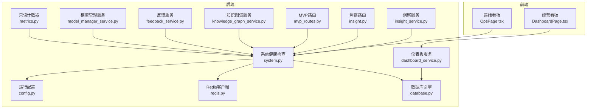
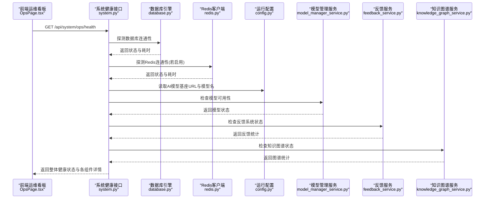
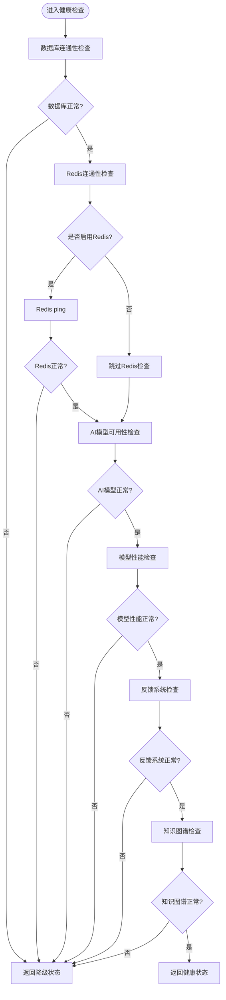
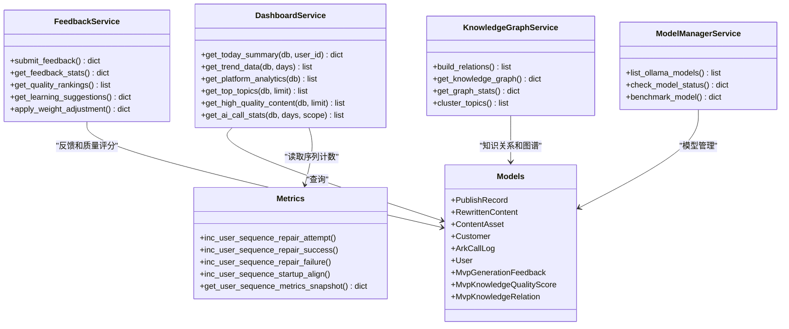
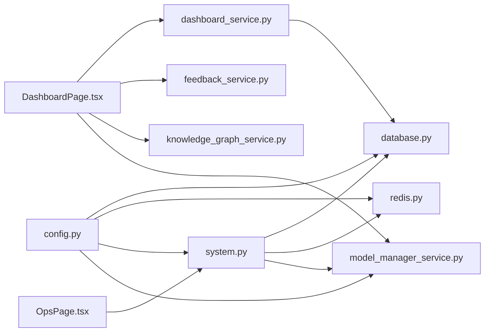

# 监控告警系统

<cite>
**本文引用的文件**
- [system.py](file://backend/app/api/endpoints/system.py)
- [config.py](file://backend/app/core/config.py)
- [database.py](file://backend/app/core/database.py)
- [redis.py](file://backend/app/core/redis.py)
- [metrics.py](file://backend/app/core/metrics.py)
- [dashboard_service.py](file://backend/app/services/dashboard_service.py)
- [schemas.py](file://backend/app/schemas/schemas.py)
- [models.py](file://backend/app/models/models.py)
- [OpsPage.tsx](file://desktop/src/pages/OpsPage.tsx)
- [DashboardPage.tsx](file://desktop/src/pages/DashboardPage.tsx)
- [mvp_routes.py](file://backend/app/api/endpoints/mvp_routes.py)
- [feedback_service.py](file://backend/app/services/feedback_service.py)
- [knowledge_graph_service.py](file://backend/app/services/knowledge_graph_service.py)
- [model_manager_service.py](file://backend/app/services/model_manager_service.py)
- [insight.py](file://backend/app/api/endpoints/insight.py)
- [insight_service.py](file://backend/app/services/insight_service.py)
- [maintenance-checklist.md](file://docs/operations/maintenance-checklist.md)
</cite>

## 更新摘要
**所做更改**
- 新增模型性能监控章节，涵盖Ollama模型管理、性能基准测试和延迟评级
- 新增知识图谱统计章节，包含关系构建、图统计和主题聚类功能
- 新增反馈质量指标监控章节，涵盖反馈收集、质量评分和学习建议
- 更新健康检查机制，增加模型可用性检查和知识图谱状态检查
- 扩展指标收集范围，包含模型性能指标和知识图谱质量指标
- 增强告警规则，支持模型性能阈值和知识图谱完整性告警

## 目录
1. [简介](#简介)
2. [项目结构](#项目结构)
3. [核心组件](#核心组件)
4. [架构总览](#架构总览)
5. [详细组件分析](#详细组件分析)
6. [新增功能模块](#新增功能模块)
7. [依赖分析](#依赖分析)
8. [性能考虑](#性能考虑)
9. [故障排查指南](#故障排查指南)
10. [结论](#结论)
11. [附录](#附录)

## 简介
本文件面向智获客监控告警系统，提供从健康检查、指标采集、存储与展示到告警规则与异常检测的完整配置与使用指南。系统通过后端健康检查接口对数据库、缓存与AI模型进行连通性与可用性探测，并在桌面端运维看板中呈现系统状态与AI调用统计；同时，通过仪表板聚合关键业务指标，辅助运营与技术团队进行日常运维与问题定位。

**更新** 新增了模型性能监控、知识图谱统计和反馈质量指标监控能力，提供更全面的系统健康状态评估。

## 项目结构
监控告警系统由后端API、核心配置与存储、前端运维看板三部分组成：
- 后端健康检查与指标：提供系统健康状态、AI调用统计等只读接口
- 核心配置与连接：数据库、Redis、AI模型基座URL等运行参数
- 前端运维看板：定时刷新系统健康状态与AI调用统计，支持快速链接直达

**图表来源**
- [system.py:134-171](file://backend/app/api/endpoints/system.py#L134-L171)
- [config.py:27-101](file://backend/app/core/config.py#L27-L101)
- [database.py:6-29](file://backend/app/core/database.py#L6-L29)
- [redis.py:6-8](file://backend/app/core/redis.py#L6-L8)
- [metrics.py:12-44](file://backend/app/core/metrics.py#L12-L44)
- [dashboard_service.py:7-209](file://backend/app/services/dashboard_service.py#L7-L209)
- [OpsPage.tsx:18-239](file://desktop/src/pages/OpsPage.tsx#L18-L239)
- [DashboardPage.tsx:1-93](file://desktop/src/pages/DashboardPage.tsx#L1-L93)
- [model_manager_service.py:22-396](file://backend/app/services/model_manager_service.py#L22-L396)
- [feedback_service.py:16-486](file://backend/app/services/feedback_service.py#L16-L486)
- [knowledge_graph_service.py:30-621](file://backend/app/services/knowledge_graph_service.py#L30-L621)
- [mvp_routes.py:1058-1401](file://backend/app/api/endpoints/mvp_routes.py#L1058-L1401)
- [insight.py:1-410](file://backend/app/api/endpoints/insight.py#L1-L410)
- [insight_service.py:57-659](file://backend/app/services/insight_service.py#L57-L659)

**章节来源**
- [system.py:134-171](file://backend/app/api/endpoints/system.py#L134-L171)
- [config.py:27-101](file://backend/app/core/config.py#L27-L101)
- [database.py:6-29](file://backend/app/core/database.py#L6-L29)
- [redis.py:6-8](file://backend/app/core/redis.py#L6-L8)
- [metrics.py:12-44](file://backend/app/core/metrics.py#L12-L44)
- [dashboard_service.py:7-209](file://backend/app/services/dashboard_service.py#L7-L209)
- [OpsPage.tsx:18-239](file://desktop/src/pages/OpsPage.tsx#L18-L239)
- [DashboardPage.tsx:1-93](file://desktop/src/pages/DashboardPage.tsx#L1-L93)

## 核心组件
- 健康检查接口
  - 提供整体健康状态、数据库、Redis、AI模型可用性检查
  - 返回各组件状态、耗时、错误信息与运行时参数快照
- 指标采集与存储
  - 用户序列修复与启动对齐的只读计数器，用于观测序列一致性恢复情况
  - AI调用统计按天与用户聚合，包含调用次数、失败次数、失败率、Token消耗、平均延迟
  - 经营看板按自然日聚合发布数量、阅读量、私信、微信添加、线索、有效线索、转化等指标
- 前端展示
  - 运维看板定时刷新系统健康状态与AI调用统计
  - 经营看板展示趋势图与关键指标卡片

**更新** 新增模型性能监控、知识图谱统计和反馈质量指标监控功能。

**章节来源**
- [system.py:134-171](file://backend/app/api/endpoints/system.py#L134-L171)
- [metrics.py:12-44](file://backend/app/core/metrics.py#L12-L44)
- [dashboard_service.py:7-209](file://backend/app/services/dashboard_service.py#L7-L209)
- [OpsPage.tsx:18-239](file://desktop/src/pages/OpsPage.tsx#L18-L239)
- [DashboardPage.tsx:1-93](file://desktop/src/pages/DashboardPage.tsx#L1-L93)

## 架构总览
系统健康检查与指标展示的整体交互如下：

**图表来源**
- [system.py:134-171](file://backend/app/api/endpoints/system.py#L134-L171)
- [database.py:6-29](file://backend/app/core/database.py#L6-L29)
- [redis.py:6-8](file://backend/app/core/redis.py#L6-L8)
- [config.py:71-74](file://backend/app/core/config.py#L71-L74)
- [model_manager_service.py:117-171](file://backend/app/services/model_manager_service.py#L117-L171)
- [feedback_service.py:181-243](file://backend/app/services/feedback_service.py#L181-L243)
- [knowledge_graph_service.py:574-616](file://backend/app/services/knowledge_graph_service.py#L574-L616)

## 详细组件分析

### 健康检查机制
- 数据库连接检查
  - 使用SQLAlchemy引擎发起连接并执行简单查询，记录耗时与错误
  - 返回字段包含名称、状态、方言、耗时、错误信息
- Redis状态检查
  - 若未启用速率限制，则直接返回"未启用"状态
  - 若未安装Redis包或连接超时，返回相应错误
  - 否则通过ping确认连通性，记录耗时与URL
- AI模型可用性检查
  - 通过请求AI模型标签接口，校验目标模型是否存在
  - 返回字段包含名称、状态、耗时、基座URL、模型数量、目标模型存在性
- **新增** 模型性能检查
  - 检查Ollama服务状态和可用模型列表
  - 验证特定模型的嵌入能力
  - 返回模型维度和可用性状态

**图表来源**
- [system.py:39-131](file://backend/app/api/endpoints/system.py#L39-L131)
- [model_manager_service.py:117-171](file://backend/app/services/model_manager_service.py#L117-L171)
- [feedback_service.py:181-243](file://backend/app/services/feedback_service.py#L181-L243)
- [knowledge_graph_service.py:574-616](file://backend/app/services/knowledge_graph_service.py#L574-L616)

**章节来源**
- [system.py:39-131](file://backend/app/api/endpoints/system.py#L39-L131)

### 指标收集与存储
- 只读计数器
  - 用户序列修复尝试/成功/失败/启动对齐计数，线程安全累加
  - 提供快照读取接口，便于观测序列一致性恢复情况
- AI调用统计
  - 按自然日与用户聚合，计算调用次数、失败次数、失败率、Token消耗、平均延迟
  - 支持按"本人/全部"范围查询
- 经营看板指标
  - 今日新增客户、微信添加、线索、有效线索、转化
  - 近N日趋势：发布数、阅读量、私信、微信添加、线索、有效线索、转化
  - 平台分析：按平台汇总发布数与线索/转化
  - 热门主题Top榜与高质量内容Top榜

**更新** 新增模型性能指标和知识图谱质量指标。

**图表来源**
- [dashboard_service.py:7-209](file://backend/app/services/dashboard_service.py#L7-L209)
- [metrics.py:12-44](file://backend/app/core/metrics.py#L12-L44)
- [feedback_service.py:16-486](file://backend/app/services/feedback_service.py#L16-L486)
- [knowledge_graph_service.py:30-621](file://backend/app/services/knowledge_graph_service.py#L30-L621)
- [model_manager_service.py:22-396](file://backend/app/services/model_manager_service.py#L22-L396)
- [models.py:259-289](file://backend/app/models/models.py#L259-L289)
- [models.py:1137-1190](file://backend/app/models/models.py#L1137-L1190)

**章节来源**
- [metrics.py:12-44](file://backend/app/core/metrics.py#L12-L44)
- [dashboard_service.py:7-209](file://backend/app/services/dashboard_service.py#L7-L209)
- [schemas.py:417-481](file://backend/app/schemas/schemas.py#L417-L481)
- [models.py:259-289](file://backend/app/models/models.py#L259-L289)
- [models.py:1137-1190](file://backend/app/models/models.py#L1137-L1190)

### 告警规则与级别
- 健康检查整体状态
  - 健康：数据库与Redis均正常且AI模型可用
  - 降级：数据库或Redis任一异常，或AI模型不可用
- 前端状态颜色
  - 绿色：健康/已连接
  - 黄色：缓慢/降级
  - 红色：异常/未连接
- 建议的阈值与规则
  - 数据库/Redis/Ping耗时超过阈值（如>500ms）标记为"缓慢"，>2000ms标记为"异常"
  - AI模型标签接口超时或返回非2xx视为异常
  - 失败率超过阈值（如>5%）触发告警
  - 平均延迟超过阈值（如>5000ms）触发告警
  - 未配置Redis时显示"未配置"，不计入健康状态
- **新增** 模型性能告警
  - 模型延迟超过阈值（如>1000ms）触发性能告警
  - 模型可用性检查失败触发告警
  - 模型维度异常触发告警
- **新增** 知识图谱告警
  - 关系构建失败率超过阈值触发告警
  - 图谱连通性比率低于阈值触发告警
  - 节点/边数量异常触发告警

**章节来源**
- [system.py:134-171](file://backend/app/api/endpoints/system.py#L134-L171)
- [OpsPage.tsx:51-55](file://desktop/src/pages/OpsPage.tsx#L51-L55)
- [OpsPage.tsx:190](file://desktop/src/pages/OpsPage.tsx#L190)
- [model_manager_service.py:331-347](file://backend/app/services/model_manager_service.py#L331-L347)
- [knowledge_graph_service.py:574-616](file://backend/app/services/knowledge_graph_service.py#L574-L616)

### 性能监控指标与阈值
- 数据库/Redis/Ping耗时：毫秒级
- AI模型标签接口耗时：毫秒级
- AI调用统计
  - 调用次数：总量
  - 失败次数：总量
  - 失败率：百分比
  - Token消耗：输入+输出之和
  - 平均延迟：毫秒
- 经营看板指标
  - 发布数、阅读量、私信、微信添加、线索、有效线索、转化
- **新增** 模型性能指标
  - 模型延迟：毫秒级（平均、最小、最大）
  - 模型维度：向量维度大小
  - 性能评级：优秀/良好/一般/慢
  - 模型可用性：布尔值
- **新增** 知识图谱指标
  - 节点数：知识条目数量
  - 边数：关系数量
  - 平均度：每个节点的平均连接数
  - 连通性比率：有关系的节点占比
  - 关系类型分布：各类关系的数量统计

**章节来源**
- [system.py:39-131](file://backend/app/api/endpoints/system.py#L39-L131)
- [dashboard_service.py:7-209](file://backend/app/services/dashboard_service.py#L7-L209)
- [schemas.py:444-461](file://backend/app/schemas/schemas.py#L444-L461)
- [model_manager_service.py:284-299](file://backend/app/services/model_manager_service.py#L284-L299)
- [knowledge_graph_service.py:574-616](file://backend/app/services/knowledge_graph_service.py#L574-L616)

### 监控仪表板使用指南
- 运维看板
  - 自动每30秒刷新系统健康状态
  - 展示数据库、Redis、AI模型可用性与最后检查时间
  - 展示API版本与桌面端版本
  - 展示AI调用统计：总调用次数、失败次数、失败率、Token消耗、平均延迟
  - 展示每日明细表格
- 经营看板
  - 展示今日新增客户、微信添加、线索、有效线索、转化
  - 展示近7日趋势折线图
  - 支持跳转至运维看板查看系统状态

**更新** 新增模型性能监控和知识图谱监控面板。

- **新增** 模型性能监控面板
  - 展示可用模型列表和状态
  - 显示模型延迟和性能评级
  - 提供模型选择和基准测试功能
- **新增** 知识图谱监控面板
  - 展示图谱统计信息：节点数、边数、平均度
  - 显示关系类型分布和连通性比率
  - 提供图谱可视化和主题聚类分析

**章节来源**
- [OpsPage.tsx:18-239](file://desktop/src/pages/OpsPage.tsx#L18-L239)
- [DashboardPage.tsx:1-93](file://desktop/src/pages/DashboardPage.tsx#L1-L93)

### 异常检测与自动化告警
- 异常检测
  - 健康检查接口对数据库、Redis、AI模型分别探测，聚合整体状态
  - 前端根据状态字符串映射颜色，实现可视化异常提示
- 自动化告警触发机制
  - 建议基于健康检查返回的"整体状态"与各组件耗时/错误信息进行阈值判断
  - 对失败率与平均延迟进行阈值告警
  - 未配置Redis时以"未配置"标识，避免误报
- **新增** 模型性能异常检测
  - 基于延迟分布的统计异常检测
  - 性能评级异常变化检测
  - 模型可用性波动检测
- **新增** 知识图谱异常检测
  - 关系构建成功率异常检测
  - 图谱连通性异常检测
  - 节点/边数量异常检测

**章节来源**
- [system.py:134-171](file://backend/app/api/endpoints/system.py#L134-L171)
- [OpsPage.tsx:51-55](file://desktop/src/pages/OpsPage.tsx#L51-L55)
- [model_manager_service.py:331-347](file://backend/app/services/model_manager_service.py#L331-L347)
- [knowledge_graph_service.py:574-616](file://backend/app/services/knowledge_graph_service.py#L574-L616)

## 新增功能模块

### 模型性能监控
智获客系统新增了完整的模型性能监控能力，支持对Ollama本地模型的管理、性能基准测试和实时监控。

#### 模型管理功能
- **模型列表管理**：获取已拉取的Ollama模型列表，包含模型名称、大小、修改时间等信息
- **模型状态检查**：验证模型可用性和嵌入能力，返回模型维度和状态信息
- **模型基准测试**：执行性能测试，测量延迟并进行性能评级
- **模型选择管理**：支持切换当前使用的embedding模型

#### 性能监控指标
- **延迟指标**：平均延迟、最小延迟、最大延迟（毫秒级）
- **质量指标**：模型维度大小、性能评级（优秀/良好/一般/慢）
- **可用性指标**：模型可用性状态、响应码
- **资源指标**：模型大小、参数量等

#### 告警规则
- **性能告警**：延迟超过阈值（如>1000ms）触发性能告警
- **可用性告警**：模型检查失败或响应异常触发告警
- **资源告警**：模型大小异常或维度异常触发告警

**章节来源**
- [mvp_routes.py:1128-1257](file://backend/app/api/endpoints/mvp_routes.py#L1128-L1257)
- [model_manager_service.py:22-396](file://backend/app/services/model_manager_service.py#L22-L396)

### 知识图谱统计
系统实现了完整的知识图谱构建、统计和分析功能，支持智能内容推荐和主题发现。

#### 关系构建
- **相似主题关系**：基于向量相似度发现相似内容（余弦距离<0.25）
- **元数据关系**：基于受众、平台、主题等元数据匹配构建关系
- **互补内容关系**：基于主题相似但类型互补的内容关系
- **批量构建**：支持全量知识条目的关系批量构建

#### 图谱统计
- **基础统计**：节点数、边数、平均度、连通性比率
- **关系统计**：各类关系类型的数量分布
- **质量统计**：有关系的节点数、有嵌入的节点数
- **连通性分析**：最大连通分量、网络密度等

#### 主题聚类
- **连通分量算法**：使用BFS算法发现主题簇
- **主题识别**：统计簇内主要主题并进行命名
- **簇质量评估**：基于簇大小和内部关系密度评估质量

#### 增强检索
- **向量检索**：基于embedding的初始检索
- **图扩展**：沿关系图扩展相关条目
- **权重衰减**：基于关系权重对扩展结果进行分数衰减

**章节来源**
- [mvp_routes.py:1263-1401](file://backend/app/api/endpoints/mvp_routes.py#L1263-L1401)
- [knowledge_graph_service.py:30-621](file://backend/app/services/knowledge_graph_service.py#L30-L621)

### 反馈质量指标监控
系统建立了完整的反馈闭环机制，通过用户反馈持续优化知识库质量和模型性能。

#### 反馈收集
- **反馈类型**：采纳（adopted）、修改（modified）、拒绝（rejected）
- **评分系统**：1-5分评分，支持文本反馈和标签分类
- **使用追踪**：记录引用的知识库条目，支持多条目引用
- **修改追踪**：保存用户修改后的文本，便于质量分析

#### 质量评分
- **评分算法**：基于正面、中性、负面反馈的贝叶斯平滑评分
- **先验处理**：引入先验值避免小样本极端评分
- **范围限制**：评分限制在0.1-0.95之间
- **权重加成**：根据质量评分动态调整检索权重

#### 学习建议
- **权重调整**：自动提升高质量条目的检索权重
- **降权处理**：降低低质量条目的检索权重
- **冷数据标记**：标记长期未使用的知识条目
- **修改模式分析**：基于用户反馈标签分析内容优化方向

#### 统计分析
- **反馈统计**：采纳率、修改率、拒绝率、平均评分
- **质量排行**：按质量评分和引用次数的综合排行
- **趋势分析**：近期反馈趋势和质量变化
- **标签分析**：用户反馈标签的分布和趋势

**章节来源**
- [mvp_routes.py:1058-1118](file://backend/app/api/endpoints/mvp_routes.py#L1058-L1118)
- [feedback_service.py:16-486](file://backend/app/services/feedback_service.py#L16-L486)
- [models.py:1137-1190](file://backend/app/models/models.py#L1137-L1190)

## 依赖分析
- 配置依赖
  - 数据库URL、主机、端口、名称
  - Redis开关与URL
  - AI模型基座URL与目标模型名
  - **新增** Ollama服务地址和模型配置
- 运行时依赖
  - SQLAlchemy用于数据库连接与探活
  - Redis客户端用于探活与速率限制
  - 请求库用于AI模型标签接口探活
  - **新增** httpx用于Ollama模型服务通信
- 前端依赖
  - 运维看板定时轮询健康检查与AI调用统计接口
  - 经营看板定时轮询今日汇总与趋势接口
  - **新增** 模型性能和知识图谱监控面板

**图表来源**
- [config.py:27-101](file://backend/app/core/config.py#L27-L101)
- [database.py:6-29](file://backend/app/core/database.py#L6-L29)
- [redis.py:6-8](file://backend/app/core/redis.py#L6-L8)
- [system.py:134-171](file://backend/app/api/endpoints/system.py#L134-L171)
- [OpsPage.tsx:18-239](file://desktop/src/pages/OpsPage.tsx#L18-L239)
- [dashboard_service.py:7-209](file://backend/app/services/dashboard_service.py#L7-L209)
- [model_manager_service.py:22-396](file://backend/app/services/model_manager_service.py#L22-L396)

**章节来源**
- [config.py:27-101](file://backend/app/core/config.py#L27-L101)
- [system.py:134-171](file://backend/app/api/endpoints/system.py#L134-L171)
- [OpsPage.tsx:18-239](file://desktop/src/pages/OpsPage.tsx#L18-L239)
- [dashboard_service.py:7-209](file://backend/app/services/dashboard_service.py#L7-L209)

## 性能考虑
- 数据库连接池
  - 预连接与溢出配置有助于降低连接抖动带来的波动
- Redis探活超时
  - 设置合理的连接与读取超时，避免阻塞健康检查
- AI模型探活
  - 采用短超时请求，避免因外部模型服务不稳定影响整体健康状态
- 前端轮询频率
  - 运维看板每30秒刷新，平衡实时性与服务器压力
- **新增** 模型性能优化
  - 模型基准测试采用多次采样取平均，避免瞬时波动影响
  - 设置合理的模型检查超时，避免阻塞健康检查流程
- **新增** 知识图谱性能优化
  - 批量关系构建支持分批处理，避免大量数据时的内存压力
  - 图统计计算使用高效的SQL聚合查询
- **新增** 反馈处理性能优化
  - 质量评分更新采用批量事务处理
  - 学习建议生成使用分页查询避免大数据量影响

**章节来源**
- [database.py:6-13](file://backend/app/core/database.py#L6-L13)
- [system.py:78-81](file://backend/app/api/endpoints/system.py#L78-L81)
- [system.py:105-108](file://backend/app/api/endpoints/system.py#L105-L108)
- [OpsPage.tsx:46-49](file://desktop/src/pages/OpsPage.tsx#L46-L49)
- [model_manager_service.py:255-280](file://backend/app/services/model_manager_service.py#L255-L280)
- [knowledge_graph_service.py:245-281](file://backend/app/services/knowledge_graph_service.py#L245-L281)
- [feedback_service.py:85-137](file://backend/app/services/feedback_service.py#L85-L137)

## 故障排查指南
- 健康检查返回"降级"或"异常"
  - 检查数据库连接串与网络连通性
  - 检查Redis服务状态与URL配置
  - 检查AI模型基座URL可达性与目标模型是否存在
- 失败率升高或平均延迟异常
  - 查看AI调用统计中的失败次数与失败率
  - 结合平均延迟与Token消耗评估模型负载
- 运维检查清单
  - 数据库连接
  - Redis连接
  - 任务队列消费
  - 日志与告警
- **新增** 模型性能故障排查
  - 检查Ollama服务状态和网络连通性
  - 验证模型文件完整性
  - 查看模型基准测试结果
  - 监控模型延迟变化趋势
- **新增** 知识图谱故障排查
  - 检查向量数据库连接（pgvector）
  - 验证知识条目embedding状态
  - 查看关系构建错误日志
  - 监控图谱统计指标变化
- **新增** 反馈系统故障排查
  - 检查反馈数据表连接状态
  - 验证质量评分计算逻辑
  - 查看学习建议生成结果
  - 监控反馈收集成功率

**章节来源**
- [system.py:134-171](file://backend/app/api/endpoints/system.py#L134-L171)
- [OpsPage.tsx:144-150](file://desktop/src/pages/OpsPage.tsx#L144-L150)
- [maintenance-checklist.md:1-7](file://docs/operations/maintenance-checklist.md#L1-L7)
- [model_manager_service.py:57-115](file://backend/app/services/model_manager_service.py#L57-L115)
- [knowledge_graph_service.py:65-133](file://backend/app/services/knowledge_graph_service.py#L65-L133)
- [feedback_service.py:31-83](file://backend/app/services/feedback_service.py#L31-L83)

## 结论
智获客监控告警系统通过后端健康检查与前端仪表板实现了对数据库、Redis与AI模型的可视化监控，并提供了AI调用统计与经营看板指标，帮助团队快速定位问题并进行容量与质量评估。

**更新** 新增的模型性能监控、知识图谱统计和反馈质量指标监控功能，进一步完善了系统的可观测性，为AI驱动的内容生产提供了全面的质量保障和性能优化支持。建议结合阈值策略与自动化告警机制，持续优化系统稳定性与用户体验。

## 附录
- 健康检查接口路径
  - GET /api/system/ops/health
  - GET /api/system/ops/readiness
- 指标接口路径
  - GET /api/system/version
  - GET /api/system/sequence-metrics
  - GET /api/dashboard/ai-call-stats
- **新增** 模型管理接口路径
  - GET /api/mvp/models/embedding
  - GET /api/mvp/models/llm
  - POST /api/mvp/models/embedding/select
  - GET /api/mvp/models/ollama/status
  - POST /api/mvp/models/ollama/pull
  - GET /api/mvp/models/ollama/{model_name}/info
  - GET /api/mvp/models/ollama/{model_name}/check
  - POST /api/mvp/models/benchmark
- **新增** 知识图谱接口路径
  - POST /api/mvp/knowledge/graph/build
  - POST /api/mvp/knowledge/{knowledge_id}/relations/build
  - GET /api/mvp/knowledge/{knowledge_id}/related
  - GET /api/mvp/knowledge/graph
  - GET /api/mvp/knowledge/graph/stats
  - GET /api/mvp/knowledge/graph/clusters
  - GET /api/mvp/knowledge/graph/enhanced-search
- **新增** 反馈监控接口路径
  - GET /api/mvp/feedback/stats
  - GET /api/mvp/knowledge/quality/rankings
  - GET /api/mvp/knowledge/quality/suggestions
  - POST /api/mvp/knowledge/quality/adjust
  - GET /api/mvp/feedback/tags
- 前端入口
  - 运维看板：/ops
  - 经营看板：/dashboard

**章节来源**
- [system.py:21-36](file://backend/app/api/endpoints/system.py#L21-L36)
- [system.py:134-171](file://backend/app/api/endpoints/system.py#L134-L171)
- [OpsPage.tsx:234-239](file://desktop/src/pages/OpsPage.tsx#L234-L239)
- [DashboardPage.tsx:33-42](file://desktop/src/pages/DashboardPage.tsx#L33-L42)
- [mvp_routes.py:1058-1401](file://backend/app/api/endpoints/mvp_routes.py#L1058-L1401)
- [insight.py:1-410](file://backend/app/api/endpoints/insight.py#L1-L410)