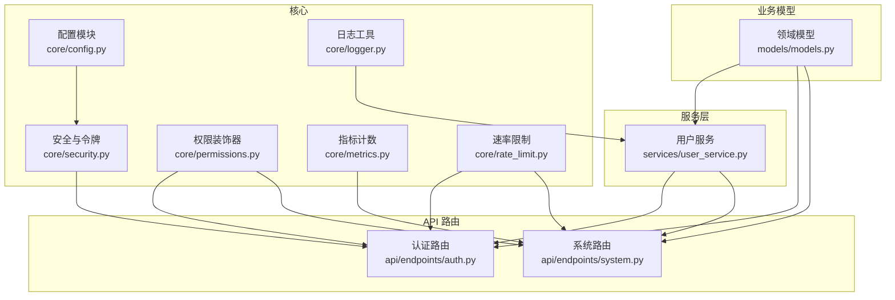
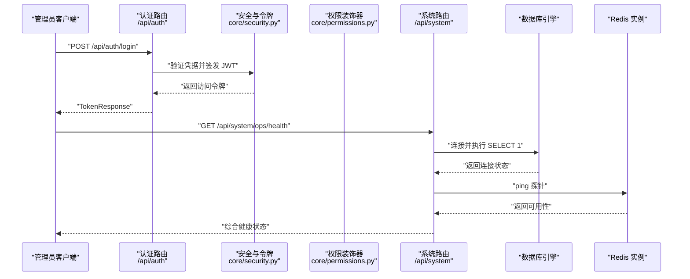
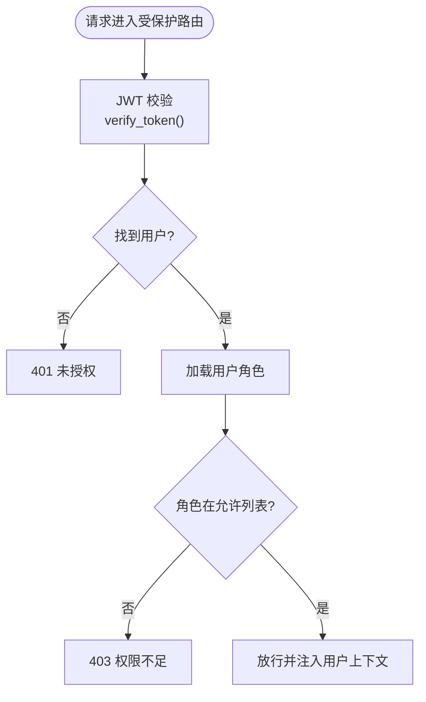
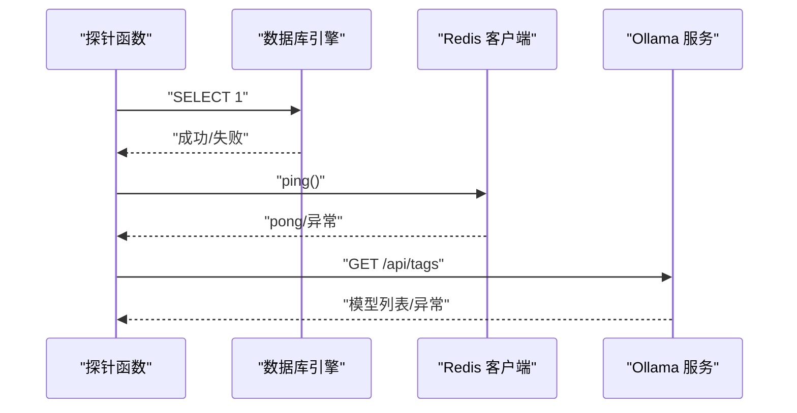
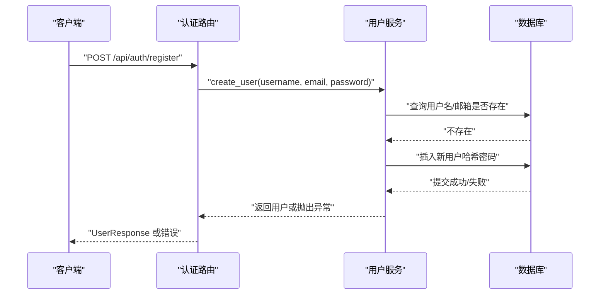
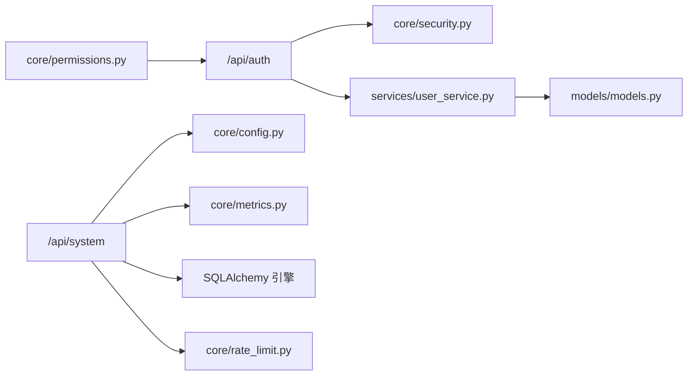

# 系统管理

<cite>
**本文引用的文件**
- [backend/app/main.py](file://backend/app/main.py)
- [backend/app/core/config.py](file://backend/app/core/config.py)
- [backend/app/core/security.py](file://backend/app/core/security.py)
- [backend/app/core/permissions.py](file://backend/app/core/permissions.py)
- [backend/app/api/endpoints/system.py](file://backend/app/api/endpoints/system.py)
- [backend/app/models/models.py](file://backend/app/models/models.py)
- [backend/app/services/user_service.py](file://backend/app/services/user_service.py)
- [backend/app/api/endpoints/auth.py](file://backend/app/api/endpoints/auth.py)
- [backend/app/core/logger.py](file://backend/app/core/logger.py)
- [backend/app/core/metrics.py](file://backend/app/core/metrics.py)
- [backend/app/core/rate_limit.py](file://backend/app/core/rate_limit.py)
- [backend/scripts/backup_db.sh](file://backend/scripts/backup_db.sh)
- [backend/scripts/restore_db.sh](file://backend/scripts/restore_db.sh)
- [backend/app/rules/sync/db_sync.py](file://backend/app/rules/sync/db_sync.py)
- [backend/app/rule/local/douyin.yaml](file://backend/app/rules/local/douyin.yaml)
- [backend/app/rule/local/xiaohongshu.yaml](file://backend/app/rules/local/xiaohongshu.yaml)
- [backend/app/rule/local/xianyu.yaml](file://backend/app/rules/local/xianyu.yaml)
- [backend/app/rule/local/zhihu.yaml](file://backend/app/rules/local/zhihu.yaml)
</cite>

## 目录
1. [简介](#简介)
2. [项目结构](#项目结构)
3. [核心组件](#核心组件)
4. [架构总览](#架构总览)
5. [详细组件分析](#详细组件分析)
6. [依赖分析](#依赖分析)
7. [性能考虑](#性能考虑)
8. [故障排除指南](#故障排除指南)
9. [结论](#结论)
10. [附录](#附录)

## 简介
本操作文档面向“智获客”系统管理功能，围绕以下目标展开：  
- 用户权限管理：角色定义、权限分配与访问控制  
- 系统配置管理：运行参数与环境变量的设置与校验  
- 监控告警：健康检查、依赖探针与运行状态观测  
- 日志管理：日志采集、存储与分析建议  
- 维护与排障：最佳实践与常见问题处理  
- 备份恢复与迁移：策略与脚本现状说明  
- 性能调优、容量规划与安全加固  

## 项目结构
后端采用 FastAPI + SQLAlchemy 架构，系统管理相关能力主要集中在核心配置、安全与权限、系统健康检查、指标与速率限制等模块，并通过 API 路由暴露管理能力。

图表来源
- [backend/app/core/config.py:15-103](file://backend/app/core/config.py#L15-L103)
- [backend/app/core/security.py:18-57](file://backend/app/core/security.py#L18-L57)
- [backend/app/core/permissions.py:9-30](file://backend/app/core/permissions.py#L9-L30)
- [backend/app/core/logger.py:4-6](file://backend/app/core/logger.py#L4-L6)
- [backend/app/core/metrics.py:36-44](file://backend/app/core/metrics.py#L36-L44)
- [backend/app/core/rate_limit.py:75-108](file://backend/app/core/rate_limit.py#L75-L108)
- [backend/app/models/models.py:8-27](file://backend/app/models/models.py#L8-L27)
- [backend/app/services/user_service.py:24-177](file://backend/app/services/user_service.py#L24-L177)
- [backend/app/api/endpoints/auth.py:27-280](file://backend/app/api/endpoints/auth.py#L27-L280)
- [backend/app/api/endpoints/system.py:18-171](file://backend/app/api/endpoints/system.py#L18-L171)

章节来源
- [backend/app/main.py:1-4](file://backend/app/main.py#L1-L4)
- [backend/app/core/config.py:15-103](file://backend/app/core/config.py#L15-L103)

## 核心组件
- 配置中心：集中管理数据库、JWT、CORS、AI 模型、Redis、上传、WeCom、浏览器采集器等参数，并对敏感参数进行校验与约束。  
- 安全与令牌：密码哈希、JWT 签发与校验、Bearer 授权方案。  
- 权限控制：基于角色的访问控制（RBAC）装饰器，支持在路由层声明所需角色。  
- 用户服务：用户创建、认证、序列一致性修复与启动健康检查。  
- 系统健康：数据库、Redis、本地大模型服务探针，统一健康与就绪检查接口。  
- 指标与日志：用户序列修复计数快照、通用日志获取器。  
- 速率限制：内存滑动窗口与 Redis 固定窗口双通道，支持分布式降级。  
- 规则体系：本地规则文件与数据库规则同步接口（占位）。  

章节来源
- [backend/app/core/config.py:15-103](file://backend/app/core/config.py#L15-L103)
- [backend/app/core/security.py:18-57](file://backend/app/core/security.py#L18-L57)
- [backend/app/core/permissions.py:9-30](file://backend/app/core/permissions.py#L9-L30)
- [backend/app/services/user_service.py:24-177](file://backend/app/services/user_service.py#L24-L177)
- [backend/app/api/endpoints/system.py:18-171](file://backend/app/api/endpoints/system.py#L18-L171)
- [backend/app/core/metrics.py:36-44](file://backend/app/core/metrics.py#L36-L44)
- [backend/app/core/logger.py:4-6](file://backend/app/core/logger.py#L4-L6)
- [backend/app/core/rate_limit.py:75-108](file://backend/app/core/rate_limit.py#L75-L108)
- [backend/app/rules/sync/db_sync.py:1-3](file://backend/app/rules/sync/db_sync.py#L1-L3)

## 架构总览
系统管理能力通过 API 路由对外提供，内部依赖配置、安全、权限、模型与服务层协同工作。下图展示关键交互：

图表来源
- [backend/app/api/endpoints/auth.py:107-112](file://backend/app/api/endpoints/auth.py#L107-L112)
- [backend/app/core/security.py:28-39](file://backend/app/core/security.py#L28-L39)
- [backend/app/api/endpoints/system.py:134-171](file://backend/app/api/endpoints/system.py#L134-L171)

## 详细组件分析

### 用户权限管理
- 角色定义与分配  
  - 用户模型包含角色字段，默认值为“operator”，可通过管理接口更新。  
  - 权限装饰器支持在路由层声明所需角色，若当前用户角色不在允许列表，则拒绝访问。  
- 访问控制流程  
  - 所有受保护路由通过 JWT 校验获取当前用户信息，再根据角色判定授权。  
  - 支持企业微信 OAuth 绑定与登录，便于组织化身份接入。  

图表来源
- [backend/app/core/permissions.py:9-30](file://backend/app/core/permissions.py#L9-L30)
- [backend/app/core/security.py:42-57](file://backend/app/core/security.py#L42-L57)
- [backend/app/models/models.py:8-27](file://backend/app/models/models.py#L8-L27)

章节来源
- [backend/app/core/permissions.py:9-30](file://backend/app/core/permissions.py#L9-L30)
- [backend/app/models/models.py:8-27](file://backend/app/models/models.py#L8-L27)
- [backend/app/api/endpoints/auth.py:257-280](file://backend/app/api/endpoints/auth.py#L257-L280)

### 系统配置管理
- 配置项分类与要点  
  - 项目与调试：API 名称、版本、调试开关  
  - 数据库：主机、端口、凭据、自动建表、启动序列健康检查  
  - JWT：密钥、算法、过期时间、移动端 H5 票据过期  
  - 企业微信：CorpId、AgentId、AgentSecret、OAuth 作用域  
  - CORS：生产环境禁止通配符  
  - AI 模型：本地 Ollama 与云端模型开关及限流参数  
  - Redis：分布式限流开关、连接串、键前缀  
  - 文件上传：最大尺寸、存储目录  
  - WeCom 机器人回调：Webhook 地址  
  - 浏览器采集器：基础地址与超时  
- 参数校验与约束  
  - 强制替换默认密钥，长度不少于 32 字符  
  - 生产环境 CORS 白名单禁止使用通配符  
- 使用方式  
  - 通过 .env 文件注入，运行时读取并实例化 Settings 单例  
  - 各模块按需读取配置，如健康检查、速率限制、AI 模型等  

章节来源
- [backend/app/core/config.py:15-103](file://backend/app/core/config.py#L15-L103)

### 监控与告警
- 健康检查接口  
  - 运维健康：/api/system/ops/health，包含数据库、Redis、Ollama 探针与总体状态  
  - 就绪检查：/api/system/ops/readiness，仅在必需依赖就绪时返回 200  
- 依赖探针  
  - 数据库：连接测试与耗时统计  
  - Redis：启用状态、可用性、连接串、超时探测  
  - Ollama：基础地址、模型列表、目标模型存在性  
- 运行时信息  
  - 返回调试模式、数据库主机/名称、是否使用云端模型、是否启用 Redis 限流等  
- 建议  
  - 结合外部监控系统（如 Prometheus/Grafana/PagerDuty）订阅健康与就绪端点，设置告警阈值与通知策略  

图表来源
- [backend/app/api/endpoints/system.py:39-132](file://backend/app/api/endpoints/system.py#L39-L132)

章节来源
- [backend/app/api/endpoints/system.py:18-171](file://backend/app/api/endpoints/system.py#L18-L171)

### 日志管理
- 日志获取器  
  - 提供按模块名获取 Logger 的统一入口，便于在服务层与路由层使用  
- 日志采集与存储  
  - 建议结合应用容器标准输出与系统日志服务（如 systemd-journald、rsyslog）进行采集  
  - 存储可采用集中式日志平台（如 ELK/EFK 或云原生日志服务）  
- 日志分析  
  - 建议对用户序列修复、认证失败、健康检查异常等关键事件建立指标与告警  
  - 使用结构化日志字段（如 event、constraint、user_id）便于检索与聚合  

章节来源
- [backend/app/core/logger.py:4-6](file://backend/app/core/logger.py#L4-L6)

### 用户与会话管理
- 用户创建与认证  
  - 创建用户：去重检查、密码哈希、提交事务  
  - 认证用户：用户名查找、密码校验  
- 序列一致性与启动健康检查  
  - 启动时尝试对齐 PostgreSQL users.id 序列，避免主键冲突  
  - 注册过程中如遇序列冲突，自动尝试修复并重试一次  
- 移动端 H5 票据  
  - 签发短期票据用于移动端引导认证，随后兑换为常规 Bearer 令牌  
- 企业微信集成  
  - 提供 OAuth 配置查询、回调换码、用户绑定接口，支持组织化登录  

图表来源
- [backend/app/api/endpoints/auth.py:95-104](file://backend/app/api/endpoints/auth.py#L95-L104)
- [backend/app/services/user_service.py:61-153](file://backend/app/services/user_service.py#L61-L153)

章节来源
- [backend/app/services/user_service.py:24-177](file://backend/app/services/user_service.py#L24-L177)
- [backend/app/api/endpoints/auth.py:95-179](file://backend/app/api/endpoints/auth.py#L95-L179)

### 速率限制与安全
- 速率限制策略  
  - 内存滑动窗口：适用于单进程部署  
  - Redis 固定窗口：分布式部署首选，支持降级回退到内存限流  
- 配置与使用  
  - 通过配置开关与参数控制是否启用 Redis 限流、键前缀、窗口大小  
  - 在需要防护的接口中调用限流器进行检查，超限返回 429  
- 安全加固建议  
  - 强制使用 HTTPS 传输，严格限制 CORS 源  
  - 定期轮换 SECRET_KEY，确保长度与强度  
  - 对敏感接口启用速率限制与 IP 黑名单策略  

章节来源
- [backend/app/core/rate_limit.py:75-108](file://backend/app/core/rate_limit.py#L75-L108)
- [backend/app/core/config.py:86-90](file://backend/app/core/config.py#L86-L90)

### 规则与内容生成边界
- 本地规则  
  - 平台化规则文件（抖音、小红书、闲鱼、知乎）用于生成边界约束与提示词模板  
- 数据库存同步  
  - 规则同步接口目前为占位实现，后续可扩展为从数据库动态加载与热更新  

章节来源
- [backend/app/rules/sync/db_sync.py:1-3](file://backend/app/rules/sync/db_sync.py#L1-L3)
- [backend/app/rule/local/douyin.yaml](file://backend/app/rules/local/douyin.yaml)
- [backend/app/rule/local/xiaohongshu.yaml](file://backend/app/rules/local/xiaohongshu.yaml)
- [backend/app/rule/local/xianyu.yaml](file://backend/app/rules/local/xianyu.yaml)
- [backend/app/rule/local/zhihu.yaml](file://backend/app/rules/local/zhihu.yaml)

## 依赖分析
- 组件耦合  
  - 权限装饰器依赖安全模块与数据库会话，路由层通过依赖注入获取当前用户  
  - 系统健康检查依赖数据库引擎与 Redis 客户端，同时读取配置决定探针行为  
  - 用户服务依赖模型与错误分类器，负责注册与认证逻辑  
- 外部依赖  
  - Redis：用于分布式限流与可选的健康探针  
  - Ollama：本地大模型服务，健康检查会拉取模型列表  
  - 企业微信：OAuth 与用户信息接口，用于组织化登录与绑定  
- 潜在风险  
  - 生产环境 CORS 通配符禁用，避免跨站风险  
  - SECRET_KEY 必须强且不可硬编码，防止令牌伪造  

图表来源
- [backend/app/api/endpoints/auth.py:27-280](file://backend/app/api/endpoints/auth.py#L27-L280)
- [backend/app/api/endpoints/system.py:18-171](file://backend/app/api/endpoints/system.py#L18-L171)
- [backend/app/core/security.py:18-57](file://backend/app/core/security.py#L18-L57)
- [backend/app/core/permissions.py:9-30](file://backend/app/core/permissions.py#L9-L30)
- [backend/app/core/metrics.py:36-44](file://backend/app/core/metrics.py#L36-L44)
- [backend/app/services/user_service.py:24-177](file://backend/app/services/user_service.py#L24-L177)
- [backend/app/models/models.py:8-27](file://backend/app/models/models.py#L8-L27)

## 性能考虑
- 数据库性能  
  - 合理设置连接池与索引，关注 users.id 序列一致性，避免主键冲突导致的回滚与重试  
  - 对高频查询字段建立索引，如用户唯一标识、内容资产平台与状态等  
- 缓存与限流  
  - 启用 Redis 限流以降低突发流量对下游的影响  
  - 对企业微信 Token 做本地内存缓存，减少重复请求  
- 大模型与 AI 推理  
  - 控制并发与速率，避免 Ollama 或云端模型成为瓶颈  
  - 合理设置模型与提示词，减少无效重试  
- 监控与可观测性  
  - 健康检查与就绪检查作为负载均衡前置过滤  
  - 指标埋点覆盖关键路径，结合告警系统快速响应异常  

## 故障排除指南
- 常见问题与处理  
  - JWT 密钥无效或过短：检查 .env 中 SECRET_KEY 是否已替换且长度≥32  
  - CORS 配置错误（生产环境）：确保 CORS_ORIGINS 不包含通配符  
  - Redis 限流不可用：确认 USE_REDIS_RATE_LIMIT 开启且 Redis 可达  
  - 数据库连接失败：检查 DATABASE_URL 与网络连通性  
  - 企业微信 OAuth 失败：核对 CorpId/AgentId/AgentSecret，确认回调地址正确  
  - 注册失败（序列冲突）：系统会自动尝试修复序列并重试一次，若仍失败需手动检查序列状态  
- 排查步骤  
  - 使用 /api/system/ops/health 与 /api/system/ops/readiness 快速定位依赖问题  
  - 查看应用日志，关注用户序列修复、认证失败、探针异常等事件  
  - 结合指标面板观察请求量、错误率与延迟趋势  

章节来源
- [backend/app/core/config.py:55-69](file://backend/app/core/config.py#L55-L69)
- [backend/app/api/endpoints/system.py:134-171](file://backend/app/api/endpoints/system.py#L134-L171)
- [backend/app/services/user_service.py:101-153](file://backend/app/services/user_service.py#L101-L153)

## 结论
本系统通过集中配置、统一安全与权限、健康检查与速率限制等机制，提供了完善的系统管理能力。建议在生产环境中严格遵循安全基线与运维规范，结合监控告警与日志分析，持续优化性能与稳定性。

## 附录

### 备份与恢复
- 当前脚本  
  - 备份脚本与恢复脚本为占位实现，尚未包含具体命令  
- 建议策略  
  - 数据库：使用官方工具进行逻辑/物理备份，定期验证恢复流程  
  - 配置与密钥：纳入版本管理或安全密钥管理系统，避免明文泄露  
  - 自动化：将备份纳入 CI/CD 流水线，设置保留周期与归档策略  
- 迁移方案  
  - 评估停机窗口与数据量，采用在线迁移或分批迁移策略  
  - 迁移前后进行数据一致性校验与功能回归测试  

章节来源
- [backend/scripts/backup_db.sh:1-4](file://backend/scripts/backup_db.sh#L1-L4)
- [backend/scripts/restore_db.sh:1-4](file://backend/scripts/restore_db.sh#L1-L4)