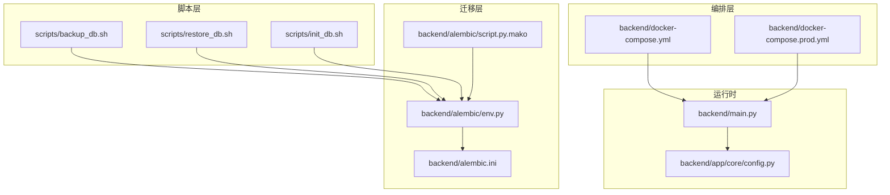
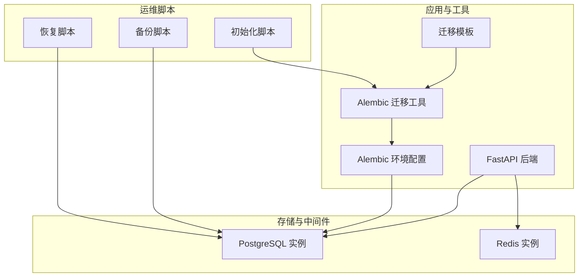
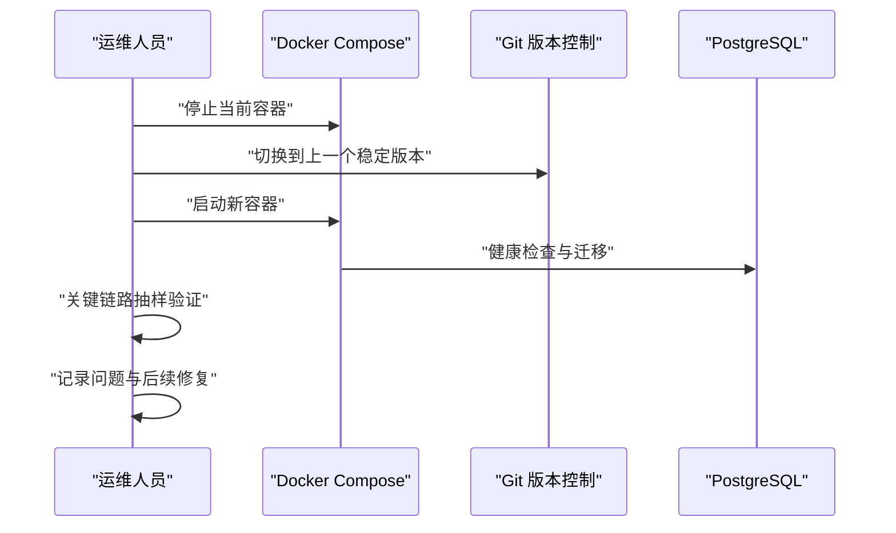
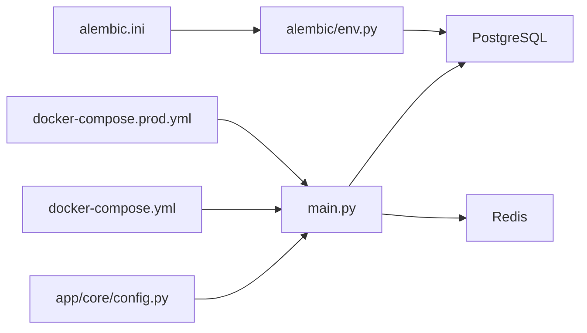

# 系统维护与备份

<cite>
**本文引用的文件**
- [scripts/backup_db.sh](file://scripts/backup_db.sh)
- [scripts/restore_db.sh](file://scripts/restore_db.sh)
- [scripts/init_db.sh](file://scripts/init_db.sh)
- [backend/alembic/env.py](file://backend/alembic/env.py)
- [backend/alembic/script.py.mako](file://backend/alembic/script.py.mako)
- [backend/alembic.ini](file://backend/alembic.ini)
- [backend/docker-compose.yml](file://backend/docker-compose.yml)
- [backend/docker-compose.prod.yml](file://backend/docker-compose.prod.yml)
- [backend/main.py](file://backend/main.py)
- [backend/app/core/config.py](file://backend/app/core/config.py)
- [docs/deploy/rollback-guide.md](file://docs/deploy/rollback-guide.md)
- [docs/operations/maintenance-checklist.md](file://docs/operations/maintenance-checklist.md)
- [docs/operations/incident-playbook.md](file://docs/operations/incident-playbook.md)
</cite>

## 目录
1. [简介](#简介)
2. [项目结构](#项目结构)
3. [核心组件](#核心组件)
4. [架构总览](#架构总览)
5. [详细组件分析](#详细组件分析)
6. [依赖分析](#依赖分析)
7. [性能考虑](#性能考虑)
8. [故障排查指南](#故障排查指南)
9. [结论](#结论)
10. [附录](#附录)

## 简介
本操作手册面向智获客系统的运维与开发团队，围绕数据库备份与恢复、数据恢复点选择、系统升级与回滚、定期维护任务、性能优化与容量规划、数据迁移与版本升级、灾难恢复预案与紧急处理程序、以及维护窗口规划与影响评估方法进行系统化说明。仓库中已提供数据库迁移工具与容器编排配置，但备份与恢复脚本处于待实现状态，需结合生产环境安全策略补充完善。

## 项目结构
- 备份与恢复脚本位于 scripts 目录，当前为占位实现，需按生产规范补充。
- 数据库迁移由 Alembic 提供，配置位于 backend/alembic，包含迁移上下文、模板与配置文件。
- 应用通过 FastAPI 提供健康检查等运维接口，容器编排在 docker-compose 中定义开发与生产环境。
- 运维与发布相关文档位于 docs 目录，包括回滚手册、运维检查清单与应急手册。

图表来源
- [scripts/backup_db.sh:1-4](file://scripts/backup_db.sh#L1-L4)
- [scripts/restore_db.sh:1-4](file://scripts/restore_db.sh#L1-L4)
- [scripts/init_db.sh:1-5](file://scripts/init_db.sh#L1-L5)
- [backend/alembic/env.py:1-88](file://backend/alembic/env.py#L1-L88)
- [backend/alembic/script.py.mako:1-25](file://backend/alembic/script.py.mako#L1-L25)
- [backend/alembic.ini:1-43](file://backend/alembic.ini#L1-L43)
- [backend/main.py:1-138](file://backend/main.py#L1-L138)
- [backend/app/core/config.py:1-103](file://backend/app/core/config.py#L1-L103)
- [backend/docker-compose.yml:1-67](file://backend/docker-compose.yml#L1-L67)
- [backend/docker-compose.prod.yml:1-112](file://backend/docker-compose.prod.yml#L1-L112)

章节来源
- [backend/docker-compose.yml:1-67](file://backend/docker-compose.yml#L1-L67)
- [backend/docker-compose.prod.yml:1-112](file://backend/docker-compose.prod.yml#L1-L112)
- [backend/alembic/env.py:1-88](file://backend/alembic/env.py#L1-L88)
- [backend/alembic/script.py.mako:1-25](file://backend/alembic/script.py.mako#L1-L25)
- [backend/alembic.ini:1-43](file://backend/alembic.ini#L1-L43)
- [backend/main.py:1-138](file://backend/main.py#L1-L138)
- [backend/app/core/config.py:1-103](file://backend/app/core/config.py#L1-L103)

## 核心组件
- 数据库迁移与版本控制：Alembic 提供迁移上下文、模板与配置，支持离线与在线迁移模式，并从环境变量读取数据库连接。
- 应用健康检查与静态资源：FastAPI 提供 /health 接口与前端静态资源挂载，便于运维检查与发布验证。
- 容器编排：开发与生产环境分别通过 docker-compose.yml 与 docker-compose.prod.yml 管理数据库、后端、Redis、Ollama 等服务。
- 运维脚本：init_db.sh 用于初始化数据库，backup_db.sh 与 restore_db.sh 当前为占位，需补充生产级实现。

章节来源
- [backend/alembic/env.py:37-88](file://backend/alembic/env.py#L37-L88)
- [backend/alembic/script.py.mako:19-25](file://backend/alembic/script.py.mako#L19-L25)
- [backend/alembic.ini:5-6](file://backend/alembic.ini#L5-L6)
- [backend/main.py:71-77](file://backend/main.py#L71-L77)
- [backend/docker-compose.yml:1-67](file://backend/docker-compose.yml#L1-L67)
- [backend/docker-compose.prod.yml:1-112](file://backend/docker-compose.prod.yml#L1-L112)
- [scripts/init_db.sh:1-5](file://scripts/init_db.sh#L1-L5)
- [scripts/backup_db.sh:1-4](file://scripts/backup_db.sh#L1-L4)
- [scripts/restore_db.sh:1-4](file://scripts/restore_db.sh#L1-L4)

## 架构总览
下图展示数据库、后端、Redis、Ollama 与迁移工具之间的交互关系，以及运维脚本与迁移配置的衔接。

图表来源
- [backend/alembic/env.py:37-88](file://backend/alembic/env.py#L37-L88)
- [backend/alembic/script.py.mako:1-25](file://backend/alembic/script.py.mako#L1-L25)
- [backend/docker-compose.yml:4-58](file://backend/docker-compose.yml#L4-L58)
- [backend/docker-compose.prod.yml:9-107](file://backend/docker-compose.prod.yml#L9-L107)
- [scripts/backup_db.sh:1-4](file://scripts/backup_db.sh#L1-L4)
- [scripts/restore_db.sh:1-4](file://scripts/restore_db.sh#L1-L4)
- [scripts/init_db.sh:1-5](file://scripts/init_db.sh#L1-L5)

## 详细组件分析

### 数据库备份策略与脚本使用
- 现状：备份脚本为占位实现，尚未接入具体备份命令与参数。
- 建议策略
  - 全量备份：基于容器卷快照或逻辑导出（如 pg_dump），建议保留多版本并加密传输至对象存储。
  - 增量/差异备份：结合 WAL 归档与时间点恢复（PITR），确保可恢复到分钟级粒度。
  - 策略参数：备份保留周期、压缩级别、校验与完整性检查、异地容灾与传输加密。
- 脚本扩展要点
  - 读取 DATABASE_URL 或 alembic.ini 中的 sqlalchemy.url。
  - 支持自定义备份目录、命名规则与清理策略。
  - 输出标准化日志与退出码，便于自动化调度与告警。
- 恢复点选择
  - 结合业务低峰时段与备份窗口，优先选择整点全量+最近增量的组合。
  - 恢复前进行预检查（表空间、权限、版本兼容性）。

章节来源
- [scripts/backup_db.sh:1-4](file://scripts/backup_db.sh#L1-L4)
- [backend/alembic.ini:5-6](file://backend/alembic.ini#L5-L6)
- [backend/app/core/config.py:28-34](file://backend/app/core/config.py#L28-L34)

### 数据恢复流程与恢复点选择
- 恢复流程
  - 评估故障类型与影响范围，确认是否需要回滚数据库或仅回滚应用。
  - 若涉及数据库回滚，优先执行 alembic downgrade（仅在可逆且经评估后）。
  - 使用备份脚本生成的备份进行恢复，完成后进行一致性校验与关键路径验证。
- 恢复点选择
  - 以“可接受的数据丢失窗口”为上限，结合备份频率与 WAL 归档情况确定目标时间点。
  - 对于结构变更导致的不兼容，优先采用“应用回滚 + 数据库不变”的策略。

章节来源
- [docs/deploy/rollback-guide.md:31-35](file://docs/deploy/rollback-guide.md#L31-L35)
- [scripts/restore_db.sh:1-4](file://scripts/restore_db.sh#L1-L4)
- [backend/alembic/env.py:37-44](file://backend/alembic/env.py#L37-L44)

### 系统升级与回滚操作步骤
- 升级步骤
  - 准备阶段：冻结写入、备份数据库、准备回滚镜像与代码版本。
  - 执行阶段：停止当前容器、拉取新镜像/代码、启动服务、健康检查。
  - 验证阶段：关键链路抽样测试、日志与监控观察。
- 回滚步骤
  - 确认触发条件（健康检查失败、核心链路不可用、错误率升高）。
  - 停止当前容器，切换到上一个稳定版本并启动。
  - 回滚后进行健康检查与关键链路抽样，补齐问题记录与后续修复计划。
- 数据回滚原则
  - 默认先回滚应用，不直接回滚数据库。
  - 仅在迁移明确可逆且经过评估时执行 alembic downgrade -1。
  - 涉及数据丢失风险时，先做备份再执行回退。

图表来源
- [docs/deploy/rollback-guide.md:11-29](file://docs/deploy/rollback-guide.md#L11-L29)

章节来源
- [docs/deploy/rollback-guide.md:1-49](file://docs/deploy/rollback-guide.md#L1-L49)

### 定期维护任务与最佳实践
- 维护任务清单
  - 数据库连接与表空间检查
  - Redis 连接与内存使用
  - 任务队列消费与积压
  - 日志与告警巡检
- 最佳实践
  - 将维护窗口固定在业务低峰时段，提前通知相关方。
  - 所有变更均需通过版本控制与最小化变更原则，配合自动化测试。
  - 对关键操作进行“双人复核”与“回滚预案”。

章节来源
- [docs/operations/maintenance-checklist.md:1-7](file://docs/operations/maintenance-checklist.md#L1-L7)

### 性能优化与容量规划
- 数据库层面
  - 索引与统计信息维护：定期分析与重建索引，保持统计信息新鲜。
  - 连接池与并发：根据峰值 QPS 调整连接数与超时参数。
  - 表分区与归档：对历史数据进行分区或归档，降低热数据规模。
- 缓存与中间件
  - Redis 内存优化与持久化策略（AOF/RDB），监控淘汰策略与命中率。
- 应用与网络
  - 合理设置请求超时与重试策略，避免级联故障。
  - 前端静态资源缓存与 CDN 加速。
- 容量规划
  - 基于历史增长曲线与业务预测，预留 30%-50% 的冗余。
  - 定期评估磁盘、CPU、内存与网络带宽的瓶颈。

### 数据迁移与版本升级流程
- 迁移流程
  - 在隔离环境中验证迁移脚本，确保可逆与幂等。
  - 通过 Alembic 执行迁移，记录迁移日志与版本号。
  - 迁移后进行数据一致性校验与性能回归测试。
- 版本升级
  - 采用蓝绿/滚动发布策略，逐步切换流量。
  - 升级前后对比关键指标（吞吐、延迟、错误率）。

章节来源
- [backend/alembic/env.py:47-88](file://backend/alembic/env.py#L47-L88)
- [backend/alembic/script.py.mako:19-25](file://backend/alembic/script.py.mako#L19-L25)

### 灾难恢复预案与紧急处理程序
- 预案内容
  - 明确触发条件（服务不可用、数据库不可达、大规模错误）。
  - 快速回滚流程与责任人分工。
  - 数据备份与恢复通道、异地灾备与切换演练。
- 紧急处理
  - 立即确认服务可用性与数据库连通性。
  - 查看后端日志与监控，定位根因。
  - 执行回滚或切换策略，同时补齐问题记录与改进项。

章节来源
- [docs/operations/incident-playbook.md:1-7](file://docs/operations/incident-playbook.md#L1-L7)
- [docs/deploy/rollback-guide.md:5-10](file://docs/deploy/rollback-guide.md#L5-L10)
- [backend/docker-compose.prod.yml:49-54](file://backend/docker-compose.prod.yml#L49-L54)

### 维护窗口规划与影响评估方法
- 窗口规划
  - 选择业务低峰时段，尽量避开节假日与促销活动。
  - 将变更拆分为小步快跑，减少单次窗口占用时间。
- 影响评估
  - 识别受影响的服务与用户范围，制定回滚与补偿方案。
  - 通过灰度发布与限流策略降低风险。

## 依赖分析
- 迁移工具与数据库连接
  - Alembic 通过 env.py 读取 DATABASE_URL 或 alembic.ini 中的 sqlalchemy.url，决定迁移目标。
  - env.py 同时加载模型元数据，确保迁移上下文完整。
- 应用与配置
  - FastAPI 应用通过 config.py 读取数据库连接与运行参数，/health 接口用于健康检查。
- 编排与服务发现
  - docker-compose 与 docker-compose.prod.yml 定义了数据库、后端、Redis、Ollama 的服务与依赖关系，确保健康检查与启动顺序。

图表来源
- [backend/app/core/config.py:28-34](file://backend/app/core/config.py#L28-L34)
- [backend/main.py:71-77](file://backend/main.py#L71-L77)
- [backend/alembic/env.py:37-44](file://backend/alembic/env.py#L37-L44)
- [backend/alembic.ini:5-6](file://backend/alembic.ini#L5-L6)
- [backend/docker-compose.yml:21-38](file://backend/docker-compose.yml#L21-L38)
- [backend/docker-compose.prod.yml:31-59](file://backend/docker-compose.prod.yml#L31-L59)

章节来源
- [backend/app/core/config.py:1-103](file://backend/app/core/config.py#L1-L103)
- [backend/main.py:1-138](file://backend/main.py#L1-L138)
- [backend/alembic/env.py:1-88](file://backend/alembic/env.py#L1-L88)
- [backend/alembic.ini:1-43](file://backend/alembic.ini#L1-L43)
- [backend/docker-compose.yml:1-67](file://backend/docker-compose.yml#L1-L67)
- [backend/docker-compose.prod.yml:1-112](file://backend/docker-compose.prod.yml#L1-L112)

## 性能考虑
- 数据库性能
  - 定期执行 ANALYZE 与索引维护，避免查询计划退化。
  - 控制长事务与锁竞争，必要时拆分热点表或引入只读副本。
- 缓存与限流
  - 合理设置 Redis 过期与淘汰策略，避免内存压力。
  - 使用分布式限流（Redis）保护下游系统。
- 应用与网络
  - 优化 API 路由与序列化，减少不必要的计算与 IO。
  - 启用连接复用与超时控制，避免资源泄露。

## 故障排查指南
- 健康检查
  - 通过 /health 接口快速判断后端服务状态。
- 数据库连通性
  - 检查 DATABASE_URL 与网络连通，确认容器健康检查状态。
- 日志与监控
  - 查看后端与数据库容器日志，关注错误堆栈与慢查询。
- 回滚与切换
  - 按回滚手册执行快速回滚，确认关键链路恢复后再逐步放量。

章节来源
- [backend/main.py:71-77](file://backend/main.py#L71-L77)
- [docs/deploy/rollback-guide.md:11-29](file://docs/deploy/rollback-guide.md#L11-L29)
- [docs/operations/incident-playbook.md:1-7](file://docs/operations/incident-playbook.md#L1-L7)

## 结论
本操作手册基于现有仓库中的迁移工具、容器编排与运维文档，给出了数据库备份与恢复、升级与回滚、定期维护、性能优化与容量规划、灾难恢复与紧急处理、以及维护窗口规划与影响评估的系统化方法。鉴于备份与恢复脚本尚处占位阶段，建议尽快结合生产安全策略补充实现，并建立完善的自动化与审计机制。

## 附录
- 初始化数据库
  - 通过 init_db.sh 调用后端初始化脚本，确保数据库表结构与种子数据就绪。
- 迁移执行
  - 使用 Alembic 在离线与在线模式下执行迁移，确保目标元数据一致。
- 健康检查
  - 通过 /health 接口与容器健康检查双重保障服务可用性。

章节来源
- [scripts/init_db.sh:1-5](file://scripts/init_db.sh#L1-L5)
- [backend/alembic/env.py:47-88](file://backend/alembic/env.py#L47-L88)
- [backend/main.py:71-77](file://backend/main.py#L71-L77)