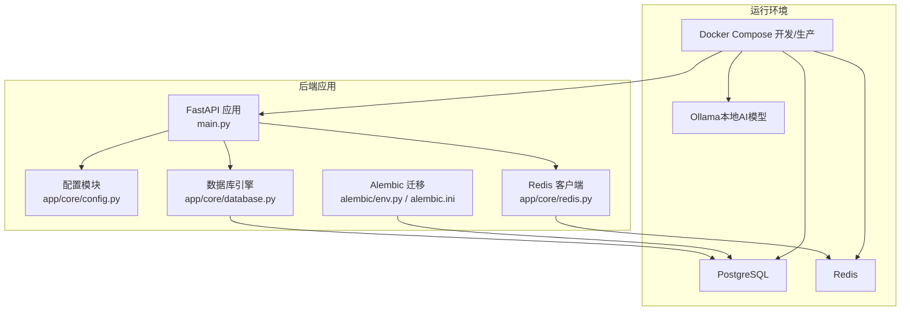
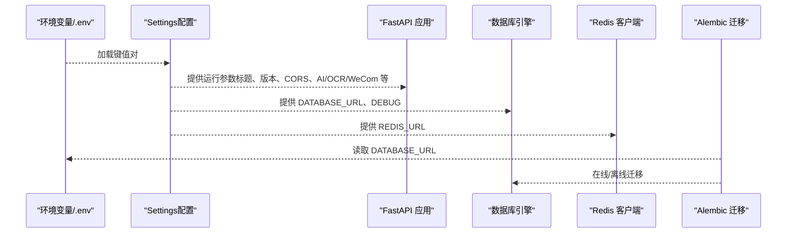
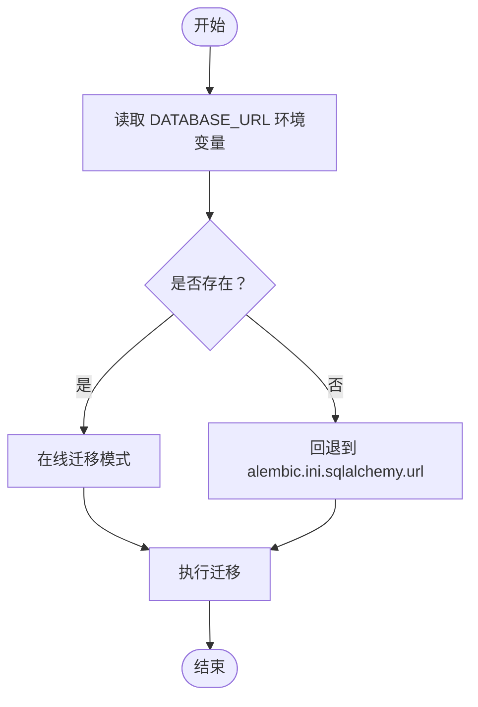
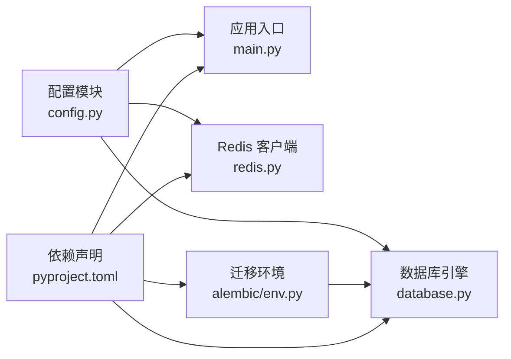

# 系统配置管理

<cite>
**本文引用的文件**
- [backend/app/core/config.py](file://backend/app/core/config.py)
- [backend/pyproject.toml](file://backend/pyproject.toml)
- [backend/alembic.ini](file://backend/alembic.ini)
- [backend/alembic/env.py](file://backend/alembic/env.py)
- [backend/docker-compose.yml](file://backend/docker-compose.yml)
- [backend/docker-compose.prod.yml](file://backend/docker-compose.prod.yml)
- [backend/main.py](file://backend/main.py)
- [backend/app/core/database.py](file://backend/app/core/database.py)
- [backend/app/core/redis.py](file://backend/app/core/redis.py)
- [docs/deploy/env-example.md](file://docs/deploy/env-example.md)
- [scripts/backup_db.sh](file://scripts/backup_db.sh)
- [scripts/restore_db.sh](file://scripts/restore_db.sh)
</cite>

## 目录
1. [简介](#简介)
2. [项目结构](#项目结构)
3. [核心组件](#核心组件)
4. [架构总览](#架构总览)
5. [详细组件分析](#详细组件分析)
6. [依赖关系分析](#依赖关系分析)
7. [性能考虑](#性能考虑)
8. [故障排查指南](#故障排查指南)
9. [结论](#结论)
10. [附录](#附录)

## 简介
本文件面向“智获客”系统的配置管理，覆盖数据库连接、Redis缓存、AI模型、企业微信集成、CORS、速率限制、文件上传、浏览器采集服务等配置项的含义与作用，解释环境变量设置方法与配置优先级，阐述数据库迁移配置与版本管理策略，提供配置备份与恢复方法，并说明开发、测试、生产环境的配置差异与切换方式。

## 项目结构
后端采用 FastAPI + SQLAlchemy + Alembic 架构，配置集中于 Pydantic Settings 的 Settings 类，通过 .env 文件加载，支持 Docker Compose 多环境编排。数据库迁移由 Alembic 管理，支持离线与在线两种模式。

图表来源
- [backend/main.py:46-65](file://backend/main.py#L46-L65)
- [backend/app/core/config.py:15-102](file://backend/app/core/config.py#L15-L102)
- [backend/app/core/database.py:6-13](file://backend/app/core/database.py#L6-L13)
- [backend/app/core/redis.py:6-7](file://backend/app/core/redis.py#L6-L7)
- [backend/alembic/env.py:37-87](file://backend/alembic/env.py#L37-L87)
- [backend/docker-compose.yml:24-38](file://backend/docker-compose.yml#L24-L38)
- [backend/docker-compose.prod.yml:37-53](file://backend/docker-compose.prod.yml#L37-L53)

章节来源
- [backend/main.py:46-65](file://backend/main.py#L46-L65)
- [backend/app/core/config.py:15-102](file://backend/app/core/config.py#L15-L102)
- [backend/app/core/database.py:6-13](file://backend/app/core/database.py#L6-L13)
- [backend/app/core/redis.py:6-7](file://backend/app/core/redis.py#L6-L7)
- [backend/alembic/env.py:37-87](file://backend/alembic/env.py#L37-L87)
- [backend/docker-compose.yml:24-38](file://backend/docker-compose.yml#L24-L38)
- [backend/docker-compose.prod.yml:37-53](file://backend/docker-compose.prod.yml#L37-L53)

## 核心组件
- 配置加载与校验：Settings 类统一定义并加载 .env 环境变量，内置字段校验（如密钥强度、CORS 白名单），并提供运行时实例 settings。
- 数据库连接：基于 SQLAlchemy 引擎配置，支持调试输出、连接池参数与预检查。
- Redis 缓存：基于 redis-py 客户端，从配置读取连接字符串。
- Alembic 迁移：支持从环境变量 DATABASE_URL 读取数据库地址，若缺失则回退到 alembic.ini 中的 sqlalchemy.url。
- Docker 编排：提供开发与生产两套 compose 文件，分别注入不同环境变量与健康检查策略。

章节来源
- [backend/app/core/config.py:15-102](file://backend/app/core/config.py#L15-L102)
- [backend/app/core/database.py:6-13](file://backend/app/core/database.py#L6-L13)
- [backend/app/core/redis.py:6-7](file://backend/app/core/redis.py#L6-L7)
- [backend/alembic/env.py:37-44](file://backend/alembic/env.py#L37-L44)
- [backend/docker-compose.yml:24-28](file://backend/docker-compose.yml#L24-L28)
- [backend/docker-compose.prod.yml:37-38](file://backend/docker-compose.prod.yml#L37-L38)

## 架构总览
下图展示配置在系统中的流向与依赖关系：

图表来源
- [backend/app/core/config.py:15-102](file://backend/app/core/config.py#L15-L102)
- [backend/main.py:46-65](file://backend/main.py#L46-L65)
- [backend/app/core/database.py:6-13](file://backend/app/core/database.py#L6-L13)
- [backend/app/core/redis.py:6-7](file://backend/app/core/redis.py#L6-L7)
- [backend/alembic/env.py:37-44](file://backend/alembic/env.py#L37-L44)

## 详细组件分析

### 配置参数与含义
- 项目信息
  - API_TITLE、API_VERSION：API 标题与版本，用于 OpenAPI 文档与健康检查返回。
  - DEBUG：开启调试模式，影响数据库引擎 echo 与热重载。
- 数据库
  - DATABASE_URL：完整数据库连接串，优先级高于分段字段。
  - DATABASE_HOST、DATABASE_PORT、DATABASE_USER、DATABASE_PASSWORD、DATABASE_NAME：分段字段，便于理解但最终以 DATABASE_URL 为准。
  - DB_AUTO_CREATE_TABLES：是否在启动时自动建表（谨慎启用）。
  - ENABLE_STARTUP_USER_SEQUENCE_HEALTHCHECK：启动时进行序列健康检查。
- 安全与认证
  - SECRET_KEY：JWT 密钥，必须为长度≥32且非默认占位值。
  - ALGORITHM：签名算法，默认 HS256。
  - ACCESS_TOKEN_EXPIRE_MINUTES：访问令牌过期时间（分钟）。
  - MOBILE_H5_TICKET_EXPIRE_MINUTES：移动端 H5 票据过期时间（分钟）。
- 企业微信集成（可选）
  - WECOM_CORP_ID、WECOM_AGENT_ID、WECOM_AGENT_SECRET：企业微信应用配置。
  - WECOM_OAUTH_SCOPE：授权范围（snsapi_base 或 snsapi_privateinfo）。
  - WECOM_WEBHOOK_URL：企业微信群机器人 Webhook 地址。
- 跨域（CORS）
  - CORS_ORIGINS：允许的来源列表，生产环境禁止包含通配符。
- AI 与火山引擎（OCR/内容分析）
  - OLLAMA_BASE_URL、OLLAMA_MODEL：本地 Ollama 接口与模型名。
  - USE_CLOUD_MODEL：是否使用云端模型（火山引擎）。
  - ARK_API_KEY、ARK_BASE_URL、ARK_MODEL、ARK_TIMEOUT_SECONDS：火山引擎 API 配置。
  - ARK_VISION_RATE_LIMIT_PER_MINUTE、ARK_VISION_RATE_LIMIT_WINDOW_SECONDS：视觉类接口限流。
  - INSIGHT_BATCH_ANALYZE_RATE_LIMIT_PER_MINUTE、INSIGHT_BATCH_ANALYZE_RATE_LIMIT_WINDOW_SECONDS：洞察批量分析限流。
- Redis 与速率限制
  - USE_REDIS_RATE_LIMIT：是否启用 Redis 分布式限流。
  - REDIS_URL：Redis 连接串。
  - RATE_LIMIT_KEY_PREFIX：限流键前缀。
- 文件上传
  - MAX_UPLOAD_SIZE：最大上传大小（字节）。
  - UPLOAD_DIR：上传目录路径。
- 浏览器采集服务
  - BROWSER_COLLECTOR_BASE_URL：采集服务地址。
  - BROWSER_COLLECTOR_TIMEOUT_SECONDS：请求超时（秒）。

章节来源
- [backend/app/core/config.py:22-101](file://backend/app/core/config.py#L22-L101)

### 环境变量设置与优先级
- 加载来源与顺序
  - .env 文件：默认从项目根目录加载，键名区分大小写，多余键会被忽略。
  - Docker 环境变量：compose 文件中通过 environment/env_file 注入，优先覆盖 .env。
  - 系统环境变量：容器启动时传入，进一步覆盖 .env。
- 关键变量
  - DATABASE_URL：数据库连接串，Alembic 与应用均依赖此变量。
  - REDIS_URL：Redis 连接串。
  - SECRET_KEY：必须设置为强密钥，否则校验失败。
  - ARK_API_KEY：火山引擎 API 密钥（可选，未配置时 OAuth 入口会降级）。
- 示例参考
  - 参考部署文档中的环境变量示例文件，补充必要变量。

章节来源
- [backend/app/core/config.py:16-20](file://backend/app/core/config.py#L16-L20)
- [backend/docker-compose.yml:24-28](file://backend/docker-compose.yml#L24-L28)
- [backend/docker-compose.prod.yml:37-38](file://backend/docker-compose.prod.yml#L37-L38)
- [docs/deploy/env-example.md:3-8](file://docs/deploy/env-example.md#L3-L8)

### 配置校验规则
- 密钥校验
  - 不得使用默认占位值集合中的任意一个。
  - 长度不得少于 32 个字符。
- CORS 校验
  - 生产环境禁止包含通配符来源。
- 模型与 OCR 校验
  - 若未配置火山引擎密钥，则 OAuth 入口自动隐藏，降级为短票据模式。

章节来源
- [backend/app/core/config.py:55-69](file://backend/app/core/config.py#L55-L69)

### 数据库迁移配置与版本管理
- Alembic 配置
  - 默认从 alembic.ini 读取 sqlalchemy.url，仅用于本地调试。
  - 生产与容器化环境建议通过 DATABASE_URL 环境变量驱动。
- 迁移流程
  - 离线模式：直接生成迁移脚本并绑定目标元数据。
  - 在线模式：动态注入数据库连接串，建立连接后执行迁移。
- 版本策略
  - 版本文件位于 alembic/versions 下，按时间戳命名，确保可追溯与幂等。
  - 运行前确保数据库已可达，避免迁移失败。

图表来源
- [backend/alembic/env.py:37-44](file://backend/alembic/env.py#L37-L44)
- [backend/alembic/env.py:62-81](file://backend/alembic/env.py#L62-L81)
- [backend/alembic.ini:5-6](file://backend/alembic.ini#L5-L6)

章节来源
- [backend/alembic/env.py:37-87](file://backend/alembic/env.py#L37-L87)
- [backend/alembic.ini:5-6](file://backend/alembic.ini#L5-L6)

### 配置热更新机制
- 当前实现
  - 应用启动时一次性读取配置并进行校验，随后常驻内存。
  - 未实现运行时动态刷新配置的能力。
- 建议
  - 如需热更新，可在应用层增加配置变更监听与缓存刷新逻辑，或通过外部配置中心推送变更事件触发重启/重载。

章节来源
- [backend/app/core/config.py:16-20](file://backend/app/core/config.py#L16-L20)
- [backend/main.py:22-35](file://backend/main.py#L22-L35)

### 配置备份与恢复
- 备份脚本
  - 已提供脚本入口，当前为占位实现，尚未具体实现备份逻辑。
- 恢复脚本
  - 已提供脚本入口，当前为占位实现，尚未具体实现恢复逻辑。
- 建议
  - 备份：结合数据库导出工具与对象存储，定期导出数据库快照与配置文件。
  - 恢复：在新环境中导入数据库快照，恢复 .env 与容器环境变量，重新部署。

章节来源
- [scripts/backup_db.sh:1-4](file://scripts/backup_db.sh#L1-L4)
- [scripts/restore_db.sh:1-4](file://scripts/restore_db.sh#L1-L4)

### 环境差异与切换
- 开发环境（docker-compose.yml）
  - 默认注入 DATABASE_URL、REDIS_URL、SECRET_KEY、DEBUG 等。
  - 启动后端服务时启用热重载（DEBUG=true）。
- 生产环境（docker-compose.prod.yml）
  - 通过 .env 文件注入关键变量，严格要求数据库密码等敏感变量必须设置。
  - 启用健康检查与日志轮转，提升稳定性与可观测性。
- 切换方法
  - 使用不同的 compose 文件启动：开发使用 docker-compose.yml，生产使用 docker-compose.prod.yml。
  - 通过环境变量覆盖 .env 中的默认值，满足多环境差异化需求。

章节来源
- [backend/docker-compose.yml:24-38](file://backend/docker-compose.yml#L24-L38)
- [backend/docker-compose.prod.yml:37-53](file://backend/docker-compose.prod.yml#L37-L53)

## 依赖关系分析
- 组件耦合
  - main.py 依赖配置模块提供运行参数，依赖数据库模块建立引擎，依赖 Redis 模块获取客户端。
  - Alembic env.py 依赖配置模块的元数据与模型注册，同时从环境变量读取数据库连接串。
- 外部依赖
  - Python 依赖通过 pyproject.toml 管理，包含 FastAPI、SQLAlchemy、Alembic、Pydantic Settings、Redis、Ollama 等。
- 潜在风险
  - 配置校验失败会导致启动阶段即刻报错，避免错误配置进入运行态。
  - 生产环境未正确设置 DATABASE_URL 或敏感变量，可能导致迁移与服务启动失败。

图表来源
- [backend/app/core/config.py:15-102](file://backend/app/core/config.py#L15-L102)
- [backend/main.py:46-65](file://backend/main.py#L46-L65)
- [backend/app/core/database.py:6-13](file://backend/app/core/database.py#L6-L13)
- [backend/app/core/redis.py:6-7](file://backend/app/core/redis.py#L6-L7)
- [backend/alembic/env.py:30-34](file://backend/alembic/env.py#L30-L34)
- [backend/pyproject.toml:7-31](file://backend/pyproject.toml#L7-L31)

章节来源
- [backend/app/core/config.py:15-102](file://backend/app/core/config.py#L15-L102)
- [backend/main.py:46-65](file://backend/main.py#L46-L65)
- [backend/app/core/database.py:6-13](file://backend/app/core/database.py#L6-L13)
- [backend/app/core/redis.py:6-7](file://backend/app/core/redis.py#L6-L7)
- [backend/alembic/env.py:30-34](file://backend/alembic/env.py#L30-L34)
- [backend/pyproject.toml:7-31](file://backend/pyproject.toml#L7-L31)

## 性能考虑
- 数据库连接池
  - 连接池大小与溢出量已在数据库引擎中设定，可根据并发与资源情况调整。
- 速率限制
  - Redis 限流可有效控制突发流量，建议结合业务峰值合理配置限流窗口与阈值。
- 日志与健康检查
  - 生产环境启用健康检查与日志轮转，有助于快速定位异常并降低日志体积。

## 故障排查指南
- 启动失败（密钥校验）
  - 症状：启动时报错提示密钥不符合安全要求。
  - 处理：在 .env 中设置强密钥，长度≥32，且不在默认占位集合内。
- CORS 错误（生产环境）
  - 症状：跨域请求被拒绝。
  - 处理：将 CORS_ORIGINS 修改为明确来源列表，不要包含通配符。
- 数据库连接失败
  - 症状：迁移或服务启动时报数据库不可达。
  - 处理：确认 DATABASE_URL 是否正确，容器网络是否可达，PostgreSQL 健康状态是否正常。
- Redis 连接失败
  - 症状：限流或缓存相关功能异常。
  - 处理：确认 REDIS_URL 正确，Redis 服务健康，网络连通。
- 迁移失败
  - 症状：Alembic 报错提示未设置 DATABASE_URL。
  - 处理：在运行环境中设置 DATABASE_URL，或在本地 alembic.ini 中配置 sqlalchemy.url。

章节来源
- [backend/app/core/config.py:55-69](file://backend/app/core/config.py#L55-L69)
- [backend/alembic/env.py:37-44](file://backend/alembic/env.py#L37-L44)

## 结论
本配置体系以 Pydantic Settings 为核心，结合 .env 与 Docker 环境变量实现灵活的多环境管理；通过严格的启动校验保障安全性与稳定性；Alembic 提供可控的数据库演进能力。建议在生产环境强化备份与恢复流程，并评估引入配置热更新或外部配置中心以提升运维效率。

## 附录
- 快速对照表
  - 数据库连接：DATABASE_URL（优先）、分段字段（辅助理解）
  - 缓存与限流：REDIS_URL、USE_REDIS_RATE_LIMIT、RATE_LIMIT_KEY_PREFIX
  - 安全：SECRET_KEY、ALGORITHM、ACCESS_TOKEN_EXPIRE_MINUTES
  - AI/OCR：OLLAMA_BASE_URL、OLLAMA_MODEL、USE_CLOUD_MODEL、ARK_*、INSIGHT_BATCH_ANALYZE_RATE_LIMIT_*
  - 企业微信：WECOM_*、WECOM_WEBHOOK_URL
  - CORS：CORS_ORIGINS（生产禁止通配符）
  - 文件上传：MAX_UPLOAD_SIZE、UPLOAD_DIR
  - 浏览器采集：BROWSER_COLLECTOR_BASE_URL、BROWSER_COLLECTOR_TIMEOUT_SECONDS