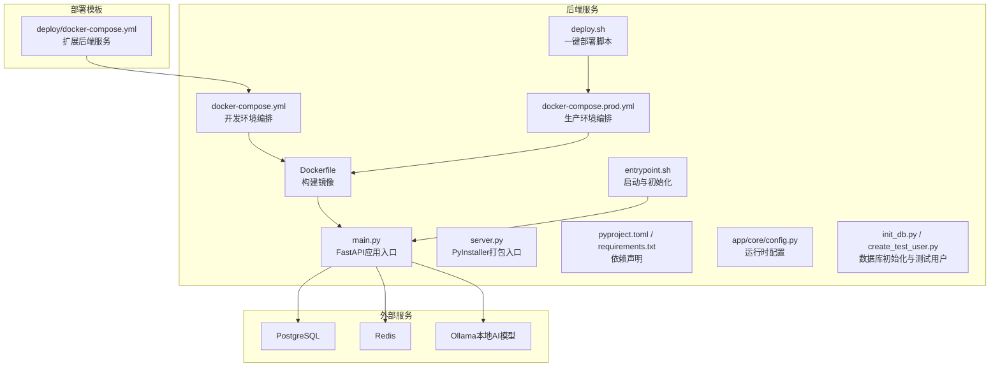
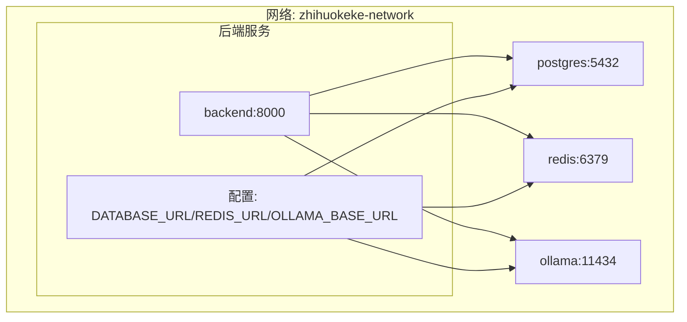
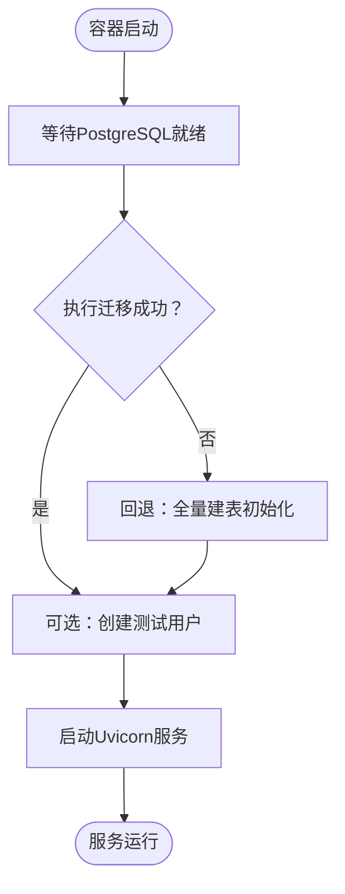
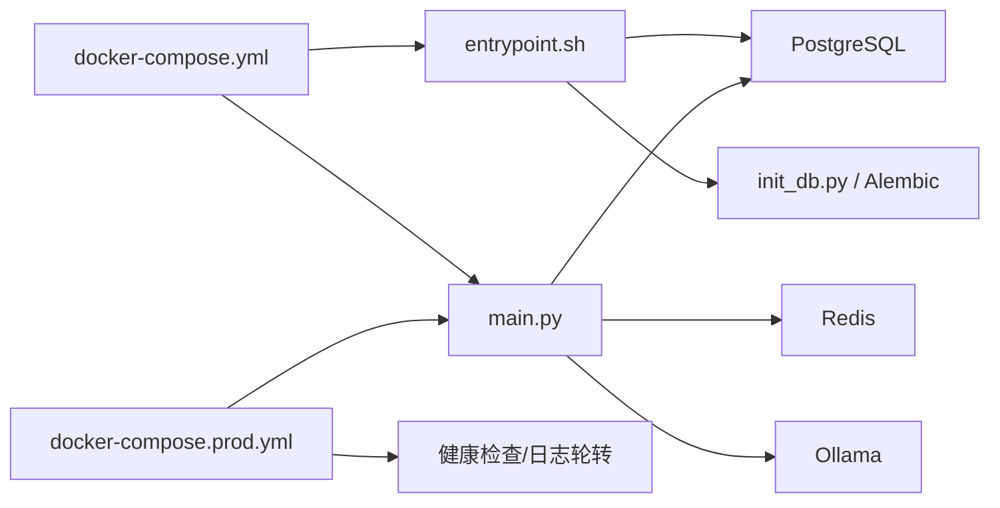

# Docker容器化

<cite>
**本文引用的文件**
- [Dockerfile](file://backend/Dockerfile)
- [docker-compose.yml](file://backend/docker-compose.yml)
- [docker-compose.prod.yml](file://backend/docker-compose.prod.yml)
- [entrypoint.sh](file://backend/entrypoint.sh)
- [main.py](file://backend/main.py)
- [server.py](file://backend/server.py)
- [pyproject.toml](file://backend/pyproject.toml)
- [requirements.txt](file://backend/requirements.txt)
- [app/core/config.py](file://backend/app/core/config.py)
- [init_db.py](file://backend/init_db.py)
- [create_test_user.py](file://backend/create_test_user.py)
- [deploy.sh](file://backend/deploy.sh)
- [deploy/docker-compose.yml](file://deploy/docker-compose.yml)
- [docs/deploy/env-example.md](file://docs/deploy/env-example.md)
</cite>

## 目录
1. [简介](#简介)
2. [项目结构](#项目结构)
3. [核心组件](#核心组件)
4. [架构总览](#架构总览)
5. [详细组件分析](#详细组件分析)
6. [依赖关系分析](#依赖关系分析)
7. [性能考量](#性能考量)
8. [故障排查指南](#故障排查指南)
9. [结论](#结论)
10. [附录](#附录)

## 简介
本文件面向“智获客”项目的Docker容器化与编排，系统性阐述后端服务的Dockerfile构建流程、多阶段构建策略建议、docker-compose.yml服务编排配置（后端、数据库、Redis、AI模型容器），以及生产与开发环境的compose文件差异。同时覆盖容器间网络通信、数据卷挂载策略、容器监控与日志收集、资源限制与健康检查配置、以及容器扩容与高可用部署最佳实践。

## 项目结构
- 后端服务位于 backend 目录，包含应用代码、Dockerfile、compose文件、启动脚本与部署脚本。
- 前端桌面应用位于 desktop 目录，通过静态文件挂载方式由后端提供。
- 部署模板位于 deploy 目录，提供基于后端compose的扩展服务编排样例。
- 文档位于 docs 目录，包含环境变量示例与部署相关说明。

图表来源
- [Dockerfile:1-19](file://backend/Dockerfile#L1-L19)
- [docker-compose.yml:1-67](file://backend/docker-compose.yml#L1-L67)
- [docker-compose.prod.yml:1-112](file://backend/docker-compose.prod.yml#L1-L112)
- [entrypoint.sh:1-48](file://backend/entrypoint.sh#L1-L48)
- [main.py:1-138](file://backend/main.py#L1-L138)
- [server.py:1-30](file://backend/server.py#L1-L30)
- [pyproject.toml:1-47](file://backend/pyproject.toml#L1-L47)
- [requirements.txt:1-21](file://backend/requirements.txt#L1-L21)
- [app/core/config.py:1-103](file://backend/app/core/config.py#L1-L103)
- [init_db.py:1-44](file://backend/init_db.py#L1-L44)
- [create_test_user.py:1-54](file://backend/create_test_user.py#L1-L54)
- [deploy.sh:1-132](file://backend/deploy.sh#L1-L132)
- [deploy/docker-compose.yml:1-7](file://deploy/docker-compose.yml#L1-L7)

章节来源
- [Dockerfile:1-19](file://backend/Dockerfile#L1-L19)
- [docker-compose.yml:1-67](file://backend/docker-compose.yml#L1-L67)
- [docker-compose.prod.yml:1-112](file://backend/docker-compose.prod.yml#L1-L112)
- [deploy/docker-compose.yml:1-7](file://deploy/docker-compose.yml#L1-L7)

## 核心组件
- Dockerfile：定义基础镜像、依赖安装、应用代码复制、入口脚本处理与Python缓冲设置。
- entrypoint.sh：容器启动时等待数据库、执行迁移或初始化、可选创建测试用户、最后启动Uvicorn。
- docker-compose.yml：开发环境编排，包含PostgreSQL、Redis、Ollama与后端服务，支持热重载。
- docker-compose.prod.yml：生产环境编排，启用重启策略、健康检查、日志轮转、数据卷挂载与只读静态资源。
- main.py/server.py：FastAPI应用入口与PyInstaller打包入口，支持静态资源托管与健康检查端点。
- app/core/config.py：集中式运行时配置，支持环境变量注入、密钥校验、CORS限制、AI模型与限流配置。
- init_db.py/create_test_user.py：数据库表初始化与测试用户创建工具。
- deploy.sh：一键部署脚本，负责环境准备、健康检查与模型拉取。
- deploy/docker-compose.yml：基于后端compose的扩展模板，便于在统一编排中引入后端服务。

章节来源
- [Dockerfile:1-19](file://backend/Dockerfile#L1-L19)
- [entrypoint.sh:1-48](file://backend/entrypoint.sh#L1-L48)
- [docker-compose.yml:1-67](file://backend/docker-compose.yml#L1-L67)
- [docker-compose.prod.yml:1-112](file://backend/docker-compose.prod.yml#L1-L112)
- [main.py:1-138](file://backend/main.py#L1-L138)
- [server.py:1-30](file://backend/server.py#L1-L30)
- [app/core/config.py:1-103](file://backend/app/core/config.py#L1-L103)
- [init_db.py:1-44](file://backend/init_db.py#L1-L44)
- [create_test_user.py:1-54](file://backend/create_test_user.py#L1-L54)
- [deploy.sh:1-132](file://backend/deploy.sh#L1-L132)
- [deploy/docker-compose.yml:1-7](file://deploy/docker-compose.yml#L1-L7)

## 架构总览
容器化架构围绕后端服务为核心，通过Compose编排数据库、缓存与AI模型服务，形成完整的应用栈。开发环境强调快速迭代（热重载），生产环境强调稳定性（健康检查、日志轮转、重启策略）。

图表来源
- [docker-compose.yml:64-67](file://backend/docker-compose.yml#L64-L67)
- [docker-compose.prod.yml:109-112](file://backend/docker-compose.prod.yml#L109-L112)
- [app/core/config.py:27-38](file://backend/app/core/config.py#L27-L38)
- [app/core/config.py:86-89](file://backend/app/core/config.py#L86-L89)
- [app/core/config.py:71-75](file://backend/app/core/config.py#L71-L75)

## 详细组件分析

### Dockerfile构建流程与多阶段构建策略
- 基础镜像与工作目录：采用官方Python精简镜像，设置工作目录。
- 依赖安装：优先使用国内镜像源加速下载，避免缓存以减小镜像体积。
- 应用代码复制：将项目代码复制至镜像内。
- 启动脚本处理：修复换行符并赋予执行权限。
- 环境变量：设置非缓冲输出，确保日志实时可见。
- 入口命令：通过自定义入口脚本启动Uvicorn，便于在容器内执行初始化逻辑。

多阶段构建建议（可选优化）
- 阶段一：使用完整Python镜像安装依赖与构建产物。
- 阶段二：使用精简Python镜像仅拷贝运行时产物，进一步缩小镜像体积并降低攻击面。
- 适用场景：对镜像大小与安全有更高要求的生产环境。

章节来源
- [Dockerfile:1-19](file://backend/Dockerfile#L1-L19)

### entrypoint.sh启动流程与初始化
- 数据库等待：循环检测数据库连接，直至可用。
- 数据迁移：优先执行Alembic迁移；若失败则回退到全量建表初始化。
- 可选测试用户：根据环境变量决定是否创建测试用户。
- 启动服务：以多进程模式启动Uvicorn，承载HTTP服务。

图表来源
- [entrypoint.sh:7-47](file://backend/entrypoint.sh#L7-L47)
- [init_db.py:16-21](file://backend/init_db.py#L16-L21)

章节来源
- [entrypoint.sh:1-48](file://backend/entrypoint.sh#L1-L48)
- [init_db.py:1-44](file://backend/init_db.py#L1-L44)

### docker-compose.yml（开发环境）
- 服务定义
  - postgres：设置认证与数据库名，暴露端口，持久化数据卷，健康检查。
  - backend：基于当前上下文构建，注入数据库与Redis连接信息，开启热重载，挂载源码实现开发调试。
  - ollama：提供本地AI推理服务，映射端口与持久化模型数据。
  - redis：持久化配置与数据，暴露端口。
- 网络：自定义网络名称，便于服务发现与隔离。
- 依赖：后端依赖数据库健康与Redis启动。

章节来源
- [docker-compose.yml:1-67](file://backend/docker-compose.yml#L1-L67)

### docker-compose.prod.yml（生产环境）
- 服务定义
  - postgres：启用重启策略、健康检查、日志轮转、数据卷持久化。
  - backend：启用重启策略、健康检查、日志轮转、数据卷挂载上传目录与只读桌面静态资源、依赖健康检查。
  - ollama：启用重启策略、健康检查、日志轮转、数据卷持久化。
  - redis：启用重启策略、健康检查、日志轮转、数据卷持久化。
- 网络：复用开发网络名称，保持一致性。
- 依赖：与开发一致，但健康检查更严格。

章节来源
- [docker-compose.prod.yml:1-112](file://backend/docker-compose.prod.yml#L1-L112)

### main.py与server.py（应用入口）
- main.py：创建FastAPI应用，注册中间件与路由，提供健康检查端点，托管前端静态资源。
- server.py：PyInstaller打包入口，修正模块路径与工作目录，按环境变量启动Uvicorn。

章节来源
- [main.py:1-138](file://backend/main.py#L1-L138)
- [server.py:1-30](file://backend/server.py#L1-L30)

### 配置管理（app/core/config.py）
- 环境变量注入：通过Pydantic Settings加载.env文件，支持类型校验与默认值。
- 安全校验：强制要求SECRET_KEY长度与强度，禁止生产环境使用通配CORS。
- 运行参数：数据库、Redis、AI模型、限流、文件上传、浏览器采集服务等参数集中管理。

章节来源
- [app/core/config.py:1-103](file://backend/app/core/config.py#L1-L103)

### 数据库初始化与测试用户
- init_db.py：创建所有表，幂等操作，便于快速初始化。
- create_test_user.py：按环境变量创建测试用户，支持密码注入与去重提示。

章节来源
- [init_db.py:1-44](file://backend/init_db.py#L1-L44)
- [create_test_user.py:1-54](file://backend/create_test_user.py#L1-L54)

### 一键部署脚本（deploy.sh）
- 前置检查：确认Docker安装与版本。
- 环境准备：首次部署复制模板并自动生成安全密钥与数据库口令，同步URL。
- 启动服务：停止旧容器、构建镜像并启动，等待健康检查通过。
- 运维检查：调用后端运维健康接口，后台拉取AI模型。
- 输出帮助信息：提供日志查看、停止与重启命令。

章节来源
- [deploy.sh:1-132](file://backend/deploy.sh#L1-L132)

### 部署模板（deploy/docker-compose.yml）
- 基于后端compose扩展，通过extends引入backend服务定义，便于在统一编排中复用。

章节来源
- [deploy/docker-compose.yml:1-7](file://deploy/docker-compose.yml#L1-L7)

## 依赖关系分析
- 组件耦合
  - 后端服务强依赖数据库与Redis，弱依赖AI模型（可通过配置切换云模型）。
  - entrypoint.sh与数据库迁移工具耦合，确保服务启动前数据层可用。
- 外部依赖
  - PostgreSQL、Redis、Ollama均为独立容器，通过服务名进行DNS解析。
- 环境差异
  - 开发环境强调热重载与交互式调试；生产环境强调稳定性与可观测性。

图表来源
- [entrypoint.sh:7-47](file://backend/entrypoint.sh#L7-L47)
- [init_db.py:16-21](file://backend/init_db.py#L16-L21)
- [main.py:1-138](file://backend/main.py#L1-L138)
- [docker-compose.yml:1-67](file://backend/docker-compose.yml#L1-L67)
- [docker-compose.prod.yml:1-112](file://backend/docker-compose.prod.yml#L1-L112)

章节来源
- [entrypoint.sh:1-48](file://backend/entrypoint.sh#L1-L48)
- [main.py:1-138](file://backend/main.py#L1-L138)
- [docker-compose.yml:1-67](file://backend/docker-compose.yml#L1-L67)
- [docker-compose.prod.yml:1-112](file://backend/docker-compose.prod.yml#L1-L112)

## 性能考量
- 镜像体积与启动时间
  - 使用精简基础镜像与禁用pip缓存，减少镜像体积与构建时间。
  - 多阶段构建可进一步压缩运行时镜像。
- 并发与资源
  - Uvicorn以多进程模式启动，结合CPU核数合理设置worker数量。
  - 为各服务设置内存与CPU限制，避免资源争抢。
- 存储与I/O
  - 数据库与Redis使用持久化卷，避免容器重建导致数据丢失。
  - AI模型数据卷持久化，避免重复下载。
- 网络与延迟
  - 服务置于同一自定义网络，减少跨网络开销。
  - 合理设置健康检查间隔与超时，平衡探测频率与系统负载。

## 故障排查指南
- 启动失败
  - 检查数据库连接字符串与凭据，确认数据库健康检查通过。
  - 查看后端容器日志，定位迁移或初始化异常。
- 健康检查失败
  - 开发环境：确认热重载未阻塞端口；检查端口映射冲突。
  - 生产环境：查看json-file日志轮转与磁盘空间；确认健康检查命令可达。
- AI模型不可用
  - 确认Ollama容器健康；检查模型是否已拉取；验证端口映射与网络连通。
- 静态资源无法访问
  - 确认桌面静态资源目录已正确挂载且为只读；检查后端静态文件挂载逻辑。
- 密钥与CORS配置
  - 生产环境禁止使用默认密钥与通配CORS；通过.env注入并重启容器。

章节来源
- [entrypoint.sh:1-48](file://backend/entrypoint.sh#L1-L48)
- [docker-compose.yml:15-19](file://backend/docker-compose.yml#L15-L19)
- [docker-compose.prod.yml:24-29](file://backend/docker-compose.prod.yml#L24-L29)
- [app/core/config.py:55-69](file://backend/app/core/config.py#L55-L69)
- [docs/deploy/env-example.md:1-8](file://docs/deploy/env-example.md#L1-L8)

## 结论
本容器化方案以Docker与Compose为核心，结合启动脚本与健康检查，实现了开发与生产的差异化编排。通过集中式配置管理、持久化数据卷与严格的健康检查，保障了系统的稳定性与可维护性。建议在生产环境中进一步引入多阶段构建、资源限制与监控告警体系，以满足高可用与可扩展需求。

## 附录

### 开发与生产compose文件差异对照
- 环境变量注入
  - 开发：直接在compose中设置环境变量与DEBUG开关。
  - 生产：通过.env文件注入，严格校验密钥与CORS。
- 服务行为
  - 开发：后端启用热重载，挂载源码；数据库与Redis未启用重启策略。
  - 生产：启用重启策略、健康检查、日志轮转与数据卷挂载。
- 网络与端口
  - 两者均使用自定义网络；生产环境对端口映射与只读挂载更严格。

章节来源
- [docker-compose.yml:24-38](file://backend/docker-compose.yml#L24-L38)
- [docker-compose.prod.yml:37-59](file://backend/docker-compose.prod.yml#L37-L59)
- [app/core/config.py:55-69](file://backend/app/core/config.py#L55-L69)

### 容器监控、日志收集与资源限制
- 健康检查
  - 后端：基于内部健康端点与运维接口。
  - 数据库：基于pg_isready。
  - 缓存：基于redis-cli ping。
  - AI模型：基于ollama list。
- 日志轮转
  - 使用json-file驱动，限制单文件大小与保留文件数。
- 资源限制
  - 建议为数据库、缓存与后端分别设置内存与CPU上限，防止资源争抢。
- 监控与告警
  - 建议集成Prometheus/Grafana或第三方APM，采集容器指标与应用指标。

章节来源
- [docker-compose.prod.yml:19-29](file://backend/docker-compose.prod.yml#L19-L29)
- [docker-compose.prod.yml:49-54](file://backend/docker-compose.prod.yml#L49-L54)
- [docker-compose.prod.yml:92-97](file://backend/docker-compose.prod.yml#L92-L97)
- [docker-compose.prod.yml:72-77](file://backend/docker-compose.prod.yml#L72-L77)

### 容器扩容与高可用部署最佳实践
- 横向扩容
  - 后端服务可水平扩展，结合反向代理实现负载均衡。
  - 数据库与缓存需具备高可用能力（主从/哨兵/集群），避免单点瓶颈。
- 配置一致性
  - 所有实例共享同一配置源（如.env与密钥管理服务）。
- 存储与备份
  - 数据库与AI模型数据卷定期备份；使用快照或归档策略。
- 发布策略
  - 采用蓝绿或滚动发布，结合健康检查与灰度流量，降低风险。