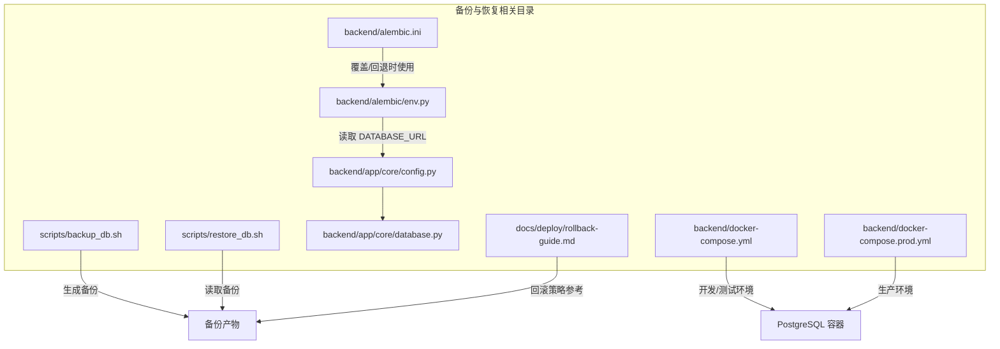
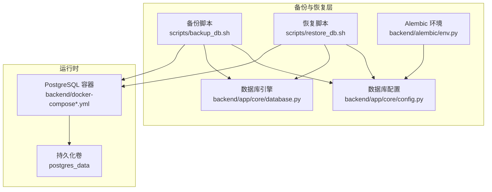
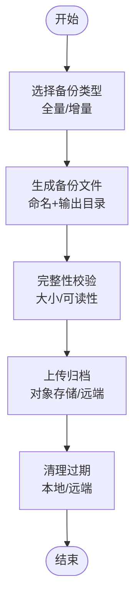
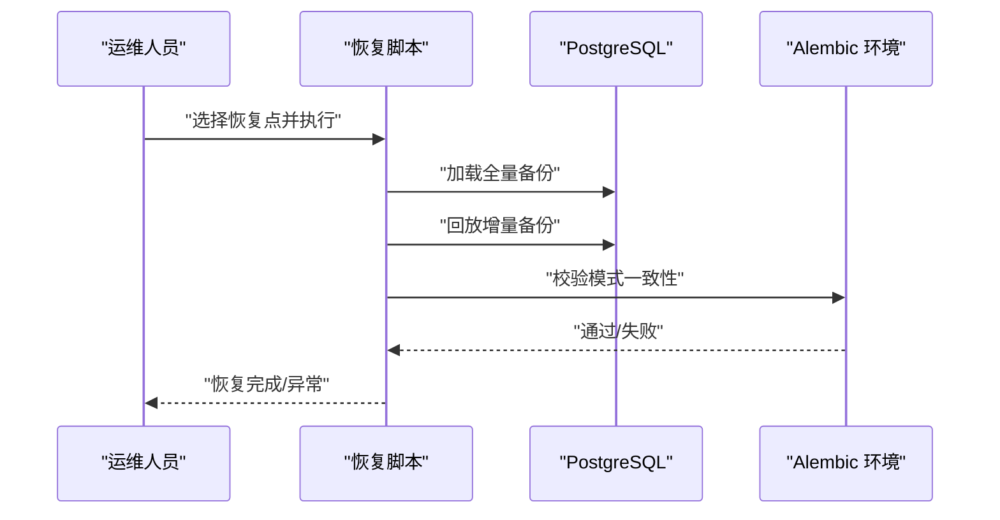
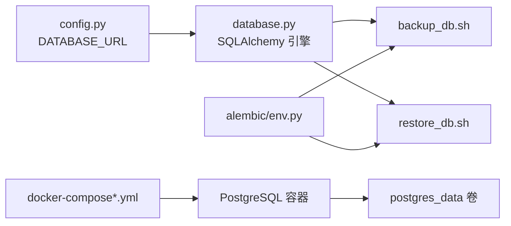

# 备份与恢复

<cite>
**本文引用的文件**
- [scripts/backup_db.sh](file://scripts/backup_db.sh)
- [scripts/restore_db.sh](file://scripts/restore_db.sh)
- [backend/app/core/config.py](file://backend/app/core/config.py)
- [backend/app/core/database.py](file://backend/app/core/database.py)
- [backend/alembic/env.py](file://backend/alembic/env.py)
- [backend/alembic.ini](file://backend/alembic.ini)
- [backend/docker-compose.yml](file://backend/docker-compose.yml)
- [backend/docker-compose.prod.yml](file://backend/docker-compose.prod.yml)
- [docs/deploy/rollback-guide.md](file://docs/deploy/rollback-guide.md)
</cite>

## 目录
1. [简介](#简介)
2. [项目结构](#项目结构)
3. [核心组件](#核心组件)
4. [架构总览](#架构总览)
5. [详细组件分析](#详细组件分析)
6. [依赖分析](#依赖分析)
7. [性能考虑](#性能考虑)
8. [故障排查指南](#故障排查指南)
9. [结论](#结论)
10. [附录](#附录)

## 简介
本操作手册面向“智获客备份与恢复系统”，目标是提供数据库备份策略、定期备份执行流程、全量与增量备份配置方法、备份存储位置与安全保护、数据恢复完整流程与验证步骤、灾难恢复计划与业务连续性保障、备份数据加密与传输安全、以及恢复演练与应急预案制定方法。  
当前仓库中，数据库备份与恢复脚本处于待实现状态，但已具备完善的数据库连接配置、Alembic 迁移支持、容器化部署与生产环境编排，可作为构建备份与恢复体系的基础。

## 项目结构
与备份与恢复直接相关的结构包括：
- 备份与恢复脚本：位于 scripts 目录，当前为占位实现，需补充具体逻辑
- 数据库配置与连接：位于 backend/app/core，包含数据库连接参数与引擎配置
- 迁移与元数据：位于 backend/alembic，提供数据库模式迁移能力
- 容器化部署：位于 backend/docker-compose*.yml，定义数据库、后端、Redis、Ollama 的服务与卷
- 回滚与运维文档：位于 docs/deploy，提供回滚流程与原则，可借鉴为备份恢复的前置策略

**图示来源**
- [scripts/backup_db.sh:1-4](file://scripts/backup_db.sh#L1-L4)
- [scripts/restore_db.sh:1-4](file://scripts/restore_db.sh#L1-L4)
- [backend/app/core/config.py:27-35](file://backend/app/core/config.py#L27-L35)
- [backend/app/core/database.py:6-13](file://backend/app/core/database.py#L6-L13)
- [backend/alembic/env.py:37-44](file://backend/alembic/env.py#L37-L44)
- [backend/alembic.ini:5-6](file://backend/alembic.ini#L5-L6)
- [backend/docker-compose.yml:4-19](file://backend/docker-compose.yml#L4-L19)
- [backend/docker-compose.prod.yml:9-29](file://backend/docker-compose.prod.yml#L9-L29)
- [docs/deploy/rollback-guide.md:31-35](file://docs/deploy/rollback-guide.md#L31-L35)

**章节来源**
- [scripts/backup_db.sh:1-4](file://scripts/backup_db.sh#L1-L4)
- [scripts/restore_db.sh:1-4](file://scripts/restore_db.sh#L1-L4)
- [backend/app/core/config.py:27-35](file://backend/app/core/config.py#L27-L35)
- [backend/app/core/database.py:6-13](file://backend/app/core/database.py#L6-L13)
- [backend/alembic/env.py:37-44](file://backend/alembic/env.py#L37-L44)
- [backend/alembic.ini:5-6](file://backend/alembic.ini#L5-L6)
- [backend/docker-compose.yml:4-19](file://backend/docker-compose.yml#L4-L19)
- [backend/docker-compose.prod.yml:9-29](file://backend/docker-compose.prod.yml#L9-L29)
- [docs/deploy/rollback-guide.md:31-35](file://docs/deploy/rollback-guide.md#L31-L35)

## 核心组件
- 数据库连接配置：集中于 settings.DATABASE_* 参数，用于驱动备份与恢复工具连接数据库
- 数据库引擎与会话：通过 SQLAlchemy 引擎与会话工厂提供稳定的连接池与事务管理
- Alembic 迁移环境：从环境变量或 alembic.ini 读取 DATABASE_URL，确保迁移与备份一致性
- 容器化部署：PostgreSQL 以持久化卷挂载，便于备份卷内数据；后端服务依赖数据库健康检查
- 备份/恢复脚本：当前为占位，需扩展为可执行的全量/增量备份与恢复流程

**章节来源**
- [backend/app/core/config.py:27-35](file://backend/app/core/config.py#L27-L35)
- [backend/app/core/database.py:6-13](file://backend/app/core/database.py#L6-L13)
- [backend/alembic/env.py:37-44](file://backend/alembic/env.py#L37-L44)
- [backend/docker-compose.yml:13-14](file://backend/docker-compose.yml#L13-L14)
- [backend/docker-compose.prod.yml:17-18](file://backend/docker-compose.prod.yml#L17-L18)
- [scripts/backup_db.sh:1-4](file://scripts/backup_db.sh#L1-L4)
- [scripts/restore_db.sh:1-4](file://scripts/restore_db.sh#L1-L4)

## 架构总览
下图展示备份与恢复在系统中的位置与交互关系：备份脚本基于数据库配置连接数据库，生成备份文件；恢复脚本读取备份文件并回放至数据库；Alembic 保证模式一致性；容器编排提供数据库持久化与健康检查。

**图示来源**
- [scripts/backup_db.sh:1-4](file://scripts/backup_db.sh#L1-L4)
- [scripts/restore_db.sh:1-4](file://scripts/restore_db.sh#L1-L4)
- [backend/app/core/config.py:27-35](file://backend/app/core/config.py#L27-L35)
- [backend/app/core/database.py:6-13](file://backend/app/core/database.py#L6-L13)
- [backend/alembic/env.py:37-44](file://backend/alembic/env.py#L37-L44)
- [backend/docker-compose.yml:13-14](file://backend/docker-compose.yml#L13-L14)
- [backend/docker-compose.prod.yml:17-18](file://backend/docker-compose.prod.yml#L17-L18)

## 详细组件分析

### 备份策略与执行流程
- 策略建议
  - 全量备份：每周一次，用于建立基准快照
  - 增量备份：每日一次，基于全量后的 WAL/变更日志进行
  - 归档保留：按 7 天滚动、4 周滚动、12 个月滚动策略管理
- 执行流程
  - 选择备份类型：全量或增量
  - 生成备份文件：命名包含时间戳与类型，输出到统一目录
  - 校验完整性：校验文件大小与可读性
  - 上传归档：推送到对象存储或远端备份介质
  - 清理过期：删除超出保留期的本地与远端备份
- 与现有配置的衔接
  - 从 DATABASE_URL 获取连接参数，确保备份工具可连通数据库
  - 使用 Alembic 环境变量或 alembic.ini 提供的 URL，确保模式一致

**章节来源**
- [backend/app/core/config.py:27-35](file://backend/app/core/config.py#L27-L35)
- [backend/alembic/env.py:37-44](file://backend/alembic/env.py#L37-L44)
- [backend/alembic.ini:5-6](file://backend/alembic.ini#L5-L6)

### 全量备份与增量备份配置
- 全量备份
  - 使用数据库导出工具生成完整 SQL 或二进制快照
  - 生成带时间戳的文件名，便于检索与比对
  - 将备份文件放入统一归档目录，并记录元数据（时间、大小、校验和）
- 增量备份
  - 基于上次全量之后的 WAL 或变更日志进行
  - 生成增量文件并记录起止时间窗口
  - 与全量文件关联，形成可恢复的时间序列
- 配置要点
  - 从 DATABASE_URL 读取连接参数，避免硬编码
  - 在 Alembic 环境中保持与生产一致的连接字符串，确保模式一致性

**章节来源**
- [backend/app/core/config.py:27-35](file://backend/app/core/config.py#L27-L35)
- [backend/alembic/env.py:37-44](file://backend/alembic/env.py#L37-L44)
- [backend/alembic.ini:5-6](file://backend/alembic.ini#L5-L6)

### 备份数据存储位置与安全保护
- 存储位置
  - 本地归档目录：统一存放备份文件，便于快速检索
  - 远端归档：对象存储或远端服务器，满足异地容灾
  - 持久化卷：PostgreSQL 数据卷用于物理层备份与快照
- 安全保护
  - 限制访问权限：仅授权人员可访问备份目录
  - 加密归档：对备份文件进行加密后再上传
  - 完整性校验：生成并保存校验和，防止篡改
  - 审计日志：记录备份与恢复操作的执行者、时间、结果

**章节来源**
- [backend/docker-compose.yml:13-14](file://backend/docker-compose.yml#L13-L14)
- [backend/docker-compose.prod.yml:17-18](file://backend/docker-compose.prod.yml#L17-L18)

### 数据恢复完整流程与验证步骤
- 恢复流程
  - 选择恢复点：根据时间戳与类型选择合适的全量与增量组合
  - 应用全量：加载全量备份，重建基础数据
  - 应用增量：按顺序回放增量备份，补齐到目标时间点
  - 验证模式：使用 Alembic 环境校验数据库模式一致性
  - 启动服务：确认后端与数据库健康检查通过
- 验证步骤
  - 关键业务链路抽样：登录、发布任务、线索转客户、插件回传
  - 数据一致性：抽样核对关键表的数据条数与代表性字段
  - 性能基线：对比恢复前后关键查询耗时与资源占用

**图示来源**
- [scripts/restore_db.sh:1-4](file://scripts/restore_db.sh#L1-L4)
- [backend/alembic/env.py:37-44](file://backend/alembic/env.py#L37-L44)

**章节来源**
- [scripts/restore_db.sh:1-4](file://scripts/restore_db.sh#L1-L4)
- [docs/deploy/rollback-guide.md:31-35](file://docs/deploy/rollback-guide.md#L31-L35)

### 灾难恢复计划与业务连续性保障
- DR 计划
  - 明确触发条件：数据库不可用、关键数据损坏、灾难事件
  - 恢复优先级：先恢复数据库与核心业务链路，再逐步恢复其他模块
  - 通信机制：指定联系人与升级路径，确保信息畅通
- 业务连续性
  - 快速回滚：遵循回滚手册，优先回滚应用，必要时回退数据库迁移
  - 降级策略：在恢复期间启用降级模式，保证基本功能可用
  - 监控告警：恢复后持续观察错误率、响应时间与资源使用

**章节来源**
- [docs/deploy/rollback-guide.md:5-10](file://docs/deploy/rollback-guide.md#L5-L10)
- [docs/deploy/rollback-guide.md:31-35](file://docs/deploy/rollback-guide.md#L31-L35)

### 备份数据加密与传输安全
- 加密策略
  - 备份文件加密：使用强对称加密算法，密钥分层管理
  - 传输加密：通过 HTTPS/SSH/SFTP 等通道传输，避免明文
  - 密钥轮换：定期轮换密钥，限制密钥生命周期
- 安全审计
  - 记录加密/解密操作日志，追踪责任人
  - 定期安全扫描：检查备份介质与网络通道的安全性

[本节为通用安全建议，无需特定文件引用]

### 恢复演练与应急预案制定
- 恢复演练
  - 定期演练：每季度至少一次全量与增量恢复演练
  - 场景设计：模拟不同规模数据损坏与灾难场景
  - 评估改进：记录耗时、成功率与问题，持续优化流程
- 应急预案
  - 明确角色与职责：指挥官、执行人、记录员
  - 资源准备：预置恢复工具、介质与网络通道
  - 事后复盘：形成复盘报告，固化最佳实践

[本节为通用流程建议，无需特定文件引用]

## 依赖分析
- 组件耦合
  - 备份/恢复脚本依赖数据库配置与连接参数
  - Alembic 环境与 alembic.ini 为模式一致性提供保障
  - 容器编排提供数据库健康检查与持久化卷，支撑备份与恢复
- 外部依赖
  - 数据库客户端工具：用于导出/导入
  - 对象存储 SDK：用于远端归档
  - 加密工具：用于备份文件加密

**图示来源**
- [backend/app/core/config.py:27-35](file://backend/app/core/config.py#L27-L35)
- [backend/app/core/database.py:6-13](file://backend/app/core/database.py#L6-L13)
- [scripts/backup_db.sh:1-4](file://scripts/backup_db.sh#L1-L4)
- [scripts/restore_db.sh:1-4](file://scripts/restore_db.sh#L1-L4)
- [backend/alembic/env.py:37-44](file://backend/alembic/env.py#L37-L44)
- [backend/docker-compose.yml:13-14](file://backend/docker-compose.yml#L13-L14)
- [backend/docker-compose.prod.yml:17-18](file://backend/docker-compose.prod.yml#L17-L18)

**章节来源**
- [backend/app/core/config.py:27-35](file://backend/app/core/config.py#L27-L35)
- [backend/app/core/database.py:6-13](file://backend/app/core/database.py#L6-L13)
- [backend/alembic/env.py:37-44](file://backend/alembic/env.py#L37-L44)
- [backend/docker-compose.yml:13-14](file://backend/docker-compose.yml#L13-L14)
- [backend/docker-compose.prod.yml:17-18](file://backend/docker-compose.prod.yml#L17-L18)

## 性能考虑
- 备份窗口：在业务低峰期执行全量备份，减少对在线业务的影响
- 并行处理：对大表进行分区并行导出，提升吞吐
- 增量策略：合理设置增量周期，平衡恢复时间与存储成本
- 存储性能：使用高性能磁盘与对象存储，缩短备份与恢复时间

[本节提供通用指导，无需特定文件引用]

## 故障排查指南
- 常见问题
  - 连接失败：检查 DATABASE_URL 与网络连通性
  - 权限不足：确认数据库用户具备导出/导入权限
  - 模式不一致：使用 Alembic 环境校验并同步迁移
- 排查步骤
  - 查看备份/恢复日志，定位失败阶段
  - 校验备份文件完整性与可读性
  - 在隔离环境中先行恢复验证
- 参考流程
  - 遵循回滚手册的回滚原则与检查项，确保恢复后系统稳定

**章节来源**
- [docs/deploy/rollback-guide.md:31-35](file://docs/deploy/rollback-guide.md#L31-L35)

## 结论
本操作手册基于现有仓库中的数据库配置、容器化部署与 Alembic 迁移能力，提出了备份与恢复的策略、流程与安全要求。当前备份/恢复脚本尚未实现，建议按照本手册的策略与流程，结合实际生产环境进行落地实施，并持续完善演练与应急预案。

## 附录
- 实施清单
  - 完成备份/恢复脚本开发与单元测试
  - 建立统一的备份归档目录与远端归档策略
  - 部署加密与传输安全机制
  - 制定并演练恢复演练与应急预案
  - 建立监控与审计日志体系

[本节为总结性内容，无需特定文件引用]