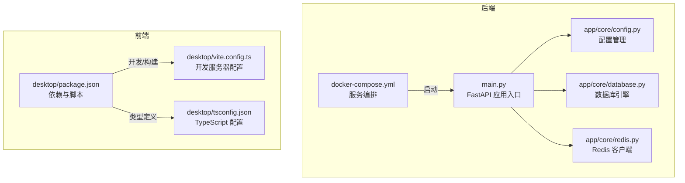
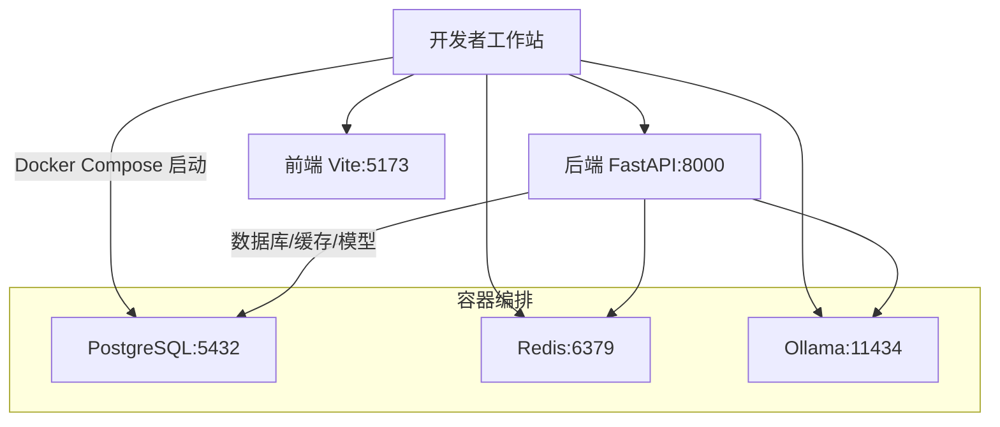
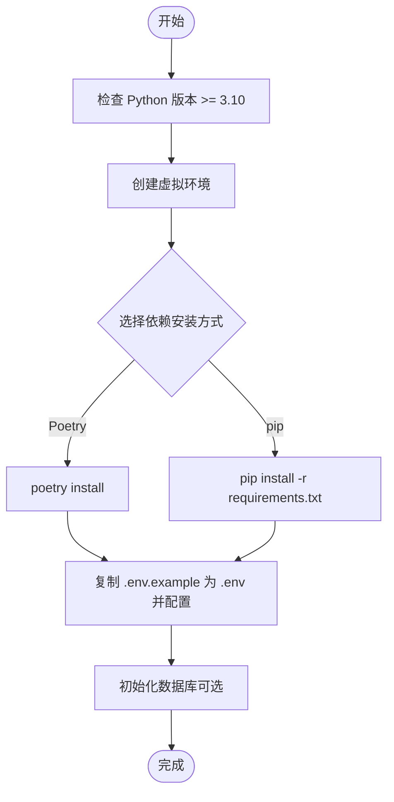
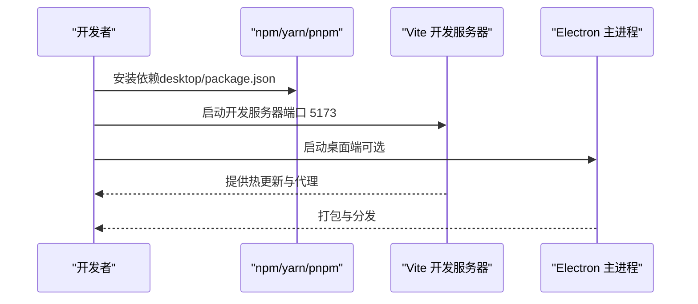
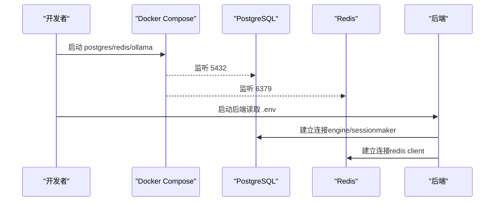
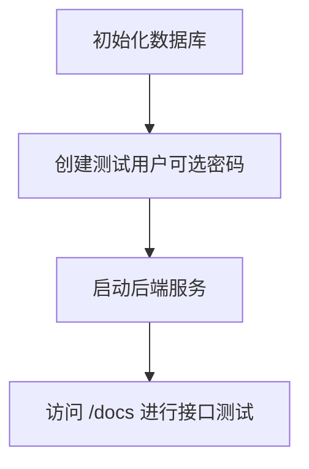
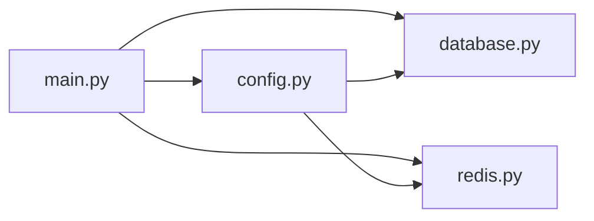

# 开发环境搭建

<cite>
**本文引用的文件**
- [backend/pyproject.toml](file://backend/pyproject.toml)
- [backend/requirements.txt](file://backend/requirements.txt)
- [backend/docker-compose.yml](file://backend/docker-compose.yml)
- [backend/setup-venv.sh](file://backend/setup-venv.sh)
- [backend/QUICKSTART.md](file://backend/QUICKSTART.md)
- [backend/init_db.py](file://backend/init_db.py)
- [backend/create_test_user.py](file://backend/create_test_user.py)
- [backend/main.py](file://backend/main.py)
- [backend/app/core/config.py](file://backend/app/core/config.py)
- [backend/app/core/database.py](file://backend/app/core/database.py)
- [backend/app/core/redis.py](file://backend/app/core/redis.py)
- [desktop/package.json](file://desktop/package.json)
- [desktop/vite.config.ts](file://desktop/vite.config.ts)
- [desktop/tsconfig.json](file://desktop/tsconfig.json)
- [scripts/init_db.sh](file://scripts/init_db.sh)
</cite>

## 目录
1. [简介](#简介)
2. [项目结构](#项目结构)
3. [核心组件](#核心组件)
4. [架构总览](#架构总览)
5. [详细组件分析](#详细组件分析)
6. [依赖关系分析](#依赖关系分析)
7. [性能考虑](#性能考虑)
8. [故障排除指南](#故障排除指南)
9. [结论](#结论)
10. [附录](#附录)

## 简介
本指南面向“智获客”项目的开发者，提供从零搭建完整开发环境的操作步骤，涵盖：
- Python 3.10+ 虚拟环境创建与激活、依赖安装
- Node.js 前端开发环境配置与依赖安装
- 开发工具链（IDE、调试、代码格式化）配置要点
- 数据库本地连接配置与 Redis 服务启动
- 测试环境搭建与测试用户创建
- 环境变量配置方法与常见问题解决方案

## 项目结构
项目采用前后端分离架构：
- 后端：Python/FastAPI，使用 SQLAlchemy 进行数据库访问，支持 Alembic 迁移，内置 Ollama 本地 AI 模型服务，Redis 用于限流等
- 前端：React + Vite + TypeScript，Electron 打包为桌面端
- 部署与编排：Docker Compose 统一编排 PostgreSQL、Redis、Ollama、后端服务

**图表来源**
- [backend/main.py:1-138](file://backend/main.py#L1-L138)
- [backend/app/core/config.py:1-103](file://backend/app/core/config.py#L1-L103)
- [backend/app/core/database.py:1-29](file://backend/app/core/database.py#L1-L29)
- [backend/app/core/redis.py:1-8](file://backend/app/core/redis.py#L1-L8)
- [backend/docker-compose.yml:1-67](file://backend/docker-compose.yml#L1-L67)
- [desktop/package.json:1-77](file://desktop/package.json#L1-L77)
- [desktop/vite.config.ts:1-23](file://desktop/vite.config.ts#L1-L23)
- [desktop/tsconfig.json:1-19](file://desktop/tsconfig.json#L1-L19)

**章节来源**
- [backend/docker-compose.yml:1-67](file://backend/docker-compose.yml#L1-L67)
- [backend/QUICKSTART.md:1-382](file://backend/QUICKSTART.md#L1-L382)

## 核心组件
- Python 版本与依赖
  - Python 版本要求：3.10+
  - 依赖管理：Poetry 或 pip（requirements.txt）
  - 关键依赖：FastAPI、SQLAlchemy、Alembic、PostgreSQL 驱动、Redis、Pydantic、Uvicorn、pytest 等
- 数据库与缓存
  - PostgreSQL（本地 Docker）+ Redis（本地 Docker），通过环境变量连接
- AI 与 OCR
  - Ollama 本地推理服务（Docker），支持模型拉取
- 前端
  - React + Vite + TypeScript，开发服务器端口 5173，预览端口 4173
- 后端服务
  - Uvicorn 提供 ASGI 服务，默认 8000 端口，支持热重载

**章节来源**
- [backend/pyproject.toml:7-31](file://backend/pyproject.toml#L7-L31)
- [backend/requirements.txt:1-21](file://backend/requirements.txt#L1-L21)
- [backend/app/core/config.py:27-89](file://backend/app/core/config.py#L27-L89)
- [desktop/package.json:8-20](file://desktop/package.json#L8-L20)
- [desktop/vite.config.ts:6-15](file://desktop/vite.config.ts#L6-L15)

## 架构总览
下图展示开发环境中的核心组件及其交互关系。

**图表来源**
- [backend/docker-compose.yml:4-57](file://backend/docker-compose.yml#L4-L57)
- [backend/main.py:130-138](file://backend/main.py#L130-L138)
- [desktop/vite.config.ts:6-15](file://desktop/vite.config.ts#L6-L15)

## 详细组件分析

### Python 虚拟环境与依赖安装
- 版本要求
  - Python 3.10+
- 创建与激活
  - 使用 venv 创建隔离环境
  - 激活方式因操作系统而异（Windows 使用 PowerShell 或 CMD 的 activate 脚本）
- 依赖安装
  - Poetry：安装依赖与开发依赖
  - pip：使用 requirements.txt 安装生产依赖
- 环境变量
  - 复制示例环境文件为 .env，并按需修改数据库、密钥、AI 服务地址等

**图表来源**
- [backend/pyproject.toml](file://backend/pyproject.toml#L8)
- [backend/requirements.txt:1-21](file://backend/requirements.txt#L1-L21)
- [backend/QUICKSTART.md:26-51](file://backend/QUICKSTART.md#L26-L51)

**章节来源**
- [backend/pyproject.toml](file://backend/pyproject.toml#L8)
- [backend/requirements.txt:1-21](file://backend/requirements.txt#L1-L21)
- [backend/QUICKSTART.md:26-51](file://backend/QUICKSTART.md#L26-L51)

### Node.js 与前端依赖安装
- 安装 Node.js（建议使用版本管理器以避免权限问题）
- 在 desktop 目录安装依赖
- 开发模式启动：同时启动 Vite 前端与 Electron（如需）
- 构建产物用于后端静态资源托管

**图表来源**
- [desktop/package.json:8-20](file://desktop/package.json#L8-L20)
- [desktop/vite.config.ts:6-15](file://desktop/vite.config.ts#L6-L15)

**章节来源**
- [desktop/package.json:1-77](file://desktop/package.json#L1-L77)
- [desktop/vite.config.ts:1-23](file://desktop/vite.config.ts#L1-L23)
- [desktop/tsconfig.json:1-19](file://desktop/tsconfig.json#L1-L19)

### 开发工具链配置
- IDE 设置
  - VS Code：推荐扩展（Python、Pylance、Black、Flake8、EditorConfig、ESLint、Prettier、TypeScript）
  - Python 解释器指向虚拟环境
  - 前端使用 TypeScript 与 React 插件
- 调试配置
  - 后端：使用 Uvicorn 启动，开启 reload 便于开发
  - 前端：Vite 默认提供热更新与源码映射
- 代码格式化与检查
  - Python：Black、isort、flake8、mypy
  - 前端：Prettier、ESLint（在 package.json 中定义）

**章节来源**
- [backend/pyproject.toml:32-36](file://backend/pyproject.toml#L32-L36)
- [desktop/package.json:28-44](file://desktop/package.json#L28-L44)

### 数据库本地连接与 Redis 启动
- PostgreSQL
  - Docker 启动：容器暴露 5432 端口，使用默认凭据
  - 初始化：执行数据库初始化脚本或 Alembic 迁移
- Redis
  - Docker 启动：容器暴露 6379 端口，持久化 AOF
- 连接配置
  - 通过环境变量 DATABASE_URL、REDIS_URL 指定连接地址
  - 后端会根据配置创建数据库引擎与会话工厂

**图表来源**
- [backend/docker-compose.yml:4-57](file://backend/docker-compose.yml#L4-L57)
- [backend/app/core/database.py:7-16](file://backend/app/core/database.py#L7-L16)
- [backend/app/core/redis.py:6-8](file://backend/app/core/redis.py#L6-L8)

**章节来源**
- [backend/docker-compose.yml:4-57](file://backend/docker-compose.yml#L4-L57)
- [backend/app/core/database.py:1-29](file://backend/app/core/database.py#L1-L29)
- [backend/app/core/redis.py:1-8](file://backend/app/core/redis.py#L1-L8)

### 测试环境搭建与测试用户创建
- 初始化数据库
  - 执行数据库初始化脚本，创建所有表
  - 可选：执行 Alembic 迁移至最新版本
- 创建测试用户
  - 支持从环境变量注入用户名、邮箱、密码
  - 若未提供密码，将自动生成安全随机密码
- 启动后端服务
  - 使用 Uvicorn 启动，访问 /docs 查看 API 文档

**图表来源**
- [backend/init_db.py:16-21](file://backend/init_db.py#L16-L21)
- [backend/create_test_user.py:15-50](file://backend/create_test_user.py#L15-L50)
- [backend/main.py:130-138](file://backend/main.py#L130-L138)

**章节来源**
- [backend/init_db.py:1-44](file://backend/init_db.py#L1-L44)
- [backend/create_test_user.py:1-54](file://backend/create_test_user.py#L1-L54)
- [backend/QUICKSTART.md:40-51](file://backend/QUICKSTART.md#L40-L51)

### 环境变量配置方法
- 复制示例文件为 .env
- 关键配置项
  - 数据库：DATABASE_URL、DATABASE_HOST、DATABASE_PORT、DATABASE_USER、DATABASE_PASSWORD、DATABASE_NAME
  - 密钥：SECRET_KEY（长度≥32，禁止使用默认占位值）
  - CORS：CORS_ORIGINS（生产环境禁止包含通配符）
  - AI 与模型：OLLAMA_BASE_URL、USE_CLOUD_MODEL、模型名称
  - Redis：REDIS_URL、RATE_LIMIT_KEY_PREFIX
  - 文件上传：MAX_UPLOAD_SIZE、UPLOAD_DIR
  - 企业微信：WECOM_*（可选）
  - 浏览器采集：BROWSER_COLLECTOR_BASE_URL、BROWSER_COLLECTOR_TIMEOUT_SECONDS

**章节来源**
- [backend/app/core/config.py:22-101](file://backend/app/core/config.py#L22-L101)
- [backend/QUICKSTART.md:238-251](file://backend/QUICKSTART.md#L238-L251)

## 依赖关系分析
后端服务对数据库、缓存与 AI 服务的依赖如下：

**图表来源**
- [backend/main.py:11-16](file://backend/main.py#L11-L16)
- [backend/app/core/config.py:27-89](file://backend/app/core/config.py#L27-L89)
- [backend/app/core/database.py:1-29](file://backend/app/core/database.py#L1-L29)
- [backend/app/core/redis.py:1-8](file://backend/app/core/redis.py#L1-L8)

**章节来源**
- [backend/main.py:1-138](file://backend/main.py#L1-L138)
- [backend/app/core/config.py:1-103](file://backend/app/core/config.py#L1-L103)

## 性能考虑
- 数据库连接池
  - 后端使用 SQLAlchemy 连接池参数（预连接、溢出、echo 等），建议在生产环境适当调整
- 并发与限流
  - Redis 用于分布式限流，可通过配置开关启用
- AI 推理
  - Ollama 本地模型推理，注意内存与 CPU 占用，建议在开发机上合理分配资源

**章节来源**
- [backend/app/core/database.py:7-16](file://backend/app/core/database.py#L7-L16)
- [backend/app/core/config.py:86-90](file://backend/app/core/config.py#L86-L90)

## 故障排除指南
- 数据库连接失败
  - 检查 DATABASE_URL 与 PostgreSQL 是否运行
  - 确认 Docker Compose 正常启动并监听 5432 端口
- CORS 错误
  - 在 .env 中正确配置 CORS_ORIGINS，生产环境禁止使用通配符
- Token 过期或鉴权失败
  - 重新登录获取新 token；确认 SECRET_KEY 配置有效且长度≥32
- 前端无法访问后端 API
  - 确认后端已启动并监听 8000 端口，前端代理或跨域配置正确
- 端口冲突
  - 修改 Vite（5173）、预览（4173）、后端（8000）、PostgreSQL（5432）、Redis（6379）、Ollama（11434）端口避免冲突
- Alembic 迁移问题
  - 使用提供的迁移命令查看当前版本、升级到最新、回滚版本

**章节来源**
- [backend/QUICKSTART.md:347-357](file://backend/QUICKSTART.md#L347-L357)
- [backend/app/core/config.py:55-69](file://backend/app/core/config.py#L55-L69)
- [backend/docker-compose.yml:11-12](file://backend/docker-compose.yml#L11-L12)

## 结论
通过本指南，您可以快速完成“智获客”的开发环境搭建：使用 Docker 启动数据库与缓存服务，创建并激活 Python 虚拟环境安装依赖，配置前端开发环境，初始化数据库并创建测试用户，最后启动后端服务进行开发与调试。遇到问题时，可依据故障排除指南逐项排查。

## 附录
- 快速启动（Docker）
  - 在 backend 目录执行：docker-compose up -d
  - 访问：API http://localhost:8000，文档 http://localhost:8000/docs
- 本地开发（Poetry）
  - 安装依赖：poetry install
  - 启动 PostgreSQL（Docker）：docker run -d --name postgres -e POSTGRES_PASSWORD=password -e POSTGRES_DB=zhihuokeke -p 5432:5432 postgres:15
  - 初始化数据库：python init_db.py
  - 可选：执行 Alembic 迁移至最新
  - 创建测试用户：python create_test_user.py
  - 启动应用：uvicorn main:app --host 0.0.0.0 --port 8000 --reload

**章节来源**
- [backend/QUICKSTART.md:14-51](file://backend/QUICKSTART.md#L14-L51)
- [scripts/init_db.sh:1-5](file://scripts/init_db.sh#L1-L5)