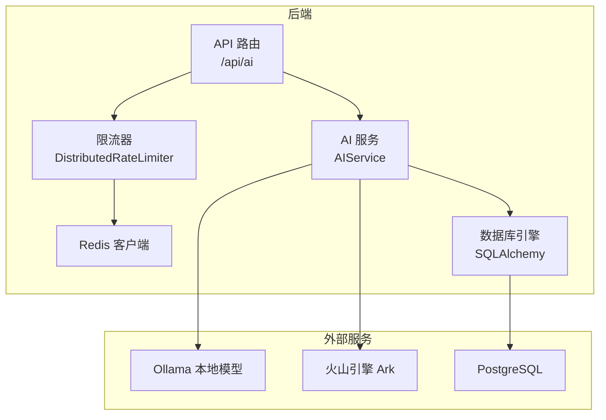
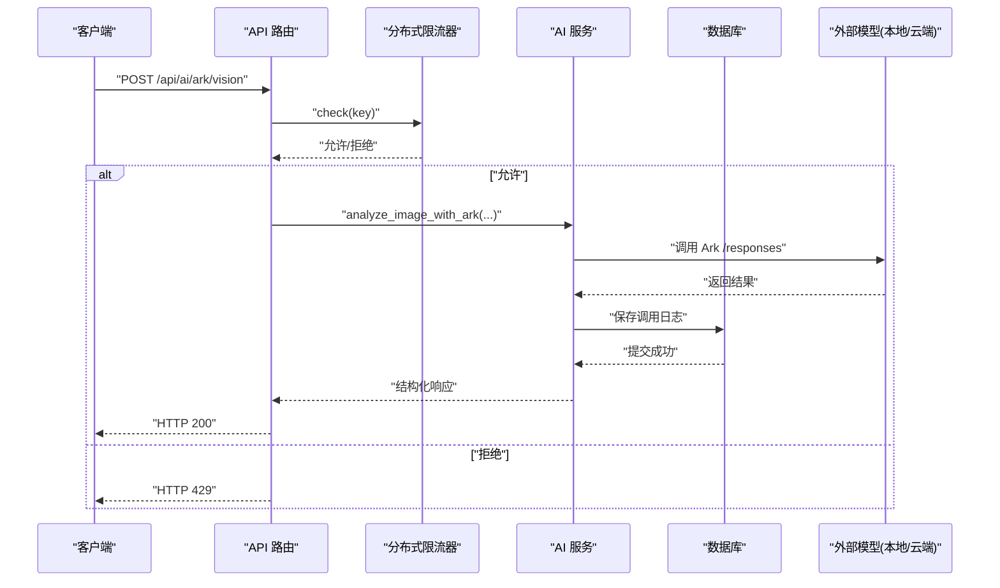
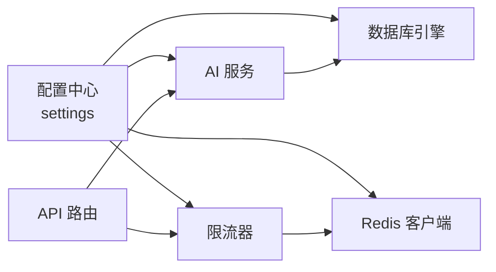

# 性能调优

<cite>
**本文引用的文件**
- [backend/app/core/database.py](file://backend/app/core/database.py)
- [backend/app/core/redis.py](file://backend/app/core/redis.py)
- [backend/app/core/config.py](file://backend/app/core/config.py)
- [backend/app/core/rate_limit.py](file://backend/app/core/rate_limit.py)
- [backend/app/api/endpoints/ai.py](file://backend/app/api/endpoints/ai.py)
- [backend/app/services/ai_service.py](file://backend/app/services/ai_service.py)
- [backend/docker-compose.yml](file://backend/docker-compose.yml)
- [backend/pyproject.toml](file://backend/pyproject.toml)
- [backend/requirements.txt](file://backend/requirements.txt)
</cite>

## 目录
1. [简介](#简介)
2. [项目结构](#项目结构)
3. [核心组件](#核心组件)
4. [架构总览](#架构总览)
5. [详细组件分析](#详细组件分析)
6. [依赖分析](#依赖分析)
7. [性能考虑](#性能考虑)
8. [故障排查指南](#故障排查指南)
9. [结论](#结论)
10. [附录](#附录)

## 简介
本指南面向“智获客”系统的性能调优，覆盖数据库、缓存与限流、AI 推理、前端与 CDN、系统资源监控、负载与压力测试、基准测试与持续优化等关键领域。文档以仓库现有实现为依据，结合最佳实践给出可操作的优化建议与排障路径。

## 项目结构
后端采用 FastAPI + SQLAlchemy 架构，数据库通过连接池管理，AI 推理支持本地 Ollama 与火山引擎 Ark 两种模式，分布式限流基于 Redis 实现，开发与运行通过 docker-compose 编排。

图示来源
- [backend/app/api/endpoints/ai.py:1-103](file://backend/app/api/endpoints/ai.py#L1-L103)
- [backend/app/services/ai_service.py:1-460](file://backend/app/services/ai_service.py#L1-L460)
- [backend/app/core/rate_limit.py:75-108](file://backend/app/core/rate_limit.py#L75-L108)
- [backend/app/core/database.py:6-19](file://backend/app/core/database.py#L6-L19)
- [backend/app/core/redis.py:6-8](file://backend/app/core/redis.py#L6-L8)

章节来源
- [backend/docker-compose.yml:1-67](file://backend/docker-compose.yml#L1-L67)

## 核心组件
- 数据库连接池：通过 SQLAlchemy 引擎配置池大小与预检查，确保连接复用与健康检查。
- Redis 客户端：统一从配置中读取地址，提供全局客户端工厂。
- 分布式限流：Redis 固定窗口计数 + 内存滑动窗口回退，支持多进程与分布式场景。
- AI 服务：统一调用本地 Ollama 或云端火山引擎 Ark，内置日志与耗时统计。
- 配置中心：集中管理数据库、Redis、AI 模型、限流参数等。

章节来源
- [backend/app/core/database.py:6-19](file://backend/app/core/database.py#L6-L19)
- [backend/app/core/redis.py:6-8](file://backend/app/core/redis.py#L6-L8)
- [backend/app/core/rate_limit.py:75-108](file://backend/app/core/rate_limit.py#L75-L108)
- [backend/app/services/ai_service.py:15-38](file://backend/app/services/ai_service.py#L15-L38)
- [backend/app/core/config.py:27-101](file://backend/app/core/config.py#L27-L101)

## 架构总览
后端服务通过 API 路由接收请求，进行鉴权与限流校验，随后调用 AI 服务完成内容改写或图像分析，并持久化调用日志。数据库与 Redis 作为基础设施支撑事务与限流状态存储。

图示来源
- [backend/app/api/endpoints/ai.py:87-103](file://backend/app/api/endpoints/ai.py#L87-L103)
- [backend/app/services/ai_service.py:93-131](file://backend/app/services/ai_service.py#L93-L131)
- [backend/app/core/rate_limit.py:75-108](file://backend/app/core/rate_limit.py#L75-L108)

## 详细组件分析

### 数据库性能优化
- 连接池配置
  - 当前设置：池大小与溢出数量已显式配置，启用连接预检查以提升可用性。
  - 建议
    - 根据并发峰值与慢查询比例调整池大小与超时阈值，避免连接饥饿。
    - 启用连接回收策略，定期清理空闲连接，降低长连接带来的资源占用。
- 查询优化
  - 使用分页与投影字段，避免 SELECT *。
  - 对高频过滤字段建立合适索引，结合 EXPLAIN 分析执行计划。
  - 将热点数据迁移至读副本，主库仅承担写入与复杂 JOIN。
- 事务与锁
  - 控制事务时长，批量写入合并提交，减少锁竞争。
  - 使用合适的隔离级别，避免长事务持有共享锁。

章节来源
- [backend/app/core/database.py:6-19](file://backend/app/core/database.py#L6-L19)

### 缓存与Redis性能优化
- 客户端与键空间
  - 使用统一 Redis 工厂，确保解码一致性与连接复用。
  - 键命名规范：前缀+业务域+时间桶，避免键冲突与扫描开销。
- 限流策略
  - Redis 固定窗口计数法简单高效，适合突发流量控制；如需更平滑曲线可评估令牌桶。
  - 多级限流：接口层限流 + 用户维度限流，结合内存回退保障单节点可用性。
- 缓存命中与失效
  - 对热点查询结果设置 TTL，避免无限增长。
  - 使用多级缓存（本地+Redis），降低跨网络延迟。

章节来源
- [backend/app/core/redis.py:6-8](file://backend/app/core/redis.py#L6-L8)
- [backend/app/core/rate_limit.py:37-73](file://backend/app/core/rate_limit.py#L37-L73)
- [backend/app/core/rate_limit.py:75-108](file://backend/app/core/rate_limit.py#L75-L108)

### AI 服务性能优化
- 模型加载与推理
  - 本地模型：确保 Ollama 服务与宿主机资源隔离，合理设置模型温度与上下文长度。
  - 云端模型：控制并发与超时，开启重试与熔断，记录调用耗时与 Token 使用量。
- 日志与可观测性
  - 记录请求 ID、场景、用户 ID、模型、耗时与 Token 统计，便于定位慢调用。
- 资源隔离
  - 将 AI 服务容器与数据库、缓存分离，避免资源争抢。

章节来源
- [backend/app/services/ai_service.py:15-38](file://backend/app/services/ai_service.py#L15-L38)
- [backend/app/services/ai_service.py:132-240](file://backend/app/services/ai_service.py#L132-L240)
- [backend/app/api/endpoints/ai.py:87-103](file://backend/app/api/endpoints/ai.py#L87-L103)

### 前端性能与CDN配置
- 资源优化
  - 启用 Gzip/Brotli 压缩，拆分入口与业务包，按需加载。
  - 图片与静态资源使用 WebP/JPEG2000 等现代格式，配合懒加载与视口检测。
- CDN 与边缘缓存
  - 将静态资源与 API 响应缓存至就近边缘节点，缩短首字节时间。
  - 设置合理的缓存标签与失效策略，避免陈旧内容。

（本节为通用指导，未直接分析具体文件）

### 系统资源监控与瓶颈识别
- 指标采集
  - 后端：请求 QPS、P95/P99 延迟、错误率、连接池利用率、Redis 命中率。
  - 数据库：慢查询、锁等待、缓冲池命中率、连接数峰值。
  - AI 服务：模型调用耗时分布、Token 速率、失败率。
- 工具与告警
  - 使用 Prometheus + Grafana 建立仪表盘，设置阈值告警与火焰图分析。
  - 关键瓶颈：CPU 上升（AI 推理）、I/O 抖动（数据库/磁盘）、网络抖动（外部模型）。

（本节为通用指导，未直接分析具体文件）

### 负载与压力测试
- 执行流程
  - 明确目标：QPS、并发用户、SLA（延迟/错误率）。
  - 场景设计：登录/鉴权、内容改写、图像分析、批量导入。
  - 工具选择：Locust/JMeter/K6，结合 k6-cloud 进行分布式压测。
  - 数据面：逐步加压，观察数据库与 Redis 的连接池与队列长度。
- 基准测试与回归
  - 建立基线指标，每次变更后回归对比，防止性能回退。
  - 持续优化：热点 SQL 优化、缓存命中率提升、限流阈值动态调整。

（本节为通用指导，未直接分析具体文件）

## 依赖分析
后端依赖关系围绕配置、数据库、Redis、限流与 AI 服务展开，整体耦合度适中，便于独立优化与替换。

图示来源
- [backend/app/core/config.py:27-101](file://backend/app/core/config.py#L27-L101)
- [backend/app/core/database.py:6-19](file://backend/app/core/database.py#L6-L19)
- [backend/app/core/redis.py:6-8](file://backend/app/core/redis.py#L6-L8)
- [backend/app/core/rate_limit.py:75-108](file://backend/app/core/rate_limit.py#L75-L108)
- [backend/app/services/ai_service.py:15-38](file://backend/app/services/ai_service.py#L15-L38)
- [backend/app/api/endpoints/ai.py:1-103](file://backend/app/api/endpoints/ai.py#L1-L103)

章节来源
- [backend/pyproject.toml:7-28](file://backend/pyproject.toml#L7-L28)
- [backend/requirements.txt:1-21](file://backend/requirements.txt#L1-L21)

## 性能考虑
- 数据库
  - 连接池参数与超时需与应用并发匹配，避免阻塞排队。
  - 对高频字段建立索引，定期维护统计信息，避免索引失效。
- 缓存与限流
  - Redis 命中率优先于容量，合理设置 TTL 与淘汰策略。
  - 限流阈值应基于历史峰值与安全余量设定，避免误杀。
- AI 推理
  - 控制上下文长度与温度，减少不必要的计算。
  - 对外部模型调用增加超时与重试，记录耗时分布以便优化。
- 前端与CDN
  - 静态资源版本化与长期缓存，API 响应缓存短期有效。
  - CDN 边缘节点选择与回源策略影响首屏与交互延迟。

（本节为通用指导，未直接分析具体文件）

## 故障排查指南
- 数据库连接异常
  - 现象：连接池耗尽、超时、连接不可用。
  - 排查：检查池大小、超时、慢查询；确认预检查与回收策略。
- Redis 限流异常
  - 现象：429 频繁、限流不生效。
  - 排查：确认 Redis 可用性、键空间前缀、窗口边界；必要时切换内存回退。
- AI 推理失败
  - 现象：外部模型超时、返回错误、Token 异常。
  - 排查：检查 API Key、模型名称、超时设置与重试策略；查看调用日志与耗时统计。
- 配置错误
  - 现象：启动失败、鉴权异常、跨域限制。
  - 排查：核对 .env 与配置项，确保密钥长度与白名单合法。

章节来源
- [backend/app/core/database.py:6-19](file://backend/app/core/database.py#L6-L19)
- [backend/app/core/rate_limit.py:53-73](file://backend/app/core/rate_limit.py#L53-L73)
- [backend/app/services/ai_service.py:132-240](file://backend/app/services/ai_service.py#L132-L240)
- [backend/app/core/config.py:55-69](file://backend/app/core/config.py#L55-L69)

## 结论
通过连接池与索引优化、Redis 限流与缓存策略、AI 推理超时与重试、前端与 CDN 资源治理、以及完善的监控与压测体系，智获客可在保证稳定性的同时持续提升吞吐与延迟表现。建议以基准测试为起点，以压测回归为手段，形成闭环优化机制。

## 附录
- 部署编排
  - 使用 docker-compose 启动后端、PostgreSQL、Redis、Ollama，便于本地与联调环境快速搭建。
- 版本与依赖
  - 后端框架与数据库驱动版本稳定，AI 推理依赖 Ollama 与火山引擎 SDK，注意版本兼容性与安全更新。

章节来源
- [backend/docker-compose.yml:1-67](file://backend/docker-compose.yml#L1-L67)
- [backend/pyproject.toml:7-28](file://backend/pyproject.toml#L7-L28)
- [backend/requirements.txt:1-21](file://backend/requirements.txt#L1-L21)