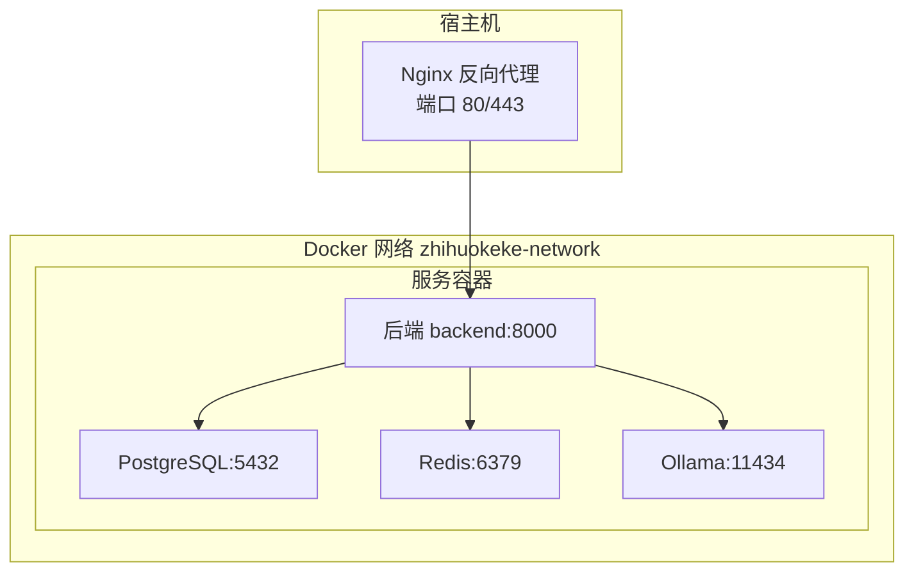
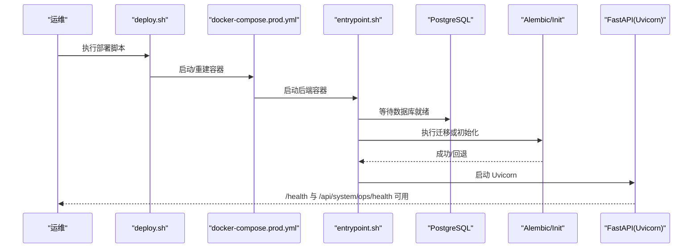
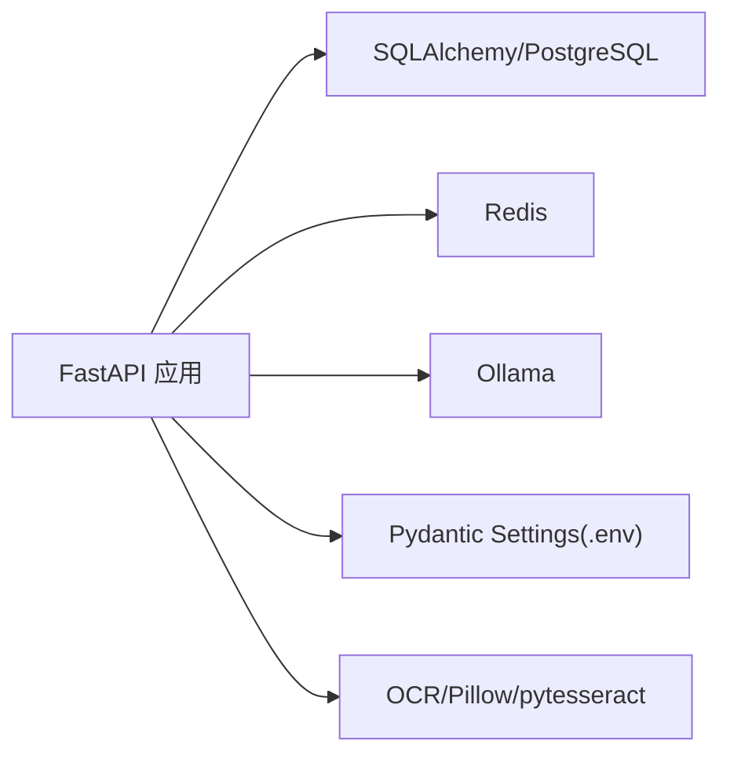

# 生产环境部署

<cite>
**本文引用的文件**
- [Dockerfile](file://backend/Dockerfile)
- [docker-compose.prod.yml](file://backend/docker-compose.prod.yml)
- [docker-compose.yml](file://backend/docker-compose.yml)
- [deploy.sh](file://backend/deploy.sh)
- [entrypoint.sh](file://backend/entrypoint.sh)
- [init_db.py](file://backend/init_db.py)
- [init_db.sh](file://scripts/init_db.sh)
- [backup_db.sh](file://scripts/backup_db.sh)
- [restore_db.sh](file://scripts/restore_db.sh)
- [config.py](file://backend/app/core/config.py)
- [database.py](file://backend/app/core/database.py)
- [redis.py](file://backend/app/core/redis.py)
- [pyproject.toml](file://backend/pyproject.toml)
- [requirements.txt](file://backend/requirements.txt)
</cite>

## 目录
1. [简介](#简介)
2. [项目结构](#项目结构)
3. [核心组件](#核心组件)
4. [架构总览](#架构总览)
5. [详细组件分析](#详细组件分析)
6. [依赖分析](#依赖分析)
7. [性能考虑](#性能考虑)
8. [故障排除指南](#故障排除指南)
9. [结论](#结论)
10. [附录](#附录)

## 简介
本指南面向生产环境部署“智获客”系统，覆盖容器化部署全流程：镜像构建、容器启动、服务配置、环境变量与敏感信息保护、Nginx 反向代理与 SSL 部署、数据库初始化、Redis 配置、Ollama AI 模型部署、健康检查与负载均衡、部署后验证与故障排除、备份与灾难恢复。

## 项目结构
- 后端采用 FastAPI + Uvicorn，通过 Docker Compose 编排 PostgreSQL、Redis、Ollama 与后端服务。
- 部署脚本负责环境准备、镜像构建、容器编排、健康检查与 AI 模型拉取。
- 配置通过 Pydantic Settings 从 .env 注入，支持数据库、Redis、AI 模型、CORS 等参数。
- 数据库迁移由 Alembic 或 fallback 的初始化脚本完成。

图表来源
- [docker-compose.prod.yml:6-112](file://backend/docker-compose.prod.yml#L6-L112)

章节来源
- [docker-compose.prod.yml:1-112](file://backend/docker-compose.prod.yml#L1-L112)
- [docker-compose.yml:1-67](file://backend/docker-compose.yml#L1-L67)

## 核心组件
- 容器编排：PostgreSQL、Redis、Ollama、FastAPI 后端。
- 镜像构建：基于 Python 3.10 slim，使用国内镜像加速安装依赖。
- 启动流程：entrypoint 等待数据库、执行迁移或初始化、可选创建测试用户、启动 Uvicorn。
- 配置体系：Pydantic Settings 从 .env 加载，校验密钥强度与 CORS 白名单。
- 数据库：SQLAlchemy 引擎与连接池配置，支持 Alembic 迁移。
- 缓存与限流：Redis 客户端与速率限制开关。
- AI 模型：Ollama 本地推理，支持切换云端模型。

章节来源
- [Dockerfile:1-19](file://backend/Dockerfile#L1-L19)
- [entrypoint.sh:1-48](file://backend/entrypoint.sh#L1-L48)
- [config.py:15-103](file://backend/app/core/config.py#L15-L103)
- [database.py:1-29](file://backend/app/core/database.py#L1-L29)
- [redis.py:1-8](file://backend/app/core/redis.py#L1-L8)
- [pyproject.toml:1-47](file://backend/pyproject.toml#L1-L47)
- [requirements.txt:1-21](file://backend/requirements.txt#L1-L21)

## 架构总览
生产部署采用单机多容器模式，所有服务位于同一 Docker 网络内，通过健康检查保证启动顺序与可用性。后端暴露 /health 与 /api/system/ops/health 用于外部健康检查。

图表来源
- [deploy.sh:76-108](file://backend/deploy.sh#L76-L108)
- [entrypoint.sh:7-47](file://backend/entrypoint.sh#L7-L47)
- [docker-compose.prod.yml:31-59](file://backend/docker-compose.prod.yml#L31-L59)

## 详细组件分析

### 镜像构建与容器启动
- 基础镜像：Python 3.10 slim，使用清华源加速 pip 安装。
- 依赖安装：一次性 COPY requirements.txt 并安装，减少层大小。
- 启动入口：entrypoint.sh 处理数据库等待、迁移/初始化、可选测试用户、Uvicorn 启动。
- 生产编排：docker-compose.prod.yml 指定健康检查、日志轮转、卷挂载与网络隔离。

章节来源
- [Dockerfile:1-19](file://backend/Dockerfile#L1-L19)
- [entrypoint.sh:1-48](file://backend/entrypoint.sh#L1-L48)
- [docker-compose.prod.yml:31-59](file://backend/docker-compose.prod.yml#L31-L59)

### 环境变量与敏感信息保护
- 必填项：DATABASE_PASSWORD、SECRET_KEY。
- 密钥校验：禁止使用占位符，长度至少 32 字符。
- CORS 白名单：生产禁止使用通配符。
- 部署脚本：首次运行自动生成强随机密钥与数据库口令，并同步 DATABASE_URL。
- 安全建议：将 .env 放置于受控目录，仅授予必要权限；定期轮换密钥。

章节来源
- [deploy.sh:29-56](file://backend/deploy.sh#L29-L56)
- [deploy.sh:58-62](file://backend/deploy.sh#L58-L62)
- [config.py:55-69](file://backend/app/core/config.py#L55-L69)
- [config.py:38-41](file://backend/app/core/config.py#L38-L41)

### 数据库初始化与迁移
- 迁移优先：使用 Alembic 升级到最新版本。
- 回退策略：若 Alembic 不可用或失败，回退到初始化脚本创建所有表。
- 开发工具：提供 init_db.sh 快速执行初始化。

章节来源
- [entrypoint.sh:23-35](file://backend/entrypoint.sh#L23-L35)
- [init_db.py:16-21](file://backend/init_db.py#L16-L21)
- [init_db.sh:1-5](file://scripts/init_db.sh#L1-L5)

### Redis 配置与速率限制
- 默认启用 Redis 限流，键前缀可配置。
- 客户端通过统一工厂函数获取连接。
- 建议：生产使用持久化 AOF，设置合理内存上限与淘汰策略。

章节来源
- [config.py:86-90](file://backend/app/core/config.py#L86-L90)
- [redis.py:1-8](file://backend/app/core/redis.py#L1-L8)

### Ollama AI 模型部署
- 容器暴露 11434 端口，挂载数据卷。
- 健康检查：通过 ollama list 判断服务可用。
- 部署脚本：后台异步拉取 qwen2:1.5b 模型。
- 切换策略：可通过配置切换至云端模型。

章节来源
- [docker-compose.prod.yml:61-83](file://backend/docker-compose.prod.yml#L61-L83)
- [deploy.sh:110-116](file://backend/deploy.sh#L110-L116)
- [config.py:71-75](file://backend/app/core/config.py#L71-L75)

### 健康检查与负载均衡
- 数据库：pg_isready 健康检查。
- 后端：内部 readiness 探针，外部 /health。
- Redis：redis-cli ping。
- Ollama：ollama list。
- 负载均衡：建议在 Nginx 层对后端进行轮询或权重分发，结合 /health 实现自动摘除。

章节来源
- [docker-compose.prod.yml:19-23](file://backend/docker-compose.prod.yml#L19-L23)
- [docker-compose.prod.yml:49-54](file://backend/docker-compose.prod.yml#L49-L54)
- [docker-compose.prod.yml:92-96](file://backend/docker-compose.prod.yml#L92-L96)
- [docker-compose.prod.yml:72-77](file://backend/docker-compose.prod.yml#L72-L77)

### Nginx 反向代理与 SSL 部署
- 反代后端：将 80/443 映射到后端 8000。
- SSL：使用 Let’s Encrypt 或商业证书，开启 TLS 1.3 与现代密码套件。
- 安全头：Strict-Transport-Security、X-Frame-Options、X-Content-Type-Options、Referrer-Policy。
- 超时与缓冲：合理设置 proxy_read_timeout、proxy_connect_timeout、proxy_buffering。
- 证书更新：自动化续期并重载 Nginx。

（本节为通用实践说明，不直接分析具体文件）

### 部署后验证与故障排除
- 验证清单：
  - /health 与 /api/system/ops/health 返回 200。
  - 数据库连接正常，表结构已迁移。
  - Redis 可 ping，速率限制生效。
  - Ollama 可列出模型，推理可用。
- 故障排查：
  - 查看后端日志：docker compose logs -f backend。
  - 检查依赖容器健康状态：docker compose ps。
  - 端口冲突：确认宿主机 8000 未被占用。
  - 网络连通：确保容器在同一 Docker 网络。

章节来源
- [deploy.sh:84-108](file://backend/deploy.sh#L84-L108)
- [docker-compose.prod.yml:31-59](file://backend/docker-compose.prod.yml#L31-L59)

## 依赖分析
- 语言与框架：Python 3.10、FastAPI、Uvicorn。
- 数据库：SQLAlchemy、Alembic、PostgreSQL。
- 缓存：Redis。
- AI：Ollama。
- OCR 与图像处理：Pillow、pytesseract。
- 类型与校验：Pydantic、Pydantic Settings、python-dotenv。

图表来源
- [pyproject.toml:7-31](file://backend/pyproject.toml#L7-L31)
- [requirements.txt:1-21](file://backend/requirements.txt#L1-L21)

章节来源
- [pyproject.toml:1-47](file://backend/pyproject.toml#L1-L47)
- [requirements.txt:1-21](file://backend/requirements.txt#L1-L21)

## 性能考虑
- 连接池：数据库连接池大小与溢出量按并发需求调整。
- Gunicorn/Uvicorn：生产建议使用多 worker，结合进程/线程模型优化。
- Redis：持久化策略与内存淘汰策略，避免阻塞命令。
- 存储：上传目录与数据库卷分离，定期清理临时文件。
- 网络：容器间通信走 Docker 内部网络，避免跨主机延迟。

（本节为通用指导，不直接分析具体文件）

## 故障排除指南
- 启动失败：
  - 检查 .env 是否包含占位值，必要时重新生成。
  - 确认 DATABASE_URL 与数据库凭据正确。
- 数据库异常：
  - 等待 pg_isready 健康检查通过后再依赖。
  - 若 Alembic 失败，回退到初始化脚本。
- Redis 异常：
  - 确认 Redis 已持久化，客户端可 ping。
- Ollama 异常：
  - 确认 11434 端口可达，模型已拉取。
- 日志定位：
  - 使用部署脚本提供的日志查看命令。
  - 关注后端健康检查返回与最近日志。

章节来源
- [deploy.sh:58-62](file://backend/deploy.sh#L58-L62)
- [entrypoint.sh:23-35](file://backend/entrypoint.sh#L23-L35)
- [docker-compose.prod.yml:19-23](file://backend/docker-compose.prod.yml#L19-L23)
- [docker-compose.prod.yml:92-96](file://backend/docker-compose.prod.yml#L92-L96)
- [docker-compose.prod.yml:72-77](file://backend/docker-compose.prod.yml#L72-L77)

## 结论
通过 Docker Compose 编排与标准化的启动流程，智获客可在生产环境实现快速部署与稳定运行。配合 Nginx 反向代理与 SSL、完善的健康检查与日志策略、以及数据库与 AI 模型的初始化与维护，可满足高可用与可扩展的业务需求。

## 附录

### 部署步骤清单
- 准备服务器与 Docker 环境。
- 生成并完善 .env，确保密钥与数据库口令安全。
- 执行部署脚本，等待后端健康检查通过。
- 拉取 Ollama 模型，验证 AI 推理能力。
- 配置 Nginx 反向代理与 SSL 证书。
- 进行端到端验证与压力测试。

章节来源
- [deploy.sh:18-108](file://backend/deploy.sh#L18-L108)
- [docker-compose.prod.yml:6-112](file://backend/docker-compose.prod.yml#L6-L112)

### 备份策略与灾难恢复
- 数据库备份：建议每日增量+每周全量，加密存储于安全位置，定期验证恢复。
- 配置与日志：.env 与容器日志纳入备份范围。
- Redis：保留 AOF/RDB 快照，确保可回滚。
- Ollama：模型权重卷纳入快照，避免重复下载。
- 灾难恢复：制定 RTO/RPO 指标，演练恢复流程，验证数据一致性。

章节来源
- [backup_db.sh:1-4](file://scripts/backup_db.sh#L1-L4)
- [restore_db.sh:1-4](file://scripts/restore_db.sh#L1-L4)