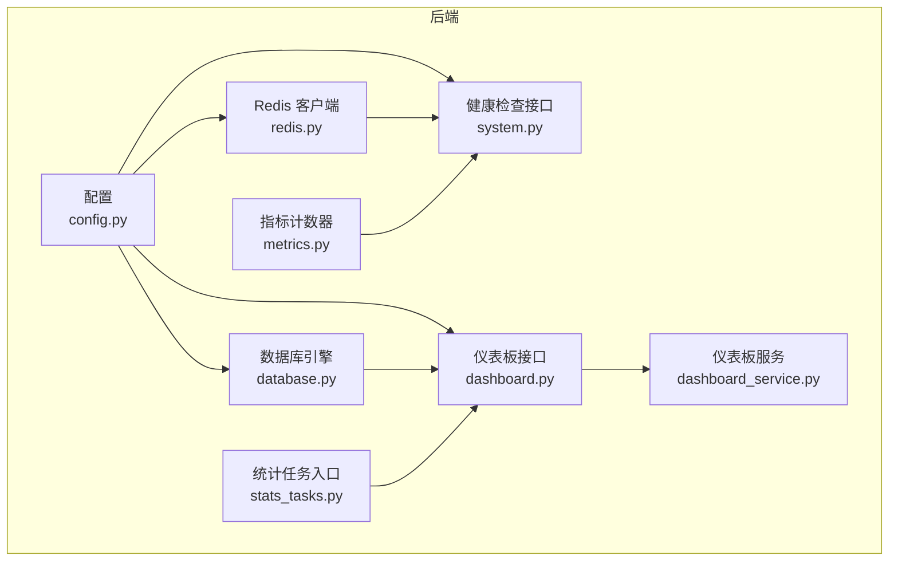
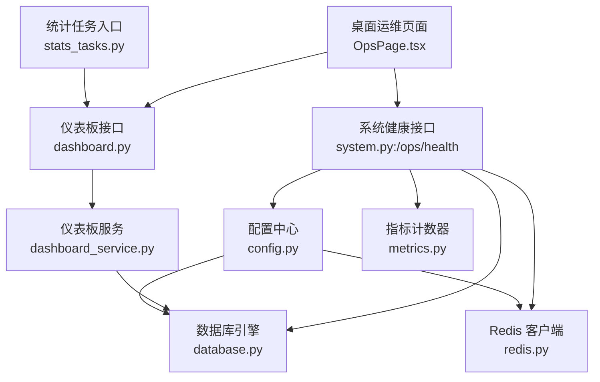
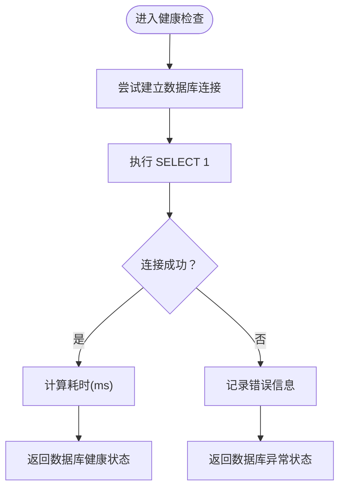
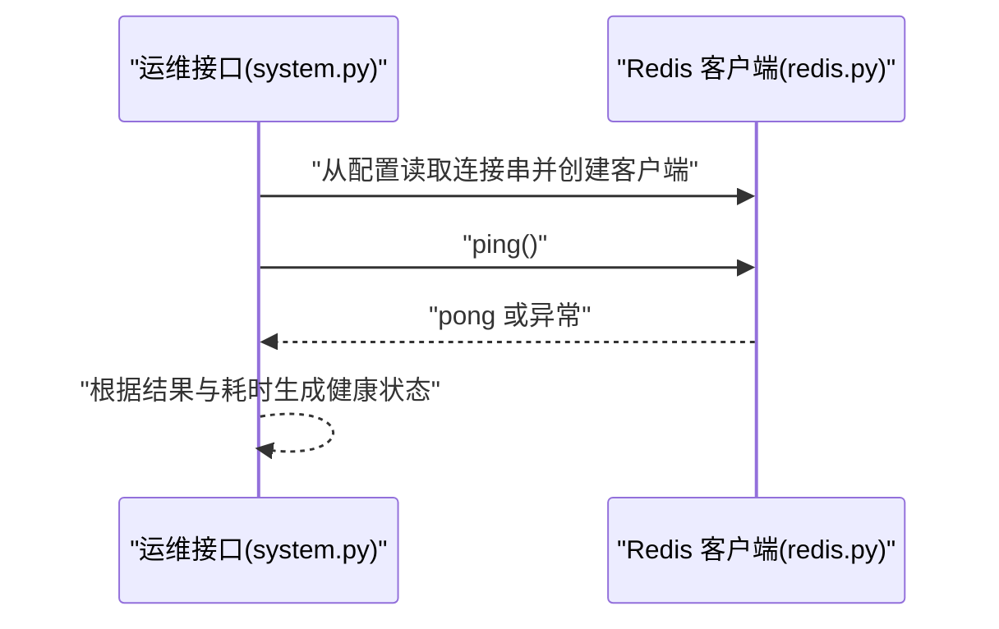
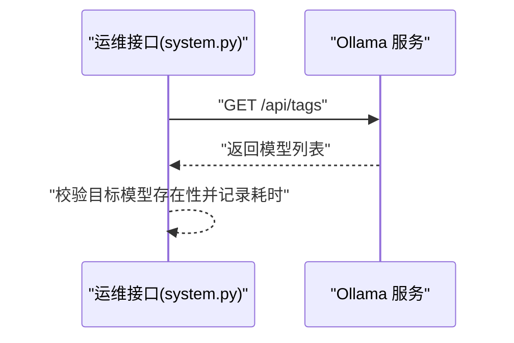
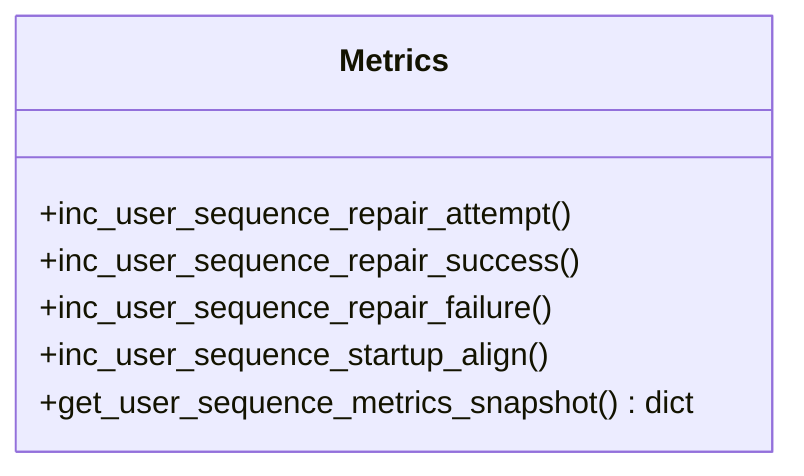
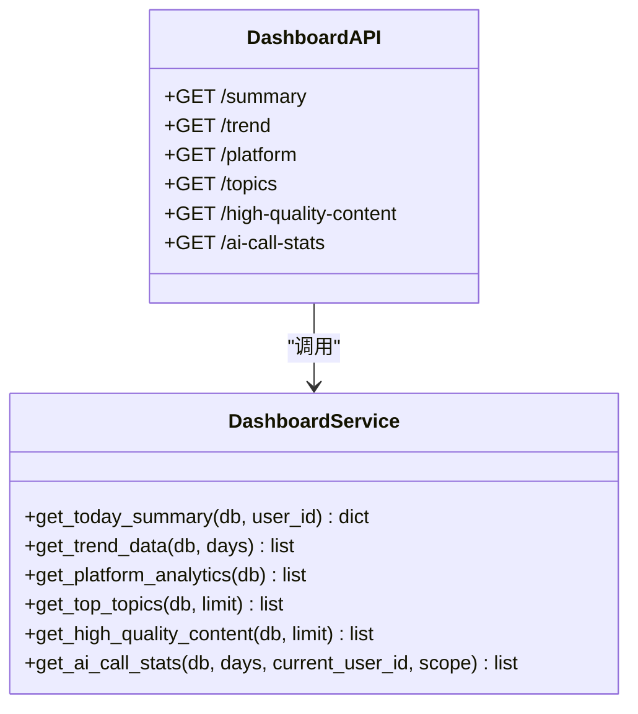
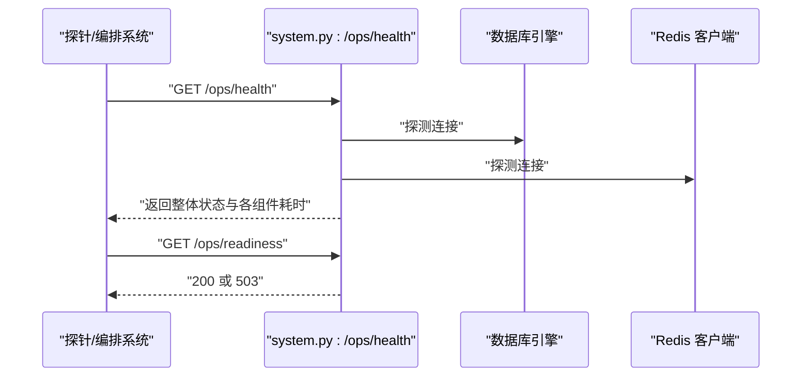
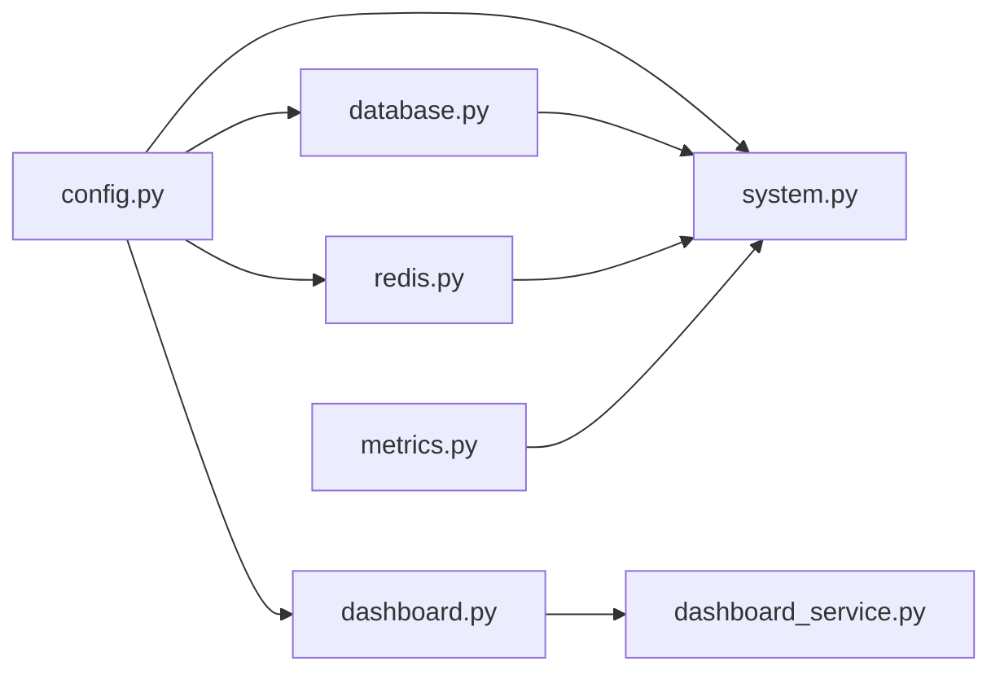

# 监控与告警

<cite>
**本文引用的文件**
- [backend/app/core/config.py](file://backend/app/core/config.py)
- [backend/app/core/database.py](file://backend/app/core/database.py)
- [backend/app/core/redis.py](file://backend/app/core/redis.py)
- [backend/app/core/metrics.py](file://backend/app/core/metrics.py)
- [backend/app/core/logger.py](file://backend/app/core/logger.py)
- [backend/app/api/endpoints/system.py](file://backend/app/api/endpoints/system.py)
- [backend/app/api/endpoints/dashboard.py](file://backend/app/api/endpoints/dashboard.py)
- [backend/app/services/dashboard_service.py](file://backend/app/services/dashboard_service.py)
- [backend/app/tasks/stats_tasks.py](file://backend/app/tasks/stats_tasks.py)
- [deploy/docker-compose.yml](file://deploy/docker-compose.yml)
- [deploy/monitoring/README.md](file://deploy/monitoring/README.md)
- [docs/operations/maintenance-checklist.md](file://docs/operations/maintenance-checklist.md)
- [desktop/src/pages/OpsPage.tsx](file://desktop/src/pages/OpsPage.tsx)
</cite>

## 目录
1. [简介](#简介)
2. [项目结构](#项目结构)
3. [核心组件](#核心组件)
4. [架构总览](#架构总览)
5. [组件详解](#组件详解)
6. [依赖关系分析](#依赖关系分析)
7. [性能考量](#性能考量)
8. [故障排查指南](#故障排查指南)
9. [结论](#结论)
10. [附录](#附录)

## 简介
本运维指南面向“智获客监控与告警系统”，围绕应用指标采集与监控配置、日志系统与聚合方案、告警规则与通知渠道、数据库/Redis/AI服务监控、监控仪表板搭建与可视化、性能瓶颈识别与优化策略，以及故障预警与应急响应流程进行系统化说明。文档以仓库现有代码与部署说明为基础，结合实际可落地的运维实践，帮助团队建立稳定可靠的运行保障体系。

## 项目结构
后端采用 FastAPI + SQLAlchemy 架构，核心监控能力由以下模块协同构成：
- 配置层：集中管理数据库、Redis、AI模型、速率限制等运行参数
- 数据访问层：统一数据库引擎与会话管理
- 缓存访问层：Redis 客户端封装
- 指标层：用户序列修复与启动对齐的只读计数器
- 健康探测层：系统健康/就绪检查接口，覆盖数据库、Redis、本地/云端AI服务
- 仪表板层：业务指标聚合与趋势分析接口
- 任务层：统计任务入口（当前为空实现）
- 部署层：Compose 扩展后端服务，监控组件位于 deploy/monitoring 目录

图表来源
- [backend/app/core/config.py:15-103](file://backend/app/core/config.py#L15-L103)
- [backend/app/core/database.py:1-29](file://backend/app/core/database.py#L1-L29)
- [backend/app/core/redis.py:1-8](file://backend/app/core/redis.py#L1-L8)
- [backend/app/core/metrics.py:1-44](file://backend/app/core/metrics.py#L1-L44)
- [backend/app/api/endpoints/system.py:1-171](file://backend/app/api/endpoints/system.py#L1-L171)
- [backend/app/api/endpoints/dashboard.py:1-100](file://backend/app/api/endpoints/dashboard.py#L1-L100)
- [backend/app/services/dashboard_service.py:1-209](file://backend/app/services/dashboard_service.py#L1-L209)
- [backend/app/tasks/stats_tasks.py:1-3](file://backend/app/tasks/stats_tasks.py#L1-L3)

章节来源
- [backend/app/core/config.py:15-103](file://backend/app/core/config.py#L15-L103)
- [backend/app/core/database.py:1-29](file://backend/app/core/database.py#L1-L29)
- [backend/app/core/redis.py:1-8](file://backend/app/core/redis.py#L1-L8)
- [backend/app/core/metrics.py:1-44](file://backend/app/core/metrics.py#L1-L44)
- [backend/app/api/endpoints/system.py:1-171](file://backend/app/api/endpoints/system.py#L1-L171)
- [backend/app/api/endpoints/dashboard.py:1-100](file://backend/app/api/endpoints/dashboard.py#L1-L100)
- [backend/app/services/dashboard_service.py:1-209](file://backend/app/services/dashboard_service.py#L1-L209)
- [backend/app/tasks/stats_tasks.py:1-3](file://backend/app/tasks/stats_tasks.py#L1-L3)
- [deploy/docker-compose.yml:1-7](file://deploy/docker-compose.yml#L1-L7)

## 核心组件
- 配置中心：集中定义数据库、Redis、AI模型、速率限制、CORS、WeCom 等参数，并提供校验逻辑，确保生产安全与一致性
- 数据库引擎：基于 SQLAlchemy 创建带连接池的引擎，支持预检测与溢出控制
- Redis 客户端：从配置读取连接串，提供统一客户端获取方法
- 指标计数器：线程安全的用户序列修复/启动对齐计数器，用于追踪用户 ID 序列健康状况
- 健康检查接口：提供数据库/Redis/本地/云端AI服务探测，输出整体状态与耗时
- 仪表板接口：提供今日汇总、趋势、平台分析、热门话题、高质量内容、AI调用统计等指标
- 统计任务入口：预留统计任务调度点位（当前为空实现）

章节来源
- [backend/app/core/config.py:15-103](file://backend/app/core/config.py#L15-L103)
- [backend/app/core/database.py:1-29](file://backend/app/core/database.py#L1-L29)
- [backend/app/core/redis.py:1-8](file://backend/app/core/redis.py#L1-L8)
- [backend/app/core/metrics.py:1-44](file://backend/app/core/metrics.py#L1-L44)
- [backend/app/api/endpoints/system.py:134-171](file://backend/app/api/endpoints/system.py#L134-L171)
- [backend/app/api/endpoints/dashboard.py:1-100](file://backend/app/api/endpoints/dashboard.py#L1-L100)
- [backend/app/services/dashboard_service.py:1-209](file://backend/app/services/dashboard_service.py#L1-L209)
- [backend/app/tasks/stats_tasks.py:1-3](file://backend/app/tasks/stats_tasks.py#L1-L3)

## 架构总览
下图展示了监控与告警在系统中的位置与交互关系：配置驱动数据库/Redis/AI参数；健康检查接口作为运维可观测性入口；仪表板接口聚合业务指标；统计任务作为后台指标产出补充；桌面端运维页面用于实时展示健康状态。

图表来源
- [desktop/src/pages/OpsPage.tsx:81-138](file://desktop/src/pages/OpsPage.tsx#L81-L138)
- [backend/app/api/endpoints/system.py:134-171](file://backend/app/api/endpoints/system.py#L134-L171)
- [backend/app/api/endpoints/dashboard.py:1-100](file://backend/app/api/endpoints/dashboard.py#L1-100)
- [backend/app/services/dashboard_service.py:1-209](file://backend/app/services/dashboard_service.py#L1-L209)
- [backend/app/core/config.py:15-103](file://backend/app/core/config.py#L15-L103)
- [backend/app/core/database.py:1-29](file://backend/app/core/database.py#L1-L29)
- [backend/app/core/redis.py:1-8](file://backend/app/core/redis.py#L1-L8)
- [backend/app/core/metrics.py:1-44](file://backend/app/core/metrics.py#L1-L44)
- [backend/app/tasks/stats_tasks.py:1-3](file://backend/app/tasks/stats_tasks.py#L1-L3)

## 组件详解

### 配置与参数校验
- 数据库：支持主机、端口、用户名、密码、库名、是否自动建表、调试模式等
- Redis：支持启用/禁用、连接串、键前缀等
- AI模型：支持本地 Ollama 与云端火山方舟（Ark）模型配置、超时、限流窗口
- CORS：生产环境禁止通配符来源
- WeCom：Webhook 地址等集成参数
- 文件上传：最大尺寸与存储目录
- 速率限制：分布式限流开关与键前缀

章节来源
- [backend/app/core/config.py:27-101](file://backend/app/core/config.py#L27-L101)

### 数据库监控
- 引擎创建：连接池大小与溢出控制，pre_ping 启用保证连接可用性
- 会话管理：依赖注入式 Session 获取与关闭
- 健康探测：通过 SELECT 1 快速验证连通性并返回耗时

图表来源
- [backend/app/api/endpoints/system.py:39-60](file://backend/app/api/endpoints/system.py#L39-L60)
- [backend/app/core/database.py:6-29](file://backend/app/core/database.py#L6-L29)

章节来源
- [backend/app/core/database.py:1-29](file://backend/app/core/database.py#L1-L29)
- [backend/app/api/endpoints/system.py:39-60](file://backend/app/api/endpoints/system.py#L39-L60)

### Redis 监控
- 客户端获取：从配置读取连接串，解码响应
- 健康探测：按超时参数连接并 ping，返回连通性与耗时
- 条件探测：当未启用速率限制时直接返回“未启用”状态

图表来源
- [backend/app/api/endpoints/system.py:62-99](file://backend/app/api/endpoints/system.py#L62-L99)
- [backend/app/core/redis.py:6-8](file://backend/app/core/redis.py#L6-L8)

章节来源
- [backend/app/core/redis.py:1-8](file://backend/app/core/redis.py#L1-L8)
- [backend/app/api/endpoints/system.py:62-99](file://backend/app/api/endpoints/system.py#L62-L99)

### AI 服务监控（Ollama 与火山方舟）
- Ollama 探测：访问标签列表接口，校验目标模型是否存在
- 火山方舟（Ark）：通过配置项控制使用云端模型，结合限流参数进行调用

图表来源
- [backend/app/api/endpoints/system.py:102-131](file://backend/app/api/endpoints/system.py#L102-L131)
- [backend/app/core/config.py:71-84](file://backend/app/core/config.py#L71-L84)

章节来源
- [backend/app/api/endpoints/system.py:102-131](file://backend/app/api/endpoints/system.py#L102-L131)
- [backend/app/core/config.py:71-84](file://backend/app/core/config.py#L71-L84)

### 指标采集与用户序列修复监控
- 计数器：线程安全地维护“修复尝试/成功/失败/启动对齐”计数
- 导出：提供快照读取接口，便于健康检查或仪表板展示

图表来源
- [backend/app/core/metrics.py:12-44](file://backend/app/core/metrics.py#L12-L44)

章节来源
- [backend/app/core/metrics.py:1-44](file://backend/app/core/metrics.py#L1-L44)
- [backend/app/api/endpoints/system.py:33-36](file://backend/app/api/endpoints/system.py#L33-L36)

### 业务指标与仪表板
- 今日汇总：新增客户、微信添加、线索、有效线索、转化数
- 趋势数据：近 N 天发布量、浏览量、私信、微信添加、线索、有效线索、转化
- 平台分析：按平台统计发布量与转化
- 热门主题：按有效线索排序的内容主题
- 高质量内容：按有效线索排序的高价值内容
- AI 调用统计：按日期与用户聚合的调用次数、失败次数、Token 使用、平均延迟

图表来源
- [backend/app/services/dashboard_service.py:7-209](file://backend/app/services/dashboard_service.py#L7-L209)
- [backend/app/api/endpoints/dashboard.py:11-99](file://backend/app/api/endpoints/dashboard.py#L11-L99)

章节来源
- [backend/app/services/dashboard_service.py:1-209](file://backend/app/services/dashboard_service.py#L1-L209)
- [backend/app/api/endpoints/dashboard.py:1-100](file://backend/app/api/endpoints/dashboard.py#L1-L100)

### 日志系统与日志聚合
- 日志器：提供按名称获取 Logger 的工厂方法
- 日志聚合：建议在部署层引入日志收集组件（如 Filebeat/Fluent Bit/Fluentd），将后端容器标准输出与文件日志汇聚至集中式日志系统（如 ELK/Elasticsearch/OpenSearch/云日志服务）

章节来源
- [backend/app/core/logger.py:1-6](file://backend/app/core/logger.py#L1-L6)
- [deploy/monitoring/README.md:1-1](file://deploy/monitoring/README.md#L1-L1)

### 健康检查与就绪检查
- 整体健康：数据库、Redis、AI 服务三者共同决定“ok/degraded”
- 就绪检查：仅在数据库与 Redis 就绪时返回 200，否则 503

图表来源
- [backend/app/api/endpoints/system.py:134-171](file://backend/app/api/endpoints/system.py#L134-L171)

章节来源
- [backend/app/api/endpoints/system.py:134-171](file://backend/app/api/endpoints/system.py#L134-L171)

### 桌面端运维页面与健康展示
- 自动刷新：每 30 秒轮询健康状态
- 实时展示：整体状态、数据库、Redis、API 版本等关键指标
- 错误提示：网络或服务异常时显示错误信息

章节来源
- [desktop/src/pages/OpsPage.tsx:81-138](file://desktop/src/pages/OpsPage.tsx#L81-L138)

## 依赖关系分析
- 配置驱动：数据库/Redis/AI 参数由配置中心统一提供
- 接口依赖：健康检查接口依赖数据库引擎、Redis 客户端与指标计数器
- 业务依赖：仪表板接口依赖数据库与服务层聚合逻辑
- 任务依赖：统计任务入口预留扩展点，当前为空实现

图表来源
- [backend/app/core/config.py:15-103](file://backend/app/core/config.py#L15-L103)
- [backend/app/core/database.py:1-29](file://backend/app/core/database.py#L1-L29)
- [backend/app/core/redis.py:1-8](file://backend/app/core/redis.py#L1-L8)
- [backend/app/core/metrics.py:1-44](file://backend/app/core/metrics.py#L1-L44)
- [backend/app/api/endpoints/system.py:1-171](file://backend/app/api/endpoints/system.py#L1-L171)
- [backend/app/api/endpoints/dashboard.py:1-100](file://backend/app/api/endpoints/dashboard.py#L1-L100)
- [backend/app/services/dashboard_service.py:1-209](file://backend/app/services/dashboard_service.py#L1-L209)

章节来源
- [backend/app/core/config.py:15-103](file://backend/app/core/config.py#L15-L103)
- [backend/app/core/database.py:1-29](file://backend/app/core/database.py#L1-L29)
- [backend/app/core/redis.py:1-8](file://backend/app/core/redis.py#L1-L8)
- [backend/app/core/metrics.py:1-44](file://backend/app/core/metrics.py#L1-L44)
- [backend/app/api/endpoints/system.py:1-171](file://backend/app/api/endpoints/system.py#L1-L171)
- [backend/app/api/endpoints/dashboard.py:1-100](file://backend/app/api/endpoints/dashboard.py#L1-L100)
- [backend/app/services/dashboard_service.py:1-209](file://backend/app/services/dashboard_service.py#L1-L209)

## 性能考量
- 数据库连接池：合理设置 pool_size 与 max_overflow，避免高并发下的连接争用
- 健康探测超时：Redis 探测设置了连接与读取超时，建议与探针间隔配合，避免频繁探测造成额外压力
- 指标导出：计数器为只读快照，开销极低；建议在健康检查中按需返回
- 仪表板查询：趋势与聚合查询涉及多表关联与分组，建议对关键字段建立索引并控制查询天数范围
- AI 服务：Ollama/Ark 调用应设置合理超时与重试策略，避免阻塞请求线程

[本节为通用性能建议，无需特定文件引用]

## 故障排查指南
- 运维检查清单：数据库连接、Redis 连接、任务队列消费、日志与告警
- 健康检查接口：优先通过 /ops/health 与 /ops/readiness 快速定位问题根因
- 日志采集：确认容器日志输出与集中式日志系统连通性
- 配置校验：生产环境禁止 CORS 通配符，密钥长度与强度要求

章节来源
- [docs/operations/maintenance-checklist.md:1-7](file://docs/operations/maintenance-checklist.md#L1-L7)
- [backend/app/api/endpoints/system.py:134-171](file://backend/app/api/endpoints/system.py#L134-L171)
- [backend/app/core/config.py:55-69](file://backend/app/core/config.py#L55-L69)

## 结论
本指南基于仓库现有代码与部署说明，梳理了监控与告警的关键路径：配置驱动、健康检查、业务指标聚合与可视化、日志与告警、以及故障排查与应急流程。建议在现有基础上完善监控组件部署（deploy/monitoring）、接入集中式日志与告警平台，并持续优化数据库与查询性能，以支撑业务稳定增长。

[本节为总结性内容，无需特定文件引用]

## 附录

### 监控仪表板搭建与可视化
- 桌面端运维页面：提供整体健康状态与关键指标的实时展示，支持手动刷新与自动刷新
- 仪表板接口：提供今日汇总、趋势、平台分析、热门主题、高质量内容、AI 调用统计等数据源
- 建议：将上述接口对接到可视化工具（如 Grafana/前端图表库），构建多维度仪表板

章节来源
- [desktop/src/pages/OpsPage.tsx:81-138](file://desktop/src/pages/OpsPage.tsx#L81-L138)
- [backend/app/api/endpoints/dashboard.py:1-100](file://backend/app/api/endpoints/dashboard.py#L1-L100)
- [backend/app/services/dashboard_service.py:1-209](file://backend/app/services/dashboard_service.py#L1-L209)

### 告警规则与通知渠道
- 告警规则：建议基于健康检查接口的整体状态与耗时阈值触发；数据库/Redis/AI 服务可用性与延迟作为二级告警
- 通知渠道：结合企业微信 Webhook 等集成，将告警推送到工作群或个人
- 建议：在部署层引入告警组件（如 Prometheus Alertmanager/PagerDuty/飞书机器人），并与现有配置联动

章节来源
- [backend/app/api/endpoints/system.py:134-171](file://backend/app/api/endpoints/system.py#L134-L171)
- [backend/app/core/config.py:95-97](file://backend/app/core/config.py#L95-L97)

### 部署与扩展
- Compose 扩展：通过 deploy/docker-compose.yml 扩展后端服务，监控组件位于 deploy/monitoring 目录
- 建议：将监控组件（Prometheus/Grafana/Alertmanager/日志栈）纳入同一编排，实现统一运维

章节来源
- [deploy/docker-compose.yml:1-7](file://deploy/docker-compose.yml#L1-L7)
- [deploy/monitoring/README.md:1-1](file://deploy/monitoring/README.md#L1-L1)