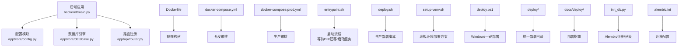
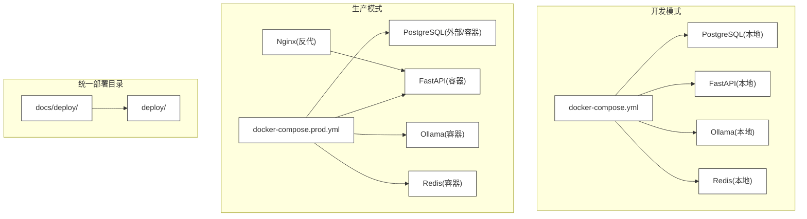
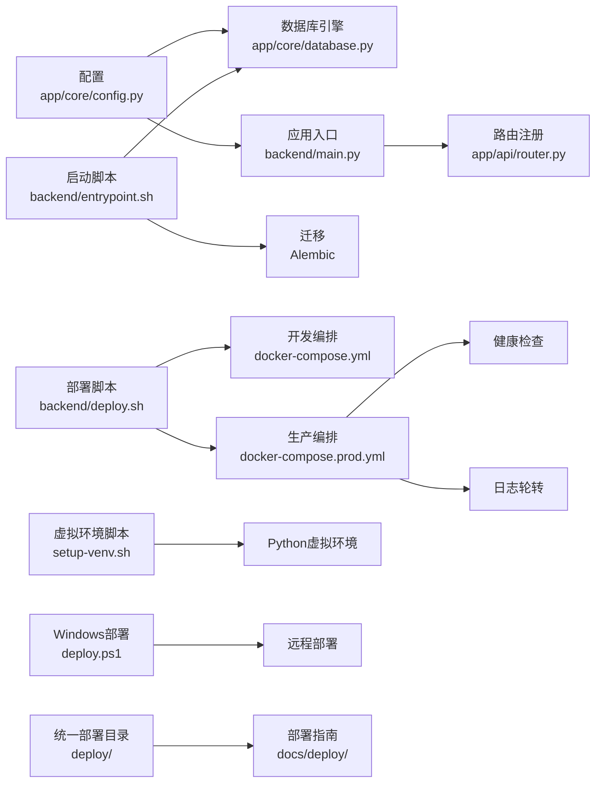
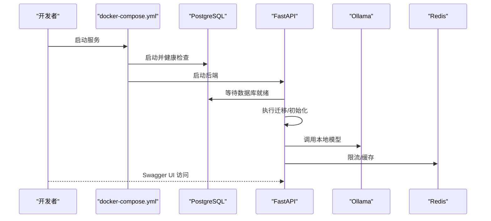
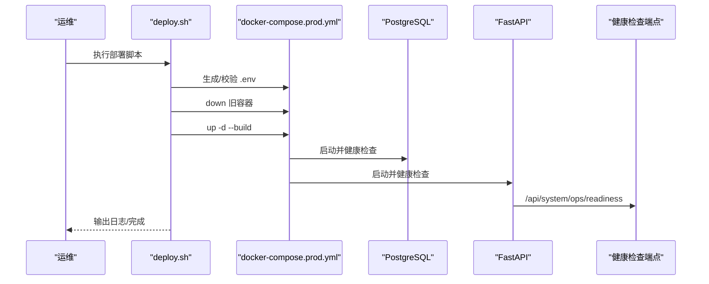
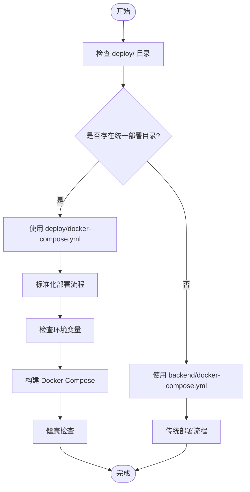
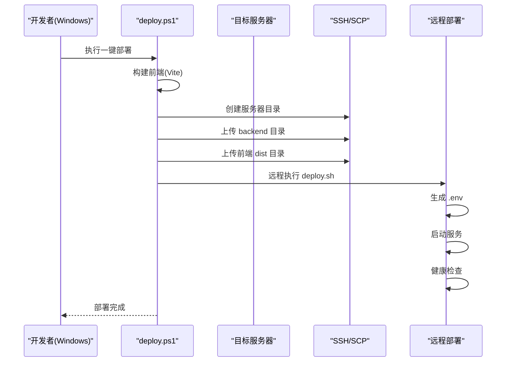
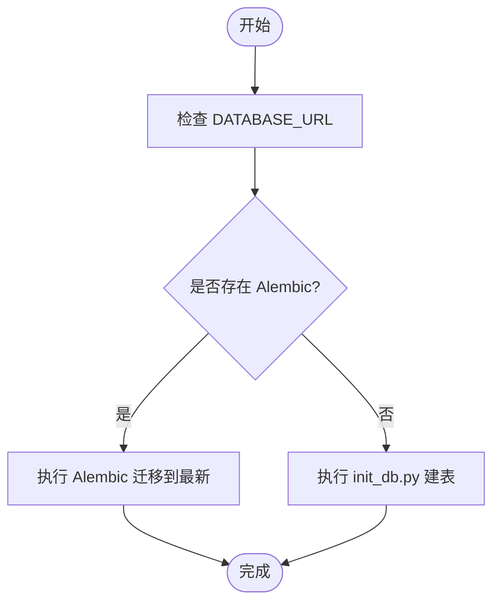

# 部署与运维

<cite>
**本文引用的文件**
- [backend/README.md](file://backend/README.md)
- [backend/QUICKSTART.md](file://backend/QUICKSTART.md)
- [backend/Dockerfile](file://backend/Dockerfile)
- [backend/docker-compose.yml](file://backend/docker-compose.yml)
- [backend/docker-compose.prod.yml](file://backend/docker-compose.prod.yml)
- [backend/pyproject.toml](file://backend/pyproject.toml)
- [backend/requirements.txt](file://backend/requirements.txt)
- [backend/main.py](file://backend/main.py)
- [backend/entrypoint.sh](file://backend/entrypoint.sh)
- [backend/init_db.py](file://backend/init_db.py)
- [backend/create_test_user.py](file://backend/create_test_user.py)
- [backend/alembic.ini](file://backend/alembic.ini)
- [backend/app/core/config.py](file://backend/app/core/config.py)
- [backend/app/core/database.py](file://backend/app/core/database.py)
- [backend/deploy.sh](file://backend/deploy.sh)
- [backend/setup-venv.sh](file://backend/setup-venv.sh)
- [deploy.ps1](file://deploy.ps1)
- [docs/deploy/deploy-guide.md](file://docs/deploy/deploy-guide.md)
- [docs/deploy/env-example.md](file://docs/deploy/env-example.md)
- [deploy/README.md](file://deploy/README.md)
- [deploy/docker-compose.yml](file://deploy/docker-compose.yml)
- [scripts/backup_db.sh](file://scripts/backup_db.sh)
</cite>

## 更新摘要
**所做更改**
- 更新了部署流程章节，反映从复杂部署脚本到简化部署流程的转变
- 新增了统一部署目录的概念和使用说明
- 更新了部署脚本和运维工具章节，反映新的部署方式
- 完善了部署指南和环境配置章节
- 更新了故障排除指南中的部署相关问题

## 目录
1. [简介](#简介)
2. [项目结构](#项目结构)
3. [核心组件](#核心组件)
4. [架构总览](#架构总览)
5. [详细组件分析](#详细组件分析)
6. [依赖关系分析](#依赖关系分析)
7. [性能考虑](#性能考虑)
8. [故障排除指南](#故障排除指南)
9. [结论](#结论)
10. [附录](#附录)

## 简介
本指南面向智获客项目的部署与运维团队，覆盖开发环境搭建、本地测试、生产环境部署（Docker 容器化与生产编排）、监控与健康检查、备份恢复、滚动更新与回滚、性能调优、容量规划、CI/CD 与自动化测试、安全加固与合规要求等。文档以仓库现有文件为依据，结合实际可操作步骤，帮助快速落地。

**更新** 部署流程已简化，删除了复杂的部署脚本，采用统一的部署目录和简化的部署方式。

## 项目结构
后端采用 FastAPI + PostgreSQL 架构，配合 Alembic 进行数据库迁移，使用 Docker Compose 进行本地与生产编排。核心目录与文件如下：
- 应用入口与路由：backend/main.py
- 配置与数据库：backend/app/core/config.py、backend/app/core/database.py
- Docker 化：backend/Dockerfile、backend/docker-compose.yml、backend/docker-compose.prod.yml
- 启动脚本：backend/entrypoint.sh、backend/deploy.sh、backend/setup-venv.sh
- 数据库初始化与迁移：backend/init_db.py、backend/alembic.ini
- 依赖与包管理：backend/pyproject.toml、backend/requirements.txt
- 快速开始与使用说明：backend/README.md、backend/QUICKSTART.md
- 统一部署目录：deploy/README.md、deploy/docker-compose.yml
- 部署指南：docs/deploy/deploy-guide.md、docs/deploy/env-example.md
- Windows 一键部署：deploy.ps1

**图表来源**
- [backend/main.py:1-138](file://backend/main.py#L1-L138)
- [backend/app/core/config.py:1-103](file://backend/app/core/config.py#L1-L103)
- [backend/app/core/database.py:1-29](file://backend/app/core/database.py#L1-L29)
- [backend/Dockerfile:1-19](file://backend/Dockerfile#L1-L19)
- [backend/docker-compose.yml:1-67](file://backend/docker-compose.yml#L1-L67)
- [backend/docker-compose.prod.yml:1-112](file://backend/docker-compose.prod.yml#L1-L112)
- [backend/entrypoint.sh:1-48](file://backend/entrypoint.sh#L1-L48)
- [backend/deploy.sh:1-132](file://backend/deploy.sh#L1-L132)
- [backend/setup-venv.sh:1-129](file://backend/setup-venv.sh#L1-L129)
- [deploy.ps1:1-130](file://deploy.ps1#L1-L130)
- [deploy/README.md:1-4](file://deploy/README.md#L1-L4)
- [docs/deploy/deploy-guide.md:1-77](file://docs/deploy/deploy-guide.md#L1-L77)
- [docs/deploy/env-example.md:1-8](file://docs/deploy/env-example.md#L1-L8)
- [deploy/docker-compose.yml:1-7](file://deploy/docker-compose.yml#L1-L7)

**章节来源**
- [backend/README.md:90-107](file://backend/README.md#L90-L107)
- [backend/QUICKSTART.md:71-105](file://backend/QUICKSTART.md#L71-L105)

## 核心组件
- 应用入口与生命周期：FastAPI 应用在 main.py 中创建，支持健康检查、CORS、静态资源与 SPA 回退。
- 配置管理：通过 pydantic-settings 读取 .env，集中管理数据库、JWT、CORS、AI 模型、Redis、上传等参数，并对安全参数进行校验。
- 数据库连接：基于 SQLAlchemy，连接池配置与 pre_ping，支持 Alembic 迁移。
- 启动流程：entrypoint.sh 负责等待数据库就绪、执行迁移或初始化、可选创建测试用户、启动 Uvicorn。
- 生产部署：deploy.sh 自动化生成安全 .env、构建镜像、健康检查、拉取 AI 模型。
- 虚拟环境部署：setup-venv.sh 提供不使用 Docker 的后端部署方案。
- 统一部署目录：deploy/ 目录统一管理部署相关文件，逐步替代 backend 目录下的散落部署文件。
- Windows 一键部署：deploy.ps1 提供从 Windows 机器到服务器的一键部署能力。

**更新** 新增了统一部署目录和虚拟环境部署方案，简化了部署流程。

**章节来源**
- [backend/main.py:22-107](file://backend/main.py#L22-L107)
- [backend/app/core/config.py:15-103](file://backend/app/core/config.py#L15-L103)
- [backend/app/core/database.py:6-29](file://backend/app/core/database.py#L6-L29)
- [backend/entrypoint.sh:7-47](file://backend/entrypoint.sh#L7-L47)
- [backend/deploy.sh:28-100](file://backend/deploy.sh#L28-L100)
- [backend/docker-compose.yml:21-38](file://backend/docker-compose.yml#L21-L38)
- [backend/docker-compose.prod.yml:31-54](file://backend/docker-compose.prod.yml#L31-L54)
- [backend/setup-venv.sh:1-129](file://backend/setup-venv.sh#L1-L129)
- [deploy/README.md:1-4](file://deploy/README.md#L1-L4)
- [deploy/docker-compose.yml:1-7](file://deploy/docker-compose.yml#L1-L7)
- [deploy.ps1:1-130](file://deploy.ps1#L1-L130)

## 架构总览
下图展示后端在开发与生产两种模式下的组件交互与数据流。

**图表来源**
- [backend/docker-compose.yml:1-67](file://backend/docker-compose.yml#L1-L67)
- [backend/docker-compose.prod.yml:1-112](file://backend/docker-compose.prod.yml#L1-L112)
- [deploy/README.md:1-4](file://deploy/README.md#L1-L4)
- [docs/deploy/deploy-guide.md:1-77](file://docs/deploy/deploy-guide.md#L1-L77)

## 详细组件分析

### 开发环境搭建与本地测试
- 环境准备
  - 复制并编辑 .env：参考 [backend/README.md:9-14](file://backend/README.md#L9-L14)、[backend/QUICKSTART.md:240-251](file://backend/QUICKSTART.md#L240-L251)
  - 依赖安装：Poetry 或 pip（requirements.txt），参考 [backend/README.md:32-34](file://backend/README.md#L32-L34)、[backend/requirements.txt:1-21](file://backend/requirements.txt#L1-L21)
- 启动方式
  - Docker Compose：启动数据库、后端、Ollama、Redis，参考 [backend/README.md:18-27](file://backend/README.md#L18-L27)、[backend/docker-compose.yml:21-38](file://backend/docker-compose.yml#L21-L38)
  - 本地直启：启动 PostgreSQL（Docker 或本机），执行迁移，启动 Uvicorn，参考 [backend/README.md:29-47](file://backend/README.md#L29-L47)、[backend/QUICKSTART.md:26-51](file://backend/QUICKSTART.md#L26-L51)
- 数据库初始化与迁移
  - 初始化/重置：init_db.py，参考 [backend/init_db.py:16-31](file://backend/init_db.py#L16-L31)
  - 迁移：Alembic，参考 [backend/README.md:50-75](file://backend/README.md#L50-L75)、[backend/alembic.ini:5-6](file://backend/alembic.ini#L5-L6)
- 本地测试
  - Swagger UI：http://localhost:8000/docs，参考 [backend/README.md:83-85](file://backend/README.md#L83-L85)
  - API 测试脚本与 curl 示例，参考 [backend/QUICKSTART.md:169-194](file://backend/QUICKSTART.md#L169-L194)

**章节来源**
- [backend/README.md:9-75](file://backend/README.md#L9-L75)
- [backend/QUICKSTART.md:26-51](file://backend/QUICKSTART.md#L26-L51)
- [backend/init_db.py:16-31](file://backend/init_db.py#L16-L31)
- [backend/alembic.ini:5-6](file://backend/alembic.ini#L5-L6)

### 生产环境部署（Docker 容器化与编排）
- 生产主路径
  - 使用 docker-compose.prod.yml，参考 [backend/README.md:212-221](file://backend/README.md#L212-L221)、[backend/QUICKSTART.md:280-301](file://backend/QUICKSTART.md#L280-L301)
  - **新增** 统一部署目录：deploy/docker-compose.yml 提供扩展的部署配置，参考 [deploy/docker-compose.yml:1-7](file://deploy/docker-compose.yml#L1-L7)
- 环境变量与安全
  - .env 安全初始化：deploy.sh 会自动生成强随机 SECRET_KEY 与数据库口令，参考 [backend/deploy.sh:29-56](file://backend/deploy.sh#L29-L56)
  - 生产安全建议：DEBUG=False、HTTPS、CORS 白名单、强密钥，参考 [backend/README.md:216-221](file://backend/README.md#L216-L221)
  - **新增** 环境变量示例：docs/deploy/env-example.md 提供完整的环境变量配置指南，参考 [docs/deploy/env-example.md:1-8](file://docs/deploy/env-example.md#L1-L8)
- 编排与健康检查
  - 服务健康检查与日志轮转，参考 [backend/docker-compose.prod.yml:19-28](file://backend/docker-compose.prod.yml#L19-L28)、[backend/docker-compose.prod.yml:49-59](file://backend/docker-compose.prod.yml#L49-L59)、[backend/docker-compose.prod.yml:72-77](file://backend/docker-compose.prod.yml#L72-L77)、[backend/docker-compose.prod.yml:92-101](file://backend/docker-compose.prod.yml#L92-L101)
- 启动流程与就绪检查
  - entrypoint.sh 等待数据库、执行迁移、可选创建测试用户、启动 Uvicorn，参考 [backend/entrypoint.sh:7-47](file://backend/entrypoint.sh#L7-L47)
  - 运维健康检查端点：/api/system/ops/health 与 /api/system/ops/readiness，参考 [backend/README.md:197-210](file://backend/README.md#L197-L210)
- 反向代理与域名
  - Nginx 反代示例，参考 [backend/QUICKSTART.md:303-315](file://backend/QUICKSTART.md#L303-L315)
- **新增** Windows 一键部署
  - deploy.ps1 提供从 Windows 到服务器的完整部署流程，包括前端构建、文件上传、远程部署等步骤，参考 [deploy.ps1:1-130](file://deploy.ps1#L1-L130)
- **新增** 部署指南
  - docs/deploy/deploy-guide.md 提供标准化的部署流程和回滚步骤，参考 [docs/deploy/deploy-guide.md:1-77](file://docs/deploy/deploy-guide.md#L1-L77)

**更新** 部署流程已简化，新增统一部署目录和标准化部署指南。

**章节来源**
- [backend/README.md:212-221](file://backend/README.md#L212-L221)
- [backend/QUICKSTART.md:280-315](file://backend/QUICKSTART.md#L280-L315)
- [backend/docker-compose.prod.yml:19-28](file://backend/docker-compose.prod.yml#L19-L28)
- [backend/docker-compose.prod.yml:49-59](file://backend/docker-compose.prod.yml#L49-L59)
- [backend/entrypoint.sh:7-47](file://backend/entrypoint.sh#L7-L47)
- [backend/README.md:197-210](file://backend/README.md#L197-L210)
- [deploy/docker-compose.yml:1-7](file://deploy/docker-compose.yml#L1-L7)
- [docs/deploy/env-example.md:1-8](file://docs/deploy/env-example.md#L1-L8)
- [deploy.ps1:1-130](file://deploy.ps1#L1-L130)
- [docs/deploy/deploy-guide.md:1-77](file://docs/deploy/deploy-guide.md#L1-L77)

### 监控与运维工具
- 健康检查端点
  - /health：基础健康快照，参考 [backend/main.py:71-77](file://backend/main.py#L71-L77)
  - /api/system/ops/health 与 /api/system/ops/readiness：运维健康检查，参考 [backend/README.md:197-210](file://backend/README.md#L197-L210)
- 日志与健康检查
  - Compose 中健康检查与日志轮转配置，参考 [backend/docker-compose.prod.yml:49-59](file://backend/docker-compose.prod.yml#L49-L59)
- 健康检查脚本
  - deploy.sh 中的健康检查与日志输出，参考 [backend/deploy.sh:86-108](file://backend/deploy.sh#L86-L108)
- **新增** 统一部署目录
  - deploy/README.md 说明统一部署目录的作用，逐步替代 backend 目录下的散落部署文件，参考 [deploy/README.md:1-4](file://deploy/README.md#L1-L4)

**更新** 新增了统一部署目录的监控说明。

**章节来源**
- [backend/main.py:71-77](file://backend/main.py#L71-L77)
- [backend/README.md:197-210](file://backend/README.md#L197-L210)
- [backend/docker-compose.prod.yml:49-59](file://backend/docker-compose.prod.yml#L49-L59)
- [backend/deploy.sh:86-108](file://backend/deploy.sh#L86-L108)
- [deploy/README.md:1-4](file://deploy/README.md#L1-L4)

### 备份恢复策略
- 现状
  - 备份脚本占位，尚未实现具体逻辑，参考 [scripts/backup_db.sh:1-4](file://scripts/backup_db.sh#L1-L4)
- 建议流程（概念性）
  - 使用数据库客户端导出/备份策略（例如 pg_dump），在停机窗口或只读挂载期间执行，保留多版本并异地存储。
  - 恢复时先在隔离环境验证，再进行灰度回滚。
- 与迁移的关系
  - Alembic 迁移用于结构演进，备份应包含结构与数据，迁移脚本作为回放依据之一。

**章节来源**
- [scripts/backup_db.sh:1-4](file://scripts/backup_db.sh#L1-L4)

### 滚动更新与回滚机制
- 滚动更新
  - 使用 Compose 的 up -d --build 逐步替换容器，结合健康检查确保就绪，参考 [backend/deploy.sh:81-100](file://backend/deploy.sh#L81-L100)、[backend/docker-compose.prod.yml:36-54](file://backend/docker-compose.prod.yml#L36-L54)
  - **新增** 标准化回滚流程：docs/deploy/deploy-guide.md 提供详细的回滚步骤，参考 [docs/deploy/deploy-guide.md:45-69](file://docs/deploy/deploy-guide.md#L45-L69)
- 回滚
  - 通过回滚到上一个镜像版本或切换到上一个 .env 配置；数据库层面使用 Alembic downgrade，参考 [backend/README.md:67-71](file://backend/README.md#L67-L71)
- 配置热更新
  - 对于非敏感配置，可通过更新 .env 并重启容器生效；敏感项（如密钥）需通过安全流程更新并滚动重启。

**更新** 新增了标准化的回滚流程指南。

**章节来源**
- [backend/deploy.sh:81-100](file://backend/deploy.sh#L81-L100)
- [backend/docker-compose.prod.yml:36-54](file://backend/docker-compose.prod.yml#L36-L54)
- [backend/README.md:67-71](file://backend/README.md#L67-L71)
- [docs/deploy/deploy-guide.md:45-69](file://docs/deploy/deploy-guide.md#L45-L69)

### 性能调优与容量规划
- 数据库连接池
  - 连接池大小与 pre_ping 已配置，参考 [backend/app/core/database.py:10-13](file://backend/app/core/database.py#L10-L13)
- 并发与工作进程
  - Uvicorn 工作进程数可在 entrypoint.sh 中调整，参考 [backend/entrypoint.sh:47](file://backend/entrypoint.sh#L47)
- 缓存与限流
  - Redis 分布式限流开关与键前缀，参考 [backend/app/core/config.py:86-89](file://backend/app/core/config.py#L86-L89)
- 存储与上传
  - 上传目录与大小限制，参考 [backend/app/core/config.py:91-94](file://backend/app/core/config.py#L91-L94)
- 容量规划建议
  - 评估并发峰值、AI 模型推理延迟、数据库查询复杂度与索引策略，预留 CPU/内存/磁盘/网络带宽。

**章节来源**
- [backend/app/core/database.py:10-13](file://backend/app/core/database.py#L10-L13)
- [backend/entrypoint.sh:47](file://backend/entrypoint.sh#L47)
- [backend/app/core/config.py:86-89](file://backend/app/core/config.py#L86-L89)
- [backend/app/core/config.py:91-94](file://backend/app/core/config.py#L91-L94)

### CI/CD 流程、自动化测试与发布策略
- 自动化测试
  - 单元测试与标记：pytest、regression 标记，参考 [backend/pyproject.toml:42-46](file://backend/pyproject.toml#L42-L46)
  - PostgreSQL 回归测试：在 PR/Push/Dispatch 默认执行，覆盖关键主链路，参考 [backend/README.md:202-210](file://backend/README.md#L202-L210)
- 发布策略
  - 生产主路径：Docker Compose，发布后执行健康检查，参考 [backend/README.md:212-221](file://backend/README.md#L212-L221)
  - **新增** 标准化发布流程：docs/deploy/deploy-guide.md 提供完整的发布检查清单，参考 [docs/deploy/deploy-guide.md:10-16](file://docs/deploy/deploy-guide.md#L10-L16)
- 代码质量
  - 格式化与检查：black、isort、flake8、mypy，参考 [backend/README.md:175-184](file://backend/README.md#L175-L184)

**更新** 新增了标准化的发布流程和检查清单。

**章节来源**
- [backend/pyproject.toml:42-46](file://backend/pyproject.toml#L42-L46)
- [backend/README.md:175-184](file://backend/README.md#L175-L184)
- [backend/README.md:202-210](file://backend/README.md#L202-L210)
- [backend/README.md:212-221](file://backend/README.md#L212-L221)
- [docs/deploy/deploy-guide.md:10-16](file://docs/deploy/deploy-guide.md#L10-L16)

### 安全加固与合规
- 密钥与配置
  - 强随机 SECRET_KEY 自动生成与校验，禁止默认占位值，参考 [backend/deploy.sh:33-38](file://backend/deploy.sh#L33-L38)、[backend/app/core/config.py:55-63](file://backend/app/core/config.py#L55-L63)
- CORS 与调试
  - 生产禁止通配符 CORS，DEBUG 关闭，参考 [backend/app/core/config.py:65-69](file://backend/app/core/config.py#L65-L69)、[backend/README.md:216-218](file://backend/README.md#L216-L218)
- 传输安全
  - HTTPS 配置与反向代理，参考 [backend/README.md:219](file://backend/README.md#L219)、[backend/QUICKSTART.md:303-315](file://backend/QUICKSTART.md#L303-L315)
- 访问控制
  - JWT 认证与权限中间件，参考 [backend/main.py:59-65](file://backend/main.py#L59-L65)
- **新增** 统一部署安全
  - deploy/README.md 强调统一部署目录的安全性和一致性，参考 [deploy/README.md:1-4](file://deploy/README.md#L1-L4)

**更新** 新增了统一部署目录的安全说明。

**章节来源**
- [backend/deploy.sh:33-38](file://backend/deploy.sh#L33-L38)
- [backend/app/core/config.py:55-63](file://backend/app/core/config.py#L55-L63)
- [backend/app/core/config.py:65-69](file://backend/app/core/config.py#L65-L69)
- [backend/README.md:216-219](file://backend/README.md#L216-L219)
- [backend/QUICKSTART.md:303-315](file://backend/QUICKSTART.md#L303-L315)
- [backend/main.py:59-65](file://backend/main.py#L59-L65)
- [deploy/README.md:1-4](file://deploy/README.md#L1-L4)

## 依赖关系分析

**图表来源**
- [backend/app/core/config.py:15-103](file://backend/app/core/config.py#L15-L103)
- [backend/app/core/database.py:6-29](file://backend/app/core/database.py#L6-L29)
- [backend/main.py:11-68](file://backend/main.py#L11-L68)
- [backend/entrypoint.sh:7-47](file://backend/entrypoint.sh#L7-L47)
- [backend/deploy.sh:28-100](file://backend/deploy.sh#L28-L100)
- [backend/setup-venv.sh:1-129](file://backend/setup-venv.sh#L1-129)
- [deploy.ps1:1-130](file://deploy.ps1#L1-L130)
- [deploy/README.md:1-4](file://deploy/README.md#L1-L4)
- [docs/deploy/deploy-guide.md:1-77](file://docs/deploy/deploy-guide.md#L1-L77)
- [backend/docker-compose.yml:21-38](file://backend/docker-compose.yml#L21-L38)
- [backend/docker-compose.prod.yml:31-54](file://backend/docker-compose.prod.yml#L31-L54)

**章节来源**
- [backend/app/core/config.py:15-103](file://backend/app/core/config.py#L15-L103)
- [backend/app/core/database.py:6-29](file://backend/app/core/database.py#L6-L29)
- [backend/main.py:11-68](file://backend/main.py#L11-L68)
- [backend/entrypoint.sh:7-47](file://backend/entrypoint.sh#L7-L47)
- [backend/deploy.sh:28-100](file://backend/deploy.sh#L28-L100)
- [backend/setup-venv.sh:1-129](file://backend/setup-venv.sh#L1-L129)
- [deploy.ps1:1-130](file://deploy.ps1#L1-L130)
- [deploy/README.md:1-4](file://deploy/README.md#L1-L4)
- [docs/deploy/deploy-guide.md:1-77](file://docs/deploy/deploy-guide.md#L1-L77)
- [backend/docker-compose.yml:21-38](file://backend/docker-compose.yml#L21-L38)
- [backend/docker-compose.prod.yml:31-54](file://backend/docker-compose.prod.yml#L31-L54)

## 性能考虑
- 数据库层
  - 连接池参数与 pre_ping 已配置，建议根据并发与慢查询优化索引与查询计划。
- 应用层
  - 合理设置 Uvicorn 工作进程数与并发，避免阻塞 IO 导致排队。
- 缓存与限流
  - Redis 限流可降低下游压力，必要时开启分布式限流。
- 存储与上传
  - 控制上传大小与目录挂载，避免磁盘打满。
- **新增** 部署性能优化
  - 统一部署目录减少文件分散，提高部署效率，参考 [deploy/README.md:1-4](file://deploy/README.md#L1-L4)

**更新** 新增了部署性能优化的相关考虑。

## 故障排除指南
- 健康检查失败
  - 使用 /health 与 /api/system/ops/readiness 验证，查看 Compose 日志，参考 [backend/README.md:197-210](file://backend/README.md#L197-L210)、[backend/deploy.sh:86-108](file://backend/deploy.sh#L86-L108)
- 数据库连接失败
  - 检查 DATABASE_URL 与数据库服务状态，参考 [backend/README.md:225-226](file://backend/README.md#L225-L226)
- CORS 错误
  - 生产环境配置明确 CORS_ORIGINS，参考 [backend/app/core/config.py:65-69](file://backend/app/core/config.py#L65-L69)
- 端口占用
  - deploy.sh 会尝试释放 8000 端口，参考 [backend/deploy.sh:68-74](file://backend/deploy.sh#L68-L74)
- 迁移问题
  - 优先执行 Alembic 迁移，失败时回退到 init_db.py，参考 [backend/entrypoint.sh:24-35](file://backend/entrypoint.sh#L24-L35)
- **新增** 部署相关问题
  - 统一部署目录文件权限问题：确保部署脚本具有执行权限，参考 [backend/deploy.sh:65-66](file://backend/deploy.sh#L65-L66)
  - Windows 一键部署失败：检查 SSH 连接和文件上传，参考 [deploy.ps1:28-38](file://deploy.ps1#L28-L38)
  - 环境变量配置错误：使用 docs/deploy/env-example.md 作为配置模板，参考 [docs/deploy/env-example.md:1-8](file://docs/deploy/env-example.md#L1-L8)

**更新** 新增了部署相关的故障排除指南。

**章节来源**
- [backend/README.md:197-210](file://backend/README.md#L197-L210)
- [backend/deploy.sh:86-108](file://backend/deploy.sh#L86-L108)
- [backend/README.md:225-226](file://backend/README.md#L225-L226)
- [backend/app/core/config.py:65-69](file://backend/app/core/config.py#L65-L69)
- [backend/deploy.sh:68-74](file://backend/deploy.sh#L68-L74)
- [backend/entrypoint.sh:24-35](file://backend/entrypoint.sh#L24-L35)
- [backend/deploy.sh:65-66](file://backend/deploy.sh#L65-L66)
- [deploy.ps1:28-38](file://deploy.ps1#L28-L38)
- [docs/deploy/env-example.md:1-8](file://docs/deploy/env-example.md#L1-L8)

## 结论
本指南基于仓库现有文件，给出了从开发到生产的完整操作路径，明确了容器化、编排、健康检查、安全加固与回归测试的关键实践。**更新** 部署流程已简化，采用统一部署目录和标准化部署指南，删除了复杂的部署脚本，提高了部署效率和一致性。建议在生产环境中严格遵循安全与合规要求，完善备份与演练流程，并持续优化数据库与应用性能。

## 附录

### A. 开发环境启动流程（序列图）

**图表来源**
- [backend/docker-compose.yml:21-38](file://backend/docker-compose.yml#L21-L38)
- [backend/entrypoint.sh:7-47](file://backend/entrypoint.sh#L7-L47)
- [backend/main.py:71-77](file://backend/main.py#L71-L77)

### B. 生产部署流程（序列图）

**图表来源**
- [backend/deploy.sh:28-100](file://backend/deploy.sh#L28-L100)
- [backend/docker-compose.prod.yml:31-54](file://backend/docker-compose.prod.yml#L31-L54)
- [backend/README.md:197-210](file://backend/README.md#L197-L210)

### C. 统一部署目录架构（新）

**图表来源**
- [deploy/README.md:1-4](file://deploy/README.md#L1-L4)
- [deploy/docker-compose.yml:1-7](file://deploy/docker-compose.yml#L1-L7)
- [backend/docker-compose.yml:1-67](file://backend/docker-compose.yml#L1-L67)

### D. Windows 一键部署流程（新）

**图表来源**
- [deploy.ps1:1-130](file://deploy.ps1#L1-L130)
- [backend/deploy.sh:1-132](file://backend/deploy.sh#L1-L132)

### E. 数据库迁移流程（流程图）

**图表来源**
- [backend/entrypoint.sh:24-35](file://backend/entrypoint.sh#L24-L35)
- [backend/init_db.py:16-20](file://backend/init_db.py#L16-L20)