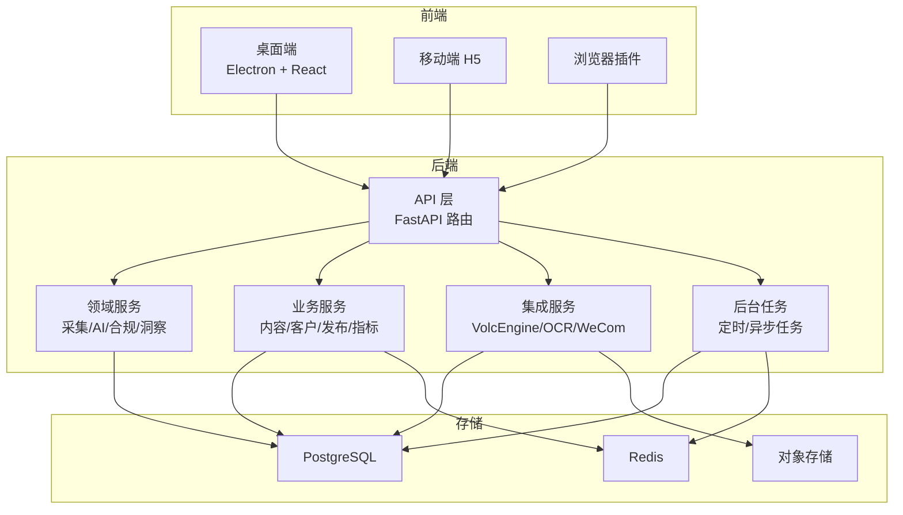
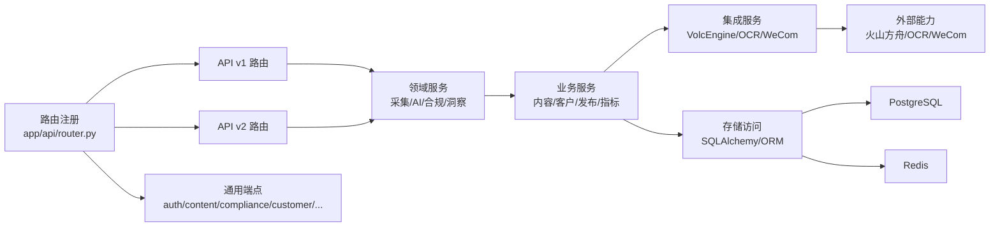
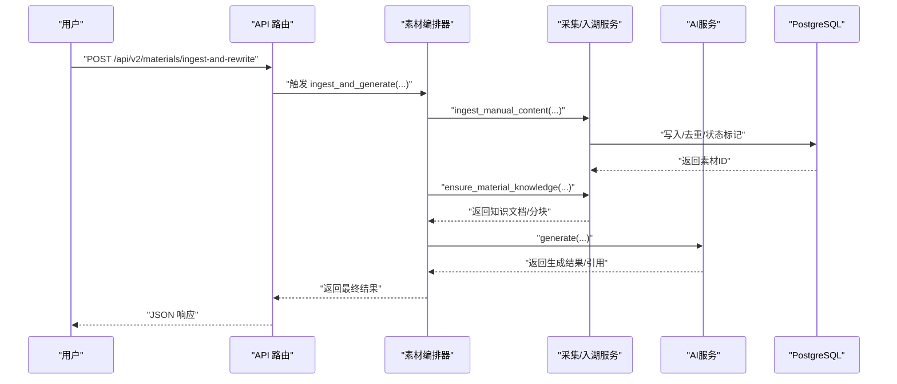
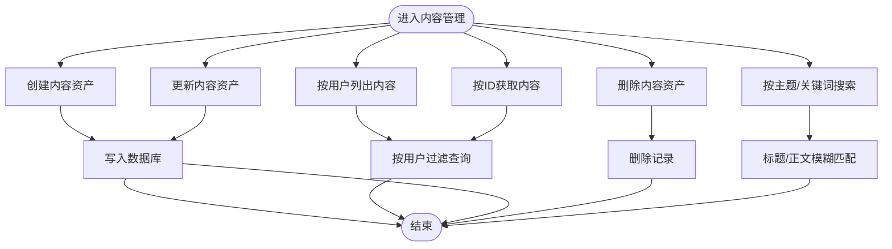
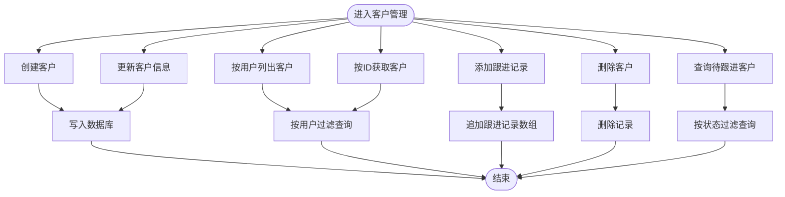
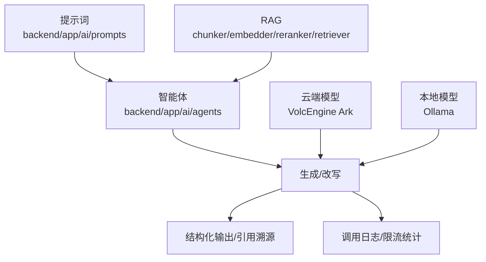
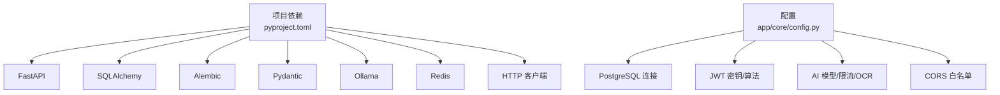

# 项目概述

<cite>
**本文引用的文件**
- [backend/README.md](file://backend/README.md)
- [backend/pyproject.toml](file://backend/pyproject.toml)
- [backend/app/main.py](file://backend/app/main.py)
- [backend/app/api/router.py](file://backend/app/api/router.py)
- [backend/app/core/config.py](file://backend/app/core/config.py)
- [backend/app/domains/acquisition/orchestrator.py](file://backend/app/domains/acquisition/orchestrator.py)
- [backend/app/services/content_service.py](file://backend/app/services/content_service.py)
- [backend/app/services/customer_service.py](file://backend/app/services/customer_service.py)
- [docs/architecture/system-architecture.md](file://docs/architecture/system-architecture.md)
- [docs/architecture/ai-architecture.md](file://docs/architecture/ai-architecture.md)
- [docs/product/business-flow.md](file://docs/product/business-flow.md)
- [desktop/package.json](file://desktop/package.json)
</cite>

## 目录
1. [引言](#引言)
2. [项目结构](#项目结构)
3. [核心组件](#核心组件)
4. [架构总览](#架构总览)
5. [详细组件分析](#详细组件分析)
6. [依赖分析](#依赖分析)
7. [性能考虑](#性能考虑)
8. [故障排除指南](#故障排除指南)
9. [结论](#结论)
10. [附录](#附录)

## 引言
智获客AI内容采集与管理系统旨在通过“采集—收件箱—素材—AI—审核—发布—线索—客户—提醒”的闭环流程，帮助内容运营团队高效获取、清洗、沉淀知识、生成适配不同平台的内容，并最终驱动销售线索转化。系统以“AI内容采集”“智能内容处理”“知识管理”“客户关系管理”为核心能力，结合企业微信、浏览器插件与桌面端应用，形成从内容生产到客户转化的一体化解决方案。

- 核心使命：降低内容运营成本，提升内容复用效率与合规质量，加速从素材到线索的转化。
- 愿景：构建可扩展、可观测、可治理的AI内容运营基础设施，支撑多平台、多账号、多用户的规模化内容运营。
- 价值主张：以“采集即入库、清洗即知识、生成即资产”的理念，实现内容资产的结构化沉淀与智能化再利用。

## 项目结构
系统采用前后端分离与多端协同的分层架构：
- 前端：桌面端 Electron + React、移动端 H5、浏览器插件
- 后端：FastAPI + PostgreSQL，按领域划分模块（采集、AI工作台、合规、洞察等）
- 存储：PostgreSQL（结构化数据）、Redis（缓存与分布式限流）、对象存储（附件/媒体）
- 集成：火山方舟（大模型/视觉）、OCR、WeCom 等外部能力

图表来源
- [docs/architecture/system-architecture.md:1-8](file://docs/architecture/system-architecture.md#L1-L8)
- [backend/app/api/router.py:1-35](file://backend/app/api/router.py#L1-L35)
- [backend/app/main.py:1-4](file://backend/app/main.py#L1-L4)

章节来源
- [docs/architecture/system-architecture.md:1-8](file://docs/architecture/system-architecture.md#L1-L8)
- [backend/app/api/router.py:1-35](file://backend/app/api/router.py#L1-L35)
- [backend/app/main.py:1-4](file://backend/app/main.py#L1-L4)

## 核心组件
- 采集与素材管线：负责从浏览器插件或手动输入采集内容，清洗、去重、入库，并沉淀为知识库条目，支持后续检索增强生成。
- AI 工作台：内置提示词、RAG 检索、多平台文案改写（小红书、抖音、知乎等），支持本地 Ollama 与云端火山方舟模型。
- 合规与风控：对内容进行关键词/语义风险识别与审核建议输出，保障内容安全。
- 知识管理：结构化存储素材与知识文档，支持向量化分块、嵌入与重排序检索，支撑生成阶段的上下文引用。
- 客户关系管理：客户信息维护、跟进记录、状态流转与提醒，打通线索到客户的转化闭环。
- 数据看板与洞察：发布效果、趋势、平台分析、主题排行与 AI 调用统计，辅助运营决策。

章节来源
- [backend/README.md:109-172](file://backend/README.md#L109-L172)
- [docs/product/business-flow.md:1-4](file://docs/product/business-flow.md#L1-L4)

## 架构总览
系统采用“API 路由 → 领域服务 → 业务服务 → 集成/存储”的分层设计，路由集中注册，领域服务编排复杂业务流程，业务服务封装 CRUD 与领域操作，集成服务对接第三方能力，存储层统一通过 SQLAlchemy/ORM 访问。

图表来源
- [backend/app/api/router.py:1-35](file://backend/app/api/router.py#L1-L35)
- [backend/app/main.py:1-4](file://backend/app/main.py#L1-L4)
- [docs/architecture/system-architecture.md:1-8](file://docs/architecture/system-architecture.md#L1-L8)

章节来源
- [backend/app/api/router.py:1-35](file://backend/app/api/router.py#L1-L35)
- [backend/app/main.py:1-4](file://backend/app/main.py#L1-L4)
- [docs/architecture/system-architecture.md:1-8](file://docs/architecture/system-architecture.md#L1-L8)

## 详细组件分析

### 采集与素材管线（Material Pipeline Orchestrator）
该组件是素材从采集到生成的编排中枢，提供“手动采集 → 清洗入库 → 知识沉淀 → 检索 → 生成”的完整链路，并支持重复素材检测与知识文档一致性校验。

图表来源
- [backend/app/domains/acquisition/orchestrator.py:11-174](file://backend/app/domains/acquisition/orchestrator.py#L11-L174)

章节来源
- [backend/app/domains/acquisition/orchestrator.py:11-174](file://backend/app/domains/acquisition/orchestrator.py#L11-L174)

### 内容资产管理（ContentService）
提供内容资产的创建、查询、更新、删除与按主题搜索能力，确保内容所有权与可见性控制。

图表来源
- [backend/app/services/content_service.py:8-79](file://backend/app/services/content_service.py#L8-L79)

章节来源
- [backend/app/services/content_service.py:8-79](file://backend/app/services/content_service.py#L8-L79)

### 客户关系管理（CustomerService）
提供客户创建、查询、更新、删除、跟进记录与待跟进客户查询，支撑线索到客户的转化闭环。

图表来源
- [backend/app/services/customer_service.py:9-115](file://backend/app/services/customer_service.py#L9-L115)

章节来源
- [backend/app/services/customer_service.py:9-115](file://backend/app/services/customer_service.py#L9-L115)

### AI 架构与能力
系统在“提示词工程、智能体编排、RAG 检索、外部模型集成”方面形成完整能力矩阵，支持本地与云端模型切换，并具备可观测性与限流策略。

图表来源
- [docs/architecture/ai-architecture.md:1-7](file://docs/architecture/ai-architecture.md#L1-L7)
- [backend/app/core/config.py:71-84](file://backend/app/core/config.py#L71-L84)

章节来源
- [docs/architecture/ai-architecture.md:1-7](file://docs/architecture/ai-architecture.md#L1-L7)
- [backend/app/core/config.py:71-84](file://backend/app/core/config.py#L71-L84)

## 依赖分析
- 技术栈选择
  - 后端：FastAPI 提供高性能异步 API；SQLAlchemy/Pydantic 实现 ORM 与数据验证；Alembic 管理数据库迁移；Uvicorn 提供 ASGI 服务器。
  - 存储：PostgreSQL 提供结构化数据持久化；Redis 提供缓存与分布式限流；对象存储用于附件/媒体。
  - AI/集成：Ollama 支持本地推理；Volcano Engine 提供云端模型与视觉能力；OCR 用于截图识别。
  - 前端：桌面端 Electron + React；移动端 H5；浏览器插件通过后端 API 交互。
- 关键依赖关系
  - API 路由集中注册于 app/api/router.py，统一挂载至 FastAPI 应用入口。
  - 领域服务（如素材编排器）依赖业务服务与集成服务，最终访问数据库与缓存。
  - 配置通过 pydantic-settings 的 Settings 类集中管理，涵盖数据库、JWT、AI 模型、限流、上传等参数。

图表来源
- [backend/pyproject.toml:7-31](file://backend/pyproject.toml#L7-L31)
- [backend/app/core/config.py:15-103](file://backend/app/core/config.py#L15-L103)

章节来源
- [backend/pyproject.toml:7-31](file://backend/pyproject.toml#L7-L31)
- [backend/app/core/config.py:15-103](file://backend/app/core/config.py#L15-L103)

## 性能考虑
- 数据库与迁移
  - 使用 Alembic 管理迁移，支持升级/回滚与历史查看；生产默认使用 PostgreSQL，确保回归测试覆盖关键主链路。
- 缓存与限流
  - Redis 用于分布式限流与缓存，当 Redis 不可用时自动降级到进程内限流，保障稳定性。
- API 与并发
  - FastAPI 异步特性与 Uvicorn 提供高吞吐；路由集中注册减少启动与维护成本。
- AI 调用可观测性
  - 对火山方舟调用进行日志记录（成功/失败、耗时、Token 用量、用户维度），便于容量规划与成本控制。

章节来源
- [backend/README.md:50-80](file://backend/README.md#L50-L80)
- [backend/README.md:160-163](file://backend/README.md#L160-L163)
- [backend/app/core/config.py:86-90](file://backend/app/core/config.py#L86-L90)

## 故障排除指南
- 健康检查端点
  - 部署完成后可通过系统运维端点检查数据库、Redis、Ollama 状态，快速定位依赖异常。
- 常见问题
  - 数据库连接：检查 .env 中 DATABASE_URL 是否正确。
  - 云端模型：开启 USE_CLOUD_MODEL 并配置 ARK_API_KEY、ARN_BASE_URL、ARN_MODEL。
  - Redis 限流：开启 USE_REDIS_RATE_LIMIT 并配置 REDIS_URL。
- 回归测试
  - PostgreSQL 回归覆盖素材主链路、发布任务生命周期、线索/客户跨用户隔离等关键场景，建议在变更后运行对应测试套件。

章节来源
- [backend/README.md:197-221](file://backend/README.md#L197-L221)
- [backend/README.md:223-240](file://backend/README.md#L223-L240)
- [backend/README.md:202-210](file://backend/README.md#L202-L210)

## 结论
智获客通过“采集—收件箱—素材—AI—审核—发布—线索—客户—提醒”的闭环，将内容运营从“散乱采集”转变为“结构化沉淀—智能化生成—可追溯转化”。系统以 FastAPI + PostgreSQL 为基础，结合 Redis、火山方舟与 OCR 等能力，形成可扩展、可观测、可治理的内容运营基础设施。对于初学者，系统提供了清晰的业务流程与模块边界；对于开发者，系统在路由、领域服务、业务服务、集成与存储层面均具备良好的分层与扩展性。

## 附录
- 目标用户群体
  - 内容运营团队、品牌营销人员、内容创作者、销售线索运营人员
- 典型应用场景
  - 多平台内容采集与改写、知识库构建与检索增强生成、合规风险识别、客户跟进与转化追踪
- 业务价值
  - 降低内容生产与合规成本，提升素材复用率与生成质量，加速线索到客户的转化周期
- 技术优势
  - 异步 API 与高并发处理、可插拔的 AI 模型（本地/云端）、完善的限流与可观测性、严格的权限与数据隔离